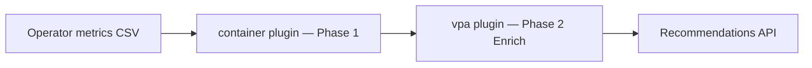

# VPA Recommendations

!!! warning "Status: Planned / Future Work"
    This feature is **not yet implemented**. The description below is the intended
    product direction for a future ROS-OCP release. Container right-sizing remains
    fully available today — including a practical **VPA `updateMode: Off`**
    validation pattern you can use without waiting for this plugin.

!!! info "Quick Facts (planned)"
    **Scope:** Vertical Pod Autoscaler (VPA) policy and `updateMode` guidance  
    **Plugin:** `vpa` (Phase 2 Enrich — builds on container recommendations)  
    **Depends on:** `container` plugin (Phase 1 Produce)  
    **Does not replace:** Container CPU/memory sizing — enriches workloads with an active VPA CR  
    **API (planned):** `GET /api/cost-management/v1/recommendations/openshift/vpa`

---

## What it will do

**VPA Recommendations** will suggest Vertical Pod Autoscaler configuration aligned
with ROS container rightsizing output:

| Recommendation type | Example |
|---------------------|---------|
| **`updateMode` policy** | Recommend `Off`, `Initial`, or `Auto` based on workload stability and change tolerance |
| **`resourcePolicy` bounds** | Suggest `minAllowed` / `maxAllowed` CPU and memory aligned with cost vs performance engines |
| **Divergence surfacing** | Compare ROS sizing vs VPA recommender targets when both disagree |
| **Promotion path** | When advisors agree over multiple windows, suggest moving from `Off` → `Initial` or `Auto` |

The VPA plugin **does not replace** the container plugin. Container rightsizing
remains the authoritative per-container CPU/memory recommendation. The VPA plugin
adds policy-layer guidance for teams that already run (or plan to run) VPA on
those workloads.

**Why it matters:** VPA `Auto` mode can evict pods to apply new requests — high
blast radius if applied blindly. ROS will recommend conservative `updateMode`
choices and bounded resource policies before customers promote to automatic apply.

---

## Two-plugin architecture

VPA recommendations follow the same Phase 2 Enrich pattern as HPA and JVM plugins:

| Phase | Plugin | Role |
|-------|--------|------|
| **1 — Produce** | `container` | CPU/memory rightsizing, percentile engines, idle/zombie classification |
| **2 — Enrich** | `vpa` | Reads container outputs + VPA status metrics; emits policy recommendations |

See [Plugin Execution Phases](../architecture/plugin-phases.md). The `vpa` plugin
will run after Phase 1 completes. It is independent of the `hpa` plugin — both
read container outputs but address different autoscaler dimensions.

**Data sources (planned):** Operator collection of `kube_verticalpodautoscaler_*`
metrics plus container recommendation rows for the same workload.

Combined VPA+HPA coordination (e.g., in-place pod vertical scaling with HPA) is
**deferred** until upstream Kubernetes behavior stabilizes.

---

## Advisory-first delivery

VPA recommendations will be **advisory in all deployment modes** (SaaS, on-prem,
multi-cluster):

1. ROS computes policy guidance centrally.
2. Users review in the Optimizations UI or REST API.
3. Users apply VPA CR changes on the cluster (manually or via external automation).

ROS does **not** patch VPA CRs or evict pods. Applying `updateMode: Auto` remains
a deliberate cluster-admin decision with appropriate safety gates.

---

## What you can do today

### Container right-sizing (shipped)

Use [Container Right-Sizing](container-recommendations.md) for CPU and memory
request/limit recommendations today. No VPA plugin or additional ROS configuration
is required.

### VPA `updateMode: Off` — dual-advisor validation (available now)

This is the highest-value integration you can run **today**, without waiting for
the VPA plugin:

1. Create VPA CRs with `updateMode: Off` for workloads of interest (or use
   [Goldilocks](https://github.com/FairwindsOps/goldilocks) to generate them).
2. The Kubernetes VPA **recommender** populates
   `.status.recommendation.containerRecommendations[].target` from live metrics.
3. The VPA **admission controller** and **updater** stay inactive — no automatic
   eviction or resize.
4. Poll ROS container rightsizing via
   `GET /api/cost-management/v1/recommendations/openshift`.
5. Compare VPA target CPU/memory vs ROS recommended requests for the same container.

| Outcome | Action |
|---------|--------|
| **Agreement** (e.g., within ~15%) | High confidence to apply — manually or via external automation |
| **Divergence** | Investigate — different algorithms, time windows, bursty traffic, idle detection |

VPA uses exponential histogram decay; ROS uses percentile-based analysis with
configurable short/medium/long terms. Different methods catch different blind spots —
agreement between two independent advisors is a strong apply signal.

**Works in all deployment modes:** SaaS, on-prem, and hybrid fleet views. No ROS
feature flag or plugin enablement is needed — only VPA CRs in `Off` mode and API access.

Full walkthrough: [Validating recommendations with VPA](container-recommendations.md#validating-recommendations-with-vpa).

### External automation

Automate VPA or Deployment resource changes today using external tools that read
the ROS API:

| Approach | Pattern |
|----------|---------|
| **Ansible Automation Platform** | Poll ROS API → patch VPA `spec.updatePolicy` or Deployment `resources` |
| **SonataFlow** | Approval workflow → Kubernetes API apply |
| **GitOps** | ROS API diff → PR → Argo CD sync |
| **CronJobs** | On-cluster job applies labeled workloads after confidence checks |

| Resource | Endpoint | Status |
|----------|----------|--------|
| Containers | `GET /recommendations/openshift` | **Shipped** |
| VPA policy recs | `GET /recommendations/openshift/vpa` | **Planned** |

### Safety gates

VPA apply — especially `updateMode: Auto` or eviction to pick up new requests —
requires pod restarts. **Always** use safety gates:

| Gate | VPA-specific note |
|------|-------------------|
| **PDB awareness** | Block apply when `minAvailable` prevents safe eviction |
| **Maintenance windows** | No VPA evictions during peak traffic or change freezes |
| **Canary rollout** | Promote `Off` → `Initial` → `Auto` per namespace, not fleet-wide |
| **Confidence threshold** | Require advisor agreement or high ROS confidence before `Auto` |
| **Change magnitude** | Large memory decreases need human review |
| **Rollback** | Snapshot VPA + Deployment spec before apply; revert on OOM or latency regression |

See [Node Recommendations Roadmap — safety gates](../architecture/node-recommendations-roadmap.md#tier-1--advisory-consolidation-with-safety-gates-shipped)
for the advisory automation model ROS uses across recommendation types.

---

## Future ROS integration (when plugin ships)

When the `vpa` plugin is implemented:

- Operator will collect VPA status metrics alongside container usage CSVs.
- ROS will compare its policy recommendations against VPA internal targets.
- UI/API will surface divergence (e.g., "VPA suggests 500m CPU; ROS suggests 200m").
- Promotion from `Off` to `Initial` or `Auto` can be suggested when alignment is
  confirmed over multiple observation windows.

Until then, the manual dual-advisor comparison above delivers most of the validation
value with zero backend changes.

---

## Related

- [HPA Recommendations](hpa-recommendations.md) — planned HPA tuning plugin (Phase 2 Enrich)
- [Container Right-Sizing](../features/container-recommendations.md) — shipped; includes VPA validation guide
- [Plugin Execution Phases](../architecture/plugin-phases.md) — Phase 1 vs Phase 2 architecture
- [Dual Engine](../features/dual-engine.md) — cost vs performance engines for container sizing
