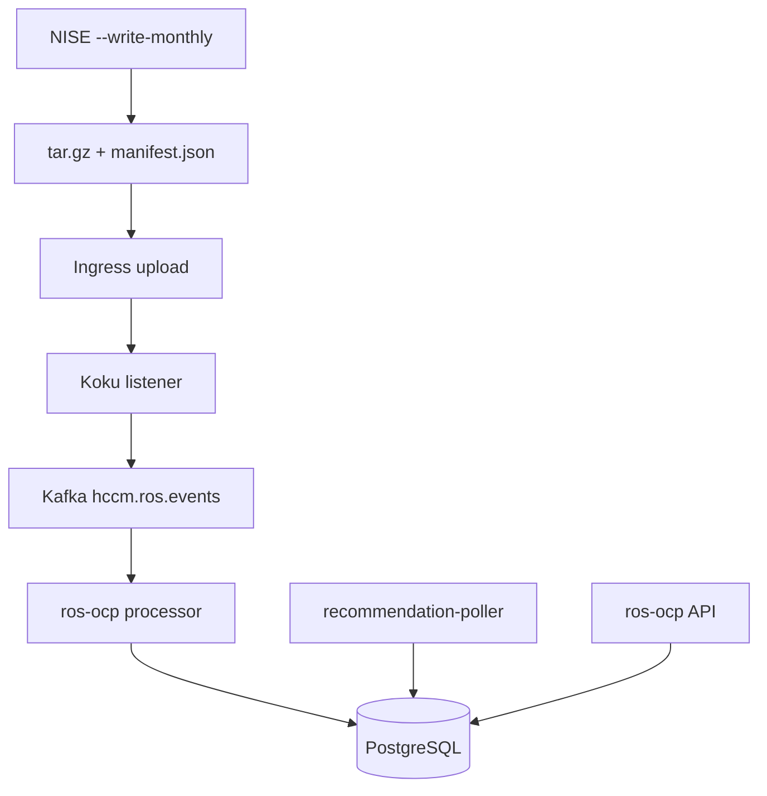

# Quick Start Tutorial

This walkthrough takes you from a fresh clone to **recommendations in the API** using
local PostgreSQL, the native engine, and NISE-generated test data. For deeper setup
options, see [Local Development](development.md).

## What you will build



## 1. Clone and setup

```bash
git clone https://github.com/pgarciaq/ros-ocp-backend.git
cd ros-ocp-backend
cp .env.example .env
```

Ensure `.env` points at your PostgreSQL instance (default `DB_PORT=15432` with compose).

## 2. Start PostgreSQL and Kafka

```bash
docker compose -f scripts/docker-compose.yml up -d db-ros kafka zookeeper kafka-create-topics
```

Wait until `db-ros` accepts connections:

```bash
docker compose -f scripts/docker-compose.yml ps db-ros
```

## 3. Run migrations

```bash
go run rosocp.go db migrate up
```

## 4. Start the service

In three terminals (or use Makefile targets):

```bash
make run-api-server          # PROMETHEUS_PORT=5007, API on :8000
make run-processor           # PROMETHEUS_PORT=5005
make run-recommendation-poller  # PROMETHEUS_PORT=5006
```

Verify the ROS-OCP API:

```bash
curl -s http://localhost:8000/status | python3 -m json.tool
```

## 5. Generate test data with NISE

Install [NISE](https://github.com/project-koku/nise) and use a static YAML with
`--ros-ocp-info` and `--write-monthly`:

```bash
nise report ocp \
  --static-report-file /path/to/ocp_static_data.yml \
  --ocp-cluster-id 550e8400-e29b-41d4-a716-446655440001 \
  --ros-ocp-info \
  --write-monthly \
  -w /tmp/nise-ros-output
```

NISE writes files such as `May-2026-<uuid>-ocp_ros_usage.csv` under a monthly folder.
See [Testing — Test Data Generation](testing.md#test-data-generation-nise) for filename rules.

## 6. Package and upload

Create `manifest.json` with **`start` and `end`** (required for Koku summary processing):

```json
{
  "uuid": "02059694-68ab-4d58-8809-de1e91f1d0e5",
  "cluster_id": "550e8400-e29b-41d4-a716-446655440001",
  "date": "2026-05-28T00:00:00",
  "start": "2026-05-01T00:00:00",
  "end": "2026-05-28T00:00:00",
  "version": "1.0.0",
  "files": ["May-2026-550e8400-ocp_ros_usage.csv"],
  "resource_optimization_files": [
    "May-2026-550e8400-ocp_ros_usage.csv",
    "May-2026-550e8400-ocp_ros_namespace_usage.csv"
  ]
}
```

Build the tarball (strip `./` prefixes):

```bash
cd /tmp/nise-ros-output/<month-folder>
tar czf /tmp/ros-upload.tar.gz --transform='s|^\./||' manifest.json *.csv
```

Upload through ingress (with docker-compose `ingress` on port 3000):

```bash
IDENTITY=$(echo -n '{"identity":{"org_id":"3340851","type":"System","auth_type":"cert-auth","system":{"cn":"550e8400-e29b-41d4-a716-446655440001","cert_type":"system"},"internal":{"org_id":"3340851"}}}' | base64 -w0)

curl -X POST \
  -F "file=@/tmp/ros-upload.tar.gz;type=application/vnd.redhat.hccm.tar+tgz" \
  -H "x-rh-identity: $IDENTITY" \
  http://localhost:3000/api/ingress/v1/upload
```

Watch the processor logs for CSV ingestion and the poller for recommendation completion.

## 7. Query recommendations

```bash
curl -s -H "x-rh-identity: $IDENTITY" \
  'http://localhost:8000/api/cost-management/v1/recommendations/openshift?limit=5' \
  | python3 -m json.tool
```

Expected response shape (abbreviated):

```json
{
  "meta": { "count": 1, "limit": 5, "offset": 0 },
  "data": [
    {
      "cluster": "550e8400-e29b-41d4-a716-446655440001",
      "project": "my-namespace",
      "recommendations": {
        "recommendation_terms": {
          "short_term": {
            "recommendation_engines": {
              "cost": { "requests": { "cpu": "...", "memory": "..." } }
            }
          }
        }
      }
    }
  ]
}
```

Other endpoints: `/recommendations/openshift/nodes`, `/gpu`, `/quota/`, `/cluster-quota/`.

## Next steps

- [Features overview](features/index.md) — all recommendation types
- [Configuration](configuration.md) — thresholds and plugins
- [Testing](testing.md) — CI test layers and quality gates
- [What's New](whats-new.md) — initial ROBNE release capabilities
- [Contributing](contributing.md) — architecture and PR workflow
