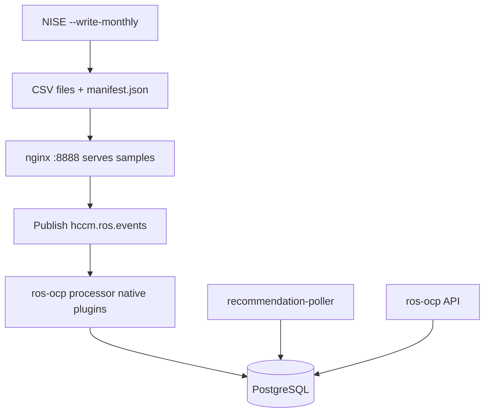
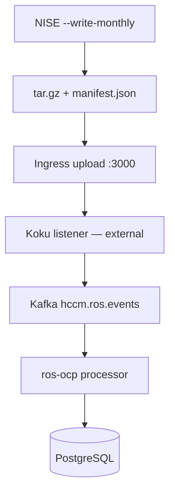

# Quick Start Tutorial

This walkthrough takes you from a fresh clone to **recommendations in the API** using
local PostgreSQL, the **native Go engine**, and NISE-generated test data. For deeper
setup options, see [Local Development](development.md).

!!! important "Use the native-engine branch"
    The published docs describe the **ROBNE (native engine)** codebase. Check out a
    branch that contains `internal/engine/` and `internal/plugins/` (for example
    `pgarciaq-rosocp-superpowers-phase14` on
    [pgarciaq/ros-ocp-backend](https://github.com/pgarciaq/ros-ocp-backend)).

    Upstream `main` (Red Hat Insights) still uses the **legacy Kruize HTTP path**
    (`createExperiment` on `:8080`). If you run that branch, you must start Kruize —
    the steps below assume the native engine instead.

## What you will build

Two local paths exist. **`scripts/docker-compose.yml` does not include Koku**,
so the ingress-only path stops after upload unless you deploy Koku separately.

### Path A — Local Kafka ingest (recommended)

Use this for day-to-day native-engine development. No ingress, no Koku, no Kruize.



### Path B — Ingress upload (full stack)

Matches production topology but requires **Koku listener** (not in compose).



For Path B, see [Validating the Native Engine](testing/validating-native-engine.md).

## 1. Clone and setup

```bash
git clone https://github.com/pgarciaq/ros-ocp-backend.git
cd ros-ocp-backend
git checkout pgarciaq-rosocp-superpowers-phase14   # or your latest native-engine branch
cp .env.example .env
```

Ensure `.env` points at your PostgreSQL instance (default `DB_PORT=15432` with compose).

Enable native plugins (do **not** include `kruize` unless you intentionally want the
legacy engine):

```bash
# .env
ROS_ENABLED_PLUGINS=container,namespace
DISABLE_NAMESPACE_RECOMMENDATION=false
```

On startup the processor logs enabled plugins, for example:
`Plugin registry: enabled plugins: [container, namespace]`.

## 2. Start infrastructure

```bash
docker compose -f scripts/docker-compose.yml up -d \
  db-ros kafka zookeeper kafka-create-topics nginx unleash-edge
```

| Service | Port | Why |
|---------|------|-----|
| `db-ros` | 15432 | PostgreSQL for ROS-OCP |
| `kafka` | 29092 | `hccm.ros.events` topic |
| `nginx` | 8888 | Serves CSV URLs the processor downloads |
| `unleash-edge` | 3063 | Namespace feature flag for org `3340851` |

Wait until `db-ros` accepts connections:

```bash
docker compose -f scripts/docker-compose.yml ps db-ros
```

If `db-ros` keeps restarting with `database files are incompatible with server`, reset
the volume (destroys data) and re-run migrations:

```bash
docker compose -f scripts/docker-compose.yml stop db-ros
docker compose -f scripts/docker-compose.yml rm -f -v db-ros
docker compose -f scripts/docker-compose.yml up -d db-ros
```

**Not included in compose:** Koku listener, storage-broker, Kruize (native path does
not need Kruize).

## 3. Run migrations

```bash
go run rosocp.go db migrate up
```

## 4. Start the service

Start these **before** publishing Kafka messages (see step 6).

```bash
make run-api-server              # PROMETHEUS_PORT=5007, API on :8000
make run-processor               # PROMETHEUS_PORT=5005
make run-recommendation-poller   # PROMETHEUS_PORT=5006
```

Verify the ROS-OCP API:

```bash
curl -s http://localhost:8000/status | python3 -m json.tool
```

## 5. Generate test data with NISE

Install [NISE](https://github.com/project-koku/nise) and use a static YAML with
`--ros-ocp-info` and `--write-monthly`:

```bash
nise report ocp \
  --static-report-file /path/to/ocp_static_data.yml \
  --ocp-cluster-id 550e8400-e29b-41d4-a716-446655440001 \
  --ros-ocp-info \
  --write-monthly \
  -w /tmp/nise-ros-output
```

NISE writes files such as `May-2026-<uuid>-ocp_ros_usage.csv` under a monthly folder.
Rename to the short pattern before packaging (drop the full UUID from filenames):

```text
May-2026-550e8400-ocp_ros_usage.csv
May-2026-550e8400-ocp_ros_namespace_usage.csv
```

See [Testing — Test Data Generation](testing.md#test-data-generation-nise) for filename rules.

## 6. Ingest data

### Path A — Publish to Kafka (recommended locally)

**6a. Create `manifest.json`** (required fields for downstream cost summary if you
later use Koku; also useful metadata):

```json
{
  "uuid": "02059694-68ab-4d58-8809-de1e91f1d0e5",
  "cluster_id": "550e8400-e29b-41d4-a716-446655440001",
  "date": "2026-05-28T00:00:00",
  "start": "2026-05-01T00:00:00",
  "end": "2026-05-28T00:00:00",
  "version": "1.0.0",
  "files": ["May-2026-550e8400-ocp_ros_usage.csv"],
  "resource_optimization_files": [
    "May-2026-550e8400-ocp_ros_usage.csv",
    "May-2026-550e8400-ocp_ros_namespace_usage.csv"
  ]
}
```

**6b. Copy CSVs where nginx can serve them** (or build under `scripts/samples/`):

```bash
mkdir -p scripts/samples/june-data
cp /tmp/nise-ros-output/<month-folder>/*.csv scripts/samples/june-data/
cp /tmp/nise-ros-output/<month-folder>/manifest.json scripts/samples/june-data/
```

Verify nginx can reach the container CSV:

```bash
curl -sI http://localhost:8888/june-data/May-2026-550e8400-ocp_ros_usage.csv | head -1
# HTTP/1.1 200 OK
```

**6c. Publish `hccm.ros.events`** (processor must already be running):

```bash
echo '{"request_id":"02059694-68ab-4d58-8809-de1e91f1d0e5","b64_identity":"test","metadata":{"org_id":"3340851","source_id":"111","cluster_uuid":"550e8400-e29b-41d4-a716-446655440001","cluster_alias":"my-cluster"},"files":["http://localhost:8888/june-data/May-2026-550e8400-ocp_ros_usage.csv","http://localhost:8888/june-data/May-2026-550e8400-ocp_ros_namespace_usage.csv"]}' \
  | docker compose -f scripts/docker-compose.yml exec -T kafka \
      kafka-console-producer --topic hccm.ros.events --broker-list localhost:29092
```

Adjust paths/filenames to match your month folder. Watch processor logs for CSV
ingestion; the poller computes recommendations into PostgreSQL.

!!! tip "Kafka offset gotcha"
    Messages published **before** the processor starts are consumed once and
    committed. If CSV fetch failed (for example nginx was down), publish a **new**
    message — the processor will not replay old offsets automatically.

### Path B — Ingress tarball upload

Only use this when Koku listener is deployed (not provided by compose).

Build the tarball:

```bash
cd /tmp/nise-ros-output/<month-folder>
tar czf /tmp/ros-upload.tar.gz --transform='s|^\./||' manifest.json *.csv
```

Start ingress (and minio if not already running):

```bash
docker start scripts-minio-1   # if using orphan minio from a prior compose run
docker compose -f scripts/docker-compose.yml up -d ingress
```

Ingress requires `INGRESS_VALID_UPLOAD_TYPES=hccm,rosocp` in
`scripts/docker-compose.yml` (newer ingress images reject uploads without it).

Upload:

```bash
IDENTITY=$(echo -n '{"identity":{"org_id":"3340851","type":"System","auth_type":"cert-auth","system":{"cn":"550e8400-e29b-41d4-a716-446655440001","cert_type":"system"},"internal":{"org_id":"3340851"}}}' | base64 -w0)

curl -X POST \
  -F "file=@/tmp/ros-upload.tar.gz;type=application/vnd.redhat.hccm.tar+tgz" \
  -H "x-rh-identity: $IDENTITY" \
  http://localhost:3000/api/ingress/v1/upload
```

A `202` response only means ingress accepted the file. Without Koku, nothing is
published to `hccm.ros.events` and the processor will not run. Use Path A locally.

## 7. Query recommendations

```bash
IDENTITY=$(echo -n '{"identity":{"org_id":"3340851","type":"System","auth_type":"cert-auth","system":{"cn":"550e8400-e29b-41d4-a716-446655440001","cert_type":"system"},"internal":{"org_id":"3340851"}}}' | base64 -w0)

curl -s -H "x-rh-identity: $IDENTITY" \
  'http://localhost:8000/api/cost-management/v1/recommendations/openshift?limit=5' \
  | python3 -m json.tool
```

Expected response shape (abbreviated):

```json
{
  "meta": { "count": 1, "limit": 5, "offset": 0 },
  "data": [
    {
      "cluster": "550e8400-e29b-41d4-a716-446655440001",
      "project": "my-namespace",
      "recommendations": {
        "recommendation_terms": {
          "short_term": {
            "recommendation_engines": {
              "cost": { "requests": { "cpu": "...", "memory": "..." } }
            }
          }
        }
      }
    }
  ]
}
```

Other endpoints: `/recommendations/openshift/nodes`, `/gpu`, `/quota/`, `/cluster-quota/`.

## Troubleshooting

| Symptom | Likely cause | Fix |
|---------|--------------|-----|
| `connection refused :8888` | nginx not running | `docker compose … up -d nginx` |
| `connection refused :8080` on legacy branch | Kruize required on upstream `main` | Checkout native-engine branch or start Kruize |
| Processor silent after upload | Koku missing (Path B) | Use Path A (Kafka publish) |
| Namespace CSV skipped | Feature disabled | `DISABLE_NAMESPACE_RECOMMENDATION=false` + unleash-edge |
| Ingress `415` | Missing upload types env | Set `INGRESS_VALID_UPLOAD_TYPES=hccm,rosocp` |
| No replay after fix | Kafka offset committed | Publish a new message |

## Multi-repository testing

Path B and UI validation require Koku, the operator, and related repos. See
[Validating the Native Engine](testing/validating-native-engine.md#repositories-and-branches).

## Next steps

- [Features overview](features/index.md) — all recommendation types
- [Configuration](configuration.md) — thresholds and plugins
- [Testing](testing.md) — CI test layers and quality gates
- [What's New](whats-new.md) — initial ROBNE release capabilities
- [Contributing](contributing.md) — architecture and PR workflow
