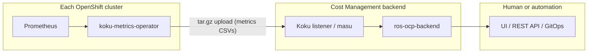

# HPA/VPA Recommendations and Deployment Modes

Internal analysis of how ros-ocp-backend deployment topology affects whether
HPA and VPA recommendations can be **used** (advisory) or **applied**
(automated actuation). HPA/VPA plugins are **deferred** — see
[REQ-8.1](requirements.md#req-81-hpa-optimization-high--deferred) and
[Deferred: HPA and VPA autoscaling](requirements.md#deferred-hpa-and-vpa-autoscaling).

## Automation story at a glance

| Stage | What | How |
|-------|------|-----|
| **Today: Advisory-first** | ROS generates recommendations; humans apply | Optimizations UI or REST API → manual `oc edit` / GitOps |
| **Today: External automation** | Consumers read API and apply with safety gates | Ansible, SonataFlow, GitOps PRs, CronJobs/operators |
| **Future: Integrated automation** | Optional in-product actuator, GitOps export, VPA plugin synergy | Not planned for v1 |
| **Always: Safety gates** | PDB, surge windows, canary, confidence, magnitude, rollback | Required regardless of automation approach |
| **Today: VPA `updateMode: Off`** | Dual-advisor validation without auto-apply | Compare VPA recommender vs ROS container rightsizing |

**Core principle:** ROS provides advisory recommendations via a standard REST API.
Automation is a **consumer concern** — use your preferred automation tool to read
and act on recommendations.

---

## 1. Today: Advisory-first

In all shipped deployment modes, ROS generates recommendations centrally; users
(or their automation) apply changes on the cluster.

### Deployment modes today

| Mode | Topology | Status | Recommendation delivery |
|------|----------|--------|-------------------------|
| **Remote (SaaS)** | Operator on each cluster → upload → Koku (ingress, Kafka, S3) → central ros-ocp-backend → console.redhat.com UI | **Shipped** | Advisory via web UI and REST API |
| **Local (on-prem)** | Operator + Koku + ros-ocp-backend + UI on the **same** cluster (cost-onprem chart) | **Shipped** | Advisory via local UI and REST API |
| **Local + central (hybrid)** | N clusters upload to one central Cost Management installation | **Shipped** (SaaS and multi-cluster on-prem) | Central ROS generates recs for all clusters; advisory |
| **Local Mode (planned)** | Operator computes on-cluster; optional push to central for fleet view | **Not implemented** — [local-mode.md](../features/local-mode.md) | Advisory; local `ros-ocp-api` is read-only |

All shipped modes share the same **data-collection → central processing → API/UI**
pattern. None include a built-in feedback loop that modifies cluster objects.



The koku-metrics-operator is **metrics collection and upload only**. Its
reconciler queries Prometheus, writes CSVs, packages tarballs, and POSTs to the
ingress endpoint. It does **not** read recommendations, patch Deployments, or
modify HPA/VPA CRs. Confirmed in
[koku-metrics-operator architecture](https://github.com/project-koku/koku-metrics-operator/blob/main/docs/architecture.md).

The cost-onprem chart deploys the same components locally. There is no
recommendation-actuation sidecar, no Kubernetes client in ros-ocp-backend for
writes, and no webhook that applies sizing changes.

### Advisory workflow (existing recommendation types)

**Yes — in all shipped modes, for recommendation types that exist today**
(container CPU/memory, GPU, nodes, quota, etc.):

1. Platform admin enables ROS on namespaces (`insights_cost_management_optimizations=true`).
2. Operator uploads metrics; ros-ocp-backend computes recommendations.
3. User views Optimizations UI or calls the REST API (see [API endpoints](#api-endpoints-for-automation-consumers) below).
4. User **manually** updates Deployment/StatefulSet resources, HPA specs, VPA
   policies, MachineSets, or GPU node config.

For **HPA** (when REQ-8.1 ships), advisory mode means:

- "Your HPA `frontend-hpa` is saturated at `maxReplicas=10` — consider raising to 15."
- "HPA never scales above `minReplicas=3` — consider lowering min to 1."
- "ScalingLimited condition active 40% of the window — check metric target or quota."

For **VPA** (when implemented), advisory scope per requirements:

- Recommend `updateMode: "Off"` or `"Initial"` vs `"Auto"` based on workload stability.
- Suggest `resourcePolicy` min/max bounds aligned with container rightsizing output.
- Does **not** replace container plugin sizing — enriches workloads that already have a VPA CR.

### HPA/VPA feature status

| Feature | Status | Planned delivery |
|---------|--------|------------------|
| HPA saturation / idle / flapping analysis | **Deferred** (REQ-8.1) | Phase 2 Enrich plugin `hpa`; codes **21**, **22** |
| VPA policy / updateMode recommendations | **Deferred** | Phase 2 Enrich plugin `vpa` |
| Combined VPA+HPA coordination | **Deferred** until in-place pod vertical scaling stabilizes (OQ#9) | — |

When implemented, both plugins depend on **container** recommendations (Phase 1)
and enrich them — they are not new CSV ingestors. See
[plugin-phases.md](plugin-phases.md).

---

## 2. Today: External automation

ROS does **not** ship an in-product actuator, but users can achieve automation
**today** using external tools that poll the ROS API, evaluate recommendations,
and apply changes to cluster resources.

### Automation approaches

| Approach | Pattern | Typical apply mechanism |
|----------|---------|-------------------------|
| **Ansible Automation Platform** | Playbooks/roles poll ROS API, evaluate recommendations, apply via `kubernetes.core` collection | `k8s` module to patch HPA/VPA/Deployment resources |
| **SonataFlow (Red Hat Developer Hub Orchestrator)** | Workflow orchestration reads ROS recommendations via REST, runs approval gates, executes remediation steps | REST → human approval → Kubernetes API calls |
| **GitOps (Argo CD / Flux)** | ROS API → generate YAML diffs → open PR in GitOps repo → human reviews → merge → Argo CD syncs | Blast radius contained by PR review |
| **Custom CronJobs / operators** | On-cluster CronJob curls ROS API and patches resources matching labels/annotations | Simplest path; cluster-local RBAC |

Example Ansible flow:

1. `uri` module: `GET /api/cost-management/v1/recommendations/openshift?format=json`
2. Filter: `confidence_level >= 0.8`, namespace has `ros.redhat.com/auto-apply: "true"`
3. `kubernetes.core.k8s`: patch Deployment `spec.template.spec.containers[].resources`
4. `block/rescue`: snapshot spec before patch; revert on health-check failure

Example GitOps flow:

1. Scheduled job queries ROS API for a fleet or namespace scope.
2. Diff current GitOps manifest vs recommended CPU/memory/HPA bounds.
3. Open PR with change summary and ROS recommendation ID for audit.
4. Merge after review; Argo CD applies.

### API endpoints for automation consumers

All paths are under the Cost Management API prefix
`/api/cost-management/v1`. Authenticate with `x-rh-identity` (same as UI).

| Resource | Endpoint | Status |
|----------|----------|--------|
| **Containers** | `GET /recommendations/openshift?format=json` | **Shipped** |
| **Nodes** | `GET /recommendations/openshift/nodes` | **Shipped** |
| **PVC** | `GET /recommendations/openshift/pvcs` | **Shipped** |
| **GPU (MIG)** | `GET /recommendations/openshift/gpu/mig` | **Shipped** |
| **GPU (time-slicing)** | `GET /recommendations/openshift/gpu/timeslicing` | **Shipped** |
| **HPA** | `GET /recommendations/openshift/hpa` | **Future** (REQ-8.1) |
| **VPA** | `GET /recommendations/openshift/vpa` | **Future** (VPA plugin) |

Automation consumers should:

- Paginate list endpoints and respect `filter[cluster]`, `filter[namespace]`, etc.
- Persist `recommendation_id` (or equivalent) in change audit logs.
- Re-poll after apply to confirm recommendation state converged.

On-prem and SaaS expose the **same API contract**; only the base URL differs
(local ingress vs console.redhat.com).

---

## 3. Future: Integrated automation

**Not today. Not planned for v1 in any deployment mode.**

In-product automated actuation would require a **new cluster-side component** with:

| Requirement | Current state |
|-------------|---------------|
| Read recommendations from ROS API or a push channel | Not built |
| Kubernetes API client with write RBAC | Operator has read-only metrics RBAC |
| Patch HPA `spec.maxReplicas`, VPA `spec.updatePolicy`, Deployment `resources` | No code path |
| Safety gates (PDB, surge, maintenance windows, canary) | Documented below; not enforced by product |
| Audit trail and rollback | Not designed |

Candidate implementations (all future work):

1. **Extend koku-metrics-operator** with an optional "actuation" reconciler
   (opt-in CRD field, conservative defaults).
2. **Separate "ros-actuator" operator** that watches a `RecommendationApply` CR.
3. **GitOps export** — ROS generates PR-ready YAML diffs natively in the API or UI.

On-prem does **not** change this calculus. Running Koku and ROS on the same
cluster removes upload latency but does not add a write path to the API server.
[Local Mode](../features/local-mode.md) explicitly keeps `ros-ocp-api` **read-only**.

### Is integrated automation desirable?

**FinOps products default to advisory** for resource changes because the blast
radius of a bad apply is high (OOM kills, HPA flapping, eviction storms).

| Risk | HPA auto-apply | VPA auto-apply |
|------|----------------|----------------|
| Traffic spike during scale-down | Lowers `maxReplicas` → saturation | N/A |
| Traffic spike during scale-up delay | N/A | Raises requests → scheduling pressure |
| Wrong metric window | Flapping detection false positive | Eviction of production pods (`Auto` mode) |
| Multi-tenant cluster | One bad apply affects shared nodes | VPA eviction is disruptive |

ROS design choices that reinforce advisory-first:

- Node consolidation Tier 1 is explicitly
  [advisory only](../../docs-site/planned-features/machineset-recommendations.md#tier-1-advisory-consolidation-with-safety-gates-shipped).
- Ephemeral storage recs: "never auto-apply" (unreliable cadvisor metrics).
- Seasonality plugin: "auto-apply advisory only in v1."
- REQ-8.1 HPA: code **22** `HPA_ACTIVE` **suppresses** replica-count advice when
  HPA manages the workload (OQ#9) — avoids fighting the autoscaler.

Tier 3 node roadmap ("autonomous scaling") targets **MachineAutoscaler bounds**,
not pod-level HPA/VPA, and is gated behind Tier 2 PDB/scheduling simulation.

### Industry comparison

| Product | Advisory | Automated apply | Notes |
|---------|----------|-----------------|-------|
| **AWS Compute Optimizer** | Yes | No | Export recommendations; user applies |
| **Kubecost** | Yes | No (savings plans aside) | Rightsizing is UI + API only |
| **Red Hat ROS (this project)** | Yes | No (external automation supported) | Matches FinOps advisory norm |
| **CAST AI** | Yes | Yes (optional) | Agent on cluster; node/workload automation |
| **StormForge Optimize** | Yes | Yes (experiment-driven) | ML trials with controlled apply |
| **Goldilocks / VPA** | Yes | Partial | Creates VPA in `Off`/`Recommendation`; user promotes to `Auto` |
| **Kubernetes VPA** | Built-in | `Auto` mode only | Cluster component, not a FinOps product |

Our position aligns with Kubecost and AWS Compute Optimizer for v1. CAST AI and
StormForge show that automation sells when customers opt in to an on-cluster
agent — that is a **product decision**, not a deployment-mode limitation.

---

## 4. Safety gates

Safety gates are **required regardless of automation approach** — whether a human
applies manually, Ansible patches overnight, or a future actuator operator runs
on-cluster. Skipping gates turns advisory recommendations into production incidents.

### PDB (PodDisruptionBudget) awareness

VPA apply (especially `updateMode: Auto` or eviction to pick up new requests)
requires pod restarts. HPA changes can trigger rollouts if tied to Deployment
updates. Before evicting or restarting pods:

1. List PDBs: `kubectl get pdb -n <namespace>`
2. Compare `minAvailable` / `maxUnavailable` against current ready replicas.
3. If `minAvailable=2` and only 2 replicas are running, applying VPA would
   **violate** the PDB — block the apply.

**Rule of thumb:** Only apply VPA eviction when the PDB allows at least one
disruption (e.g., 3+ replicas with `minAvailable=2`, or `maxUnavailable=1` on
a 2-replica Deployment).

Automation should fail closed: if PDB math does not permit a safe restart, leave
the recommendation advisory and surface an alert.

### Surge windows / maintenance windows

Define time windows when changes are safe (low traffic, on-call coverage, change
freeze exceptions):

- Example: "Apply HPA changes only between 02:00–04:00 UTC on weekdays."
- Example: "No VPA evictions on Fridays or during retail peak hours."

Implementation options:

- Ansible: `when` clause on playbook schedule or Tower job template.
- SonataFlow: timer / cron trigger before remediation step.
- CronJob: `schedule: "0 2 * * 1-5"` for patch jobs.

### Canary rollout

Do not apply to all workloads simultaneously.

| Phase | Scope | Observation |
|-------|-------|---------------|
| **1** | One non-critical namespace (label `ros.redhat.com/auto-apply: canary`) | N hours — watch error rate, latency, OOM |
| **2** | Staging / pre-prod namespaces | N hours |
| **3** | Production namespaces (label `ros.redhat.com/auto-apply: "true"`) | Ongoing with rollback hooks |

Automation selects workloads by label/annotation, not by fleet-wide default.

### Confidence threshold gate

Only auto-apply when ROS reports sufficient statistical confidence:

- **Auto-apply:** `confidence_level >= 0.8` (filter in API response or client-side).
- **Advisory only:** lower confidence → ticket or UI review queue.

Map directly to fields in `GET /recommendations/openshift` JSON responses.

### Change magnitude gate

Large jumps from bad metric windows can cause catastrophic under-provisioning:

- Example: "Auto-apply CPU request changes **< 30%**; alert for larger changes."
- Example: "Reject memory decreases > 50% without human approval."

Compute: `abs(recommended - current) / current`. If above threshold, create PR or
approval workflow instead of direct patch.

### Rollback mechanism

Before applying:

1. Snapshot current resource spec (Deployment, HPA, VPA) to ConfigMap, Git commit, or Ansible facts.
2. Record timestamp and recommendation ID.

After applying:

1. Watch error rate, latency, OOMKilled, HPA `ScalingLimited` for N minutes (e.g., 15–60).
2. On regression: revert to snapshot.

Implementation:

- Ansible: `block/rescue` with pre-patch `k8s_info` and rescue-time `k8s` apply of saved spec.
- SonataFlow: error handler branch calling rollback subflow.
- GitOps: revert PR or `git revert` + sync.

---

## 5. VPA `updateMode: Off` — dual-advisor validation (available today)

This integration path exists **today**. It does not require the ROS VPA plugin or
any HPA/VPA actuator.

### What it is

VPA with `updateMode: Off`:

- The VPA **recommender** runs and populates `.status.recommendation`.
- The VPA **admission controller** and **updater** are inactive — no automatic
  eviction or in-place resize.
- Cluster objects are never modified by VPA.

### How to integrate today

1. Create VPA CRs with `updateMode: Off` for workloads of interest (or use
   [Goldilocks](https://github.com/FairwindsOps/goldilocks) to generate them).
2. Kubernetes VPA recommender computes targets from live metrics into
   `.status.recommendation.containerRecommendations[].target`.
3. Poll ROS container rightsizing via
   `GET /api/cost-management/v1/recommendations/openshift?format=json`.
4. Compare VPA target CPU/memory vs ROS recommended request for the same container.
5. **Agreement** → high confidence to apply (manually or via external automation).
6. **Divergence** → investigate (different time windows, bursty workload, VPA
   histogram decay vs ROS percentile terms).

Example comparison logic (pseudocode):

```
vpa_cpu   = vpa.status.recommendation.containerRecommendations["app"].target.cpu
ros_cpu   = rec.recommendations.cpu.request
delta_pct = abs(vpa_cpu - ros_cpu) / ros_cpu
if delta_pct < 0.15:
    mark_high_confidence()
else:
    flag_for_review()
```

### Future ROS integration (when VPA plugin ships)

- Operator collects `kube_verticalpodautoscaler_*` metrics.
- ROS VPA plugin compares its own policy recommendations against VPA internal targets.
- Surfaces divergence in UI/API (e.g., "VPA suggests 500m CPU; ROS suggests 200m").
- Can suggest promoting `Off` → `Initial` or `Auto` when alignment is confirmed over
  multiple observation windows.

### Why this is valuable without the VPA plugin

- **Second opinion** on container rightsizing from an independent advisor.
- VPA uses **exponential histogram decay**; ROS uses **percentile-based** analysis
  with customer-defined term windows — different algorithms, different blind spots.
- **Agreement** between two advisors → higher confidence for apply (manual or automated).
- **Disagreement** → signal to investigate (bursty traffic, wrong VPA minAllowed,
  ROS idle detection, seasonality, etc.).

No Cost Management write path is required. Users need only VPA CRs in `Off` mode
and ROS API access.

---

## Mode-specific implications

### Remote (SaaS)

- User sees recommendations in console.redhat.com Optimizations.
- Applying HPA/VPA changes requires cluster access (`oc`, GitOps, CI, Ansible) —
  the console cannot reach the customer's API server.
- External automation runs in customer CI/AAP or on-cluster CronJobs.
- **Usability:** High for visibility; apply step is always external.

### Local (on-prem)

- Same advisory API; UI served from in-cluster nginx/webpack.
- User often has `cluster-admin` on the same cluster — **lower friction** to
  apply manually or deploy an on-cluster automation CronJob.
- **Usability:** Same recommendation quality; shorter pipeline latency only.

### Local + central

- Fleet admin sees all clusters in one Optimizations view.
- Per-cluster apply still requires targeting the right cluster context in automation.
- **Usability:** Best for governance; apply remains per-cluster.

### Local Mode (planned)

- Recommendations available in minutes on disconnected clusters.
- Push to central optional for fleet KPIs.
- Actuation still manual or external unless a future actuator component is added.
- **Usability:** Best latency; same advisory contract.

---

## Summary

| Question | Answer |
|----------|--------|
| What modes are supported today? | Remote (SaaS), local (on-prem), local+central — all advisory |
| Can users automate apply today? | **Yes**, via external tools (Ansible, SonataFlow, GitOps, CronJobs) reading REST API |
| Does ROS ship an actuator? | **No** — automation is a consumer concern |
| What API do consumers use? | `GET /api/cost-management/v1/recommendations/openshift/...` (see table above) |
| Are safety gates required? | **Yes** — PDB, windows, canary, confidence, magnitude, rollback |
| Can VPA `Off` validate ROS recs today? | **Yes** — compare VPA `.status.recommendation` vs ROS container rightsizing |
| Can we tell users "set maxReplicas to X"? | Yes, when HPA plugin ships — via API/UI (advisory) |
| Does on-prem enable built-in automation? | No — same architecture; external automation still applies |
| What would unlock integrated actuation? | Optional actuator operator, GitOps export, Tier 2+ safety simulation |

## Related docs

- [requirements.md — REQ-8.1, Deferred HPA/VPA](requirements.md#deferred-hpa-and-vpa-autoscaling)
- [plugin-phases.md — hpa, vpa plugins](plugin-phases.md)
- [machineset-recommendations.md — Tier 1–3 actuation tiers](../../docs-site/planned-features/machineset-recommendations.md#tier-overview)
- [autoscaler-optimization.md — Tier 3 MachineAutoscaler](../../docs-site/planned-features/autoscaler-optimization.md)
- [local-mode.md](../features/local-mode.md) — planned on-cluster compute
- [koku-metrics-operator architecture](https://github.com/project-koku/koku-metrics-operator/blob/main/docs/architecture.md)
