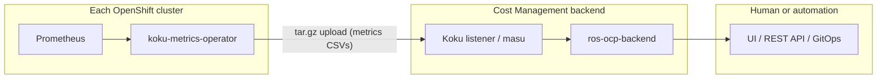

# HPA/VPA Recommendations and Deployment Modes

Internal analysis of how ros-ocp-backend deployment topology affects whether
HPA and VPA recommendations can be **used** (advisory) or **applied**
(automated actuation). HPA/VPA plugins are **deferred** — see
[REQ-8.1](requirements.md#req-81-hpa-optimization-high--deferred) and
[Deferred: HPA and VPA autoscaling](requirements.md#deferred-hpa-and-vpa-autoscaling).

## Deployment modes today

| Mode | Topology | Status | Recommendation delivery |
|------|----------|--------|-------------------------|
| **Remote (SaaS)** | Operator on each cluster → upload → Koku (ingress, Kafka, S3) → central ros-ocp-backend → console.redhat.com UI | **Shipped** | Advisory via web UI and REST API |
| **Local (on-prem)** | Operator + Koku + ros-ocp-backend + UI on the **same** cluster (cost-onprem chart) | **Shipped** | Advisory via local UI and REST API |
| **Local + central (hybrid)** | N clusters upload to one central Cost Management installation | **Shipped** (SaaS and multi-cluster on-prem) | Central ROS generates recs for all clusters; advisory |
| **Local Mode (planned)** | Operator computes on-cluster; optional push to central for fleet view | **Not implemented** — [local-mode.md](../features/local-mode.md) | Advisory; local `ros-ocp-api` is read-only |

All shipped modes share the same **data-collection → central processing → API/UI**
pattern. None include a feedback loop that modifies cluster objects.

The koku-metrics-operator is **metrics collection and upload only**. Its
reconciler queries Prometheus, writes CSVs, packages tarballs, and POSTs to the
ingress endpoint. It does **not** read recommendations, patch Deployments, or
modify HPA/VPA CRs. Confirmed in
[koku-metrics-operator architecture](https://github.com/project-koku/koku-metrics-operator/blob/main/docs/architecture.md).

The cost-onprem chart deploys the same components locally. There is no
recommendation-actuation sidecar, no Kubernetes client in ros-ocp-backend for
writes, and no webhook that applies sizing changes.

## HPA/VPA feature status

| Feature | Status | Planned delivery |
|---------|--------|------------------|
| HPA saturation / idle / flapping analysis | **Deferred** (REQ-8.1) | Phase 2 Enrich plugin `hpa`; codes **21**, **22** |
| VPA policy / updateMode recommendations | **Deferred** | Phase 2 Enrich plugin `vpa` |
| Combined VPA+HPA coordination | **Deferred** until in-place pod vertical scaling stabilizes (OQ#9) | — |

When implemented, both plugins depend on **container** recommendations (Phase 1)
and enrich them — they are not new CSV ingestors. See
[plugin-phases.md](plugin-phases.md).

## Can users USE recommendations? (Advisory mode)

**Yes — in all shipped modes, for recommendation types that exist today**
(container CPU/memory, GPU, nodes, quota, etc.). The workflow is:

1. Platform admin enables ROS on namespaces (`insights_cost_management_optimizations=true`).
2. Operator uploads metrics; ros-ocp-backend computes recommendations.
3. User views Optimizations UI or calls `GET /api/cost-management/v1/recommendations/openshift/...`.
4. User **manually** updates Deployment/StatefulSet resources, HPA specs, VPA
   policies, MachineSets, or GPU node config.

For **HPA specifically** (when REQ-8.1 ships), advisory mode means:

- "Your HPA `frontend-hpa` is saturated at `maxReplicas=10` — consider raising to 15."
- "HPA never scales above `minReplicas=3` — consider lowering min to 1."
- "ScalingLimited condition active 40% of the window — check metric target or quota."

These are **actionable text + numeric values** the user copies into their
HPA YAML or applies via `oc edit hpa`. No cluster write from Cost Management.

For **VPA** (when implemented), advisory scope per requirements:

- Recommend `updateMode: "Off"` or `"Initial"` vs `"Auto"` based on workload stability.
- Suggest `resourcePolicy` min/max bounds aligned with container rightsizing output.
- Does **not** replace container plugin sizing — enriches workloads that already have a VPA CR.

**VPA `updateMode: Off`** is the natural integration point: Kubernetes computes
VPA recommendations internally; Cost Management could:

1. Read existing VPA recommendation objects (requires operator to collect
   `kube_verticalpodautoscaler_*` metrics — listed as operator TBD in REQ-8.1).
2. Compare VPA targets against ROS container rightsizing and flag divergence.
3. Optionally suggest creating a VPA in `Off` mode so cluster admins see both
   advisors without automatic eviction.

None of this requires automated actuation.

## Can recommendations be AUTOMATICALLY applied?

**Not today. Not planned for v1 in any deployment mode.**

Automated actuation would require a **new cluster-side component** with:

| Requirement | Current state |
|-------------|---------------|
| Read recommendations from ROS API or a push channel | Not built |
| Kubernetes API client with write RBAC | Operator has read-only metrics RBAC |
| Patch HPA `spec.maxReplicas`, VPA `spec.updatePolicy`, Deployment `resources` | No code path |
| Safety gates (PDB, surge, maintenance windows, canary) | Node Tier 2/3 only on roadmap |
| Audit trail and rollback | Not designed |

Candidate implementations (all future work):

1. **Extend koku-metrics-operator** with an optional "actuation" reconciler
   (opt-in CRD field, conservative defaults).
2. **Separate "ros-actuator" operator** that watches a RecommendationApply CR.
3. **GitOps integration** — ROS exports PR-ready YAML; Argo CD / Flux applies
   (blast radius contained by review).

On-prem does **not** change this calculus. Running Koku and ROS on the same
cluster removes upload latency but does not add a write path to the API server.
[Local Mode](../features/local-mode.md) explicitly keeps `ros-ocp-api` **read-only**.

## Is automated actuation desirable?

**FinOps products default to advisory** for resource changes because the blast
radius of a bad apply is high (OOM kills, HPA flapping, eviction storms).

| Risk | HPA auto-apply | VPA auto-apply |
|------|----------------|----------------|
| Traffic spike during scale-down | Lowers `maxReplicas` → saturation | N/A |
| Traffic spike during scale-up delay | N/A | Raises requests → scheduling pressure |
| Wrong metric window | Flapping detection false positive | Eviction of production pods (`Auto` mode) |
| Multi-tenant cluster | One bad apply affects shared nodes | VPA eviction is disruptive |

ROS design choices that reinforce advisory-first:

- Node consolidation Tier 1 is explicitly
  [advisory only](node-recommendations-roadmap.md#tier-1--advisory-consolidation-with-safety-gates-shipped).
- Ephemeral storage recs: "never auto-apply" (unreliable cadvisor metrics).
- Seasonality plugin: "auto-apply advisory only in v1."
- REQ-8.1 HPA: code **22** `HPA_ACTIVE` **suppresses** replica-count advice when
  HPA manages the workload (OQ#9) — avoids fighting the autoscaler.

Tier 3 node roadmap ("autonomous scaling") targets **MachineAutoscaler bounds**,
not pod-level HPA/VPA, and is gated behind Tier 2 PDB/scheduling simulation.

## Industry comparison

| Product | Advisory | Automated apply | Notes |
|---------|----------|-----------------|-------|
| **AWS Compute Optimizer** | Yes | No | Export recommendations; user applies |
| **Kubecost** | Yes | No (savings plans aside) | Rightsizing is UI + API only |
| **Red Hat ROS (this project)** | Yes | No | Matches FinOps advisory norm |
| **CAST AI** | Yes | Yes (optional) | Agent on cluster; node/workload automation |
| **StormForge Optimize** | Yes | Yes (experiment-driven) | ML trials with controlled apply |
| **Goldilocks / VPA** | Yes | Partial | Creates VPA in `Off`/`Recommendation`; user promotes to `Auto` |
| **Kubernetes VPA** | Built-in | `Auto` mode only | Cluster component, not a FinOps product |

Our position aligns with Kubecost and AWS Compute Optimizer for v1. CAST AI and
StormForge show that automation sells when customers opt in to an on-cluster
agent — that is a **product decision**, not a deployment-mode limitation.

## Mode-specific implications for HPA/VPA

### Remote (SaaS)

- User sees recommendations in console.redhat.com Optimizations.
- Applying HPA/VPA changes requires cluster access (`oc`, GitOps, CI) — the
  console cannot reach the customer's API server.
- **Usability:** High for visibility; apply step is always external.

### Local (on-prem)

- Same advisory API; UI served from in-cluster nginx/webpack.
- User often has `cluster-admin` on the same cluster — **lower friction** to
  apply manually, but still no one-click apply from the product.
- **Usability:** Same recommendation quality; shorter pipeline latency only.

### Local + central

- Fleet admin sees all clusters in one Optimizations view.
- Per-cluster apply still requires targeting the right cluster context.
- **Usability:** Best for governance; apply remains per-cluster manual.

### Local Mode (planned)

- Recommendations available in minutes on disconnected clusters.
- Push to central optional for fleet KPIs.
- Actuation still manual unless a future actuator component is added.
- **Usability:** Best latency; same advisory contract.

## Summary

| Question | Answer |
|----------|--------|
| What modes are supported today? | Remote (SaaS), local (on-prem), local+central — all advisory |
| Can we tell users "set maxReplicas to X"? | Yes, when HPA plugin ships — via API/UI (advisory) |
| Can we auto-apply VPA recommendations? | No — requires new operator component + RBAC + safety gates |
| Does on-prem enable automation? | No — same architecture, co-located services only |
| Is automation desirable? | Opt-in only; industry and ROS safety posture favor advisory v1 |
| What would unlock actuation? | Tier 2+ safety simulation, optional actuator operator, GitOps export |

## Related docs

- [requirements.md — REQ-8.1, Deferred HPA/VPA](requirements.md#deferred-hpa-and-vpa-autoscaling)
- [plugin-phases.md — hpa, vpa plugins](plugin-phases.md)
- [node-recommendations-roadmap.md — Tier 1–3 actuation tiers](node-recommendations-roadmap.md)
- [local-mode.md](../features/local-mode.md) — planned on-cluster compute
- [koku-metrics-operator architecture](https://github.com/project-koku/koku-metrics-operator/blob/main/docs/architecture.md)
