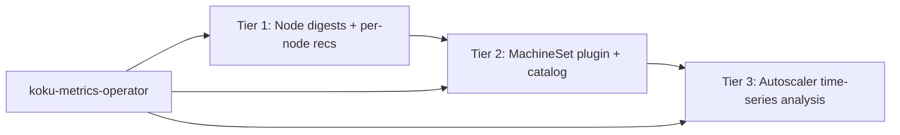

# Node Recommendations Roadmap — Tier 2 & Tier 3

**Status:** Tier 1 complete; Tier 2/3 planned  
**Related:** [Node consolidation (Tier 1)](../../docs-site/features/node-recommendations.md), [REQ-8c in requirements.md](requirements.md), [notification codes](notification-codes.md) (codes 14, 16–17 reserved for Tier 3)

Tier 1 is **shipped**, including:

| Capability | Status |
|------------|--------|
| `GET .../recommendations/openshift/nodes` (list, filters, CSV) | Done |
| Dual engines, term windows, fleet consolidation | Done |
| Idle / zombie detection + settings | Done |
| `pod_capacity`, `pod_scheduling_headroom`, notification **74** | Done |
| `filter[stranded_resource]`, `filter[instance_type]`, `filter[machineset_name]` | Done |
| `suggested_instance_type` / `instance_type_reason` (in-cluster ratio hints) | Done |
| `POST .../internal/recalculate-savings` after cost model changes | Done |
| Savings summary `?term=` alignment | Done |
| Dedicated `GET .../nodes/{node}` path | **Future** — use `filter[node]` today |
| Node recommendation history time series | **Future** |
| Cloud instance catalog (AWS/Azure/GCP specs + pricing) | **Future** (Tier 2) |

This document describes Tier 2 (MachineSet) and Tier 3 (MachineAutoscaler).

---

## Tier overview

| Tier | Focus | Actionable unit | API (planned) | Est. effort |
|------|--------|-----------------|---------------|-------------|
| **1** (done) | Per-node CPU/memory classification, sizing, consolidation | Individual node | `GET .../recommendations/openshift/nodes` | — |
| **2** | MachineSet right-sizing | MachineSet | `GET .../recommendations/openshift/machinesets` | ~2–3 weeks |
| **3** | MachineAutoscaler bounds & behavior | MachineSet + autoscaler | Extension of machinesets API or dedicated endpoint | ~4–6 weeks (after Tier 2) |

---

## Consolidation model — current scope and limitations

Tier 1 consolidation (`applyInstanceTypeConsolidation` in [recommend_nodes.go](../../internal/engine/recommend_nodes.go)) is **advisory only**.

### Current scope (Tier 1)

- Advisory signal: “you likely have N excess nodes in this fleet”
- Based on aggregate P95 utilization across the fleet group
- Groups nodes by MachineSet (when labeled) → `instance_type` → capacity bucket
- Does **not** account for: PodDisruptionBudgets, scheduling constraints (taints/tolerations/affinity), DaemonSet overhead, or actual pod placement feasibility
- Aligns with FinOps advisory tools (AWS Compute Optimizer, Kubecost, CAST AI recommendations)

### PDB/scheduling-aware consolidation (Tier 2 estimate)

Additional data required:

| Data | Source | Storage estimate |
|------|--------|------------------|
| PodDisruptionBudgets | `policy/v1` PDB resources | ~1 KB per PDB × namespaces |
| Node taints | `node.spec.taints` | Already in node labels CSV |
| Pod tolerations | `pod.spec.tolerations` | ~100 B per pod × pods |
| Node/pod affinity rules | `pod.spec.affinity` | ~200 B per pod with affinity |
| DaemonSet pod list | `apps/v1` DaemonSet resources | ~50 B per DS × nodes |

Processing estimate:

- For each candidate node removal, simulate whether non-DaemonSet pods can reschedule to remaining nodes while respecting PDBs, taints, and affinity
- Essentially a **scheduling simulation** (mini kube-scheduler) — ~O(pods × nodes) per candidate
- Example: 100-node cluster, 5000 pods → ~500K placement checks per consolidation evaluation
- Latency: seconds per evaluation (acceptable at recommendation time, not real-time)

**Storage:** ~50 MB additional per large cluster (PDB/affinity/toleration snapshots)  
**Processing:** ~5–10 s additional per cluster recommendation cycle

**Verdict:** Feasible for Tier 2 but requires operator enhancements (collect PDB + affinity data) and significant engine work. Not needed for advisory-only Tier 1.

---

## Fleet instance type suggestions (Tier 1 vs cloud catalog)

### Implemented (Tier 1 — in-cluster fleet)

When `stranded_resource` is `cpu` or `memory`, [RecommendNodes](../../internal/engine/recommend_nodes.go) compares the node’s allocatable CPU:memory ratio to **distinct instance types already observed** in `daily_node_digests` for that cluster:

- **CPU-stranded:** suggest a type with a **lower** CPU:memory allocatable ratio (compute-leaning shape already in the fleet)
- **Memory-stranded:** suggest a type with a **higher** CPU:memory ratio
- Persisted on `node_recommendations.suggested_instance_type` / `instance_type_reason` (migration **000123**)
- Exposed on list and `GET .../nodes/{node}` detail APIs

If no strictly better in-cluster type exists, fields remain empty; stranded directional notifications still apply.

### Future work — full cloud catalog (Tier 2+)

Not implemented in Tier 1. A full catalog path would:

- Query an external instance catalog (AWS/Azure/GCP pricing APIs or a bundled catalog table — see REQ-8c.6 in [requirements.md](requirements.md))
- Recommend instance types **not yet present** in the cluster
- Factor in **pricing** for cost-optimized family/size changes
- Require **provider-specific** catalog loaders and refresh jobs

Tier 2 MachineSet recommendations will reuse catalog data for replica and instance family changes; Tier 1 fleet-only suggestions avoid catalog dependency and stay accurate for homogeneous on-prem / single-family clusters.

---

## Tier 2 — MachineSet right-sizing

### Goal

Group nodes by **MachineSet** (not only by `instance_type`) and recommend **replica count** and **instance family/size** changes at the MachineSet level — the unit cluster admins actually change in IPI clusters.

Individual node recommendations (Tier 1) remain informational; MachineSet recommendations are the actionable consolidation and right-sizing surface.

### What it adds

| Capability | Description |
|------------|-------------|
| **MachineSet grouping** | Aggregate utilization, requests, and capacity across all nodes sharing a `machineset_name` |
| **Replica count** | e.g. “reduce from 5 to 3 replicas” based on sustained P95 utilization vs target (default ~70%, configurable) |
| **Instance family/size** | e.g. “switch from `m5.xlarge` to `m5.large`” when peak usage fits a smaller catalog entry; family changes for stranded CPU/memory (e.g. `m5` → `c5` / `r5`) |
| **API** | New `GET /api/cost-management/v1/recommendations/openshift/machinesets` with filters, pagination, savings |
| **Persistence** | New `machineset_recommendations` table (schema sketched in [requirements.md](requirements.md#req-8c5-tier-2--machineset-right-sizing-high--not-implemented)) |

### Prerequisites and implementation steps

1. **Operator (koku-metrics-operator)**  
   - Collect `machine.openshift.io/machine-set` (or equivalent) from node labels via Prometheus.  
   - Emit `machineset_name` on ROS container CSV (production path). **Nise** also generates `machineset_name` and `node_capacity_pods` for test data.  
   - Optional for Tier 2 core: MachineSet replica counts (`machineset_replicas`, `desired`/`available`) — required before Tier 3.

2. **Ingestion (ros-ocp-backend)** — **done for Tier 1**  
   - Parse `machineset_name` / `node_capacity_pods` from ROS CSV into `daily_node_digests`.  
   - Digest aggregation retains `machineset_name`, `instance_type`, and `pod_capacity`.

3. **Engine**  
   - New **`machineset` plugin** (or extension of node plugin phase):  
     - Group digests by `(org_id, cluster_uuid, machineset_name)`.  
     - Compute fleet-level CPU/memory P95, replica recommendation, instance type from catalog.  
   - Reuse Tier 1 stranded-resource signals for family recommendations.  
   - Integrate **cloud instance catalog** (REQ-8c.6): `cloud_instance_catalog` table, public pricing/spec APIs (AWS bulk JSON, Azure Retail Prices, GCP `machineTypes.list`), optional EC2 API when IAM allows.

4. **API**  
   - List/detail handlers mirroring node patterns: `cluster_uuid`, `machineset_name`, `current_instance_type`, `is_underutilized`, pagination, `estimated_monthly_savings`.

5. **Cloud catalog**  
   - Lookup vCPU/RAM by `instance_type` for “smallest fit” and cost comparison; on-prem may skip instance-type *changes* when catalog is empty (capacity-based logic still applies).

### Limitations

- **Machine API / MachineSets only:** Helps IPI-provisioned clusters using MachineSets. Does **not** help bare metal, single-node OpenShift (SNO), or UPI/manual nodes without `machineset_name` (those nodes stay Tier 1 only; `machineset_name` is `NULL` → skip Tier 2/3 for that node).  
- **PDB / drain safety:** Tier 2 recommends counts; PDB-aware automation is notification-only (see REQ-8c.5 in requirements).  
- **HA floor:** Configurable minimum replicas (e.g. `ROS_MIN_MACHINESET_REPLICAS`, default 2).

### Estimated effort

**~2–3 weeks** (operator label + ingest + plugin + API + catalog refresh job), assuming Tier 1 and cost integration remain stable.

---

## Tier 3 — MachineAutoscaler optimization

### Goal

Analyze **historical scaling patterns** (replica count over time vs actual demand) and recommend tighter **`minReplicas` / `maxReplicas`**, flag misconfigured autoscalers, and optionally suggest scaling policy tuning.

### What it adds

| Capability | Description |
|------------|-------------|
| **Historical scaling** | Time-series of `machineset_replicas` / desired / available vs utilization |
| **Bound recommendations** | Tighter `minReplicas` / `maxReplicas` when sustained behavior shows headroom |
| **Saturated autoscaler** | `current_replicas == maxReplicas` most of the window → raise max or enlarge instance type (notification **14** `AUTOSCALER_SATURATED`) |
| **Idle autoscaler** | `current_replicas == minReplicas` most of the window → lower min (code **15** / autoscaler idle family) |
| **Never scales / always at max** | Flag autoscalers that never leave min (min too high) or peg max (max too low or instance too small) |
| **Policy hints (optional)** | Cool-down, scale-down delay, stabilization — research-heavy; may ship as notifications first |
| **API** | New endpoint or fields on `.../machinesets` (e.g. `autoscaler_min_recommended`, `is_saturated`, `is_flapping`) |

### Prerequisites

1. **Tier 2 complete** — MachineSet identity, grouping, and replica metadata must be reliable.  
2. **Operator** — Collect MachineAutoscaler CR specs (`min`, `max`, current replicas) and ideally scaling events or hourly replica snapshots (see REQ-8c.4 Prometheus queries in [requirements.md](requirements.md)).  
3. **Engine** — Windowed analysis (e.g. % of days at min/max, peak/trough replica spread vs CPU/memory P95).  
4. **API** — Expose autoscaler state and recommendations alongside MachineSet rows.

### Complexity note

Tier 3 is **more research-oriented** than Tiers 1–2: recommendations depend on **scheduling and burst patterns**, not only average utilization. Incorrect min/max changes can cause outages; expect conservative heuristics, strong notifications, and manual-review messaging before automated apply.

### Estimated effort

**~4–6 weeks** after Tier 2, depending on operator metrics quality and policy scope (bounds-only vs full MachineAutoscaler spec suggestions).

---

## Schema and API sketch (planned)

Already partially reserved in migrations and requirements:

- `daily_node_digests.machineset_name` — **exists**; needs operator population.  
- `node_recommendations.machineset_name` — **exists** for correlation.  
- `machineset_recommendations` — **not created**; PK `(org_id, cluster_uuid, machineset_name)`.

Planned list endpoint filters (REQ-8c): `cluster_uuid`, `machineset_name`, `current_instance_type`, `is_saturated`, `is_idle`, `is_flapping`.

---

## Relationship to Tier 1 today

Tier 1 already groups fleet consolidation by **`instance_type`** when the operator provides it. Tier 2 replaces that grouping key with **MachineSet** for clusters where labels exist, and adds replica + catalog-driven instance changes. Nodes without `machineset_name` continue to use Tier 1 behavior only.

---

## References

- [requirements.md — Phase 8c](requirements.md) (REQ-8c.4–8c.7, schemas, algorithms)  
- [notification-codes.md](notification-codes.md) — codes 14, 16–17 reserved for autoscaler Tier 3  
- [cost-integration.md](cost-integration.md) — node savings; MachineSet savings will extend the same `effective_rates` patterns  
- [configurability.md](configurability.md) — future `ROS_MIN_MACHINESET_REPLICAS`, catalog refresh interval
