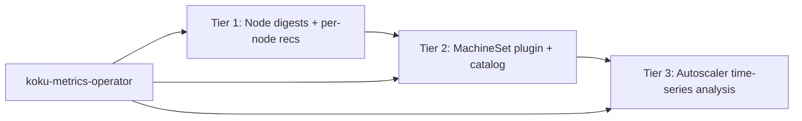

# Node Recommendations Roadmap — Tier 2 & Tier 3

**Status:** Planned future work (not implemented)  
**Related:** [Node consolidation (Tier 1)](../../docs-site/features/node-recommendations.md), [REQ-8c in requirements.md](requirements.md), [notification codes](notification-codes.md) (codes 14, 16–17 reserved for Tier 3)

Tier 1 (per-node utilization visibility, dual cost/performance engines, fleet consolidation by `instance_type`) is **shipping**. This document describes the next two tiers: actionable recommendations at the **MachineSet** level (Tier 2) and **MachineAutoscaler** tuning (Tier 3).

---

## Tier overview

| Tier | Focus | Actionable unit | API (planned) | Est. effort |
|------|--------|-----------------|---------------|-------------|
| **1** (done) | Per-node CPU/memory classification, sizing, consolidation | Individual node | `GET .../recommendations/openshift/nodes` | — |
| **2** | MachineSet right-sizing | MachineSet | `GET .../recommendations/openshift/machinesets` | ~2–3 weeks |
| **3** | MachineAutoscaler bounds & behavior | MachineSet + autoscaler | Extension of machinesets API or dedicated endpoint | ~4–6 weeks (after Tier 2) |

---

## Tier 2 — MachineSet right-sizing

### Goal

Group nodes by **MachineSet** (not only by `instance_type`) and recommend **replica count** and **instance family/size** changes at the MachineSet level — the unit cluster admins actually change in IPI clusters.

Individual node recommendations (Tier 1) remain informational; MachineSet recommendations are the actionable consolidation and right-sizing surface.

### What it adds

| Capability | Description |
|------------|-------------|
| **MachineSet grouping** | Aggregate utilization, requests, and capacity across all nodes sharing a `machineset_name` |
| **Replica count** | e.g. “reduce from 5 to 3 replicas” based on sustained P95 utilization vs target (default ~70%, configurable) |
| **Instance family/size** | e.g. “switch from `m5.xlarge` to `m5.large`” when peak usage fits a smaller catalog entry; family changes for stranded CPU/memory (e.g. `m5` → `c5` / `r5`) |
| **API** | New `GET /api/cost-management/v1/recommendations/openshift/machinesets` with filters, pagination, savings |
| **Persistence** | New `machineset_recommendations` table (schema sketched in [requirements.md](requirements.md#req-8c5-tier-2--machineset-right-sizing-high--not-implemented)) |

### Prerequisites and implementation steps

1. **Operator (koku-metrics-operator)**  
   - Collect `machine.openshift.io/machine-set` (or equivalent) from node labels via Prometheus.  
   - Emit `machineset_name` on the ROS node usage CSV (column already defined in requirements; not yet populated in production paths).  
   - Optional for Tier 2 core: MachineSet replica counts (`machineset_replicas`, `desired`/`available`) — required before Tier 3.

2. **Ingestion (ros-ocp-backend)**  
   - Parse `machineset_name` from ROS CSV into `daily_node_digests` (column exists since migration **000052**; today often `NULL`).  
   - Ensure digest aggregation retains `machineset_name` and `instance_type` for grouping.

3. **Engine**  
   - New **`machineset` plugin** (or extension of node plugin phase):  
     - Group digests by `(org_id, cluster_uuid, machineset_name)`.  
     - Compute fleet-level CPU/memory P95, replica recommendation, instance type from catalog.  
   - Reuse Tier 1 stranded-resource signals for family recommendations.  
   - Integrate **cloud instance catalog** (REQ-8c.6): `cloud_instance_catalog` table, public pricing/spec APIs (AWS bulk JSON, Azure Retail Prices, GCP `machineTypes.list`), optional EC2 API when IAM allows.

4. **API**  
   - List/detail handlers mirroring node patterns: `cluster_uuid`, `machineset_name`, `current_instance_type`, `is_underutilized`, pagination, `estimated_monthly_savings`.

5. **Cloud catalog**  
   - Lookup vCPU/RAM by `instance_type` for “smallest fit” and cost comparison; on-prem may skip instance-type *changes* when catalog is empty (capacity-based logic still applies).

### Limitations

- **Machine API / MachineSets only:** Helps IPI-provisioned clusters using MachineSets. Does **not** help bare metal, single-node OpenShift (SNO), or UPI/manual nodes without `machineset_name` (those nodes stay Tier 1 only; `machineset_name` is `NULL` → skip Tier 2/3 for that node).  
- **PDB / drain safety:** Tier 2 recommends counts; PDB-aware automation is notification-only (see REQ-8c.5 in requirements).  
- **HA floor:** Configurable minimum replicas (e.g. `ROS_MIN_MACHINESET_REPLICAS`, default 2).

### Estimated effort

**~2–3 weeks** (operator label + ingest + plugin + API + catalog refresh job), assuming Tier 1 and cost integration remain stable.

---

## Tier 3 — MachineAutoscaler optimization

### Goal

Analyze **historical scaling patterns** (replica count over time vs actual demand) and recommend tighter **`minReplicas` / `maxReplicas`**, flag misconfigured autoscalers, and optionally suggest scaling policy tuning.

### What it adds

| Capability | Description |
|------------|-------------|
| **Historical scaling** | Time-series of `machineset_replicas` / desired / available vs utilization |
| **Bound recommendations** | Tighter `minReplicas` / `maxReplicas` when sustained behavior shows headroom |
| **Saturated autoscaler** | `current_replicas == maxReplicas` most of the window → raise max or enlarge instance type (notification **14** `AUTOSCALER_SATURATED`) |
| **Idle autoscaler** | `current_replicas == minReplicas` most of the window → lower min (code **15** / autoscaler idle family) |
| **Never scales / always at max** | Flag autoscalers that never leave min (min too high) or peg max (max too low or instance too small) |
| **Policy hints (optional)** | Cool-down, scale-down delay, stabilization — research-heavy; may ship as notifications first |
| **API** | New endpoint or fields on `.../machinesets` (e.g. `autoscaler_min_recommended`, `is_saturated`, `is_flapping`) |

### Prerequisites

1. **Tier 2 complete** — MachineSet identity, grouping, and replica metadata must be reliable.  
2. **Operator** — Collect MachineAutoscaler CR specs (`min`, `max`, current replicas) and ideally scaling events or hourly replica snapshots (see REQ-8c.4 Prometheus queries in [requirements.md](requirements.md)).  
3. **Engine** — Windowed analysis (e.g. % of days at min/max, peak/trough replica spread vs CPU/memory P95).  
4. **API** — Expose autoscaler state and recommendations alongside MachineSet rows.

### Complexity note

Tier 3 is **more research-oriented** than Tiers 1–2: recommendations depend on **scheduling and burst patterns**, not only average utilization. Incorrect min/max changes can cause outages; expect conservative heuristics, strong notifications, and manual-review messaging before automated apply.

### Estimated effort

**~4–6 weeks** after Tier 2, depending on operator metrics quality and policy scope (bounds-only vs full MachineAutoscaler spec suggestions).

---

## Schema and API sketch (planned)

Already partially reserved in migrations and requirements:

- `daily_node_digests.machineset_name` — **exists**; needs operator population.  
- `node_recommendations.machineset_name` — **exists** for correlation.  
- `machineset_recommendations` — **not created**; PK `(org_id, cluster_uuid, machineset_name)`.

Planned list endpoint filters (REQ-8c): `cluster_uuid`, `machineset_name`, `current_instance_type`, `is_saturated`, `is_idle`, `is_flapping`.

---

## Relationship to Tier 1 today

Tier 1 already groups fleet consolidation by **`instance_type`** when the operator provides it. Tier 2 replaces that grouping key with **MachineSet** for clusters where labels exist, and adds replica + catalog-driven instance changes. Nodes without `machineset_name` continue to use Tier 1 behavior only.

---

## References

- [requirements.md — Phase 8c](requirements.md) (REQ-8c.4–8c.7, schemas, algorithms)  
- [notification-codes.md](notification-codes.md) — codes 14, 16–17 reserved for autoscaler Tier 3  
- [cost-integration.md](cost-integration.md) — node savings; MachineSet savings will extend the same `effective_rates` patterns  
- [configurability.md](configurability.md) — future `ROS_MIN_MACHINESET_REPLICAS`, catalog refresh interval
