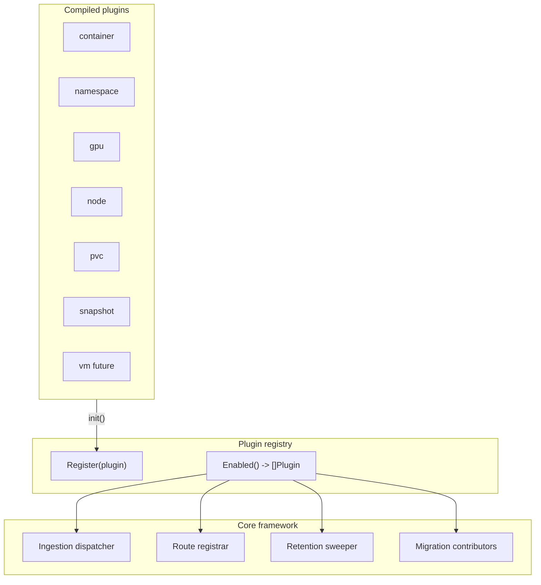

# Recommendation Plugin Architecture — Design Proposal

> **Date:** 2026-05-18  
> **Status:** Proposal  
> **Scope:** `ros-ocp-backend` (Go service that ingests OpenShift metrics and serves resource optimization recommendations via HTTP)

ros-ocp-backend today implements multiple recommendation domains—container CPU/memory, namespace aggregates, GPU (MIG and time-slicing), node utilization, PVC storage, and VolumeSnapshot staleness—with additional domains planned (OpenShift Virtualization VMs, Java/JVM, Golang). Each domain spans ingestion, persistence, recommendation logic, HTTP handlers, and retention. **There is no shared plugin abstraction**: behavior is wired through sequential conditionals and tightly coupled call chains across roughly eight touchpoints per feature.

This document proposes **compile-time, in-process plugins** behind small Go interfaces, toggled at runtime via environment variables (`ROS_ENABLED_PLUGINS` / `ROS_DISABLED_PLUGINS`). Plugins ship in the same binary (blank imports + `init()` registration)—no dynamic `.so` loading, no gRPC, no Wasm—preserving **zero interface dispatch overhead** on the hot path beyond ordinary Go polymorphism.

---

## 1. Problem statement

### 1.1 Symptoms

- Adding or substantially changing a recommendation type requires edits across Kafka ingestion, CSV classification, digest pipelines, recommendation engines, HTTP routing, handlers, and often SQL migrations—without a single place that declares “this type exists.”
- Operators cannot disable a domain (for example GPU or snapshots) without feature-specific env vars scattered through `config`, or without removing code paths.
- Cross-cutting behavior (GPU digest upserts during container CSV processing; GPU enrichment of container list/detail APIs; node recommendations invoked from the container native path) is **implicitly sequenced** inside large functions, which obscures ownership and complicates testing.

### 1.2 Concrete coupling in the codebase

**Kafka report dispatch — sequential `if` branches per CSV type** (`internal/services/report_processor.go`):

```104:136:internal/services/report_processor.go
	var csvType types.PayloadType

	for _, file := range kafkaMsg.Files {
		csvType = utils.DetermineCSVType(file)

		if cfg.UseNativeEngine && csvType == types.PayloadTypeContainer {
			if err := processContainerCSVNative(file, kafkaMsg); err != nil {
				reportProcessingFailed = true
				recordKafkaTransient(err)
			}
			continue
		}
		if cfg.UseNativeEngine && csvType == types.PayloadTypeNamespace {
			if err := processNamespaceCSVNative(file, kafkaMsg); err != nil {
				reportProcessingFailed = true
				recordKafkaTransient(err)
			}
			continue
		}
		if cfg.UseNativeEngine && csvType == types.PayloadTypeStorage {
			if err := processStorageCSVNative(file, kafkaMsg); err != nil {
				reportProcessingFailed = true
				recordKafkaTransient(err)
			}
			continue
		}
		if cfg.UseNativeEngine && csvType == types.PayloadTypeSnapshot {
			if err := processSnapshotCSVNative(file, kafkaMsg); err != nil {
				reportProcessingFailed = true
				recordKafkaTransient(err)
			}
			continue
		}
```

**CSV type discrimination by filename substring** (`internal/utils/utils.go`):

```384:395:internal/utils/utils.go
func DetermineCSVType(fileName string) types.PayloadType {
	if strings.Contains(fileName, "namespace") {
		return types.PayloadTypeNamespace
	}
	if strings.Contains(fileName, "snapshot") {
		return types.PayloadTypeSnapshot
	}
	if strings.Contains(fileName, "storage") {
		return types.PayloadTypeStorage
	}
	return types.PayloadTypeContainer
}
```

**Payload type constants** (shared contract; every new file pattern requires updates here and in dispatch) (`internal/types/kafkaMsg.go`):

```5:12:internal/types/kafkaMsg.go
type PayloadType string

const (
	PayloadTypeContainer PayloadType = "container"
	PayloadTypeNamespace PayloadType = "namespace"
	PayloadTypeStorage   PayloadType = "storage"
	PayloadTypeSnapshot  PayloadType = "snapshot"
)
```

**Container CSV native path fans into container recommendations and node recommendations** (`internal/services/report_processor.go`):

```440:545:internal/services/report_processor.go
// processContainerCSVNative handles container CSV files through the native Go
// recommendation engine instead of the Kruize pipeline. It downloads the CSV,
// computes daily digests, upserts them, and runs the recommendation engine.
func processContainerCSVNative(fileURL string, kafkaMsg types.KafkaMsg) error {
	// ...
	if err := ingestion.ProcessCSVToDigests(ctx, pool, body, orgID, clusterUUID); err != nil {
		// ...
	}
	// ... RecommendAllWorkloads, WriteRecommendations, history, quality ...
	if err := runNodeRecommendations(ctx, pool, orgID, clusterUUID, start, now, appCfg); err != nil {
		log.Warnf("native engine: node recommendations incomplete for org=%s cluster=%s: %v", orgID, clusterUUID, err)
		return fmt.Errorf("node recommendations: %w", err)
	}
	return nil
}
```

**GPU and node digest upserts chained inside container digest processing** (`internal/ingestion/pipeline.go`):

```267:276:internal/ingestion/pipeline.go
	log.Infof("ProcessCSVToDigests: upserted %d digests for org=%s cluster=%s",
		len(grouped), orgID, clusterUUID)

	if err := upsertGPUDigests(ctx, pool, rows, orgID, clusterUUID); err != nil {
		return fmt.Errorf("GPU digest upsert: %w", err)
	}

	if err := upsertNodeDigests(ctx, pool, rows, orgID, clusterUUID); err != nil {
		return fmt.Errorf("node digest upsert: %w", err)
	}
```

**HTTP routes registered imperatively per domain** (`internal/api/server.go`):

```61:127:internal/api/server.go
	// Container recommendations — native engine with Kruize fallback, or legacy-only.
	if cfg.UseNativeEngine {
		// Static /gpu path must register before /:recommendation-id so "gpu" is not captured as an ID.
		v1.GET("/recommendations/openshift/gpu", GetGPUSummary)
		v1.GET("/recommendations/openshift", GetRecommendationSetListWithFallback)
		v1.GET("/recommendations/openshift/:recommendation-id", GetRecommendationSetWithFallback)
	} else {
		// ...
	}

	// Project/Namespace — ...
	if cfg.UseNativeEngine {
		v1.GET("/recommendations/openshift/namespaces", GetNamespaceRecommendationSetListWithFallback)
		// ...
	}
	// ...
	// Node-level GPU time-slicing and MIG-focused listings (native engine only).
	if cfg.UseNativeEngine {
		v1.GET("/recommendations/openshift/gpu/timeslicing", GetNodeRecommendations)
		v1.GET("/recommendations/openshift/gpu/mig", GetGPUMIGRecommendations)
		v1.GET("/recommendations/openshift/nodes", GetNodeUtilizationRecs)
		v1.GET("/recommendations/openshift/nodes/utilization", GetNodeUtilizationRecsLegacyPath)
	}
	// PVC ... Snapshot ...
```

Under Echo, **`static > param > any`** matching means concrete paths such as **`/gpu`** are not consumed by **`/:recommendation-id`** when ordering follows the framework rule in §6.2 (plugin routes first; core catch-alls last). The inline comment reflects the same invariant.

**GPU enrichment hard-coded into container list handlers** (`internal/api/handlers.go`):

```372:385:internal/api/handlers.go
	results, count, queryErr := model.GetNativeRecommendations(OrgID, apiListOptions, queryParams, userPerms)
	if queryErr != nil {
		// ...
	}

	enrichWithGPU(c.Request().Context(), results, OrgID)

	hasGPU, gpuModels, gpuClassifications := parseGPUFilters(c)
	results, count = filterGPUResults(results, hasGPU, gpuModels, gpuClassifications)
```

**Retention sweeps use a fixed table list** (`internal/engine/retention.go`):

```23:30:internal/engine/retention.go
// Tables retained by the general ROS_RETENTION_MONTHS setting.
var retainedTables = []string{
	"container_usage_samples",
	"daily_container_digests",
	"daily_namespace_digests",
	"gpu_container_digests",
	"namespace_usage_samples",
}
```

Together, these fragments show the same pattern repeated: **dispatch by enum + imperative wiring**, rather than a registry of named capabilities.

---

## 2. Design goals

| Goal | Intent |
|------|--------|
| **Zero hot-path IPC overhead** | Use Go interfaces and static calls only—no gRPC, no subprocesses, no serialization between core and plugins. |
| **Runtime enable/disable without recompilation** | Operators choose active domains via env vars; compiled plugins not in the allowlist (or explicitly blocklisted) do not run **their** ingest hooks, routes, retention, or migrations **contributions**. The binary remains a single artefact with all plugins linked. |
| **Incremental adoption** | Introduce registry and interfaces first; migrate one recommendation type at a time behind the same API. |
| **Explicit cross-plugin relationships** | Secondary behavior (GPU/node piggybacking on container CSV; GPU enrichment of container HTTP responses) becomes **declarative** (`IngestHook`, `APIEnricher`) instead of buried ordering inside monolithic functions. |
| **Testability** | Each plugin can be unit-tested with fake `PluginContext`; integration tests compose a subset of registered plugins. |

Non-goals are listed in [§13](#13-what-this-design-does-not-do).

---

## 3. Architecture overview

Plugins are **compiled in** and **self-register** via `init()`. A central **registry** filters registrations according to env-configured enabled sets. Core subsystems (**ingestion dispatcher**, **HTTP registrar**, **retention runner**, **migration contributor list**) iterate **only enabled** plugins and invoke optional capabilities via type assertions (trait pattern).



**Shared infrastructure** (PostgreSQL pool, service config, term-config resolver, Prometheus metrics, structured logging) is passed through a **`PluginContext`** constructed once at startup and injected into plugins that need it (either via setter called from `main`, or passed into `ProcessCSV` / `RunRetention` — exact wiring is an implementation detail left to Phase 1).

### 3.1 Configuration boundary (confirmed)

- **Single load:** The root **`Config`** struct is populated **once at process startup** via Viper (existing pattern). This stays the single source of truth, consistent with Koku’s central `settings.py`, the metrics operator’s typed CRD spec, and today’s `ros-ocp-backend` wiring.
- **No ambient reads in plugins:** Plugins **must not** call Viper or **`os.Getenv`** directly. Each plugin defines its own **typed config struct**; startup code maps fields from the root **`Config`** into **`PluginContext`** (or an embedded plugin-specific config snapshot) **once**, before serving traffic.
- **Cleanup:** GPU-related toggles currently read via raw **`os.Getenv`** in **`gpu_recommender.go`** should move onto the central **`Config`** and flow through **`PluginContext`** like other domains—mirroring Django’s “central settings + app reads constants” and the operator’s typed spec.

---

## 4. Plugin interfaces (trait-based)

Not every plugin implements every trait. Core code uses **type assertions** to detect capabilities—no “fat” interface forcing empty methods.

```go
package plugin

// Plugin is the base identity every recommendation domain must implement.
type Plugin interface {
	Name() string           // stable identifier: "container", "gpu", "pvc", ...
	DefaultEnabled() bool   // when ROS_ENABLED_PLUGINS is unset, include if true
}

// CSVIngestor handles CSV files arriving via Kafka (after URL fetch / typing).
type CSVIngestor interface {
	Plugin
	PayloadTypes() []PayloadType // types.DetermineCSVType or successor maps files here
	ProcessCSV(ctx context.Context, pctx *PluginContext, fileURL string, msg KafkaMsg) error
}

// IngestHook runs after the primary CSV ingestor parses the file and performs its own persistence.
// Confirmed contract (Option B): the container plugin passes parsed rows in-memory — no second DTO type.
// Hook errors are non-fatal by default unless a future Critical() trait is introduced (§6.1.1).
type IngestHook interface {
	Plugin
	HookAfter() string // plugin Name(), e.g. "container"
	OnAfterCSVIngest(ctx context.Context, pctx *PluginContext, primary Plugin, rows []ingestion.MetricRow, orgID, clusterUUID string, msg KafkaMsg) error
}

// APIProvider registers HTTP routes under the authenticated v1 group.
type APIProvider interface {
	Plugin
	RegisterRoutes(e *echo.Group, pctx *PluginContext)
}

// APIEnricher decorates responses owned by another plugin.
// Example: GPU metadata on container list/detail payloads.
type APIEnricher interface {
	Plugin
	EnrichTarget() string // plugin Name(), e.g. "container"
	EnrichList(ctx context.Context, pctx *PluginContext, orgID string, results *[]model.NativeContainerResult) error
	EnrichDetail(ctx context.Context, pctx *PluginContext, orgID string, detail interface{}) error
}

// RetentionProvider contributes partition drops / DELETE sweeps for domain-owned tables.
type RetentionProvider interface {
	Plugin
	RunRetention(ctx context.Context, pctx *PluginContext, retentionMonths int, historyRetentionDays int) error
}

// MigrationProvider documents plugin-owned DDL that lives in the central migrations/ directory (§6.4).
// Per-plugin migration subtrees (embedded fs.FS, internal/plugins/*/migrations/) are not used.
type MigrationProvider interface {
	Plugin
	// OwnedTables lists logical tables/partitions introduced by this plugin’s SQL files — useful for
	// retention validation and docs; exact shape deferred to implementation.
	OwnedTables() []string
}
```

```5:22:internal/ingestion/models.go
// MetricRow represents a single parsed row from an OCP metrics CSV file,
// with all numeric values already converted to integer types (millicores, KiB).
type MetricRow struct {
	IntervalStart time.Time
	IntervalEnd   time.Time
	Namespace     string
	WorkloadName  string
	WorkloadType  string
	ContainerName string
	Pod           string
	Node          string

	CPURequestMC     int64
	CPULimitMC       int64
```

**IngestHook data contract (confirmed — Option B):** After the container **`CSVIngestor`** parses the CSV, hooks receive **`[]MetricRow`** — the existing struct in [`internal/ingestion/models.go`](../../internal/ingestion/models.go). That type is already the de facto DTO for **`upsertGPUDigests`** and **`upsertNodeDigests`** in the ingestion pipeline. **Option C** (hooks re-query the DB after the container writer persists rows) was rejected: it adds I/O, couples hooks to table shapes, and complicates tests. Passing **`[]MetricRow`** avoids an extra DB round-trip; hooks are trivially unit-testable with in-memory slices; and **`MetricRow`** can grow additively as the CSV schema evolves—hooks that only read fields they need remain compatible.

**Note:** `PayloadType`, `KafkaMsg`, Echo types, and **`MigrationProvider.OwnedTables()`** are illustrative; the implementation should import existing `internal/types`, `internal/ingestion`, and `internal/api` packages rather than duplicating models.

---

## 5. Registry implementation

- **`Register(p Plugin)`** — appends to a package-level slice; called from each plugin’s `init()`.
- **`Enabled()`** — returns plugins filtered by env:

  - If **`ROS_ENABLED_PLUGINS`** is non-empty: treat as **allowlist** (comma-separated names). Only registered plugins whose `Name()` appears are enabled (regardless of `DefaultEnabled()`, unless we explicitly document hybrid behavior—recommended: allowlist wins).
  - If **`ROS_ENABLED_PLUGINS`** is empty: enable all registered plugins such that **`DefaultEnabled() == true`**, then apply **`ROS_DISABLED_PLUGINS`** as a **blocklist** (comma-separated names).

- **Ordering** — registry preserves registration order (import order in `main`). For deterministic hooks, core may **sort** hooks by `(HookAfter(), Name())` or document that hook order follows registration order after filtering.

Illustrative logic (**central registry** reads **`ROS_*`** env vars; plugin implementations must not call **`os.Getenv`** themselves — §3.1):

```go
func Enabled() []Plugin {
	allow := parsePluginSet(os.Getenv("ROS_ENABLED_PLUGINS"))
	deny := parsePluginSet(os.Getenv("ROS_DISABLED_PLUGINS"))
	var out []Plugin
	for _, p := range registry {
		name := p.Name()
		if len(allow) > 0 {
			if allow[name] {
				out = append(out, p)
			}
			continue
		}
		if deny[name] {
			continue
		}
		if p.DefaultEnabled() {
			out = append(out, p)
		}
	}
	return out
}
```

**Blank imports** in `cmd/*/main.go` (or a single `internal/plugins/import_plugins.go`) pull in plugins:

```go
import (
	_ "github.com/redhatinsights/ros-ocp-backend/internal/plugins/container"
	_ "github.com/redhatinsights/ros-ocp-backend/internal/plugins/namespace"
	_ "github.com/redhatinsights/ros-ocp-backend/internal/plugins/gpu"
	// ...
)
```

---

## 6. Core dispatch changes

### 6.1 Ingestion (`report_processor.go`)

Replace the fixed sequence of `if csvType == …` with:

1. Compute `csvType` (eventually **`CSVIngestor.PayloadTypes()`** may supersede central string matching, or `DetermineCSVType` becomes a fallback delegating to plugins).
2. For each enabled plugin implementing **`CSVIngestor`**, if `csvType` ∈ `PayloadTypes()`, call `ProcessCSV`.
3. For each enabled **`IngestHook`** where `HookAfter()` equals the **primary** plugin `Name()` that just ran, call **`OnAfterCSVIngest`** with the parsed **`[]MetricRow`** (plus org/cluster identifiers from context)—confirmed Option B in §4.

This preserves semantics while allowing GPU/node code to move out of `internal/ingestion/pipeline.go`’s unconditional tail calls.

### 6.1.1 Hook failure semantics (confirmed)

**`IngestHook`** invocations are **non-fatal by default**. If a hook (for example GPU digest upsert) returns an error, core **logs** it, **increments an error metric**, and **continues** processing the remainder of the pipeline (including other hooks and downstream steps that do not depend on the failed hook’s side effects). **Container recommendations are the primary product**: an auxiliary plugin bug must **not** prevent container CSV data and container-native recommendations from landing.

This behavior is a core benefit of the plugin architecture: **isolation** between domains limits blast radius compared to today’s inlined chains where a GPU digest failure can fail the whole container ingest path (see [`internal/ingestion/pipeline.go`](../../internal/ingestion/pipeline.go) GPU/node upserts returning errors from `ProcessCSVToDigests`).

**Future extension:** A **`Critical() bool`** trait (or equivalent) on hooks could mark must-succeed contributors that should abort the batch—**not** part of the initial design.

### 6.2 API (`server.go` / handlers)

After constructing Echo groups and middleware:

```go
for _, p := range plugin.Enabled() {
	if api, ok := p.(plugin.APIProvider); ok {
		api.RegisterRoutes(v1, pctx)
	}
}
```

**Route ordering (confirmed):** No **`Priority() int`** on **`APIProvider`** is required. Echo’s router matches **`static > param > any`**, so concrete paths such as **`/recommendations/openshift/gpu`** or **`/recommendations/openshift/namespaces`** naturally win over **`/:recommendation-id`** without explicit priorities. **Rule for core:** register catch-all or parameterized routes (**`/:recommendation-id`** and similar) **after** the generic plugin registrar loop so every plugin has registered its static segments first. Plugins expose **full path strings** in their **`RegisterRoutes`** implementations (as today in [`internal/api/server.go`](../../internal/api/server.go)); contributors must not rely on manual ordering beyond “catch-all last.”

Container list/detail handlers resolve **`APIEnricher`** targets named `"container"` instead of calling `enrichWithGPU` directly.

### 6.3 Retention (`internal/engine/retention.go`)

Split today’s monolithic `retainedTables` slice:

- **Framework-owned** tables stay in core (for example org/cluster/account bookkeeping if applicable).
- Each **`RetentionProvider`** appends domain-specific partition parents or runs targeted `DELETE`s.

Core orchestrates:

```go
for _, p := range plugin.Enabled() {
	if rp, ok := p.(plugin.RetentionProvider); ok {
		if err := rp.RunRetention(ctx, pctx, months, historyDays); err != nil {
			errs = append(errs, err)
		}
	}
}
```

### 6.4 Migrations

**Central directory only (confirmed):** All golang-migrate SQL stays in the repository’s single **`migrations/`** directory with **sequential numeric prefixes** on filenames. Plugin-contributed DDL is added as new numbered files in that same tree—**not** under **`internal/plugins/<name>/migrations/`** or other per-plugin paths.

**Convention:** Each plugin-authored file begins with a SQL comment header identifying ownership, e.g. **`-- plugin: gpu`**, so operators and reviewers can see domain ownership without splitting the migrate graph.

The golang-migrate driver loads **one** sequential chain (core + plugin contributions in numeric order). Disabled plugins still imply an operational constraint: operators must not enable a domain on an existing cluster until its numbered migrations have been applied—same as today when toggling features.

### 6.5 Legacy Kruize engine (optional plugin — confirmed stance)

Today’s **dual execution paths** (**`WithFallback`** handlers and **`ROS_USE_NATIVE_ENGINE`** / legacy ingestion) keep a large **Kruize-facing** surface alive alongside the native Go engine: roughly **2.5k+ lines** across the HTTP client ([`internal/utils/kruize/`](../../internal/utils/kruize/)), payload types ([`internal/types/kruizePayload/`](../../internal/types/kruizePayload/)), the recommendation poller (**`recommendation_poller.go`**), legacy ingestion plumbing, and handler fallback branches.

**External dependencies** include HTTP calls to the Kruize server, consumption/production on the Kafka recommendation topic, and **`KRUIZE_*`** configuration variables.

**Decision:** Treat Kruize integration as an **optional legacy plugin** (or adapter behind the same trait interfaces) for as long as **`WithFallback`** and **`ROS_USE_NATIVE_ENGINE`** coexist. **Remove it only** when product commits to **native-only** operation **and** all tenants are migrated off Kruize-backed flows—avoid stranding operators mid-cutover.

**Mutual exclusivity with native plugins (confirmed):**

- The **Kruize legacy path is disabled by default** — deployments run the native Go engine unless operators explicitly opt into legacy (`ROS_USE_NATIVE_ENGINE=false` / equivalent).
- **Enabling the Kruize plugin — or selecting Kruize via `ROS_ENABLED_PLUGINS=kruize` once the registry exists — automatically disables all other plugins** (the native engine’s domain plugins). The two engines are **mutually exclusive**: operators run **either** native plugins **or** the Kruize legacy plugin, **never both at once**.
- **Startup enforcement:** When the plugin registry determines that Kruize is active, it **logs a warning** and **skips registration of every other plugin** so native hooks/routes/retention do not double-process the same workloads.
- **Rationale:** Running Kruize alongside native plugins would emit **conflicting or duplicate recommendations** for the same workloads and risks **double-counting** savings or churn in APIs/UI. Mutual exclusivity keeps persisted state and API responses consistent with a single active engine.

---

## 7. Hard coupling points and resolutions

| Coupling | Today | Resolution |
|----------|--------|------------|
| **Container CSV fan-out** | `ProcessCSVToDigests` always upserts GPU + node digests; `processContainerCSVNative` always runs node recommendations. | **Container** plugin owns digest + container engine only. **GPU** / **node** implement **`IngestHook`** on **`"container"`**. Hooks receive **`[]MetricRow`** after parse (Option B — §4): same struct used today by **`upsertGPUDigests`** / **`upsertNodeDigests`** in [`internal/ingestion/pipeline.go`](../../internal/ingestion/pipeline.go). Node recommendation batch remains **`node`** plugin responsibility after container ingest completes. |
| **GPU API enrichment** | `handlers.go` calls `enrichWithGPU` unconditionally on native lists. | **GPU** plugin implements **`APIEnricher`** with `EnrichTarget() == "container"`. Container handlers query enrichers from registry. |
| **Shared infrastructure** | Packages import `db.GetPool()` and `config.GetConfig()` freely. | **`PluginContext`** carries pool, **typed config subsets** derived once from the root Viper-loaded **`Config`** (§3.1), metrics, and collaborators (cost provider, RBAC hooks). Reduces init-time globals for tests. |
| **Retention table lists** | Single `retainedTables` array mixes domains. | Partition parents move under **`RetentionProvider`** per plugin; core retains only cross-cutting tables. |

---

## 8. Plugin directory structure (proposed)

```
internal/plugins/
  registry.go            # Register, Enabled, PluginContext
  traits.go              # interface definitions (+ PayloadType aliases)

  _example/
    README.md            # trait contract for plugin authors (see §8.1)
    plugin.go            # stub implementations of every trait (compile-time interface check)

  container/
    plugin.go            # init() + composite struct
    ingest.go            # CSVIngestor
    hooks_export.go      # registers nothing — hooks live in gpu/node
    api.go               # APIProvider
    retention.go         # RetentionProvider (samples + daily_container_digests + ...)
    migrations.go        # optional MigrationProvider / OwnedTables metadata — SQL files live only in repo migrations/

  namespace/
    ...

  gpu/
    plugin.go
    ingest_hook.go       # IngestHook(container)
    api.go               # routes + APIEnricher(container)
    retention.go

  node/
    plugin.go
    ingest_hook.go
    recommend_hook.go    # post-container recommendation pass (or fold into ingest hook)
    api.go
    retention.go

  pvc/
    ...

  snapshot/
    ...
```

Engine math under `internal/engine/` can remain shared libraries imported by plugins until a later refactor moves code physically.

### 8.1 Sample plugin (`_example`) — confirmed

The repository includes an **`_example`** plugin under **`internal/plugins/_example/`** that implements **all** trait interfaces with **stub/logging bodies** (no production behavior). It serves dual purposes:

- **Authoring template** — copy/adapt when adding a new plugin; shows required method shapes and naming conventions.
- **Compile-time check** — proves the trait set is **coherent and usable** in one package (if `_example` builds, the interfaces remain satisfiable together).

The directory includes its own **`README.md`** explaining the trait contract, registration expectations, and how `_example` differs from enabled domains.

---

## 9. Trait matrix (current recommendation types)

| Domain | Plugin name | CSVIngestor | IngestHook | APIProvider | APIEnricher | RetentionProvider | MigrationProvider |
|--------|-------------|:-----------:|:----------:|:-----------:|:-----------:|:-----------------:|:-----------------:|
| Container CPU/memory | `container` | ✅ Primary ros CSV | — | ✅ List/detail/history/quality/terms | — | ✅ Container samples & digests | ✅ Shared baseline |
| Namespace | `namespace` | ✅ | — | ✅ (+ legacy paths) | — | ✅ Namespace samples & digests | ✅ |
| GPU (MIG / time-slicing) | `gpu` | — | ✅ After `container` | ✅ Summary + subroutes | ✅ Targets `container` | ✅ `gpu_container_digests` | ✅ |
| Node utilization | `node` | — | ✅ After `container` (digests); recommendation pass may be same hook or secondary hook | ✅ Nodes routes | — | ✅ `daily_node_digests` & related (when split from core list) | ✅ |
| PVC | `pvc` | ✅ Storage CSV | — | ✅ | — | ✅ PVC digest tables | ✅ |
| Snapshot | `snapshot` | ✅ Snapshot CSV | — | ✅ + settings | — | ✅ `snapshot_inventory` purge logic | ✅ |

*Cells marked “Shared baseline” imply DDL already lives under the central **`migrations/`** directory; **`MigrationProvider`** (if implemented) documents ownership via **`OwnedTables()`** and SQL **`-- plugin:`** headers—not separate migrate trees.*

---

## 10. Adding a new plugin (example: OpenShift Virtualization VMs)

1. **Define plugin name** — `vm` (stable, lowercase, matches env vars).
2. **Create package** `internal/plugins/vm/` with `init() { plugin.Register(&VMPlugin{}) }`.
3. **Implement traits:**
   - **`CSVIngestor`** if a distinct CSV / payload type exists; otherwise **`IngestHook`** if VM metrics piggyback on an existing file.
   - **`APIProvider`** for `/recommendations/openshift/vms` (exact paths follow OpenAPI policy).
   - **`RetentionProvider`** for `daily_vm_digests` and VM recommendation partitions.
   - **`MigrationProvider`** when DDL is plugin-owned.
4. **Add SQL** as the next sequential migration(s) under the central **`migrations/`** directory with a **`-- plugin: vm`** (or matching name) header comment—no **`internal/plugins/vm/migrations/`** subtree.
5. **Blank-import** `_ ".../internal/plugins/vm"` from the main binary.
6. **Update operator / ingest documentation** so the correct files arrive on Kafka when the plugin is enabled.

No edits to `server.go`’s route list should be required beyond the generic registrar loop once Phase 1 lands.

---

## 11. Enable / disable mechanism

| Variable | Semantics |
|----------|-----------|
| **`ROS_ENABLED_PLUGINS`** | Comma-separated allowlist. When set, **only** these plugins run (names match `Plugin.Name()`). |
| **`ROS_DISABLED_PLUGINS`** | Comma-separated blocklist applied when **allowlist is unset**: defaults minus blocked names. |
| **Both unset** | All plugins with `DefaultEnabled() == true`. |

Examples:

```bash
# Default bundle (all default-enabled plugins)
ROS_ENABLED_PLUGINS=
ROS_DISABLED_PLUGINS=

# Strict subset for lightweight deployments
ROS_ENABLED_PLUGINS=container,namespace,pvc

# Disable GPU and snapshot domains only
ROS_DISABLED_PLUGINS=gpu,snapshot
```

**Operational note:** Disabling a plugin stops **new** processing and API surfaces for that domain; existing DB rows remain until retention policies drop them (may require running disabled plugin retention once for cleanup, or a documented manual purge).

---

## 12. Migration path (four phases)

| Phase | Deliverable |
|-------|-------------|
| **Phase 1 — Skeleton** | Add `internal/plugins` registry, `PluginContext`, env parsing, unit tests. Refactor `report_processor.go`, `server.go`, and `retention.go` to loop plugins while existing logic lives in **adapter structs** calling today's functions. |
| **Phase 2 — Simple domains** | Migrate **PVC** and/or **snapshot** end-to-end into plugin packages (low cross-talk). |
| **Phase 3 — Coupled domains** | Break **`ProcessCSVToDigests`** GPU/node tail into **`IngestHook`** implementations; move **`runNodeRecommendations`** invocation to **node** plugin; replace **`enrichWithGPU`** with **`APIEnricher`**. |
| **Phase 4 — New domains** | Add **VM** (then JVM/Go) using only plugin-local code + blank import—prove the framework. |

Detailed testing expectations per phase are in [§16](#16-test-strategy).

---

## 13. What this design does not do

- **No dynamic `.so` plugins** — avoids Go plugin package instability across platforms and build modes.
- **No gRPC / sidecar plugins** — avoids latency and operational complexity on every request and CSV row batch.
- **No polyglot plugins** — JVM or Python logic would require a **different** integration model (out of scope here).
- **No runtime plugin download** — supply chain and reproducibility stay under Git + container image versioning.

---

## 14. Risks and mitigations

| Risk | Mitigation |
|------|------------|
| **Over-abstraction** | Keep trait count small; forbid “misc” traits—justify each with ≥2 plugins. |
| **Hook ordering bugs** | Integration tests with partial enable sets; document hook contracts; optional deterministic sort. |
| **Double CSV fetch** | Eliminated for hooks on the container path by passing **`[]MetricRow`** from the primary ingestor (§4). Hooks must not re-download the same URL unless a future use case explicitly requires it. |
| **Migration skew when toggling plugins** | Document: enabling a plugin on an old DB requires migrations; CI runs full migration suite with all plugins registered. |
| **Shared table ownership** | **Core** owns org/cluster/account globals; plugins own domain digest and recommendation tables. |
| **RBAC / OpenAPI drift** | Gate **APIProvider** registration behind existing RBAC middleware; OpenAPI generation must include enabled routes only or document full surface as “implementation toggled.” |

---

## 15. Alternatives considered

| Approach | Why not chosen |
|----------|----------------|
| **`plugin` package (Go runtime plugins)** | Poor portability (Linux-focused), painful linking constraints, difficult debugging—unsuitable for enterprise OpenShift builds (often FIPS / static-ish binaries). |
| **gRPC microservices per domain** | Operational overhead, network latency, duplicated auth and paging semantics; contradicts “single binary” deployment model. |
| **HashiCorp go-plugin** | Same IPC/process isolation benefits/drawbacks as gRPC for this scale; unnecessary when compile-time registration suffices. |
| **Wasm extensions** | Embedding a Wasm runtime adds security surface and latency; team expertise and toolchain cost outweigh benefits for internal recommendation types. |
| **IngestHook loads rows from DB after container write (Option C)** | Extra I/O and tight coupling to table schemas; hooks harder to unit test — **`[]MetricRow`** passed in-process is the confirmed contract (§4). |

---

## 16. Test strategy

**Current state (baseline):** **74** test files totaling roughly **16.7k** lines; tests are **colocated** with production code. Approximately **53** files are **pure unit tests**; approximately **21** require **PostgreSQL** via **testcontainers**.

**Principle:** Existing tests **stay where they are** today—they are the **acceptance criteria** for the refactor. If all **74** files still pass after each extraction phase, that phase is considered behavior-preserving.

**Phased approach:**

| Phase | Testing focus |
|-------|----------------|
| **Phase 1 — Framework** | Add new tests for the **registry**, **`PluginContext`**, and **ingestion/API dispatch loops**. The **`_example`** plugin gets dedicated tests proving **every trait is callable** through the normal registration path. **Existing tests unchanged**—they provide the regression safety net. |
| **Phase 2 — Container plugin extraction** | Keep **`recommend_cpu_test.go`**, **`recommend_memory_test.go`**, **`digest_test.go`**, and related container tests **in place** and passing. Add a **small integration test** asserting the container plugin **registers** and the dispatch loop **invokes** it for container CSVs. |
| **Phase 3+ — GPU, node, namespace plugins** | Same pattern: **domain-specific tests remain** where they live today; add **wiring tests** that enabled plugins are registered and hooks/routes/retention hooks fire as expected. |
| **Post-extraction (optional)** | **Cosmetic** re-home tests under each plugin’s directory—organizational only; **no functional requirement**. |

**Known refactor prerequisite:** **`handlers_node_recs_integration_test.go`** (~886 lines) mixes **GPU time-slicing** scenarios with **node utilization** scenarios. It should be **split** when those concerns become separate plugins (aligned with §12 Phase 3 / coupled domains).

---

## 17. Summary

A **trait-based, compile-time plugin model** with **`ROS_ENABLED_PLUGINS` / `ROS_DISABLED_PLUGINS`** gives operators control over recommendation domains **without forking the binary**, while eliminating the worst of today’s scattered `if` chains documented in §1.2. Confirmed mechanics: **`IngestHook`** receives **`[]MetricRow`** (§4), hook failures are **non-fatal by default** (§6.1.1), migrations remain **one central numbered directory** with **`-- plugin:`** headers (§6.4), Echo **static-before-param** routing avoids a **`Priority()`** API when core registers catch-alls **last** (§6.2), **Kruize stays an optional legacy path** until native-only is mandatory (§6.5), **config flows once from Viper into typed plugin subsets** via **`PluginContext`** (§3.1), an **`_example`** plugin documents traits at compile time (§8.1), and testing stays anchored on existing coverage plus phased wiring tests ([§16](#16-test-strategy)). The phased migration limits risk: first introduce indirection, then move code, then untangle GPU/node/container coupling, then add VM/JVM/Golang plugins as first-class citizens.
