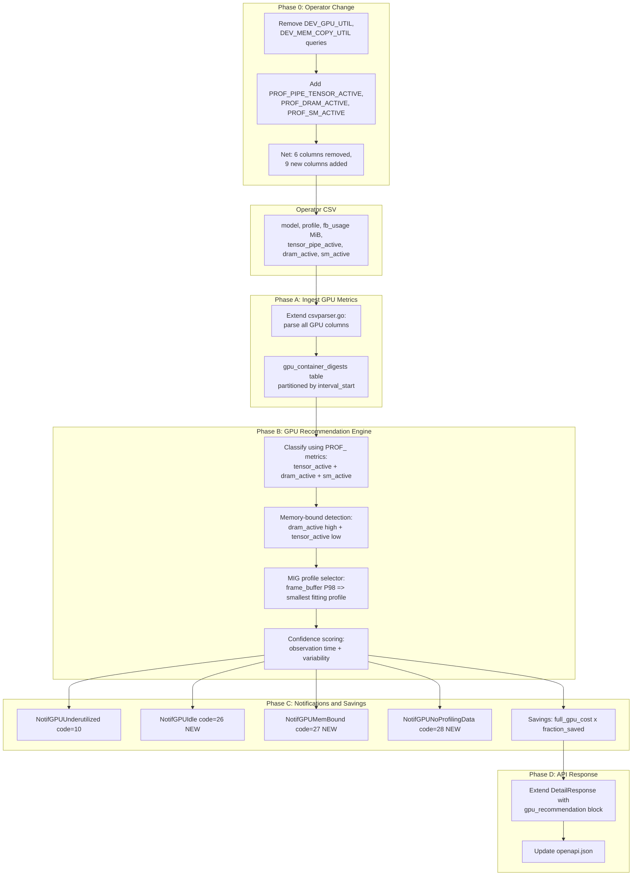

# GPU Recommendations for Native Engine

## Overview

Implement GPU right-sizing recommendations in the ros-ocp-backend native engine.
Replaces misleading `DEV_GPU_UTIL` / `DEV_MEM_COPY_UTIL` with DCGM profiling
metrics (`PIPE_TENSOR_ACTIVE`, `DRAM_ACTIVE`, `SM_ACTIVE`) in the operator. Native
engine uses these for accurate workload classification, memory-bound detection
(Utilyze-informed), MIG profile recommendations, and savings estimation.

## Competitive Position

| Feature | Kubecost | Cast.ai | Kruize | Our Plan |
|---|---|---|---|---|
| Idle GPU detection | Yes | Yes | Yes | Yes |
| Underutilized GPU flagging | Yes | Limited | Yes | Yes |
| MIG profile recommendation | No | No | Yes (A100/H100/H200/B200/RTX) | Yes (same GPU families) |
| Memory-bound detection | No | No | No | **Yes (unique, via DRAM_ACTIVE)** |
| Accurate profiling metrics | No (DEV_GPU_UTIL) | No | No (DEV_GPU_UTIL) | **Yes (PROF_ metrics)** |
| GPU savings estimate ($) | Yes (cost only) | Node-level | No | Yes (per-container) |
| Time-slicing recommendation | No | No | No | Phase 2 |

## Why Standard DCGM Metrics Are Misleading

Systalyze/Utilyze demonstrates that the standard DCGM metrics (`DCGM_FI_DEV_GPU_UTIL`,
`DCGM_FI_DEV_MEM_COPY_UTIL`) systematically **overstate** GPU utilization for
memory-bound workloads (LLM decode, LoRA fine-tuning). SM Active can read 99% while
true compute throughput is 6%.

We cannot use Utilyze's Nsight Perf SDK approach (hardware performance counter
sampling) from Prometheus. However, DCGM exposes **profiling metrics**
(`DCGM_FI_PROF_*`, field IDs 1001-1083) that provide much better signal:

- `DCGM_FI_PROF_PIPE_TENSOR_ACTIVE` (1004): ratio of cycles tensor cores are
  active -- the closest available proxy to Utilyze's Compute SOL% for AI workloads
- `DCGM_FI_PROF_DRAM_ACTIVE` (1005): ratio of cycles the HBM interface is active --
  the closest proxy to Memory SOL%
- `DCGM_FI_PROF_SM_ACTIVE` (1002): ratio of cycles an SM has at least 1 warp --
  useful baseline for idle detection

These are not as precise as Utilyze (they measure pipe *activity cycles*, not actual
*FLOP throughput*), but they are orders of magnitude better than `DEV_GPU_UTIL` and
are available through the standard DCGM Exporter in Prometheus. No competitor uses
these metrics for recommendations.

**Reference:** https://www.systalyze.com/utilyze

---

## DCGM Exporter and GPU Compatibility

### Minimum DCGM Exporter Version

- **Minimum**: dcgm-exporter **3.1.x** (DCGM 2.x+). Profiling metrics were
  introduced in DCGM 1.7, but the exporter gained stable support in 3.x.
- **Avoid**: dcgm-exporter **4.0.x through 4.1.x** -- a regression broke PROF_
  metrics on some GPUs (fixed in 4.2.3).
- **Recommended**: dcgm-exporter **4.2.3+** (confirmed stable).
- **Current GPU Operator** (v26.3.1, Apr 2026): ships dcgm-exporter **v4.5.1-4.8.0**.

Any customer running a current NVIDIA GPU Operator on OpenShift has a compatible
dcgm-exporter.

### GPU Architecture Support for Profiling Metrics

DCGM profiling metrics (`DCGM_FI_PROF_*`) require datacenter-grade GPUs from
Turing or newer:

| Architecture | Compute Cap. | PROF_ Metrics | MIG Support | Example GPUs |
|---|---|---|---|---|
| Pascal (2016) | 6.x | No | No | P40, P100 |
| Volta (2017) | 7.0 | **No** (broken in modern DCGM) | No | V100 |
| **Turing (2018)** | 7.5 | **Yes** | No | T4 |
| **Ampere (2020)** | 8.0/8.6 | **Yes** | A100/A30 only | A100, A10, A30 |
| **Ada Lovelace (2022)** | 8.9 | **Yes** (datacenter) | No | L4, L40, L40S |
| **Hopper (2022)** | 9.0 | **Yes** | Yes | H100, H200 |
| **Blackwell (2024)** | 10.0 | **Yes** | Yes | B100, B200, GB200 |

Not supported: V100 (PROF_ metrics are broken despite being Volta datacenter),
Pascal and older, GeForce/consumer GPUs (RTX 4090 etc., except Blackwell GeForce
50xx series with driver 580+).

**References:**
- https://github.com/NVIDIA/dcgm-exporter/issues/550 (V100 lacks PROF_ metrics)
- https://github.com/NVIDIA/dcgm-exporter/issues/513 (4.x regression)
- https://docs.nvidia.com/datacenter/dcgm/latest/user-guide/feature-overview.html

### Two Support Tiers

**Tier 1 -- Full recommendations (PROF_ metrics available):** Turing+ datacenter
GPUs (T4, A10, A30, A100, L4, L40, L40S, H100, H200, B100, B200). These get
accurate workload classification, memory-bound detection, and confidence scoring.

**Tier 2 -- Frame-buffer-only recommendations (any GPU with DEV_FB_USED):** Any
NVIDIA GPU including V100 and Pascal. These only get MIG profile sizing
recommendations based on frame buffer usage, but no workload classification or
memory-bound detection. A notification informs the user that profiling metrics are
unavailable.

MIG profile recommendations are only relevant for MIG-capable GPUs: A100, A30,
H100, H200, B100, B200.

### Graceful Degradation

When a GPU doesn't support PROF_ metrics, the Prometheus queries return empty
results and the CSV columns are blank. The native engine detects NULL PROF_
columns and:
- Still reports `gpu_model_name` and `fb_usage` data
- Skips workload classification (idle/underutilized/memory-bound)
- Can still recommend MIG profiles based on frame buffer usage alone (if MIG-capable)
- Emits notification: "GPU profiling metrics are not available for this GPU model.
  Workload classification requires Turing or newer datacenter GPUs with DCGM
  Exporter 3.1+."

---

## DCGM Metric Audit

### Cost CSV path (for Koku) -- unchanged

| Query Key | DCGM Metric | Field ID | Used by Koku | Status |
|---|---|---|---|---|
| `cost:nvidia_gpu_capacity_memory_mib_mig` | `DCGM_FI_PROF_GR_ENGINE_ACTIVE` | 1001 | Yes (MIG pod discovery) | **Keep** |
| `cost:nvidia_gpu_utilization` | `DCGM_FI_PROF_GR_ENGINE_ACTIVE` | 1001 | Yes (gpu_pod_uptime) | **Keep** |
| `cost:nvidia_gpu_max_slices` | `DCGM_FI_DEV_MIG_MAX_SLICES` | -- | Yes (MIG slice count) | **Keep** |

### ROS CSV path (for resource optimization)

| Query Key | DCGM Metric | Field ID | Used? | Status |
|---|---|---|---|---|
| `ros:accelerator_core_usage_*` | `DCGM_FI_DEV_GPU_UTIL` | 203 | No (never productized) | **Remove** |
| `ros:accelerator_memory_copy_*` | `DCGM_FI_DEV_MEM_COPY_UTIL` | 204 | No (never productized) | **Remove** |
| `ros:accelerator_frame_buffer_*` | `DCGM_FI_DEV_FB_USED` | 252 | Yes (MIG sizing) | **Keep** |

### New metrics (Phase 0)

| Query Key | DCGM Metric | Field ID | Purpose |
|---|---|---|---|
| `ros:tensor_pipe_active_{min,max,avg}` | `DCGM_FI_PROF_PIPE_TENSOR_ACTIVE` | 1004 | True tensor core utilization |
| `ros:dram_active_{min,max,avg}` | `DCGM_FI_PROF_DRAM_ACTIVE` | 1005 | True HBM bandwidth utilization |
| `ros:sm_active_{min,max,avg}` | `DCGM_FI_PROF_SM_ACTIVE` | 1002 | SM activity baseline |

GPU recommendations were never productized in the Kruize path, so `DEV_GPU_UTIL`
and `DEV_MEM_COPY_UTIL` have no consumers. Safe to remove now.

---

## Data Available from Operator (After Phase 0)

Per container, per hourly interval:

**Kept columns:**
- `accelerator_model_name` -- e.g., "NVIDIA A100-SXM4-80GB"
- `accelerator_profile_name` -- MIG profile if active, e.g., "3g.40gb"
- `accelerator_frame_buffer_usage_{min,max,avg}` -- `DCGM_FI_DEV_FB_USED` (MiB)

**Removed columns:**
- ~~`accelerator_core_usage_percentage_{min,max,avg}`~~ -- was `DCGM_FI_DEV_GPU_UTIL`
- ~~`accelerator_memory_copy_percentage_{min,max,avg}`~~ -- was `DCGM_FI_DEV_MEM_COPY_UTIL`

**New columns:**
- `tensor_pipe_active_{min,max,avg}` -- `DCGM_FI_PROF_PIPE_TENSOR_ACTIVE` (0.0-1.0)
- `dram_active_{min,max,avg}` -- `DCGM_FI_PROF_DRAM_ACTIVE` (0.0-1.0)
- `sm_active_{min,max,avg}` -- `DCGM_FI_PROF_SM_ACTIVE` (0.0-1.0)

---

## Architecture



---

## Phase 0: Operator Metric Collection Change

**Goal:** Replace misleading `DEV_GPU_UTIL` and `DEV_MEM_COPY_UTIL` ROS queries
with accurate DCGM profiling metrics. Keep `DEV_FB_USED`.

**Repo:** `koku-metrics-operator`

### 0.1. Remove Obsolete Queries

In `internal/collector/queries.go`, remove these 6 ROS queries:

| Query Key (remove) | DCGM Metric | Why |
|---|---|---|
| `ros:accelerator_core_usage_percentage_{min,max,avg}` | `DCGM_FI_DEV_GPU_UTIL` (203) | Misleading, never consumed |
| `ros:accelerator_memory_copy_percentage_{min,max,avg}` | `DCGM_FI_DEV_MEM_COPY_UTIL` (204) | Misleading, never consumed |

Also remove the corresponding struct fields and CSV column mappings in
`internal/collector/types.go`.

### 0.2. Add New Profiling Queries

Add 9 new ROS queries (min/max/avg for each), following the same pattern as
`ros:accelerator_frame_buffer_usage_*`:

| Query Key | DCGM Metric | Notes |
|---|---|---|
| `ros:tensor_pipe_active_{min,max,avg}` | `DCGM_FI_PROF_PIPE_TENSOR_ACTIVE` | 0.0-1.0 ratio |
| `ros:dram_active_{min,max,avg}` | `DCGM_FI_PROF_DRAM_ACTIVE` | 0.0-1.0 ratio |
| `ros:sm_active_{min,max,avg}` | `DCGM_FI_PROF_SM_ACTIVE` | 0.0-1.0 ratio |

### 0.3. New CSV Columns

In `internal/collector/types.go`, add 9 new fields + CSV column mappings:

```
tensor_pipe_active_min, tensor_pipe_active_max, tensor_pipe_active_avg
dram_active_min, dram_active_max, dram_active_avg
sm_active_min, sm_active_max, sm_active_avg
```

### 0.4. Impact Assessment

- **Koku cost CSV**: Unaffected.
- **Kruize**: GPU recommendations never productized -- no impact.
- **ros-ocp-backend**: Does not parse GPU columns yet -- no impact.
- **V100/Pascal clusters**: Removed queries were never consumed. Kept columns
  (`accelerator_frame_buffer_usage_*`, `accelerator_model_name`) still work. New
  PROF_ queries return empty for these GPUs (expected Tier 2 behavior).

---

## Phase A: Ingest GPU Metrics

**Goal:** Parse GPU columns from operator CSV and store daily GPU digests.

### A1. Extend MetricRow

```go
AcceleratorModelName    string
AcceleratorProfileName  string
AcceleratorFBUsageMin   float64  // DEV_FB_USED, MiB
AcceleratorFBUsageMax   float64
AcceleratorFBUsageAvg   float64
TensorPipeActiveMin     float64  // PROF_PIPE_TENSOR_ACTIVE, 0.0-1.0
TensorPipeActiveMax     float64
TensorPipeActiveAvg     float64
DRAMActiveMin           float64  // PROF_DRAM_ACTIVE, 0.0-1.0
DRAMActiveMax           float64
DRAMActiveAvg           float64
SMActiveMin             float64  // PROF_SM_ACTIVE, 0.0-1.0
SMActiveMax             float64
SMActiveAvg             float64
```

### A2. Extend CSV Parser

All GPU columns are optional. Containers without GPUs have empty values. PROF_
columns may be blank if DCGM Exporter lacks profiling support.

### A3. Create `gpu_container_digests` Table

```sql
CREATE TABLE gpu_container_digests (
    id              BIGSERIAL,
    interval_start  TIMESTAMP NOT NULL,
    cluster_uuid    UUID NOT NULL,
    namespace       TEXT NOT NULL,
    workload        TEXT NOT NULL,
    container_name  TEXT NOT NULL,
    gpu_model_name  TEXT NOT NULL,
    gpu_profile_name TEXT,
    fb_usage_min_mib REAL,
    fb_usage_max_mib REAL,
    fb_usage_avg_mib REAL,
    tensor_pipe_active_min REAL,
    tensor_pipe_active_max REAL,
    tensor_pipe_active_avg REAL,
    dram_active_min REAL,
    dram_active_max REAL,
    dram_active_avg REAL,
    sm_active_min   REAL,
    sm_active_max   REAL,
    sm_active_avg   REAL
) PARTITION BY RANGE (interval_start);
```

### A4. Daily Aggregation

Aggregate hourly GPU rows into daily digests (min of mins, max of maxes,
weighted avg of avgs), following `daily_container_digests` pattern.

---

## Phase B: GPU Recommendation Engine

### B1. GPU Model Metadata

Static Go map mapping GPU model names to specs:

```go
var GPUModels = map[string]GPUModelSpec{
    // Tier 1: Full profiling (Turing+)
    "T4":         {TotalFBMiB: 16384,  SMCount: 40,  MIGSupported: false, ProfilingSupported: true},
    "A10":        {TotalFBMiB: 24576,  SMCount: 72,  MIGSupported: false, ProfilingSupported: true},
    "A30":        {TotalFBMiB: 24576,  SMCount: 56,  MIGSupported: true,  ProfilingSupported: true, ...},
    "A100_40GB":  {TotalFBMiB: 40960,  SMCount: 108, MIGSupported: true,  ProfilingSupported: true, ...},
    "A100_80GB":  {TotalFBMiB: 81920,  SMCount: 108, MIGSupported: true,  ProfilingSupported: true, ...},
    "L4":         {TotalFBMiB: 24576,  SMCount: 60,  MIGSupported: false, ProfilingSupported: true},
    "L40":        {TotalFBMiB: 49152,  SMCount: 142, MIGSupported: false, ProfilingSupported: true},
    "L40S":       {TotalFBMiB: 49152,  SMCount: 142, MIGSupported: false, ProfilingSupported: true},
    "H100_80GB":  {TotalFBMiB: 81920,  SMCount: 132, MIGSupported: true,  ProfilingSupported: true, ...},
    "H100_94GB":  {TotalFBMiB: 96256,  SMCount: 132, MIGSupported: true,  ProfilingSupported: true, ...},
    "H200_141GB": {TotalFBMiB: 144384, SMCount: 132, MIGSupported: true,  ProfilingSupported: true, ...},
    "B200_180GB": {TotalFBMiB: 184320, SMCount: 160, MIGSupported: true,  ProfilingSupported: true, ...},
    // Tier 2: No profiling (Volta and older)
    "V100_16GB":  {TotalFBMiB: 16384,  SMCount: 80,  MIGSupported: false, ProfilingSupported: false},
    "V100_32GB":  {TotalFBMiB: 32768,  SMCount: 80,  MIGSupported: false, ProfilingSupported: false},
    "P100":       {TotalFBMiB: 16384,  SMCount: 56,  MIGSupported: false, ProfilingSupported: false},
}
```

MIG profiles sourced from Kruize's `AnalyzerConstants.java`.

### B2. Workload Classification

| Classification | Condition | Confidence |
|---|---|---|
| **Idle** | `sm_active_avg < 0.02` sustained | High |
| **Underutilized** | `tensor_pipe_active_avg < 0.15` AND `sm_active_avg < 0.25` | High |
| **Memory-bound** | `dram_active_avg > 0.60` AND `tensor_pipe_active_avg < 0.15` | High |
| **Compute-bound underutilized** | `tensor_pipe_active_avg < 0.25` AND `dram_active_avg < 0.30` | High |
| **Well-utilized** | `tensor_pipe_active_avg >= 0.25` OR `dram_active_avg >= 0.60` | Moderate-High |
| **No profiling data** (Tier 2) | All PROF_ columns NULL | N/A -- emit notification, skip; MIG sizing from FB only |

Thresholds configurable via env vars.

### B3. Memory-Bound Detection

When `dram_active_avg > 0.60` AND `tensor_pipe_active_avg < 0.15`: memory-bandwidth
bound. This is the Utilyze scenario where `nvidia-smi` shows 99% but real compute
is 6%.

### B4. MIG Profile Recommendation

For MIG-capable GPUs where workload is underutilized:
1. Identify GPU model from `gpu_model_name`
2. Required FB: `P98(fb_usage_max_mib)` + 20% headroom
3. Required compute: `P95(tensor_pipe_active_avg)`
4. Select smallest MIG profile where `FBSizeMiB >= required_fb` AND
   `ComputeFrac >= required_compute`

### B5. Confidence Scoring

- Observation days: < 3d => 0.3, 3-7d => 0.6, 7+ => 0.8, 14+ => 1.0
- Variability: `sm_active_max / sm_active_avg > 5` => multiply by 0.7
- No PROF_ data: skip entirely (no recommendation)

---

## Phase C: Notifications and Savings

### C1. Notification Codes

- `NotifGPUUnderutilized = 10` (existing, now emitted for underutilized GPUs)
- `NotifGPUIdle = 26` (NEW): "GPU is allocated but idle (< 2%). Consider removing."
- `NotifGPUMemBound = 27` (NEW): "Workload is memory-bandwidth bound."
- `NotifGPUNoProfilingData = 28` (NEW): "Profiling metrics unavailable for this GPU."

### C2. GPU Savings Estimation

Via Koku `effective_rates` API (`/api/cost-management/v1/effective_rates/?cluster_uuid=<UUID>`):

The `configured_rates` object includes `gpu_cost_per_month` with `infrastructure` and
`supplementary` values. The total GPU monthly rate is `infrastructure + supplementary`.

Savings logic (`ApplyGPUSavings()` in `gpu_recommender.go`):
- **Idle**: savings = full GPU rate/month (could remove the GPU entirely)
- **MIG right-sizing**: savings = `(1 - recommended_slices/total_slices) * full_gpu_rate/month`
  where `total_slices` is the max MIG slices for the GPU model
- **Well-utilized / no recommendation**: savings = $0
- **No cost data**: savings = nil (no estimate available)

The `enrichWithGPU()` function in `gpu_enrichment.go` fetches cost data from Koku
via `HTTPCostDataProvider` and passes it to `ApplyGPUSavings()`. The Koku URL is
configured via `KokuMasuURL` in the ROS config. If Koku is unreachable, savings
are omitted (nil) rather than failing the request.

---

## Phase D: API Response

### D1. Response Format

```json
{
  "gpu": {
    "current_gpu_model": "NVIDIA A100-SXM4-80GB",
    "current_gpu_profile": null,
    "gpu_classification": "underutilized",
    "recommended_gpu_profile": "3g.40gb",
    "memory_bound_detected": false,
    "gpu_confidence": 0.9,
    "tensor_pipe_active_avg": 0.12,
    "dram_active_avg": 0.08,
    "sm_active_avg": 0.18,
    "fb_usage_max_mib": 15234,
    "estimated_monthly_gpu_savings_usd": 285.00,
    "notifications": [10]
  }
}
```

### D2. API Filters

- `has_gpu=true` -- filter to GPU workloads only
- `gpu_model=A100` -- filter by GPU model
- `gpu_classification=idle,underutilized` -- filter by classification

### D3. OpenAPI Spec

Update `openapi.json` with GPU fields, filters, and response schema.

---

## Files Changed (Estimated)

### koku-metrics-operator (Phase 0)

| File | Change |
|---|---|
| `internal/collector/queries.go` | Remove 6 DEV_ queries, add 9 PROF_ queries |
| `internal/collector/types.go` | Remove 6 DEV_ fields, add 9 PROF_ fields + CSV mappings |
| `internal/collector/test_files/` | Update expected CSV test data |

### ros-ocp-backend (Phases A-D)

| File | Change |
|---|---|
| `internal/ingestion/models.go` | Add GPU fields to MetricRow |
| `internal/ingestion/csvparser.go` | Parse GPU CSV columns (all optional) |
| `internal/types/csvColumnMapping.go` | Add GPU column type mappings |
| `migrations/000042_create_gpu_container_digests.{up,down}.sql` | New table |
| `internal/engine/gpu_metadata.go` | NEW: GPU model specs + MIG profile catalog |
| `internal/engine/gpu_recommender.go` | NEW: Classification, MIG selection, confidence |
| `internal/engine/gpu_recommender_test.go` | NEW: Unit tests |
| `internal/engine/notifications.go` | Add codes 26, 27, 28 |
| `internal/engine/engine.go` | Call GPU recommender after CPU/memory |
| `internal/model/recommendation_set_native.go` | Add GPU fields |
| `internal/api/handlers_integration_test.go` | GPU integration tests |
| `openapi.json` | GPU response schema and filters |
| `docs/known-issues.md` | Update GPU section |

### nise (test data generation)

| File | Change |
|---|---|
| `nise/generators/ocp/ocp_generator.py` | Add 14 GPU columns to `OCP_ROS_USAGE_COLUMN`, `_gen_ros_gpu_metrics()`, `_enrich_ros_data_with_gpus()` |
| `tests/test_ocp_generator.py` | 6 new tests for GPU ROS CSV columns |

---

## Implementation Status

| Phase | Status | Notes |
|---|---|---|
| Phase 0: Operator metrics | **Done** | Removed DEV_GPU_UTIL/DEV_MEM_COPY_UTIL, added PROF_PIPE_TENSOR_ACTIVE/DRAM_ACTIVE/SM_ACTIVE |
| Phase A: Ingestion | **Done** | Extended MetricRow, CSV parser, migration 000042, gpu_container_digests table, `upsertGPUDigests` pipeline |
| Phase A+: GPU digest pipeline | **Done** | `upsertGPUDigests()` in `pipeline.go` aggregates hourly GPU metrics into daily digests in `gpu_container_digests`. Migration 000043 adds unique constraint for upsert correctness. |
| Phase B: GPU engine | **Done** | GPU metadata (16 models), classification, MIG selection, confidence scoring, `QueryGPURecommendations()` in `gpu_query.go` |
| Phase C: Notifications/savings | **Done** | Notification codes 10/26/27/28. `ApplyGPUSavings()` computes savings using `gpu_cost_per_month` from Koku `effective_rates` endpoint. |
| Phase D: API response | **Done** | `enrichWithGPU()` in `gpu_enrichment.go` attaches GPU recommendations to `NativeContainerResult`. API filters: `has_gpu`, `gpu_model`, `gpu_classification` (post-enrichment in-memory filtering). OpenAPI spec updated. |
| Nise: Test data generation | **Done** | ROS CSV generates GPU profiling metrics for Tier 1/Tier 2 GPUs |
| E2E: Apollo cluster validation | **Done** | Full pipeline verified: nise data → upload → Koku ingestion → ROS processing → gpu_container_digests → API response with GPU block |
| Unit tests | **Done** | `gpu_digest_test.go`, `gpu_enrichment_test.go`, `gpu_filter_test.go`, `gpu_savings_test.go` |
| Integration tests | **Done** | `TestGetNativeRecommendationSetList_GPUEnrichment` (5 subtests: GPU block, has_gpu filter, gpu_model filter, gpu_classification filter) |

### What's Not Yet Implemented

- **Koku-UI**: Frontend display of GPU recommendations awaits UX mockups.
- **Additional unit tests**: Some test plan items (A-T6/A-T7 daily aggregation, B-T1 to B-T15 individual classification scenarios, C-T1 to C-T6 individual notification/savings scenarios) have partial coverage through the integration test and `gpu_savings_test.go` but are not exhaustively implemented as separate test functions.

### Key Files (GPU Pipeline)

| File | Purpose |
|---|---|
| `internal/ingestion/pipeline.go` | `upsertGPUDigests()` — writes GPU daily digests from parsed CSV |
| `internal/engine/gpu_query.go` | `QueryGPURecommendations()` — reads digests, calls `RecommendGPU()` |
| `internal/api/gpu_enrichment.go` | `enrichWithGPU()` — attaches GPU recs + savings to API results; `filterGPUResults()` — in-memory GPU filtering |
| `internal/api/handlers.go` | Calls `enrichWithGPU()` and `filterGPUResults()` in list/detail handlers |
| `internal/engine/gpu_recommender.go` | Classification, MIG selection, confidence, `ApplyGPUSavings()` |
| `internal/engine/gpu_metadata.go` | GPU model specs and MIG profile catalog |
| `migrations/000042_create_gpu_container_digests.up.sql` | GPU digests table (partitioned) |
| `migrations/000043_add_gpu_digests_unique_constraint.up.sql` | Unique constraint for upsert correctness |
