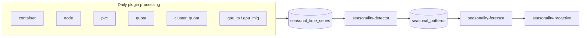
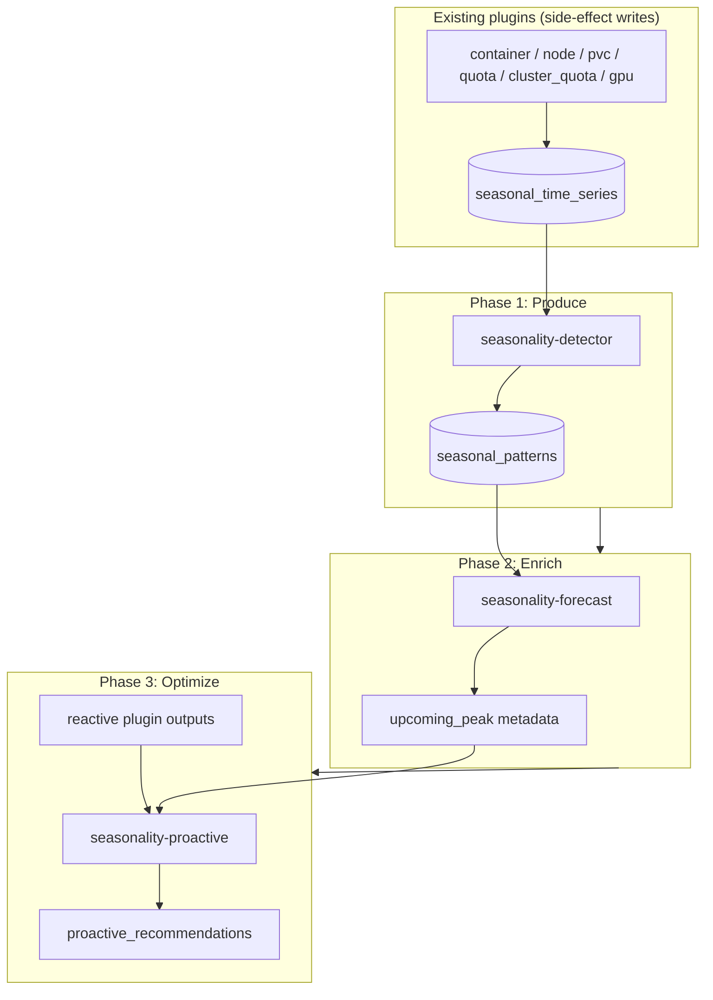

# Seasonality & Proactive Recommendations — Design Document

**Status:** Planned / Future Work — not implemented; tracked in
[known-issues.md](../known-issues.md#future-seasonality--proactive-recommendations).  
**Last updated:** 2026-06-02  
**Public overview:** [Seasonality (docs-site)](../../docs-site/planned-features/seasonality.md)

---

## Problem statement

Today's ROS-OCP recommendations are **reactive**: they compare current usage against limits and advise changes when utilization is already high or low. Operators running predictable workloads still get surprised by recurring peaks (month-end batch jobs, holiday traffic, Monday-morning surges, PVC fill-up, node pool exhaustion) because nothing warns them **before** the spike arrives.

Customers want **proactive** guidance across the full optimization surface — not only namespaces:

- *"In 3 days, `checkout-service` will likely need 1200m CPU — Monday 9am spike detected from 12 prior weeks."*
- *"Worker pool will need 10 nodes by 2026-06-28 — end-of-month batch pattern."*
- *"PVC `postgres-data-pvc` hits capacity in 18 days at current growth rate."*

This document describes a planned plugin family that:

1. Collects **daily aggregated metrics** from every applicable ROS plugin into a generic time-series store.
2. Detects seasonal and growth patterns in that history (classical decomposition / ETS — not foundation models).
3. Forecasts near-term resource demand per entity (container, node, PVC, quota, GPU, etc.).
4. Emits forward-looking recommendations with configurable lead time and confidence gates.

---

## Applicable plugins (all-plugins model)

Seasonality is **not** a namespace-only feature. Any plugin that produces stable daily metrics can feed the detector. Rollout priority reflects customer value and pattern predictability:

| Priority | Plugin | Example seasonal pattern | Value |
|----------|--------|--------------------------|-------|
| 1 | Container | `checkout` namespace CPU spikes every Monday at 9am and every Black Friday | Very high — namespace-level by default; opt-in per-container for critical namespaces |
| 1 | Node | You'll need 4 more nodes next week based on weekly pattern | Very high — scale-up lead time |
| 2 | PVC | This PVC grows 2GB/week, hits capacity in 18 days | High — storage growth is extremely predictable |
| 3 | Namespace quota | `production` namespace hits quota ceiling every end-of-month | High — capacity planning |
| 3 | Cluster quota | Org-wide resource demand peaks quarterly | High — infrastructure budgeting |
| 4 | GPU time-slicing | ML training jobs spike every Tuesday (retrain cycle) | Medium-high — GPU is expensive |
| 4 | GPU MIG | Inference demand increases weekday mornings | Medium-high |
| 5 | Snapshot | Less about seasonality, more about operational drift | Low — **not applicable** for v1 |

The seasonality detector reads from a **single generic table** and does not branch on plugin-specific schemas beyond `plugin` + `metric` + `entity_id`.

---

## Use cases

| Domain | Plugin | Pattern | Example signal |
|--------|--------|---------|----------------|
| E-commerce | Container | Annual / event | Cyber Monday CPU/memory on `checkout-service` |
| Batch / FinOps | Node, namespace quota | Monthly | End-of-month batch on days 28–31 |
| Interactive | Container, GPU | Weekly | Monday 08:00 surge, Tuesday retrain |
| Storage | PVC | Linear growth | 2 GB/week → capacity in N days |
| Platform | Cluster quota | Quarterly | Org-wide CPU/memory demand peaks |
| HR / payroll | Container, quota | Bi-weekly | Payroll namespace spikes every 14 days |

These map to infrastructure time series with **strong periodicity or monotonic growth** — a good fit for classical decomposition, ETS forecasting, and simple growth projection, not foundation models.

---

## Generic data model

### `seasonal_time_series`

Replace namespace-specific or digest-only storage with one table populated **as a side effect** of each plugin's normal daily processing:

```sql
CREATE TABLE seasonal_time_series (
    org_id TEXT,
    plugin TEXT,           -- 'container', 'quota', 'cluster_quota', 'node', 'pvc', 'gpu_ts', 'gpu_mig'
    entity_id TEXT,        -- container UUID, namespace name, node name, PVC name, etc.
    cluster_id TEXT,
    metric TEXT,           -- 'cpu_usage_avg', 'memory_request_p95', 'storage_used_gb', 'gpu_util_pct'
    date DATE,
    value DOUBLE PRECISION,
    PRIMARY KEY (org_id, plugin, entity_id, cluster_id, metric, date)
);
```

| Column | Role |
|--------|------|
| `plugin` | Source optimization domain; drives rollout and API `plugin` field |
| `entity_id` | Opaque per-plugin identifier (container UUID, PVC name, quota scope key, etc.) |
| `metric` | Normalized signal name; detector algorithms keyed by metric family |
| `date` | Calendar day (UTC or cluster-local policy TBD) |
| `value` | Pre-aggregated daily scalar (mean, p95, growth rate, etc.) |

**Write path:** Each enabled plugin appends/upserts one row per `(entity, metric, date)` after its daily digest or recommendation run completes.

**Read path:** `seasonality-detector` scans `seasonal_time_series` generically — container CPU series and PVC growth series use the same detection pipeline.

### Derived patterns table (proposed)

Detection output remains plugin-agnostic:

**`seasonal_patterns`** — `org_id`, `plugin`, `cluster_id`, `entity_id`, `metric`, `period_days`, `amplitude`, `phase_offset`, `confidence`, `pattern_type` (`weekly` \| `monthly` \| `annual` \| `linear_growth`), `detected_occurrences`, `updated_at`.

### Storage impact (all plugins, one org)

| Scenario | Entities | Metrics each | × 365 days | Rows/year |
|----------|----------|--------------|------------|-----------|
| 500 containers | 500 | 4 (cpu_use, cpu_req, mem_use, mem_req) | 365 | 730,000 |
| 50 namespaces | 50 | 5 | 365 | 91,250 |
| 20 nodes | 20 | 4 | 365 | 29,200 |
| 100 PVCs | 100 | 3 (usage, capacity, growth_rate) | 365 | 109,500 |
| 10 GPU workloads | 10 | 3 | 365 | 10,950 |
| 5 cluster quotas | 5 | 4 | 365 | 7,300 |
| **Total per org per year** | | | | **~978,000** |
| **3 years retention** | | | | **~2.9M rows (~500 MB)** |

Retention policy: **minimum 90 days** for monthly/weekly detection; **3 years** where annual patterns are desired. Prune by `(org_id, date)` — no per-plugin special cases.

The estimates above assume **moderate** entity counts. See [Scalability](#scalability) for large-cluster sizing, namespace-level defaults, and tiered retention.

---

## Scalability

Large OpenShift fleets (50k–200k+ containers) require deliberate aggregation scope and retention policy. Container-level storage for every workload does not scale on on-prem PostgreSQL.

### Scalability analysis

The naive approach — one row per container per metric per calendar day — grows linearly with fleet size:

| Containers | Metrics | Retention | Rows | Storage (est.) |
|------------|---------|-----------|------|----------------|
| 500 | 4 | 3 years | ~2.2M | ~300 MB |
| 10,000 | 4 | 3 years | ~44M | ~5–6 GB |
| 50,000 | 4 | 3 years | ~219M | ~25–30 GB |
| 200,000 | 4 | 3 years | ~876M | ~100–130 GB |

At **200k containers**, container-level seasonal tracking alone can exceed **100 GB** — impractical for typical on-prem PostgreSQL deployments (shared disk, backup windows, vacuum cost). The design therefore defaults to **namespace-level** aggregation for the container plugin and treats per-container history as **opt-in** for selected namespaces.

### Scalability strategy

#### Default: namespace-level aggregation

200k containers typically map to **500–2000 namespaces**. Tracking seasonality at namespace scope reduces container-plugin storage by roughly **100–400×**:

- 2000 namespaces × 5 metrics × 365 days × 3 years ≈ **11M rows (~1.5 GB)**
- Always affordable on constrained on-prem clusters
- Always useful for capacity planning (quotas, node pool sizing)
- Namespaces are stable entities; individual container IDs are ephemeral

In `seasonal_time_series`, container-plugin rows use **`entity_id` = namespace name** (aggregated daily CPU/memory across all pods in that namespace) unless container-level tracking is enabled for that namespace.

#### Opt-in: container-level tracking for selected namespaces

Customers enable per-container seasonal history only where it matters — critical application namespaces, not every sidecar or init container.

**Environment variable:**

```bash
ROS_SEASONALITY_CONTAINER_NAMESPACES=checkout,payments,search,ml-inference
```

**Settings API (planned):**

```http
PUT /api/cost-management/v1/recommendations/openshift/settings/seasonality
```

```json
{
  "container_level_namespaces": ["checkout", "payments", "search", "ml-inference"]
}
```

Writers for namespaces **not** in this list emit namespace-aggregated series only. Listed namespaces additionally emit container-level rows (subject to variance filtering below).

#### Tiered retention with downsampling

Long-term pattern detection does not require daily points for the full 3-year window:

| Age of data | Granularity | Use case |
|-------------|-------------|----------|
| Days 1–90 | Daily | Weekly and monthly pattern detection (full resolution) |
| Days 91–365 | Weekly averages | Quarterly patterns |
| Days 366–1095 | Monthly averages | Annual patterns |

Compared to 1095 daily points per series, tiered storage is roughly **90 + 39 + 24 = 153** points per metric over 3 years (~**85%** reduction). Tiered downsampling applies primarily to **opt-in container-level** namespaces (namespace-level and node/PVC/quota series remain daily for the full retention window unless configured otherwise).

#### Variance-based filtering

Many series are **stable** (flat CPU/memory, no meaningful seasonality). Before persisting long-term history (especially container-level), compute **coefficient of variation (CV)** over the minimum history window:

| CV | Action |
|----|--------|
| CV &lt; `ROS_SEASONALITY_MIN_VARIANCE` (default 0.1) | **Skip** seasonal tracking for that entity/metric (~70–80% of containers) |
| CV ≥ threshold | **Track** — variable usage worth detection and forecast |

Namespace-level aggregates often exhibit clearer seasonality than a single noisy replica; CV is evaluated per `(plugin, entity_id, metric)` after aggregation.

### Decision matrix for operators

| Cluster size | Default behavior | Optional |
|--------------|------------------|----------|
| Small (&lt;1000 containers) | Container-level for all (`ROS_SEASONALITY_SCOPE=container`) | N/A |
| Medium (1k–50k) | Namespace-level + optional top-N containers by variance | Container-level for namespaces in `ROS_SEASONALITY_CONTAINER_NAMESPACES` |
| Large (50k–200k+) | Namespace-level only | Container-level for selected namespaces + tiered retention on those series |

### Why namespace-level is the right default

1. **Namespaces represent applications** — seasonality is an application property (checkout peaks on Black Friday), not a property of one short-lived replica.
2. **Containers are ephemeral** — a pod may exist for days; per-container history across reschedules is misleading.
3. **Aggregation improves signal** — averaging 20 replicas reduces noise versus one outlier container.
4. **Quotas are namespace-scoped** — proactive quota guidance targets namespace limits.
5. **Node recommendations use cluster demand** — node scaling follows aggregate load across namespaces, not individual container IDs.

Container-level tracking remains appropriate for:

- Long-lived singletons (databases, stateful services)
- Drilling into which workload drives a namespace-level pattern
- Customers who explicitly opt in via settings

### Updated storage estimate (realistic defaults, 200k-container cluster)

Assume **2000 namespaces**, **200 nodes**, **500 PVCs**, **10 cluster quota scopes**, namespace-level container metrics, and **4 opt-in namespaces** with ~200 containers each (container-level + variance filter):

| Component | Calculation | Rows (3 yr) | Storage (est.) |
|-----------|-------------|-------------|----------------|
| 2000 namespaces × 5 metrics (daily) | 2000×5×1095 | 10.95M | ~1.5 GB |
| 200 nodes × 4 metrics (daily) | 200×4×1095 | 876K | ~120 MB |
| 500 PVCs × 3 metrics (daily) | 500×3×1095 | 1.64M | ~220 MB |
| 10 cluster quotas × 4 metrics (daily) | 10×4×1095 | 43.8K | ~6 MB |
| **Subtotal (namespace-level default)** | | **~13.5M** | **~1.85 GB** |
| + 4 opt-in namespaces × 200 containers × 4 metrics (daily) | 800×4×1095 | 3.5M | ~470 MB |
| **Total with opt-in container tracking** | | **~17M** | **~2.3 GB** |

This stays within comfortable on-prem PostgreSQL limits (indexes, backups, retention jobs) even at fleet scale.

### Schema implications

- **`entity_id` semantics depend on scope:** for `plugin=container` with default scope, `entity_id` is the **namespace**; with opt-in container scope, additional rows use **container UUID** (or stable workload key — see [Open questions](#open-questions)).
- **Optional column (future):** `granularity` (`daily` \| `weekly` \| `monthly`) on `seasonal_time_series` to support tiered retention without duplicate logical series.
- **Detection pipeline:** unchanged — same Augurs path per `(plugin, entity_id, metric)` regardless of whether the entity is a namespace aggregate or a container.

---

## Data sources (what we need and do not need)

| Requirement | Status |
|-------------|--------|
| Daily aggregated metrics | **Required** — partly available today via existing digest tables; unified into `seasonal_time_series` |
| Raw operator CSVs | **Not required** — do not extend CSV retention for seasonality |
| Past recommendation rows | **Not required** — patterns come from usage/limit time series, not rec history |
| `seasonal_time_series` writes | **Required** — each applicable plugin writes during normal daily processing |
| Generic detector read | **Required** — `seasonality-detector` reads one table regardless of source plugin |

**Flow:**



Digest tables may remain the **immediate** source for some plugins during migration; the design target is a single write API into `seasonal_time_series` so the detector never depends on per-plugin digest schemas.

---

## Plugin architecture

Plugins follow the existing phased execution model ([`internal/plugin/phases.go`](../../internal/plugin/phases.go), [Plugin Execution Phases](../../docs-site/architecture/plugin-phases.md)):

| ROS phase constant | Name | Planned plugin | Role |
|--------------------|------|----------------|------|
| `PhaseProduce` (1) | Produce | `seasonality-detector` | Read `seasonal_time_series`; ACF period detection; MSTL; persist `seasonal_patterns` |
| `PhaseEnrich` (2) | Enrich | `seasonality-forecast` | ETS / growth projection from patterns; attach `upcoming_peak` metadata per entity |
| `PhaseOptimize` (3) | Optimize | `seasonality-proactive` | Combine forecast with container/node/PVC/quota/GPU engines; emit `proactive_recommendations[]` |



### `seasonality-detector` (Phase 1)

- **Input:** `seasonal_time_series` (all plugins), filtered by org and minimum history window.
- **Processing:** [Augurs](https://github.com/grafana/augurs) period detection (ACF) + MSTL per metric; linear regression for PVC-style `linear_growth` metrics.
- **Output:** `seasonal_patterns` rows keyed by `(org_id, plugin, entity_id, metric)`.

### `seasonality-forecast` (Phase 2)

- **Input:** `seasonal_patterns` + latest values from `seasonal_time_series`.
- **Processing:** Augurs ETS over horizon (`ROS_SEASONALITY_FORECAST_HORIZON_DAYS`); growth projection for PVC metrics.
- **Output:** Enrichment metadata — `upcoming_peak_date`, forecast percentiles, `days_until_full`, `confidence`.

### `seasonality-proactive` (Phase 3)

- **Input:** Forecast metadata + Phase 1 outputs from reactive plugins (`container`, `node`, `pvc`, `quota`, `cluster-quota`, `gpu_ts`, `gpu_mig`).
- **Processing:** Map predicted peak or fill date to concrete limit changes using existing headroom/threshold machinery per plugin.
- **Output:** API field `proactive_recommendations[]` (see [Output format](#output-format)).

**Enablement:** `ROS_ENABLED_PLUGINS` includes `seasonality-detector`, `seasonality-forecast`, `seasonality-proactive`. Master switch: `ROS_SEASONALITY_ENABLED=false` by default until GA.

Individual **writer** plugins do not need a seasonality flag — they only need to populate `seasonal_time_series` when their own plugin is enabled.

---

## Phased rollout strategy

| Phase | Plugins | Rationale |
|-------|---------|-----------|
| **1** | Container + Node | Highest customer impact; most actionable and scale-up lead time |
| **2** | PVC | Very predictable linear growth; high confidence proactive storage actions |
| **3** | Namespace quota + Cluster quota | Capacity planning and FinOps budgeting |
| **4** | GPU time-slicing + GPU MIG | If customer demand exists; expensive resource |
| **Skip** | Snapshot | Operational drift, not seasonal — out of scope |

Detector and forecast plugins ship once; writers roll out per phase above.

---

## Forecasting library: Augurs (Grafana)

**Primary choice:** [github.com/grafana/augurs](https://github.com/grafana/augurs) — Rust library built for observability metrics.

### Why Augurs

| Criterion | Augurs |
|-----------|--------|
| Runtime | Rust — embeddable in Go service via C FFI / WASM / small sidecar |
| Domain fit | Built for infrastructure / metrics seasonality |
| Algorithms | ACF period detection, MSTL decomposition, ETS forecasting |
| Footprint | No GPU, no Python, minimal CPU and binary size |
| License | Apache-2.0 / MIT dual license |
| Explainability | Decomposable seasonal components — suitable for customer-facing rationale |

Infrastructure metrics are **structured and periodic**; classical methods often match or beat transformers at ~1000× lower cost for this workload class. PVC growth may use simple linear fit without MSTL.

### Alternatives evaluated

| Library | Language | Why not primary | Possible role |
|---------|----------|-----------------|---------------|
| **Augurs** | Rust | ✅ Primary | Detection + MSTL + ETS |
| [Merlion](https://github.com/salesforce/Merlion) | Python | Cannot embed in Go service | Offline benchmarking during development |
| [Orbit](https://github.com/uber/orbit) | Python/Stan | MCMC too heavy | Not suitable |
| [Moirai](https://github.com/SalesforceAIResearch/Moirai) | Python/PyTorch | GPU-preferred, black box | Optional future premium sidecar |
| [TimesFM](https://github.com/google-research/timesfm) | Python/JAX | Same as Moirai | Not suitable |
| [Chronos-2](https://github.com/amazon-science/chronos-forecasting) | Python/PyTorch | Same as Moirai | Optional future premium sidecar |
| MSTL (statsmodels) | Python | Algorithm correct; Augurs implements MSTL in Rust | N/A |

**Why not foundation models (Moirai, TimesFM, Chronos-2) as primary:**

1. Python + PyTorch/JAX runtime (~2 GB disk) — poor fit for on-prem cost-onprem chart.
2. GPU recommended for hundreds of series at acceptable latency.
3. Black-box outputs are hard to justify in UI copy ("the transformer said so").
4. Deployment complexity vs. marginal accuracy gain on strongly periodic cluster metrics.

**Future option:** Optional **premium sidecar** (Python + GPU) for tenants with complex, weakly periodic workloads — not in v1 scope.

---

## GPU-Accelerated Tier (Optional)

> **Implementation order:** The default path below (Augurs only, no GPU) is what we expect to ship first. The GPU tier is an **optional** add-on for SaaS or on-prem clusters that already run GPU hardware and want higher accuracy on irregular workloads.

When GPUs are available (managed SaaS or on-prem with NVIDIA-capable nodes), a **tiered architecture** becomes viable without replacing the primary recommendation:

| Tier | Runtime | When used | Role |
|------|---------|-----------|------|
| **Tier 1 (default)** | Augurs (Rust) | All entities after minimum history | Handles **80%+** of workloads — weekly/monthly cycles, PVC growth, namespace aggregates |
| **Tier 2 (opt-in, GPU)** | Chronos-2 (Amazon, Apache 2.0) | Residual variance above threshold **and** GPU enabled | Complex or irregular patterns where classical decomposition leaves high unexplained variance |

### Why Chronos-2 over Moirai / TimesFM

| Criterion | Chronos-2 | Moirai / TimesFM |
|-----------|-----------|------------------|
| License | Apache 2.0 | Various (research / restrictive) |
| Model sizes | `mini` → `large` (latency/cost tradeoff) | Typically single large checkpoint |
| Zero-shot | Yes — no per-entity training | Yes |
| Multi-variate | Native support for correlated metrics | Varies by model |
| Operational fit | Sidecar batch inference on flagged series only | Full-fleet inference is costly |

Moirai and TimesFM remain useful for **offline benchmarking** during development; they are not the planned production GPU tier.

### Why not GPU-only

1. **Cost** — Running a transformer over ~200k container-level series (even a subset) is roughly **$2–5/hr** in cloud GPU time; namespace-level defaults reduce cardinality but Tier 2 still targets the hardest cases only.
2. **Signal** — Most OpenShift usage is **simple periodicity** (weekly login surge, month-end batch); Augurs MSTL/ETS matches or beats transformers at far lower CPU and no extra infrastructure.
3. **Dependency** — GPU-only seasonality hard-requires NVIDIA nodes, drivers, and chart changes; unsuitable as the default for cost-onprem and air-gapped SNO.

### Configuration (GPU tier)

| Variable | Default | Description |
|----------|---------|-------------|
| `ROS_SEASONALITY_GPU_ENABLED` | `false` | Enable Tier 2 Chronos-2 sidecar path |
| `ROS_SEASONALITY_GPU_MODEL` | `chronos-2-mini` | Model size (`mini`, `small`, `base`, `large`) |
| `ROS_SEASONALITY_GPU_THRESHOLD` | `0.3` | Minimum residual variance (post-MSTL) to flag an entity for Tier 2 |

Tier 1 env vars (`ROS_SEASONALITY_ENABLED`, confidence, horizon, scope, retention) apply unchanged; GPU settings are ignored when `ROS_SEASONALITY_GPU_ENABLED=false`.

### Tiered flow (architecture)

```mermaid
flowchart TB
  TS[(seasonal_time_series)]
  SD[seasonality-detector<br/>Augurs MSTL + ACF]
  TS --> SD
  SD -->|low residual| P1[seasonal_patterns<br/>Tier 1]
  SD -->|residual ≥ threshold<br/>AND GPU enabled| FLAG[Flag for Tier 2]
  FLAG --> C2[Chronos-2 sidecar<br/>batch inference]
  C2 --> P2[seasonal_patterns<br/>Tier 2 metadata]
  P1 --> SF[seasonality-forecast]
  P2 --> SF
  SF -->|ETS / Augurs| F1[Forecast Tier 1]
  SF -->|Chronos-2 horizon| F2[Forecast Tier 2]
  F1 --> PS[seasonality-proactive]
  F2 --> PS
  PS --> API[proactive_recommendations[]]
  RECS[Reactive plugin outputs] --> PS
```

- **`seasonality-detector`:** Always runs Augurs MSTL on Tier 1 path. If normalized residual variance ≥ `ROS_SEASONALITY_GPU_THRESHOLD` and `ROS_SEASONALITY_GPU_ENABLED=true`, enqueue entity/metric for Chronos-2 refinement (pattern confirmation + updated confidence).
- **`seasonality-forecast`:** Tier 1 uses Augurs ETS (and linear growth for PVC metrics). Tier 2 uses Chronos-2 multi-step forecast for flagged series only; results share the same enrichment schema (`upcoming_peak_date`, confidence, horizon).
- **`seasonality-proactive`:** Consumes forecasts **regardless of tier** — no API change for UI; optional `forecast_tier` field in JSON for support/debug.

### Augurs integration paths

| Approach | Pros | Cons |
|----------|------|------|
| **C FFI (cgo + `.so`)** | Lowest latency, in-process | Build matrix (glibc, arch), Rust toolchain in CI |
| **WASM in-process** | Sandboxed, portable binary | Slower than native FFI |
| **Rust sidecar (Unix socket)** | Clean ABI boundary, independent releases | Extra Deployment in chart, IPC latency |

**Recommendation for v1 spike:** Rust sidecar or WASM first (faster iteration), migrate to static `.so` if latency becomes critical at fleet scale.

Example FFI boundary (illustrative):

```go
// #cgo LDFLAGS: -L${SRCDIR}/lib -laugurs_seasonality
// #include "augurs_seasonality.h"
import "C"

func DetectSeasonality(values []float64) (period int, confidence float64, err error) {
    // copy values to C array, call C.DetectPeriod + C.MSTLDecompose
}
```

---

## Data requirements

| Pattern type | Minimum history | Notes |
|--------------|-----------------|-------|
| Weekly | ~14–21 days | 2–3 full cycles |
| Monthly | ~60–90 days | 2–3 full cycles |
| Annual | 2+ years | Cold start — no annual recs until enough data |
| Linear growth (PVC) | ~14 days | Slope stability check; fewer cycles needed |
| Default gate | 90 days (`ROS_SEASONALITY_MIN_HISTORY_DAYS`) | Aligns with `seasonal_time_series` retention minimum |
| Long retention | 3 years (tiered) | Annual patterns; ~2 GB/org at 200k-container scale with namespace default — see [Scalability](#scalability) |

---

## Configuration

Three-tier model consistent with [configurability.md](../architecture/configurability.md):

| Variable | Default | Description |
|----------|---------|-------------|
| `ROS_SEASONALITY_ENABLED` | `false` | Master enable for all seasonality plugins |
| `ROS_SEASONALITY_MIN_HISTORY_DAYS` | `90` | Minimum calendar days in `seasonal_time_series` before detection |
| `ROS_SEASONALITY_CONFIDENCE_THRESHOLD` | `0.8` | Minimum confidence to surface a pattern |
| `ROS_SEASONALITY_FORECAST_HORIZON_DAYS` | `14` | How far ahead to project usage |
| `ROS_SEASONALITY_LEAD_TIME_DAYS` | `7` | How many days before peak to emit proactive rec |
| `ROS_SEASONALITY_SCOPE` | `namespace` | Container plugin write scope: `namespace` (default, large clusters) or `container` (small clusters &lt;1k containers) |
| `ROS_SEASONALITY_CONTAINER_NAMESPACES` | *(empty)* | Comma-separated namespaces for opt-in **container-level** tracking when `SCOPE=namespace` |
| `ROS_SEASONALITY_RETENTION_DAYS` | `90` | Daily granularity retention (days 1–90 of history) |
| `ROS_SEASONALITY_RETENTION_WEEKS` | `52` | Weekly downsampled retention (covers days 91–365) |
| `ROS_SEASONALITY_RETENTION_MONTHS` | `36` | Monthly downsampled retention (covers days 366–1095) |
| `ROS_SEASONALITY_MIN_VARIANCE` | `0.1` | Minimum coefficient of variation to persist/track a series |
| `ROS_SEASONALITY_MAX_SERIES_PER_CLUSTER` | *(TBD)* | Optional cap on container-level series per cluster (WASM/FFI batch limits) |

**Legacy note:** Early drafts used `ROS_SEASONALITY_RETENTION_DAYS=1095` as a single prune horizon. At scale, retention is **tiered** (daily + weekly + monthly windows above). A single global prune job deletes rows older than the combined 3-year window per granularity policy.

**Settings API (planned):**  
`GET` / `PUT` / `DELETE` `/api/cost-management/v1/recommendations/openshift/settings/seasonality`  
with `locked_fields` when admin env vars are set (same pattern as `cluster-quota`, `business-hours`).  
Request/response fields mirror env vars: `scope`, `container_level_namespaces`, `retention_days`, `retention_weeks`, `retention_months`, `min_variance`, plus confidence, horizon, and lead-time.

Per-plugin rollout can be gated via existing `ROS_ENABLED_PLUGINS` without separate seasonality flags for writers.

---

## Output format

Proactive recommendations extend list/detail responses (exact route TBD — likely nested under cluster or a dedicated proactive collection). Each item identifies **source plugin** and **entity**:

```json
{
  "proactive_recommendations": [
    {
      "plugin": "container",
      "entity": "checkout-service",
      "namespace": "ecommerce",
      "type": "seasonal_peak",
      "confidence": 0.94,
      "pattern": "weekly",
      "period_days": 7,
      "next_peak": "2026-06-02",
      "lead_time_days": 3,
      "detected_from": "12 prior occurrences (Mon 9am spike)",
      "current_values": {"cpu_request": "500m", "memory_limit": "1Gi"},
      "recommended_values": {"cpu_request": "1200m", "memory_limit": "2Gi"}
    },
    {
      "plugin": "pvc",
      "entity": "postgres-data-pvc",
      "namespace": "database",
      "type": "growth_projection",
      "confidence": 0.97,
      "pattern": "linear_growth",
      "days_until_full": 18,
      "current_usage_gb": 82,
      "capacity_gb": 100,
      "growth_rate_gb_per_day": 1.0,
      "recommended_action": "Expand PVC to 150Gi before 2026-06-17"
    },
    {
      "plugin": "node",
      "entity": "worker-pool",
      "cluster_id": "prod-east",
      "type": "seasonal_peak",
      "confidence": 0.88,
      "pattern": "monthly",
      "period_days": 30,
      "next_peak": "2026-06-28",
      "lead_time_days": 7,
      "detected_from": "4 prior occurrences (end-of-month batch)",
      "current_nodes": 6,
      "recommended_nodes": 10
    }
  ]
}
```

UI should show **human-readable rationale**: `plugin`, entity, pattern type, prior occurrences, confidence, and which reactive plugin supplied baseline values.

---

## Effort estimate

| Phase | Scope | Effort |
|-------|-------|--------|
| 1 | `seasonal_time_series` schema + writer hooks (container, node) | 2–3 weeks |
| 2 | Augurs integration (FFI or sidecar) + generic period detection | 2–3 weeks |
| 3 | Forecasting engine (ETS + PVC growth) | 2–3 weeks |
| 4 | Proactive API + writers for PVC, quota, cluster_quota | 2–3 weeks |
| 5 | GPU writers + optional calendar-aware annual patterns | 2–3 weeks |

**Total (v1 through Phase 4, without GPU):** ~10–14 weeks engineering + QA.  
**GPU + Phase 5:** +2–3 weeks.

---

## Risks and mitigations

| Risk | Impact | Mitigation |
|------|--------|------------|
| Cold start | No proactive recs until history accumulates | Clear UI messaging; phase writers by rollout table |
| False positives | One-off incidents mistaken for seasonality | `CONFIDENCE_THRESHOLD`; require N occurrences; manual dismiss API (future) |
| Storage growth | Naive container-level at 200k+ pods → 100+ GB | Namespace default, opt-in containers, tiered retention, CV filter — see [Scalability](#scalability); partition by `date`; target ~2 GB/org at 200k-container scale |
| CGo / FFI build | CI and multi-arch (aarch64 SNO) friction | Start with sidecar or WASM; document build in cost-onprem-chart |
| WASM performance | Slower than native at high cardinality | Cap series per cluster; batch detection offline |
| Time series gaps | Missing days break ACF | Interpolate or skip window; quality flag on pattern row |
| CRQ/namespace mapping | Proactive quota may double-count with CRQ | Reuse FinOps dedup notes from [cluster-resource-quota](../features/cluster-resource-quota.md) |
| Writer drift | Plugin forgets to write series | Integration test: each enabled writer produces expected row count |

---

## Related work

| Document | Relevance |
|----------|-----------|
| [Plugin Execution Phases](../architecture/plugin-phases.md) | Phase barriers and priority ordering |
| [History & Quality](../../docs-site/features/history-and-quality.md) | Time-series of past recommendations (orthogonal to seasonality input) |
| [Business Hours](../features-business-hours.md) | Scheduled windows — complementary to seasonality (known calendar vs. learned periodicity) |
| [Recommendation Math](../architecture/recommendation-math.md) | Percentiles and trend detection in reactive engines |
| [Retention](../operations/retention.md) | Digest and time-series lifecycle |

---

## Open questions

1. **Entity granularity:** Namespace default vs. container UUID for opt-in namespaces; workload name vs. UUID for display — UUID is stable; display name in API only?
2. **Notifications:** Integrate with [native-engine-notification-gap.md](../archive/native-engine-notification-gap.md) in v1 or API-only?
3. **Auto-apply:** Proactive recs advisory only in v1 (recommended).
4. **Federation:** Fleet-level seasonality on aggregated metrics vs. per-cluster only?
5. **Timezone:** Cluster-local vs. UTC for daily `date` bucket — affects Monday 9am detection.

---

## References

- [Augurs — Grafana](https://github.com/grafana/augurs)
- [Merlion — Salesforce](https://github.com/salesforce/Merlion)
- [Moirai — Salesforce AI Research](https://github.com/SalesforceAIResearch/Moirai)
- [TimesFM — Google Research](https://github.com/google-research/timesfm)
- [Chronos-2 — Amazon Science](https://github.com/amazon-science/chronos-forecasting)
