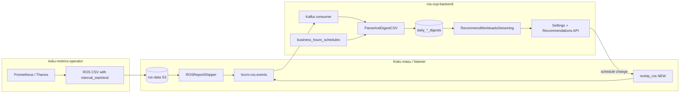
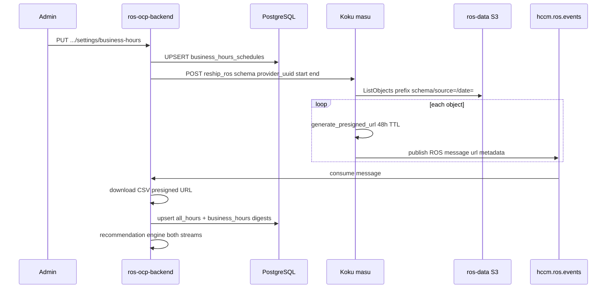

# Business Hours Recommendations — Design Document

| Field | Value |
|-------|-------|
| **Status** | Accepted |
| **Author** | ros-ocp-backend team |
| **Last Updated** | 2026-05-23 |

## Summary

Customers want OpenShift resource optimization recommendations based on **business hours only** (e.g., Mon–Fri 08:00–17:00 in a chosen timezone). Off-hours traffic (batch jobs, backups, dev spikes) skews percentile-based sizing when all 24 hours are aggregated.

The native engine today applies **exponential time decay** (`DecayHalfLifeHours` in term config) across calendar days. Decay weights *when* a day occurred, not *which hours within a day* contributed. It cannot exclude overnight samples.

This design adds **dual daily aggregates** at ingestion: one digest row per container per day for all hours, and a second for business-hours samples only. Schedules are configured in ros-ocp-backend (not Koku cost models). When a schedule is created or changed, historical CSVs are **re-shipped** from S3 via a new Koku masu endpoint so digests can be recomputed idempotently. API responses expose both perspectives using the existing Kruize-compatible `amount`/`format` structure.

**No koku-metrics-operator changes** are required; ROS CSVs already include `interval_start` / `interval_end` at hourly or 15-minute granularity.

---

## Design Assumptions

| Assumption | Implication |
|------------|-------------|
| **Business hours change very rarely** | Re-ingestion cost on schedule change is acceptable; precompute and cache the business-hours recommendation after initial computation |
| **ros-ocp-backend never runs without Koku** | Hard dependency on Koku masu for the `reship_ros` endpoint is acceptable — no standalone fallback needed |
| **Customers want both perspectives** | Always serve "all hours" alongside "business hours" so customers can compare and make informed decisions |
| **Feature is opt-in and admin-controllable** | Zero overhead when disabled; administrators can kill-switch the entire feature via env var |

---

## Problem Statement

| Issue | Impact |
|-------|--------|
| 24/7 aggregation includes off-hours noise | Recommendations over-provision CPU/memory for steady-state business workloads |
| Decay is day-granular only | Cannot express “weight Mon 9am samples, ignore Sat 2am samples” |
| Cost model settings live in Koku | Business hours are an optimization concern, not billing |

---

## Why Settings API (Not Koku Cost Model)

Business hours could theoretically live in Koku's cost model (which already stores per-cluster configuration like cost distribution strategy, markup, etc.). However:

- **Not every cluster needs a cost model** — creating an OpenShift cost model just to configure business hours adds unnecessary overhead for customers who only want optimization recommendations.
- **Separation of concerns** — business hours are a resource optimization concept, not a billing/chargeback concept. Coupling them to cost models conflates two unrelated systems.
- **ros-ocp-backend owns the recommendation lifecycle** — the settings that control how recommendations are computed should live where they are consumed.

The Settings API in ros-ocp-backend follows the same pattern as existing settings (snapshot staleness, recommendation terms).

---

## Design Decision: Dual Daily Aggregates (Choice A)

Alternatives considered:

| Approach | Storage | Pros | Cons | Decision |
|----------|---------|------|------|----------|
| **A: Dual daily digests** | ~2× digest rows | Simple engine/query model; schedules change rarely | Second row per entity-day | **Selected** |
| B: Hourly digests | ~24× | Flexible post-hoc filtering | Large storage; engine rewrite | Rejected |
| C: Lightweight hourly samples | ~6× | Middle ground | Still multiplies storage; aggregation at read time | Rejected |

### Storage Math

Current baseline: **1 digest row per container per day** (with ~15 percentile/stat columns).

| Choice | Rows per container-day | Multiplier | Reasoning |
|--------|----------------------|------------|-----------|
| **A: Dual daily** | 2 | **~2×** | 1 all-hours + 1 business-hours |
| B: Hourly digests | 24 | **~24×** | 1 row per hour |
| C: Daily + hourly samples | 1 + 24 lightweight | **~6×** | Full daily row + 24 small rows (~20% size each); `1 + 24×0.2 ≈ 6` row-equivalents |

Business hours definitions change infrequently. Paying ~2× on partitioned digest tables (not raw CSV storage) is acceptable. Raw metrics remain in S3; PostgreSQL stores only pre-computed percentiles ([`daily_container_digests`](migrations/000024_create_daily_container_digests.up.sql)).

Choice C was rejected despite its flexibility because 6× ongoing storage cost is hard to justify for a setting that changes perhaps once per quarter. Choice A's weakness (retroactive application requires re-ingestion) is mitigated by the Koku `reship_ros` endpoint — acceptable given the "rarely changes" assumption.

---

## Architecture Overview



---

## Data Flow

### 1. Operator → S3 → Kafka (unchanged)

The operator collects ROS metrics on an hourly window (`Step: time.Minute` for cost-mgmt paths; ROS container metrics use **4×15-minute instant queries** per hour). Each CSV row includes `interval_start` and `interval_end`.

**References:**

- CSV contract: [`docs/architecture/kafka-schema.md`](architecture/kafka-schema.md), [`internal/ingestion/csvparser.go`](../internal/ingestion/csvparser.go)
- Parsed row type: [`internal/ingestion/models.go`](../internal/ingestion/models.go) (`MetricRow.IntervalStart`)
- Koku shipper: [`koku/masu/external/ros_report_shipper.py`](../../koku/koku/masu/external/ros_report_shipper.py) → topic `hccm.ros.events`
- S3 key pattern: `{schema}/source={provider_uuid}/date={YYYY-MM-DD}/{filename}`

ros-ocp-backend **does not** access S3 directly; it downloads CSVs from presigned URLs in Kafka messages.

### 2. Ingestion: timezone-aware row filtering

For each `MetricRow`:

1. Resolve effective schedule for `(org_id, cluster_uuid, namespace)` via inheritance (see Settings API).
2. If business hours are **disabled** or **not configured**: behavior matches today — one digest per container-day (`schedule_type = all_hours`).
3. If **enabled**:
   - Convert `interval_start` to the configured `timezone` (IANA, e.g. `America/New_York`).
   - Evaluate day-of-week (`schedule.days`) and local time window (`start_time`–`end_time`, half-open `[start, end)`).
   - Row always contributes to **all_hours** aggregate.
   - Row contributes to **business_hours** aggregate only when inside the window.

Grouping today is in [`GroupCSVRows`](internal/ingestion/digest.go) (container + UTC calendar day). The change extends `DigestKey` (or parallel grouping) with `schedule_type`.

Percentile computation stays in [`ComputeContainerDigest`](internal/ingestion/digest.go) / [`ComputeDigest`](internal/ingestion/digest.go) — only the input row sets differ.

### 3. Recommendation engine

[`RecommendWorkloadsStreaming`](internal/engine/recommend_all.go) loads digests from `daily_container_digests` filtered by `schedule_type`. When business hours are enabled for a namespace:

- Run engine against `business_hours` digests → business-hours recommendations.
- Run against `all_hours` digests → current behavior (unchanged semantics).

Decay configuration ([`internal/plugins/container/plugin.go`](../internal/plugins/container/plugin.go) default terms) applies independently per digest stream. Two digest sets do not require a new decay model.

### 4. API response

Responses remain Kruize-compatible ([`internal/model/detail_response.go`](../internal/model/detail_response.go) — `DetailResourceValue` with `amount` / `format`). Add optional `business_hours` nested config under each term’s engine `config` (and list endpoints as appropriate). Field omitted when no schedule is configured or `enabled: false`.

---

## Settings API Design

Follow the pattern of existing settings handlers ([`internal/api/handlers_snapshot_settings.go`](../internal/api/handlers_snapshot_settings.go), [`internal/api/handlers_terms.go`](../internal/api/handlers_terms.go)) and route registration in [`internal/api/server.go`](../internal/api/server.go).

**Base path:** `/api/cost-management/v1` (same as other ROS endpoints).

| Method | Path | Scope |
|--------|------|-------|
| `GET` | `/recommendations/openshift/settings/business-hours` | Org default |
| `PUT` | `/recommendations/openshift/settings/business-hours` | Org default |
| `DELETE` | `/recommendations/openshift/settings/business-hours` | Remove org default (reverts to system default: all-hours only) |
| `GET` | `/recommendations/openshift/settings/business-hours/clusters/{cluster_id}` | Cluster override |
| `PUT` | `/recommendations/openshift/settings/business-hours/clusters/{cluster_id}` | Cluster override |
| `DELETE` | `/recommendations/openshift/settings/business-hours/clusters/{cluster_id}` | Remove cluster override (inherits from org default) |
| `GET` | `/recommendations/openshift/settings/business-hours/clusters/{cluster_id}/namespaces/{namespace}` | Namespace override |
| `PUT` | `/recommendations/openshift/settings/business-hours/clusters/{cluster_id}/namespaces/{namespace}` | Namespace override |
| `DELETE` | `/recommendations/openshift/settings/business-hours/clusters/{cluster_id}/namespaces/{namespace}` | Remove namespace override (inherits from cluster) |

**`DELETE` behavior:**

- Removes the schedule row at that level, restoring inheritance from the parent level
- Triggers re-ingestion for the affected scope (same as PUT) to recompute business-hours digests with the inherited schedule — or to remove business-hours digests entirely if no parent schedule exists
- Returns `204 No Content` on success, `404 Not Found` if no override exists at that level
- Distinct from `PUT` with `enabled: false`: DELETE removes the override (inherit parent), while `enabled: false` explicitly disables business hours at that level regardless of parent

**Request / response body:**

```json
{
  "timezone": "America/New_York",
  "schedule": {
    "days": ["monday", "tuesday", "wednesday", "thursday", "friday"],
    "start_time": "08:00",
    "end_time": "17:00"
  },
  "off_hours_weight": 0.0,
  "enabled": true
}
```

**`off_hours_weight`** (float, range `[0.0, 1.0]`, default `0.0`):

Controls how much off-hours data contributes to the business-hours recommendation:

- `0.0` — off-hours samples excluded entirely (pure business-hours view)
- `0.2` — off-hours samples contribute at 20% weight (useful for workloads with light overnight activity)
- `1.0` — equivalent to all-hours (business-hours recommendation collapses to same as all-hours)

### Combined Weight Formula

Each data point's final weight in the business-hours percentile computation is:

```
W_final = W_decay × W_schedule
```

Where:

- **`W_decay`** = exponential time decay (existing): `exp(-age_hours × ln2 / decay_halflife_hours)`
- **`W_schedule`** = schedule weight:
  - `1.0` if the sample falls **inside** business hours
  - `off_hours_weight` if the sample falls **outside** business hours

For the **all-hours** aggregate, `W_schedule = 1.0` always (unchanged from today).

**Example:** A sample from last Tuesday at 3pm (business hours) that is 48 hours old with `decay_halflife_hours = 168`:

```
W_decay    = exp(-48 × 0.693 / 168) = 0.821
W_schedule = 1.0 (inside business hours)
W_final    = 0.821 × 1.0 = 0.821
```

A sample from last Saturday at 2am (off-hours) that is 120 hours old with `off_hours_weight = 0.2`:

```
W_decay    = exp(-120 × 0.693 / 168) = 0.607
W_schedule = 0.2 (outside business hours)
W_final    = 0.607 × 0.2 = 0.121
```

This multiplicative model means off-hours samples that are also old get doubly downweighted — which matches intuition (stale off-hours data is the least relevant).

**Inheritance rules:**

| Level | Inherits from | `enabled: false` meaning |
|-------|---------------|---------------------------|
| Namespace | Cluster → Org default | No business-hours digest/recommendations for that namespace |
| Cluster | Org default | Applies to all namespaces without namespace override |
| Org default | — (system: all-hours only) | Org-wide disable |

Resolution order for a container row: namespace override → cluster override → org default. Missing row at a level means “inherit parent.”

**Validation:**

- `timezone`: valid IANA location (`time.LoadLocation`)
- `days`: non-empty subset of `monday`…`sunday` (lowercase)
- `start_time` / `end_time`: `HH:MM` 24h; `end_time` > `start_time` (overnight shifts deferred — see Future Considerations)
- `off_hours_weight`: float in `[0.0, 1.0]`; default `0.0` if omitted
- `cluster_id` path param: cluster UUID string (consistent with other ROS APIs)

**Side effect on `PUT`:** Persist schedule, then trigger re-ingestion (async job) for affected `provider_uuid` over `[today - max_window_days, today]` per plugin ([`MaxWindowDays()`](internal/plugins/container/plugin.go) returns 90 for container).

### Administrator Kill-Switch

| Env Var | Type | Default | Effect |
|---------|------|---------|--------|
| `ROS_BUSINESS_HOURS_ENABLED` | bool | `true` | When `false`, the entire business-hours feature is disabled |

When `ROS_BUSINESS_HOURS_ENABLED=false`:

- **Routes not registered** — business-hours settings endpoints return `404 Not Found` (same `disabledPluginRoute404` pattern used by GPU, node, PVC, snapshot plugins)
- **OpenAPI spec** — business-hours paths are stripped from `/openapi.json` via `x-plugin-required: "business-hours"` annotation (same filtering mechanism in [`openapi_handler.go`](../internal/api/openapi_handler.go))
- **Capabilities endpoint** — reports `business_hours: false` so clients know the feature is unavailable
- **Ingestion** skips business-hours aggregation entirely — only `all_hours` digests produced regardless of stored schedules
- **API response** never includes the `business_hours` field in recommendations
- **Re-ingestion** is never triggered

This follows the existing pattern where disabled plugins have their endpoints completely hidden from the API surface — not just forbidden. Clients that inspect `/openapi.json` or the capabilities endpoint will not see business-hours endpoints at all.

Existing schedules are preserved in the database (not deleted) so re-enabling is non-destructive — a re-ingestion is triggered automatically on next `PUT` or can be triggered manually.

---

## Database Schema

### New table: `business_hours_schedules`

Stores hierarchy parallel to [`snapshot_settings`](migrations/000049_create_snapshot_tables.up.sql) (per-org configuration pattern in [`internal/engine/snapshot_settings.go`](../internal/engine/snapshot_settings.go)).

```sql
CREATE TABLE business_hours_schedules (
    org_id              TEXT NOT NULL,
    cluster_uuid        UUID NOT NULL DEFAULT '00000000-0000-0000-0000-000000000000',
    namespace           TEXT NOT NULL DEFAULT '',
    timezone            TEXT NOT NULL,
    days                TEXT[] NOT NULL,   -- e.g. ARRAY['monday','tuesday',...]
    start_time          TIME NOT NULL,     -- local wall clock
    end_time            TIME NOT NULL,
    off_hours_weight    REAL NOT NULL DEFAULT 0.0,  -- [0.0, 1.0]
    enabled             BOOLEAN NOT NULL DEFAULT true,
    updated_at          TIMESTAMPTZ NOT NULL DEFAULT NOW(),
    PRIMARY KEY (org_id, cluster_uuid, namespace)
);
```

**Hierarchy sentinels (not SQL NULL):** PostgreSQL does not allow NULL in PRIMARY KEY columns, so scope uses sentinel values instead:

| Scope | `cluster_uuid` | `namespace` |
|-------|----------------|-------------|
| Org default | `00000000-0000-0000-0000-000000000000` | `''` (empty string) |
| Cluster override | actual cluster UUID | `''` |
| Namespace override | actual cluster UUID | namespace name |

See [`migrations/000066_create_business_hours_schedules.up.sql`](../migrations/000066_create_business_hours_schedules.up.sql) and [`internal/bhschedule/cache.go`](../internal/bhschedule/cache.go).

**Indexes:** `(org_id)`, `(org_id, cluster_uuid)` for bulk cluster lookups during ingestion.

### Modified digest tables: `schedule_type` discriminator

**Recommended approach:** Add `schedule_type TEXT NOT NULL DEFAULT 'all_hours'` to existing digest tables and extend the primary key.

| Table | Migration reference | Notes |
|-------|---------------------|-------|
| `daily_container_digests` | [`000024_create_daily_container_digests.up.sql`](../migrations/000024_create_daily_container_digests.up.sql) | Primary container path |
| `daily_namespace_digests` | `000025_*` | Namespace-level recs |
| `daily_node_digests` | node plugin | Node recommendations |
| `daily_pvc_digests` | PVC plugin | If business-hours PVC is in scope (optional phase 2) |
| `gpu_container_digests` | `000042_*` | GPU uses `interval_start` PK — evaluate separately |

```sql
CREATE TYPE digest_schedule_type AS ENUM ('all_hours', 'business_hours');

ALTER TABLE daily_container_digests
  ADD COLUMN schedule_type digest_schedule_type NOT NULL DEFAULT 'all_hours';

ALTER TABLE daily_container_digests
  DROP CONSTRAINT daily_container_digests_pkey,
  ADD PRIMARY KEY (org_id, cluster_uuid, namespace, workload, workload_type,
                   container_name, bucket_date, schedule_type);
```

Update upsert in [`internal/ingestion/pipeline.go`](../internal/ingestion/pipeline.go) `ON CONFLICT` target columns accordingly.

**Trade-off: column vs separate table**

| Option | Pros | Cons |
|--------|------|------|
| **`schedule_type` column (recommended)** | Single schema; shared retention/partition logic; one [`EnsureDigestPartitions`](../internal/ingestion/pipeline.go) path | Wider PK; all queries must filter `schedule_type` |
| Separate `daily_container_digests_business_hours` | Clear separation | Duplicated migrations, retention, partition registry ([`000060_ros_partitioned_parent_registry`](../migrations/000060_ros_partitioned_parent_registry.up.sql)) |

### Existing data

- Deploy migration with `DEFAULT 'all_hours'` — no backfill required.
- `business_hours` rows appear only after schedule configuration + re-ingestion.

---

## Ingestion Implementation Notes

**Entry point:** [`ParseAndDigestCSV`](internal/ingestion/pipeline.go) → extend grouping before [`ComputeContainerDigest`](internal/ingestion/digest.go).

**Pseudocode:**

```
effectiveSchedule := ResolveSchedule(orgID, clusterUUID, namespace)
groupsAll := GroupCSVRows(rows, schedule_type=all_hours, weight_fn=nil)
groupsBH := empty
if effectiveSchedule.Enabled {
    weightFn := func(row) float64 {
        if InBusinessHours(row.IntervalStart, effectiveSchedule) {
            return 1.0
        }
        return effectiveSchedule.OffHoursWeight
    }
    groupsBH := GroupCSVRows(rows, schedule_type=business_hours, weight_fn=weightFn)
}
upsert(groupsAll)
upsert(groupsBH)
```

When `off_hours_weight = 0.0`, rows outside business hours have zero weight and are effectively excluded (equivalent to filtering). When `off_hours_weight > 0.0`, all rows contribute but with asymmetric weights.

### Weight Application: Two-Stage Pipeline

The combined weight formula `W_final = W_decay × W_schedule` is conceptually correct but the two factors are applied at **different pipeline stages**:

```
Stage 1 (intra-day, at digest creation time):
  ~96 raw samples/day → apply W_schedule per sample → weighted percentile → daily digest row

Stage 2 (inter-day, at recommendation time):
  N daily digest rows → apply W_decay per day → weighted combination → final recommendation
```

This means `W_schedule` shapes the **intra-day** percentile (which samples dominate p95 within a single day), while `W_decay` shapes the **inter-day** combination (which days matter more for the final recommendation).

**Why not single-pass?** A single-pass `W_final` over all raw samples would be mathematically exact but requires storing ~96 raw values per container per day instead of pre-computed percentiles — a ~96× storage increase that defeats the purpose of digests. The two-stage approximation is the **same** approximation the existing decay system already uses (decay is applied inter-day, not per-sample). Business hours adds intra-day weighting at the digest stage, which is a complementary and orthogonal concern.

**Accuracy impact:** Minimal in practice. Business hours are a coarse filter (entire hours included or excluded), not fine-grained per-sample reweighting. The dominant accuracy factor remains the inter-day decay approximation, which is unchanged.

### Weighted Percentile Performance

When `off_hours_weight = 0.0` (default): off-hours rows are skipped entirely before sorting — **zero overhead** vs current implementation.

When `off_hours_weight > 0.0`: weighted percentile computation on ~96 samples per container per day:

1. Sort N samples by value: O(N log N) where N ≈ 96
2. Compute cumulative normalized weights
3. Interpolate at desired thresholds (p50, p95, p99)

**Benchmark estimate:** For 10,000 containers × 1 day of data = 10,000 sorts of 96 elements. On modern hardware (single core): **< 10ms total**. This is negligible — it will not impact cluster performance. The bottleneck remains CSV download (network I/O), not percentile computation.

### Schedule Resolution Caching

During ingestion, the effective schedule for each `(org_id, cluster_uuid, namespace)` must be resolved. For clusters with many namespaces, this should be **cached in memory** at the start of each ingestion batch:

```
scheduleCache := LoadSchedules(orgID, clusterUUID)  // one DB query, cached for batch
for _, row := range csvRows {
    schedule := scheduleCache.Resolve(row.Namespace)  // in-memory lookup
    ...
}
```

Schedules change rarely (assumption), so a per-batch cache with no TTL-based invalidation is sufficient. The cache is rebuilt on each Kafka message (new CSV batch).

**Performance:** O(rows) with one `time.In(location)` and weekday/time comparison per row — negligible vs CSV parse and percentile sort.

**Sample counts:** `sample_count` on business-hours digests reflects only in-window intervals (~40 samples/day for 8h at 15-min granularity vs ~96 for 24h). Engine [`MinDataDays`](internal/plugins/container/plugin.go) applies unchanged; sparse business-hours days widen effective confidence (documented under Edge Cases).

### Plugin Scope

| Plugin | Phase | Rationale |
|--------|-------|-----------|
| **Container** | **v1** | Primary use case — CPU/memory usage profiles differ dramatically between business and off-hours (interactive services vs batch/backup noise) |
| **Namespace** | **v1** | Aggregation of container-level data; same business-hours logic applies directly |
| **Node** | Phase 2 | See [Node considerations](#node-business-hours-considerations) below |
| **GPU** | Phase 2 | See [GPU considerations](#gpu-business-hours-considerations) below |
| **PVC** | Not applicable | Storage is cumulative — capacity and growth slope are time-of-day-agnostic (a disk doesn't "use less" at night) |
| **Snapshot** | Not applicable | Snapshot staleness measures DR freshness; unrelated to time-of-day weighting |

#### Node Business Hours Considerations

Node recommendations today suggest optimal instance types and counts based on cluster-wide CPU/memory utilization. Business-hours filtering would answer: *"What nodes do I need if I only care about capacity during working hours?"*

**Potential value:**
- Clusters with significant off-hours batch jobs (ETL, ML training, backups) show artificially high utilization 24/7. Business-hours-only recs could suggest smaller/fewer nodes for the steady-state workload, with batch scheduling pushed to spot/preemptible nodes.
- Multi-shift environments (e.g., US business hours then EU handoff) could get per-shift node sizing.

**Complications:**
- Node recommendations are **cluster-wide** (aggregated across all namespaces), but business hours are configured per-namespace. Resolution: use the cluster-level schedule (not namespace) for node recs.
- Nodes must handle **peak** demand, not average. A business-hours node rec that ignores a legitimate 3am traffic spike could cause outages. The recommendation engine would need to clearly label this as "business hours sizing — not peak-safe."
- Autoscaler interaction: if the cluster uses HPA/VPA/cluster-autoscaler, business-hours node recs may conflict with autoscaler decisions.

**Implementation:** Extend `daily_node_digests` with `schedule_type`; node plugin reads cluster-level schedule only.

#### GPU Business Hours Considerations

GPU recommendations classify workloads (compute-bound, memory-bound, idle, MIG candidates) and suggest right-sized GPU allocations. Business-hours filtering would answer: *"What GPU resources do my interactive workloads need during working hours vs training jobs that run overnight?"*

**Potential value:**
- Interactive GPU workloads (inference APIs, Jupyter notebooks, visualization) have clear business-hours patterns — humans use them during the day.
- Right-sizing GPU for business hours could free GPU capacity for batch training during off-hours (scheduling optimization).
- MIG (Multi-Instance GPU) recommendations could differ: during business hours, more smaller MIG slices for inference; overnight, fewer larger slices for training.

**Complications:**
- Many GPU workloads are batch/training and run 24/7 intentionally. Business-hours filtering on these is meaningless or misleading.
- GPU utilization is bursty (inference: idle → 100% → idle in milliseconds). 15-minute sampling windows may already smooth this out, but business-hours filtering adds another layer.
- GPU metrics (SM active, DRAM active, tensor pipe) are profiling metrics, not capacity metrics — the "right-size" question is different from CPU/memory.

**Implementation:** Extend `gpu_container_digests` with `schedule_type`; GPU plugin reads namespace-level schedule. Consider exposing a "workload type" hint (interactive vs batch) so customers can opt specific workloads out of business-hours filtering even when it's enabled for the namespace.

---

## Recommendation Engine Changes

1. **Load path:** Add `schedule_type` parameter to digest queries in [`recommend_all.go`](../internal/engine/recommend_all.go) (and namespace/node equivalents).
2. **Dual run:** After container ingest or on recommendation poller tick:
   - Always compute/persist `all_hours` recommendations.
   - If schedule enabled for workload namespace, compute `business_hours` recommendations.
3. **Stale detection:** Recommendations use `clusters.last_reported_at` (not digest `bucket_date`) to determine staleness. This prevents reshipped historical data from being marked stale when the cluster is actively reporting new metrics. See [`loadClusterLastReportedAt`](../internal/engine/recommend_all.go).
4. **Persistence:** Extend `recommendation_sets` / native result structs to store both configs, or embed `business_hours` in JSON recommendation blob (align with existing native storage patterns in [`internal/model/`](../internal/model/)).
5. **List/detail API:** Merge into response in [`BuildDetailResponse`](../internal/model/detail_response.go) — add `BusinessHours *DetailResourceConfig` on `DetailEngine` or sibling field under `config`.

**Example response shape** (detail / term level):

```json
{
  "recommendations": {
    "recommendation_terms": {
      "short_term": {
        "recommendation_engines": {
          "cost": {
            "config": {
              "requests": {
                "cpu": { "amount": 0.5, "format": "cores" },
                "memory": { "amount": 268435456, "format": "bytes" }
              },
              "limits": { }
            },
            "business_hours": {
              "requests": {
                "cpu": { "amount": 0.8, "format": "cores" },
                "memory": { "amount": 402653184, "format": "bytes" }
              },
              "limits": { }
            }
          }
        }
      }
    }
  }
}
```

`business_hours` omitted entirely when not applicable (backward compatible).

---

## Re-ingestion Flow

When business hours are created, updated, disabled, or timezone changes:



**Masu endpoint (new):**

```
POST /api/cost-management/v1/reship_ros/?schema={schema}&provider_uuid={uuid}&start_date={YYYY-MM-DD}&end_date={YYYY-MM-DD}
```

**Implementation sketch (~50–80 lines):** Mirror [`ingest_ocp_payload`](../../koku/koku/masu/api/ingest_ocp_payload.py) pattern but:

- Use `get_ros_s3_client()` and `settings.S3_ROS_BUCKET_NAME` ([`ros_report_shipper.py`](../../koku/koku/masu/external/ros_report_shipper.py))
- List keys under `{schema}/source={provider_uuid}/date={date}/`
- For each key: `generate_s3_object_url()` + `build_ros_msg()` + `send_kafka_message()`
- No re-upload — objects already exist for retention period

**ros-ocp-backend caller:**

- Env: `KOKU_MASU_URL` — masu host only (e.g. `http://masu-server:5042`); client appends `/api/cost-management/v1/reship_ros/`
- Date range: `[now - MaxWindowDays(), now]` per affected cluster
- **Provider UUID resolution:** ros-ocp-backend stores OpenShift **cluster UUIDs** but masu `reship_ros` expects **provider UUIDs**. Before calling `reship_ros`, the reship client resolves `cluster_uuid → provider_uuid` by calling masu's `GET .../effective_rates/?org_id={org_id}&cluster_id={cluster_uuid}` endpoint (see [`internal/reship/provider_resolver.go`](../internal/reship/provider_resolver.go)). The response includes `provider_uuid` for the cluster's Koku source.
- **Resolution failure observability:** When `effective_rates` fails, the resolver categorizes the error (`no_cost_model` for HTTP 404, `masu_unavailable` for 5xx/connection errors, `not_found` for empty/unparseable responses, `timeout` for deadline/timeout errors), emits a WARNING-level structured log (`provider_uuid resolution failed; reship deferred`), and increments `ros_reship_provider_resolution_failures_total{org_id, reason}`. Reship is deferred; `reship_pending_since` stays set for poller retry.
- **Resolution failure fallback:** If resolution fails after max poller retries, `reship_pending_since` remains set. The next schedule PUT/DELETE or poller cycle will retry. No ROS data is lost — S3 objects persist for the retention window.
- Async goroutine to avoid blocking Settings API (return `202 Accepted`)
- **Optimistic `reship_pending_since`:** On PUT/DELETE, `reship_pending_since` is set **before** the async reship goroutine runs (not only on masu failure). It is cleared only after masu HTTP success. This ensures the pending flag is visible immediately if anything goes wrong during reship (masu down, provider lookup failure, lock contention).
- **Retry on masu unavailability:** If `reship_ros` call fails (network error, masu down, 5xx, provider UUID resolution failure), the `reship_pending_since` flag remains set. A background poller (e.g., every 60 seconds) retries pending reshships until success or max retries (configurable, default 10). On success, clear the flag. On max retries exceeded, log an error and expose via Prometheus metric (`ros_reship_failures_total`). This ensures eventual consistency even if masu is temporarily unavailable.
- **Testing impact:** Integration tests that exercise the reship flow need masu to be reachable (or mocked). Unit tests mock the HTTP call. E2E tests on the SNO cluster require the full stack (masu + S3 + Kafka) to be healthy. The retry mechanism can be tested by injecting a temporary masu failure (stop masu, PUT schedule, verify `reship_pending` flag is set, restart masu, verify reship completes within poller interval).

**Idempotency:** Digest upserts already use `ON CONFLICT DO UPDATE` in [`pipeline.go`](../internal/ingestion/pipeline.go); reprocessing the same CSV replaces percentiles deterministically.

### Concurrency Control (Single-Flight Lock)

Follow Koku's established pattern for cost model recalculation (`update_cost_model_costs` in `masu/processor/tasks.py`):

**Mechanism:** Single-flight lock with requeue-on-conflict.

| Component | Koku (reference) | ros-ocp-backend (new) |
|-----------|-----------------|----------------------|
| Lock store | `worker_cache_table` (PostgreSQL) | `reship_locks` table or in-memory mutex (single-process) |
| Lock key | `(task_name, schema, provider_uuid, start_date, end_date)` | `(org_id, cluster_uuid)` — **per cluster**, not org-wide |
| Org-level PUT fan-out | N/A (per provider task) | One `reship_ros` per cluster; **max 2 concurrent** per org |
| Lock TTL | 1 hour (default) | 1 hour |
| On conflict | Requeue with no delay | Drop (latest schedule wins — see below) |

**Key difference from Koku:** Koku requeues blocked tasks (unbounded queue growth possible). For business hours, re-ingestion is expensive (S3 reads + Kafka + CSV re-download), so unbounded retries are unacceptable. Instead we use a **trailing reship** pattern: drop duplicates during the lock, then run one final reship after lock release if the schedule changed during flight. This guarantees **at most 2 reshships per burst** of changes — immediate start with no delay, no queue growth, and eventual consistency.

**Behavior on rapid consecutive changes (3 PUTs in 5 minutes):**

1. PUT #1 → persist schedule v1, acquire reship lock, trigger `reship_ros`
2. PUT #2 → persist schedule v2, lock held → **skip reship** (schedule already saved; the in-flight reship will read stale schedule v1 for intra-day weighting)
3. PUT #3 → persist schedule v3, lock held → **skip reship**
4. Reship #1 completes, lock released → digests computed with schedule v1 (stale)
5. **Trailing reship:** on lock release, if schedule `updated_at > reship_started_at`, automatically trigger one final reship with the latest schedule

This "trailing reship" pattern ensures eventual consistency: at most 2 reshships per burst of changes (one in-flight + one trailing), regardless of how many PUTs arrive.

### Handling Obsolete In-Flight Re-ingestion

When a schedule changes while re-ingestion is already in progress:

- **In-flight Kafka messages** from the old reship cannot be cancelled (they're already in the topic)
- **Consumer processing** of those messages is safe: they'll compute digests with the **new** schedule (consumer reads schedule from DB at processing time, not from the Kafka message)
- **No data corruption**: idempotent upserts mean the trailing reship simply overwrites any stale digests

The consumer **always reads the current schedule from the database** when processing a CSV, not from any cached or message-embedded schedule. This is the same pattern Koku uses (cost model updater reads rates at execution time, not enqueue time).

### `interval_start` Is Always UTC

Confirmed: the koku-metrics-operator normalizes all timestamps to UTC via `now().UTC()` in `getTimeRange()`. CSV values appear as `2020-11-06 18:00:00 +0000 UTC`. The ros-ocp-backend ingestion code must parse this format and apply `time.In(configuredTimezone)` for schedule evaluation. No ambiguity risk.

---

## Edge Cases

| Scenario | Behavior |
|----------|----------|
| No schedule configured | Only `all_hours` digests and recommendations (current behavior) |
| Schedule change / timezone change | Full-window re-ingestion via `reship_ros` |
| Entire day outside business hours | `business_hours` digest row absent or `sample_count = 0`; engine skips or marks low confidence |
| Fewer than `MinDataDays` business-hours days | Wider intervals / existing “insufficient data” notifications |
| Cluster with no historical data | Schedule stored; applies on future Kafka ingest |
| Mixed namespace schedules in one cluster | Per-namespace schedule resolution during row filter |
| `enabled: false` at namespace | Namespace uses all-hours only; cluster/org settings ignored for BH |
| DST transitions | Use IANA timezone rules on `interval_start`; document possible 1h boundary quirks |
| Overnight window (e.g. 22:00–06:00) | **Not in v1** — validation rejects `end_time <= start_time` |

---

## Performance Considerations

| Area | Impact |
|------|--------|
| Storage | ~2× digest rows when BH enabled (partitioned monthly tables unchanged) |
| Ingestion CPU | Dual stream adds ~1.7–2× digest CPU vs all-hours-only (see benchmark data below) |
| Re-ingestion | Bounded by window × files/day; see "First-Time Reship Expectations" below |
| Recommendation CPU | ~1.7× per container when BH enabled (~12µs vs ~7µs in engine benchmark) |
| Kafka | Burst of messages on schedule change; consumer horizontal scale unchanged |

### Benchmark Results (BH-PERF-003, May 2026)

Measured with `go test -bench=BenchmarkDualDigestIngestion_Overhead -benchmem -count=3`
on Intel Core Ultra 7 165H (`internal/ingestion/bench_business_hours_test.go`):

| Path | ns/op (100 containers × 96 samples) | B/op | allocs/op | Per container-day |
|------|-------------------------------------|------|-----------|-------------------|
| **single** (all_hours only) | ~1.6–2.7 ms | ~461 KB | 600 | ~16–27 µs |
| **dual** (all_hours + weighted BH) | ~3.6–4.1 ms | ~1.15 MB | 901 | ~36–41 µs |
| **Ratio** | **~1.7–2×** | ~2.5× | ~1.5× | — |

**What the benchmark measures:** In-memory digest computation only (no CSV I/O,
DB upsert, or Kafka). Dual path runs `ComputeContainerDigest` plus
`ComputeContainerDigestWeighted` with `off_hours_weight=0.1` (weighted
percentile path).

**Was 250× real?** The earlier ~250× figure (~2 ms vs ~500 ms) was caused by
two implementation bugs, not inherent algorithmic cost:

1. **`parseHHMM` via `fmt.Sscanf` on every row evaluation** — schedule window
   bounds were re-parsed for each of 96 rows × 6 metric fields × 100 containers.
2. **Redundant weight evaluation** — `computeWeightedFieldDigest` called the
   weight function separately for each of six metric columns.

Fixes (May 2026): cache `startMin`/`endMin` at schedule load time; evaluate row
weights once in `computeAllWeightedFieldDigests`. Post-fix ratio aligns with the
design target of **<2× dual overhead**.

**Production impact estimate** (1,000 containers, 14-day reship, ~1 ROS CSV/day):

| Phase | Time |
|-------|------|
| Digest CPU only | 14 days × 1,000 ctr × ~40 µs dual ≈ **0.6 s** |
| Full file re-ingest (download + parse + upsert) | **~30–90 s** (I/O bound) |
| End-to-end reship wall clock | Dominated by masu S3 list + network, not digest math |

Recommendation engine dual stream adds ~5 µs per container (~12 µs vs ~7 µs);
negligible vs API and DB latency.

**When `off_hours_weight=0`:** Off-hours rows are filtered before grouping —
BH weighted path cost approaches zero extra work for excluded samples
(BH-PERF-006: <1.05× vs unweighted single stream).

### First-Time Full-Window Reship Expectations

When a customer configures business hours for the first time, a reship is triggered
for the entire recommendation window (up to 90 days by default). This is the most
expensive reship scenario. Here are the expected performance characteristics:

**Assumptions** (representative on-prem deployment, ~100 containers, 90-day window):

| Factor | Value |
|--------|-------|
| Days to reship | 90 |
| ROS CSV files per day | 1–2 (daily tarball contains 1 ROS CSV per upload cycle) |
| S3 list + presign latency per file | ~50ms |
| Kafka publish latency per message | ~5ms |
| Total files | 90–180 |
| **Estimated masu reship time** | **5–10 seconds** (S3 list + presign + publish) |
| ros-ocp-backend re-ingestion per file | ~200ms (download + parse + upsert ~100 containers) |
| **Total ros-ocp-backend processing** | **20–40 seconds** (sequential, single goroutine) |
| **End-to-end wall clock** | **~1 minute** (masu + Kafka delivery + consumer processing) |

**Larger deployments** (~1,000 containers, 90-day window):

| Factor | Value |
|--------|-------|
| ROS CSV files per day | 1–2 |
| Rows per CSV | ~1,000 (15-min intervals × 1,000 containers = larger files) |
| ros-ocp-backend re-ingestion per file | ~2 seconds |
| **Total ros-ocp-backend processing** | **~3–6 minutes** |
| **End-to-end wall clock** | **~4–7 minutes** |

**Key observations:**

1. **Not a blocking operation** — reship is fully async (202 return + background goroutine). API remains responsive during reship.
2. **No cluster freeze** — S3 reads and DB upserts are I/O-bound, not CPU-bound. CPU spikes are brief (~10ms per weighted percentile calculation per container). Memory footprint is bounded by single-file streaming (one CSV in memory at a time).
3. **Incremental visibility** — as each day's CSV is reprocessed, the business-hours digests and recommendations update progressively. Users see partial results within seconds, full convergence after the pipeline drains.
4. **Bounded worst case** — even a 10,000-container deployment with 90 days of history completes in under 30 minutes (dominated by sequential S3 downloads). This is a one-time cost per schedule creation/change.
5. **Operator resource impact** — zero. The operator is not involved; data already exists in S3.

**Monitoring during reship:**

- `ros_reship_in_progress` gauge (0/1) — visible in Prometheus/Grafana
- `ros_reship_files_processed` counter — progress tracking
- `ros_reship_duration_seconds` histogram — latency per file
- `ros_reship_provider_resolution_failures_total{org_id, reason}` counter — masu `effective_rates` lookup failures (`no_cost_model`, `masu_unavailable`, `not_found`, `timeout`)
- Worker logs emit structured JSON: `{"msg":"reship progress","org_id":"...","files_done":45,"files_total":90}`

### Caching Strategy

Since business hours change very rarely (perhaps once per quarter), the business-hours recommendation can be **precomputed once** and served from cache indefinitely until:

1. New data arrives (normal daily ingestion cycle updates digests → recommendation recomputed)
2. Schedule changes (re-ingestion triggered → digests rebuilt → recommendation recomputed)

In steady state (99.9% of API calls), recommendations are served from the precomputed result — zero extra computation cost. The 2× engine cost only applies at computation time (after new data ingestion or schedule change), not at query time.

---

## Migration Strategy

1. Migration `000066_create_business_hours_schedules.up.sql`
2. Migration `000067_add_schedule_type_to_digests.up.sql` — all digest tables + partition parent registry if needed
3. Migration `000068_container_usage_samples_pk_workload_type.up.sql` — bundled on the `feature/business-hours` branch for E2E compatibility with the deployed chart schema (unrelated to business hours logic; ensures migration version alignment in integration tests)
4. Migration `000069_add_reship_forward_only_since.up.sql` — optional forward-only reship fallback state (`reship_forward_only_since`)
5. Deploy ros-ocp-backend with feature flag optional (`ROS_BUSINESS_HOURS_ENABLED`)
6. Deploy Koku masu `reship_ros` endpoint
7. No automatic backfill — operators/customers trigger re-ship after configuring schedules
8. Document in upgrade runbook ([`docs/upgrade-runbook.md`](upgrade-runbook.md))

### Deploy Order (Three Repos)

| Order | Repo | Branch | What |
|-------|------|--------|------|
| 1 | koku | `feature/reship-ros-endpoint` | `reship_ros` masu endpoint (S3 list + presign + Kafka) |
| 2 | ros-ocp-backend | `feature/business-hours` | Full BH feature (schema, API, ingestion, engine, reship client) |
| 3 | cost-onprem-chart | `feature/business-hours-e2e` | E2E tests + any Helm value additions |

**Order rationale:** ros-ocp-backend's reship client calls masu's `reship_ros`. If ros deploys first, the `reship_pending` + poller mechanism retries until masu is available (graceful degradation). However, deploying koku first avoids unnecessary retry noise in logs.

**Rollback:** Each repo can be rolled back independently. ros-ocp-backend rollback triggers migration down (deletes BH digest rows, drops schema). Koku rollback removes the endpoint (ros retries become permanent failures — clear `reship_pending` manually or redeploy).

---

## Koku Changes Required

| Component | Change |
|-----------|--------|
| `masu/api/views.py` + `urls.py` | Register `reship_ros` view |
| `masu/api/reship_ros.py` (new) | List S3 ROS keys, presign, publish Kafka |
| Tests | `masu/test/api/test_reship_ros.py` — pattern from [`test_ingest_ocp_payload.py`](../../koku/koku/masu/test/api/test_ingest_ocp_payload.py) |
| Credentials | Existing `S3_ROS_*` settings used by listener/shipper |

No operator or listener routing changes for **collection**; listener already ships ROS files to S3 and Kafka on ingest.

### Reship Kafka Message Format

During reship, masu publishes **one Kafka message per S3 object** (vs normal ingestion which batches files). This produces more messages for the same data volume but enables granular re-ingestion and progress tracking. The message format is identical to `ROSReportShipper.build_ros_msg`:

- Topic: `hccm.ros.events`
- Body: `{"request_id": "...", "metadata": {...}, "files": ["<presigned-url>"], "object_keys": ["<s3-key>"]}`

ros-ocp-backend's consumer handles both single-file and multi-file messages transparently (iterates `files` array).

---

## Dependencies

| Dependency | Purpose |
|------------|---------|
| `KOKU_MASU_URL` | ros-ocp-backend → masu `reship_ros` |
| `S3_ROS_*` (Koku) | List/presign existing ROS objects |
| `hccm.ros.events` | Re-ingestion message bus |
| PostgreSQL | Schedules + dual digests |

Network: ros-ocp-backend must reach masu API (same as cost-onprem / SaaS deployments where masu is internal).

---

## Testing Plan (high level)

| Layer | Tests |
|-------|-------|
| Unit | `InBusinessHours()` — timezones, DST, day boundaries, `enabled: false` |
| Unit | Grouping produces two digest keys when BH enabled |
| Integration | Settings API inheritance + PUT triggers reship mock |
| Integration | Re-process fixture CSV → two digest rows with expected `sample_count` ratio |
| Engine | Recommendations differ between streams on synthetic data |
| API | `business_hours` field present/absent; backward compatibility |
| Koku | `reship_ros` lists correct prefix, publishes Kafka message shape per [`kafka-schema.md`](architecture/kafka-schema.md) |

Contract: extend [`internal/ingestion/csv_contract_test.go`](../internal/ingestion/csv_contract_test.go) only if new columns added (none expected).

---

## Future Considerations

| Enhancement | Notes |
|-------------|-------|
| **Node business hours (phase 2)** | Cluster-level schedule applied to `daily_node_digests`; label recs as "not peak-safe" |
| **GPU business hours (phase 2)** | Namespace-level schedule on `gpu_container_digests`; consider workload-type hint (interactive vs batch) |
| Per-day hours (Tue 10–14, Wed 9–17) | Extend `schedule` JSON; richer than single window |
| Overnight shifts | Allow `end_time < start_time` with split interval logic |
| UI in koku-ui | Settings page calling ROS Settings API |
| `reship_ros` rate limiting | Masu in-process concurrency cap if load testing requires it |
| Proportional interval overlap | Weight by fraction of 15m interval inside BH window |
| `GET .../effective` | Resolved schedule + inheritance source metadata for UI |
| `updated_by` on schedules | In-app audit if gateway logs are insufficient |

---

## Key Files (implementation checklist)

### ros-ocp-backend

| Area | Files |
|------|-------|
| Migrations | `migrations/NNNN_*_business_hours*.sql` |
| Schedule store | `internal/engine/business_hours_settings.go` (new) |
| Ingestion | `internal/ingestion/digest.go`, `pipeline.go` |
| Engine | `internal/engine/recommend_all.go`, `recommend_namespace.go` |
| API | `internal/api/handlers_business_hours_settings.go`, `server.go` |
| Response | `internal/model/detail_response.go` |
| Reship client | `internal/services/koku_reship.go` (new) |
| Config | `internal/config/config.go` — `KOKU_MASU_URL`, `ROS_BUSINESS_HOURS_ENABLED` |

### koku

| Area | Files |
|------|-------|
| Endpoint | `koku/masu/api/reship_ros.py`, `views.py`, `urls.py` |
| S3/Kafka | Reuse `ros_report_shipper.generate_s3_object_url`, `get_ros_s3_client` |

### koku-metrics-operator

No changes — temporal data already in CSV `interval_start` / `interval_end`.

---

## Related Documentation

- [Kafka message schema](architecture/kafka-schema.md)
- [Recommendation math / decay](architecture/recommendation-math.md) — hour-based decay design
- [Snapshot settings pattern](features-f-snapshot-staleness.md) — per-org settings + API precedent
- [PVC feature (CSV interval columns)](features-f27-pvc-rightsizing.md)
- [Database schema diagram](database/db-schema)

---

## Design Decisions Log

Decisions from design review (2026-05-22). Each item references the review question ID.

### Q1: Weighted percentile algorithm

**Decision:** Extend the existing custom percentile code in [`internal/ingestion/digest.go`](../internal/ingestion/digest.go). Do **not** add a third-party stats library.

**Rationale:**

- Intra-day digests already use `ComputeDigest` → `percentileFromSorted` with **nearest-lower-rank** selection (`idx = floor(pct × (n-1))`), matching the “not interpolated” contract in [`recommendation-math.md`](architecture/recommendation-math.md).
- Inter-day combination uses [`WeightedPercentile`](../internal/engine/decay.go), which is a **decay-weighted average of pre-computed daily percentiles** (not a true percentile across raw samples — see audit note #238). Business hours does not change that path.
- `go.mod` has no dedicated stats package; only indirect `gonum.org/v1/gonum/stat` via `go-gota`. A new dependency is unnecessary for ~96 samples per group.

**Implementation:** Add `ComputeWeightedDigest(values, weights []int64)` (or parallel `[]float64` weights) that:

1. Filters out samples with weight `0` (fast path when `off_hours_weight = 0`).
2. Sorts `(value, weight)` pairs by value (same as today).
3. Computes normalized cumulative weights and selects the value at the target percentile rank (same nearest-lower-rank rule as `percentileFromSorted`).

Unit tests: `BH-UNIT-039`, `BH-UNIT-095`; mirror cases in [`digest_test.go`](../internal/ingestion/digest_test.go).

### Q2: 15-minute interval boundary classification

**Decision:** **v1 uses `IntervalStart`-only** schedule classification (`InBusinessHours(row.IntervalStart, schedule)`). No proportional overlap weighting in v1.

**Rationale:**

- Matches how grouping already keys on UTC calendar day from `IntervalStart` in [`GroupCSVRows`](../internal/ingestion/digest.go).
- Maximum misclassification per boundary: one 15-minute bucket (~3.75 minutes effective error at a single boundary per day). Business hours are a coarse filter; customers tune windows, not sub-interval overlap.
- Proportional weighting (e.g. 10/15 of weight for a partially overlapping interval) adds complexity and diverges from the operator’s point-in-time sampling model without meaningful gain for sizing.

**Documentation:** Call out in API/upgrade notes that windows apply to the interval **containing** `interval_start` (UTC → local). Revisit proportional overlap only if customer feedback demands it (Future Considerations).

### Q3: Multi-cluster reship — Kafka volume, locks, parallelism

**Decision:**

| Topic | Decision |
|-------|----------|
| **Masu Kafka messages** | **One Kafka message per S3 object** (existing [`build_ros_msg`](../koku/koku/masu/external/ros_report_shipper.py) pattern). A 90-day window × ~1–2 files/day ⇒ ~90–180 messages **per cluster** per reship. |
| **Org-level PUT** | Fan out **one `reship_ros` HTTP call per cluster** (provider UUID from `clusters` / Kafka metadata). For 50 clusters ⇒ 50 masu calls, not one megacall. |
| **Single-flight lock** | **Per `(org_id, cluster_uuid)`** — not org-wide. Allows different clusters to reship concurrently; prevents duplicate work on the same cluster. |
| **Org fan-out concurrency** | Cap **2 concurrent cluster reshships per org** (align with Koku `WORKER_CACHE_LARGE_CUSTOMER_CONCURRENT_TASKS=2`). Additional clusters queue until a slot frees. |
| **Masu `reship_ros`** | Synchronous HTTP handler; list with prefix `{schema}/source={provider_uuid}/date={YYYY-MM-DD}/` per day in range (or paginated `ListObjectsV2` under `{schema}/source={provider_uuid}/` with date filter). No Celery task — see R2 for masu-side limits. |

**Performance note:** 50 clusters × 90 days ≈ 4,500–9,000 Kafka messages if all run at once. Bounded org concurrency + per-cluster trailing reship keeps ros consumer load predictable; masu work is list+presign (seconds per cluster per design estimates).

### Q4: S3 key structure and listing

**Decision:** Reuse the existing ROS layout; listing by cluster + date is efficient.

**Confirmed layout** ([`ROSReportShipper.ros_s3_path`](../../koku/koku/masu/external/ros_report_shipper.py)):

```
{schema}/source={provider_uuid}/date={YYYY-MM-DD}/{filename}
```

`reship_ros` lists per-day prefixes (or one prefix walk with `date=` filter). This is the same path shipper uses on upload; no schema change required. Partition-style prefixes make cluster+date scoping natural for S3 `ListObjectsV2`.

### R1: Phase numbering and cross-repo CI

**Clarification:**

| Phase | Repo | What it is |
|-------|------|------------|
| **7** | ros-ocp-backend | Reship **client**: HTTP to masu, `reship_pending`, poller, per-cluster lock, trailing reship, metrics |
| **8** | koku | Reship **server**: `POST .../reship_ros/` — S3 list, presign, Kafka publish |
| **9** | ros-ocp-backend (+ chart) | Integration tests: Settings → mock/real masu → consumer → dual digests |
| **10** | cost-onprem-chart | Full-stack E2E on deployed cluster |

**CI strategy:**

| Repo / tier | Approach |
|-------------|----------|
| **ros-ocp-backend PR** | Mock masu with `httptest.Server`; assert URL, query params, pending flag, lock/trailing behavior. No koku required. |
| **koku PR** | Mock S3 + Kafka producer; assert prefix, message shape, error paths. No ros consumer required. |
| **ros integration (Phase 9)** | Optional docker-compose job with masu stub or recorded fixtures. |
| **cost-onprem-chart (Phase 10)** | Only place that **must** run both new images together for end-to-end reship. |

Deploy order for production: migration (ros) → ros API + ingestion → koku `reship_ros` → enable feature. Either side can ship first if the other’s endpoint is absent (pending flag + poller on ros; masu 404 until deployed).

### R2: Global rate limiting for reship

**Decision:** **No global cross-tenant rate limit in v1.** Use **per-cluster single-flight + trailing reship** on ros and **optional masu request throttling** if needed.

**What Koku does today** ([`update_cost_model_costs`](../../koku/koku/masu/processor/tasks.py), [`worker_cache.py`](../../koku/koku/masu/processor/worker_cache.py)):

- **Single-flight** per `(task, schema, provider_uuid, start_date, end_date)` via `WorkerCache` (PostgreSQL `worker_cache_table`, 1h TTL).
- **Large-customer cap:** max **2 concurrent** tasks per schema for the same task name (`WORKER_CACHE_LARGE_CUSTOMER_CONCURRENT_TASKS`).
- **On conflict:** Celery **requeues** the task (can grow queue depth — acceptable for cost models, rejected for BH reship).
- **Worker concurrency:** `CELERY_WORKER_CONCURRENCY = 1` per worker process (separate from cache locks).

**BH reship differs:** `reship_ros` is a **synchronous masu HTTP handler**, not a Celery task. ROS already uses **trailing reship** (max 2 per cluster per burst) instead of unbounded requeue.

**v1 masu safeguards (recommended):**

- Validate `end_date - start_date` ≤ `MaxWindowDays` (90).
- Return `429` or `503` if an in-process/semaphore limit on concurrent `reship_ros` executions is exceeded (configurable, default high enough for normal ops).
- Defer global “all tenants” throttling to Future Considerations unless load testing shows S3/Kafka saturation.

### R3: Migration rollback strategy

**Decision:** Down migrations must **delete derived data before narrowing primary keys**. Order below is mandatory.

**`000067_add_schedule_type_to_digests.down.sql` (per digest table: container, namespace, …):**

```sql
-- 1. Remove business-hours digest rows (old code only knows all_hours PK shape)
DELETE FROM daily_container_digests WHERE schedule_type = 'business_hours';
DELETE FROM daily_namespace_digests WHERE schedule_type = 'business_hours';
-- repeat for any other digest table that gained schedule_type

-- 2. Restore PK without schedule_type
ALTER TABLE daily_container_digests DROP CONSTRAINT daily_container_digests_pkey;
ALTER TABLE daily_container_digests DROP COLUMN schedule_type;
ALTER TABLE daily_container_digests
  ADD PRIMARY KEY (org_id, cluster_uuid, namespace, workload, workload_type,
                   container_name, bucket_date);

-- 3. Drop enum only after all tables dropped the column
DROP TYPE IF EXISTS digest_schedule_type;
```

**`000066_create_business_hours_schedules.down.sql`:**

```sql
DROP TABLE IF EXISTS business_hours_schedules;
```

**Rollback order when reversing both:** Run **067 down before 066 down** (digest cleanup first; schedules table can remain until digest PK is safe, but typical `migrate down 1` is single-step — implement 067 down to be self-contained).

**Roundtrip test:** Extend `BH-INT-004` / `TestMigrationRoundtrip_BusinessHours` to insert `business_hours` rows, migrate down, assert zero `business_hours` rows and valid `all_hours` PK.

### R4: Storage alarm for org-level BH enable

**Decision:** **v1: document + API metadata warning; no hard namespace cap, no dry-run mode.**

| Option | v1 |
|--------|-----|
| Confirmation in API response | **Yes** — on successful org/cluster PUT, include `warnings[]` e.g. `"Enabling business hours approximately doubles digest storage for affected scopes."` |
| Max namespace count | **No** — arbitrary limit is hard to tune (100 vs 1000 valid use cases). |
| Dry-run mode | **No** — reship is already async and bounded; dry-run would duplicate listing logic with little benefit. |
| Upgrade runbook | **Yes** — storage formula: `~2×` digest rows for enabled scopes ([Storage Math](#storage-math)). |

Matches precedent: [`snapshot_settings`](migrations/000049_create_snapshot_tables.up.sql) has no pre-flight quota; terms settings have no dry-run.

### G1: Rate limiting on Settings PUT

**Decision:** **Trailing reship is sufficient; no API rate-limit middleware in v1.**

- Rapid PUTs collapse to **at most 2 reshships per `(org_id, cluster_uuid)`** per burst (in-flight + trailing).
- Schedule rows are always persisted on every PUT; only reship is coalesced.
- [`internal/api/server.go`](../internal/api/server.go) has no rate-limit middleware today (identity, RBAC, CORS only) — same as terms/snapshot settings.

Optional future: Echo rate limiter on mutating BH routes if abuse is observed.

### G2: Effective schedule GET endpoint

**Decision:** **Defer dedicated `/effective` endpoint in v1.**

- Existing GET handlers already return **resolved/effective** schedule after inheritance (per Settings API table).
- Add `GET .../business-hours/effective?cluster_id=&namespace=` only if UI/clients need explicit resolution metadata (source level: org | cluster | namespace) — **Phase 2 / nice-to-have**.

### G3: Audit trail (`updated_by`)

**Decision:** **`updated_at` only; no `updated_by` column in v1.**

- [`snapshot_settings`](migrations/000049_create_snapshot_tables.up.sql) and [`handlers_terms.go`](../internal/api/handlers_terms.go) use `updated_at` (or implicit write time) without user attribution.
- Platform identity middleware provides org context; **who** changed a setting is available from **ingress/API gateway audit logs** (OpenShift/Kafka audit, RHBK access logs on-prem).
- Add `updated_by TEXT` later if product requires in-app audit history.

---

## v1.1 Roadmap

The v1 release ships an opt-in forward-only reship fallback (`ROS_BUSINESS_HOURS_RESHIP_FORWARD_ONLY_FALLBACK`, default `false`). When masu reship retries are exhausted with the flag enabled, the cluster transitions to `reship_status: "forward_only"` and business-hours recommendations continue using forward-only data (new ingest only, no historical reprocessing). The items below are planned for v1.1.

### v1.1: Slow periodic backfill retry

For clusters in `forward_only` state, ros-ocp-backend will attempt masu reship again on a slow cadence instead of giving up permanently.

| Setting | Env var | Default (proposed) |
|---------|---------|-------------------|
| Retry interval | `ROS_BUSINESS_HOURS_FORWARD_RETRY_INTERVAL` | `24h` |

**Behavior:**

1. Poller selects clusters where `reship_forward_only_since IS NOT NULL` and `NOW() - reship_forward_only_since >= interval`.
2. Clears `reship_forward_only_since`, sets `reship_pending_since`, and runs a full reship attempt (same masu `reship_ros` path as v1).
3. On **success**: clears both pending and forward-only flags; `GET` returns `reship_status: "complete"`.
4. On **failure**: re-enters the v1 retry loop; if retries exhaust again with fallback enabled, sets `reship_forward_only_since` again.

This auto-heals when masu or cost-model configuration becomes available after an outage without requiring manual intervention.

### v1.1: UI degraded-mode banner (koku-ui)

**Scope:** `koku-ui-onprem` only. Business hours settings are not exposed in the SaaS (console.redhat.com) UI.

#### When to show the banner

Show a **warning banner** on the Business Hours recommendations section for a cluster when the settings API reports degraded reship state.

**API check:**

```
GET /api/cost-management/v1/recommendations/openshift/settings/business-hours/clusters/{cluster_uuid}
```

Response fields (v1):

```json
{
  "enabled": true,
  "timezone": "America/New_York",
  "schedule": { "days": ["monday"], "start_time": "08:00", "end_time": "17:00" },
  "off_hours_weight": 0.0,
  "reship_status": "forward_only",
  "reship_status_since": "2026-05-23T10:00:00.000Z"
}
```

| `reship_status` | UI action |
|-----------------|-----------|
| `"complete"` | No banner (normal operation) |
| `"pending"` | Optional subtle info: reship in progress; recommendations may update shortly |
| `"forward_only"` | **Show degraded-mode warning banner** (required) |

#### Banner placement

- **Primary:** Business Hours tab/section on cluster recommendations (where BH-adjusted CPU/memory suggestions are shown).
- **Secondary (optional):** Cluster settings page where the BH schedule is edited — can reuse the same banner component.

#### Suggested copy

**Title:** Business hours recommendations use partial data

**Body:**

> Business hours recommendations for this cluster are based on partial data (since {formatted `reship_status_since`}). Historical data could not be reprocessed. Recommendations will improve over time as new data arrives.

Format `reship_status_since` in the user's locale/timezone (ISO-8601 from API is UTC).

#### Call to action

- Link label: **Review business hours settings**
- Target: Settings route for the cluster's business-hours schedule (same cluster UUID in the path).
- Help text (tooltip or secondary line): Re-saving the schedule triggers a new reship attempt.

Admins can **PUT** the same schedule again (or tweak and save) to re-arm reship: v1 clears `reship_forward_only_since`, sets `reship_pending_since`, and triggers async reship immediately (bypasses the exhausted retry counter).

#### Implementation notes for koku-ui developers

1. Fetch cluster BH settings when rendering the BH recommendations panel (or reuse existing settings fetch if already loaded).
2. Branch on `reship_status === "forward_only"` for the warning `Alert` (PatternFly `Alert variant="warning"`).
3. Do not block rendering recommendations when status is `forward_only` — show recommendations **and** the banner.
4. Namespace-level GET also includes cluster-scoped `reship_status` / `reship_status_since` (same values as cluster GET).
5. Org-default GET does **not** include reship fields (reship is per cluster).
6. Poll or refetch settings after a PUT until `reship_status` returns to `"complete"` if showing progress UI.

#### Example React sketch (pseudocode)

```tsx
const { data: bhSettings } = useBusinessHoursClusterSettings(clusterId);

const showDegradedBanner = bhSettings?.reship_status === "forward_only";

{showDegradedBanner && (
  <Alert variant="warning" title={intl.formatMessage({ id: "bh.degraded.title" })} isInline>
    <p>{intl.formatMessage(
      { id: "bh.degraded.body" },
      { since: formatDateTime(bhSettings.reship_status_since) }
    )}</p>
    <AlertActionLink component={RouterLink} to={settingsPath(clusterId)}>
      {intl.formatMessage({ id: "bh.degraded.settingsLink" })}
    </AlertActionLink>
  </Alert>
)}
```

### v1.1: Admin notification

Optional operator notification when a cluster **transitions into** `forward_only` (not on every poller tick).

**Proposed behavior:**

- Emit a structured log event at WARN (already in v1 when fallback triggers).
- Increment Prometheus counter `ros_reship_fallback_forward_only_total{org_id}` (v1).
- **v1.1 add-on:** configurable webhook URL (`ROS_BUSINESS_HOURS_FORWARD_ONLY_WEBHOOK_URL`) POSTing JSON:

```json
{
  "event": "business_hours_reship_forward_only",
  "org_id": "1234567",
  "cluster_uuid": "02059694-68ab-4d58-8809-de1e91f1d0e5",
  "since": "2026-05-23T10:00:00.000Z",
  "reason": "masu reship_ros returned 503"
}
```

On OpenShift deployments with Alertmanager, a PrometheusRule on `increase(ros_reship_fallback_forward_only_total[5m]) > 0` can route to the same notification channels as other ROS alerts.
