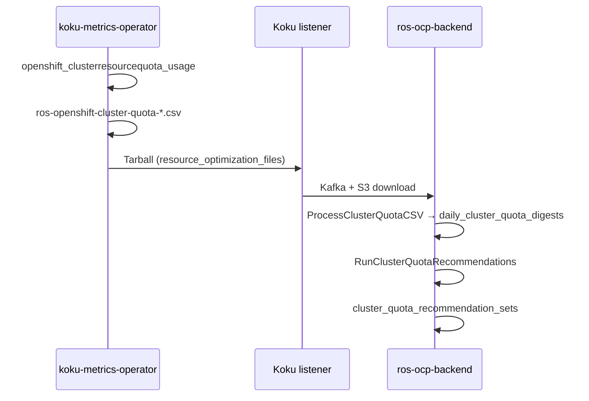

# ClusterResourceQuota Recommendations

**Status:** **IMPLEMENTED** (Phase 10)  
**Plugin:** `cluster-quota` (Phase 1, priority 36)  
**Depends on:** Namespace [ResourceQuota recommendations](quota-recommendations.md) (recommended for v1 recommended-hard sums)  
**OpenShift:** Required — `ClusterResourceQuota` is an OpenShift API extension (`quota.openshift.io/v1`), not upstream Kubernetes.

---

## What is ClusterResourceQuota?

`ClusterResourceQuota` enforces the same **hard / used** semantics as namespace `ResourceQuota`, but **aggregated across multiple namespaces** selected by a label or annotation selector on `Namespace` objects.

| Concept | Namespace `ResourceQuota` | `ClusterResourceQuota` |
|---------|---------------------------|-------------------------|
| API group | `v1` / `ResourceQuota` | `quota.openshift.io/v1` / `ClusterResourceQuota` |
| Scope | One namespace | Many namespaces (selector) |
| Metric source | `kube_resourcequota` | `openshift_clusterresourcequota_usage` |
| Operator CSV | `ros-openshift-namespace-*.csv` | `ros-openshift-cluster-quota-*.csv` |
| ROS plugin | `quota` (priority 35) | `cluster-quota` (priority 36) |

CRQ objects are **per cluster** — each recommendation row is `(org_id, cluster_uuid, cluster_quota_name)`.

---

## Implementation overview

| Layer | Component | Behavior |
|-------|-----------|----------|
| **Operator** | koku-metrics-operator | PromQL on `openshift_clusterresourcequota_usage` (`type=hard` / `used`) for CPU/memory request and limit resources; emits `ros-openshift-cluster-quota-YYYYMMDD-YYYYMMDD.csv` when series exist |
| **Listener** | Koku masu | No changes — `ros-openshift` files route to `resource_optimization_files` via existing packaging |
| **Ingest** | [`internal/ingestion/cluster_quota.go`](../../internal/ingestion/cluster_quota.go) | `PayloadTypeClusterQuota`; upserts `daily_cluster_quota_digests` |
| **Engine** | [`internal/engine/recommend_cluster_quota.go`](../../internal/engine/recommend_cluster_quota.go) | Classification reuse from namespace quota (`tighten` / `raise` / `optimal` / `none`) |
| **Persistence** | [`migrations/000087_cluster_quota_recommendations.up.sql`](../../migrations/000087_cluster_quota_recommendations.up.sql) | `cluster_quota_recommendation_sets` |
| **API** | [`internal/api/handlers_cluster_quota_recs.go`](../../internal/api/handlers_cluster_quota_recs.go) | `GET .../cluster-quota/` |
| **Settings** | [`internal/engine/cluster_quota_settings.go`](../../internal/engine/cluster_quota_settings.go) | `GET/PUT/DELETE .../settings/cluster-quota` |

**Plugin registration:** [`internal/plugins/cluster-quota/plugin.go`](../../internal/plugins/cluster-quota/plugin.go) — CSV ingest via `SupportedCSVTypes`, priority 36, retention on recommendation and digest tables.

**Enablement:** Include `cluster-quota` in `ROS_ENABLED_PLUGINS`. When disabled, list and settings routes return **404** (same as other plugins).

---

## Data flow



**Filename routing:** [`DetermineCSVType`](../../internal/utils/utils.go) matches ordered prefixes, including `ros-openshift-cluster-quota-` and nise compat `ocp_ros_cluster_quota`.

**Clusters without CRQs:** No metrics → no CSV → zero API rows (not an error). Plugin stays enabled.

---

## Recommendation algorithm (v1)

1. Load latest CRQ hard/used per `cluster_quota_name` from `daily_cluster_quota_digests`.
2. Sum namespace quota recommendations from `quota_recommendation_sets` for namespaces in the
   operator `namespaces` column (cluster-wide when empty).
3. Apply headroom and utilization thresholds from [Configuration](#configuration) (same semantics as namespace `quota`).
4. Classify `recommendation_type` and `risk_level`; on `tighten`, estimate monthly savings when
   `ROS_SAVINGS_ESTIMATES_ENABLED=true` (CPU, memory, and storage when cost rates exist; pods
   report `capacity_freed` only).

**Namespace membership:** The operator exports a comma-separated `namespaces` column on
`ros-openshift-cluster-quota-*.csv`. The engine sums namespace `quota_recommendation_sets`
only for namespaces in that list. When membership is empty (older operator builds), the
engine falls back to a cluster-wide aggregate.

**FinOps note:** Do not add namespace `quota` savings and CRQ `tighten` savings in one fleet total without deduplication — CRQ is a team-pool view; namespace quota is a project view.

---

## Timing and one-cycle lag

Same pattern as [namespace ResourceQuota](quota-recommendations.md#timing-and-one-cycle-lag):

1. **After container CSV:** `RunClusterQuotaRecommendations` runs immediately after `RunQuotaRecommendations` at the end of `processContainerCSVNative`, using digests and namespace quota rows already in PostgreSQL.
2. **After cluster-quota CSV:** Ingest updates `daily_cluster_quota_digests`, then `RunClusterQuotaRecommendations` runs in the same cycle.
3. **Stale namespace quota sums:** If namespace `quota` has not run yet in the current cycle (for example, only CRQ CSV in the payload), recommended-hard aggregates reflect the **previous** namespace quota run until container + namespace/quota processing completes.

On first deployment, expect **one report cycle** before tighten/raise signals fully align with fresh container and namespace quota data.

---

## Database schema

**Recommendations:** `cluster_quota_recommendation_sets` — unique `(org_id, cluster_uuid, cluster_quota_name)`.

**Digests:** `daily_cluster_quota_digests` — unique `(org_id, cluster_uuid, cluster_quota_name, report_date)`; GREATEST upsert on hard/used columns.

Thresholds are **not** stored per row; they resolve at runtime from settings (see below).

---

## API

```
GET /api/cost-management/v1/recommendations/openshift/cluster-quota/
```

| Query param | Maps to |
|-------------|---------|
| `filter[cluster]` | `cluster_uuid` |
| `filter[cluster_quota_name]`, `filter[cluster_resource_quota]`, or `filter[crq]` | `cluster_quota_name` |
| `filter[recommendation_type]` | `tighten` \| `raise` \| `optimal` \| `none` |
| `filter[risk_level]` | `high` \| `medium` \| `low` \| `none` |
| `filter[project]` | CRQs whose namespace membership includes the value (`filter[namespace]` accepted as alias) |
| `group_by[cluster]` | Aggregate per cluster (sum `capacity_freed` and `estimated_savings`; row includes `count`) |
| `order_by`, `order_how` | Sort — see [order_by values](#order_by-values) |
| `limit`, `offset` | Pagination (default limit 20, max 100) |

### order_by values

| `order_by` | Sort key |
|------------|----------|
| `cluster_quota_name` | CRQ object name (default) |
| `utilization` | Max of CPU/memory/storage/pods utilization percents (object-count excluded) |
| `risk_level` | `high` → `medium` → `low` → `none` |
| `estimated_monthly_savings` | `savings_dollars_monthly` (tighten rows only) |

### Notification codes

CRQ rows may emit codes **70–73** (shared catalog with namespace ResourceQuota except code 73 is CRQ-specific). Derivation: [`ClusterQuotaNotificationCodes`](../../internal/engine/quota_notifications.go).

| Code | Name | When emitted (CRQ) |
|------|------|-------------------|
| **70** | `QUOTA_NEAR_CAPACITY` | `risk_level` is `high` — utilization at or above the high-risk threshold |
| **71** | `QUOTA_OVERSIZED` | `recommendation_type` is `tighten` — hard limits exceed aggregated namespace quota recommendations |
| **72** | `QUOTA_BLOCKING` | `used >= hard` on any tracked resource (CPU, memory, storage, pods, or object counts) — admission may block new workloads |
| **73** | `CLUSTER_QUOTA_AT_CAPACITY` | `risk_level` is `high` — CRQ-specific high-utilization alert (often co-emitted with **70**) |

Filter notification catalog by plugin: `GET .../notification-codes/?filter[plugin]=cluster-quota` returns all four codes.

**Detail:**

```
GET /api/cost-management/v1/recommendations/openshift/cluster-quota/detail?cluster_uuid=...&cluster_quota_name=...
```

Returns the same fields as a list row plus `history[]` (90-day append-only snapshots per resource).

**Settings:**

```
GET /api/cost-management/v1/recommendations/openshift/settings/cluster-quota
PUT /api/cost-management/v1/recommendations/openshift/settings/cluster-quota
DELETE /api/cost-management/v1/recommendations/openshift/settings/cluster-quota
```

OpenAPI: [`openapi.json`](../../openapi.json). Public docs: [docs-site feature page](../../docs-site/features/cluster-resource-quota.md).

---

## Savings recalculation

Cluster-quota `estimated_savings` values are computed at ingestion time from Koku
`configured_rates` when `ROS_SAVINGS_ESTIMATES_ENABLED=true` (tighten rows only).
When cost model rates change, persisted savings can become stale until refreshed.

**Automatic refresh:** After Koku applies updated cost model rates
(`update_summary_cost_model_costs`), masu calls ROS:

```
POST /api/cost-management/v1/internal/recalculate-savings
```

Include `"cluster-quota"` in `recommendation_types` (along with `container`, `node`,
`pvc`, and/or `quota` as needed). ROS recomputes `savings_dollars_monthly` on existing
`tighten` rows without re-ingesting CSV data. Requires `ROS_SAVINGS_RECALCULATION_ENABLED=true`
(default) and Koku→ROS connectivity (`KOKU_MASU_URL` / `ROS_API_HOST`).

**What changes:** Dollar savings only — `recommendation_type`, `risk_level`, hard/used
values, and notification codes are unchanged by savings recalc.

Implementation: [`internal/engine/savings_recalculate.go`](../../internal/engine/savings_recalculate.go)
(`TestRecalculateClusterQuotaSavings_Unit`). See also
[cost-integration.md](../architecture/cost-integration.md#savings-recalculation-after-cost-model-changes).

---

## Configuration

Resolution order: **per-org Settings API** → **`ROS_CLUSTER_QUOTA_*` env vars** → **compiled defaults** (10 / 90 / 70).

| Variable | Default | Description |
|----------|---------|-------------|
| `ROS_CLUSTER_QUOTA_HEADROOM_PERCENT` | `10` | Margin on recommended CRQ hard values |
| `ROS_CLUSTER_QUOTA_HIGH_RISK_THRESHOLD_PERCENT` | `90` | `raise` + `high` risk when utilization ≥ threshold |
| `ROS_CLUSTER_QUOTA_MEDIUM_RISK_THRESHOLD_PERCENT` | `70` | `medium` risk band |

Distinct prefix from namespace `ROS_QUOTA_*`. PUT on env-locked fields returns **403**.

---

## Comparison with namespace quota

| Aspect | Namespace Quota | ClusterResourceQuota |
|--------|-----------------|----------------------|
| Scope | Single namespace | Multiple namespaces (selector) |
| Metric source | `kube_resourcequota` | `openshift_clusterresourcequota_usage` |
| Operator CSV | `ros-openshift-namespace-*.csv` | `ros-openshift-cluster-quota-*.csv` |
| DB table | `quota_recommendation_sets` | `cluster_quota_recommendation_sets` |
| Plugin | `quota` | `cluster-quota` |
| API | `GET .../quota/` | `GET .../cluster-quota/` |
| Settings | `.../settings/quota` | `.../settings/cluster-quota` |
| Status | **Implemented** | **Implemented** |

---

## Operator CSV columns

Beyond CPU/memory request and limit hard/used, the operator also collects:

| Column | PromQL resource |
|--------|-----------------|
| `storage_request_hard` / `storage_request_used` | `requests.storage` |
| `pods_hard` / `pods_used` | `pods` |
| `object_count_hard` / `object_count_used` | Sum of `count/*` resources |
| `namespaces` | Distinct namespaces with `type=used` > 0 |

### Object-count quotas (risk and notifications only)

The operator ingests aggregated **`object_count_*`** metrics (sum of all Kubernetes
`count/*` ResourceQuota resource types, such as `count/deployments.apps`,
`count/services`, `count/secrets`, and `count/configmaps`). These appear on CRQ digests as
`object_count_hard` / `object_count_used`. Namespace quota uses the same aggregation — see
[Object-count resources](quota-recommendations.md#object-count-resources).

| Use case | Included? | Notes |
|----------|-----------|-------|
| **API utilization fields** | No | `utilization` exposes CPU, memory, storage, and pods percents only — no `object_count_*` fields |
| **`order_by=utilization`** | No | Sort uses the same four percents; object-count utilization is internal-only |
| **Risk level** | Yes | `ObjectCountBP` participates in `maxUtilizationBP()` — a team at 95% of its object-count hard limit can surface `high` risk even when CPU/memory are low |
| **Blocking notifications** | Yes | Code **72** fires when `used >= hard` on object counts, same as CPU/memory/storage/pods |
| **High-utilization notifications** | Yes | Codes **70** and **73** fire when `risk_level` is `high` (object-count pressure can contribute to that classification) |
| **Tighten / raise** | No | There is no workload-derived target comparable to summed namespace `quota_recommendation_sets` or container `rec_*` request columns |
| **Savings** | No | Koku `effective_rates` has no object-count or per-object cost metric; freed object-count capacity is not monetized |

**Rationale:** Object-count limits are **admission-control guardrails**, not FinOps cost levers.
ROS does not recommend lowering object-count hard values because:

- There is no rightsizing signal — container recommendations do not produce a target object total.
- There is no cost-model rate for discrete object types in Koku.
- Reducing object limits could cause production outages (deployments blocked at admission).

**What users get:** elevated **risk badge** when object-count utilization is high,
**notification code 72** when at hard capacity, and **codes 70/73** when overall CRQ risk
is `high`. Treat these as operational admission-pressure indicators, not dollar savings
opportunities.

Implementation: [`quota_notifications.go`](../../internal/engine/quota_notifications.go),
[`recommend_cluster_quota.go`](../../internal/engine/recommend_cluster_quota.go) (`ObjectCountBP`
in risk classification only; no tighten/raise path for object counts).

### Savings by resource

| Resource | Monthly savings | Capacity freed |
|----------|-----------------|----------------|
| CPU / memory request | Yes (hourly rates × 730 h/month) | `cpu_cores_freed`, `memory_bytes` |
| Storage request | Yes when `storage_gb_request_per_month` (or usage fallback) is in effective rates | `storage_request_bytes` |
| Pods | No monetary estimate | `pods_freed` on tighten only |

---

## Extended resources (future work)

Extended ResourceQuota and ClusterResourceQuota resource types — for example
`requests.ephemeral-storage`, `limits.ephemeral-storage`, `nvidia.com/gpu`,
`hugepages-2Mi`, `hugepages-1Gi`, and custom device-plugin resources — are **not**
currently collected by the koku-metrics-operator or analyzed by the `quota` /
`cluster-quota` plugins.

**Data availability:** Prometheus already exposes these values on
`kube_resourcequota` and `openshift_clusterresourcequota_usage` when clusters define
them. The gap is **operator query scope** (which PromQL series the ROS CSV includes),
not missing cluster telemetry.

| Resource type | Priority | Notes |
|---------------|----------|-------|
| **Ephemeral storage** (`requests.ephemeral-storage`) | **High** | Common quota dimension; cadvisor usage metrics remain unreliable through OCP 4.21 — visibility on hard/used may precede usage-based tighten (see REQ-8.2) |
| **GPU quota** (`nvidia.com/gpu`, vendor GPU resources) | **Medium** | GPU **workload** recommendations are handled by the separate `gpu` plugin; GPU **quota** hard/used would be visibility-only unless a quota-specific cost rate exists |
| **Hugepages** (`hugepages-*`) | **Low** | Niche; demand-driven |
| **Custom device-plugin resources** | **Low** | Demand-driven; pattern same as object counts unless a cost-model rate is added |

**Planned pattern when added:** Same as [object-count quotas](#object-count-quotas-visibility-and-alerting-only) —
**visibility + alerting only** (utilization %, risk level, blocking notifications) unless
Koku exposes a matching cost-model rate. Do not emit tighten/raise or `estimated_savings`
for extended resources without a workload-derived target and a FinOps metric.

Track alongside namespace quota extended-resource work in
[quota-recommendations.md — Roadmap](quota-recommendations.md#roadmap--future-work).

---

## Related documentation

- [Namespace ResourceQuota recommendations](quota-recommendations.md)
- [REQ-8.4b](../architecture/requirements.md) — requirements traceability
- [Plugin phases](../architecture/plugin-phases.md) — `cluster-quota` priority 36
- [Known issues](../known-issues.md) — timing and remaining gaps
