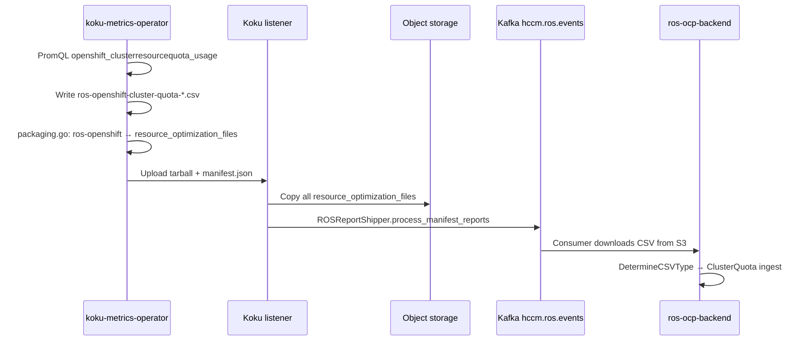

# ClusterResourceQuota Recommendations (Design)

**Status:** Design only — not implemented. Routing, naming, and `DetermineCSVType` decisions finalized.  
**Depends on:** Namespace [ResourceQuota recommendations](quota-recommendations.md) (shipped).  
**OpenShift:** Required — `ClusterResourceQuota` is an OpenShift API extension (`quota.openshift.io/v1`), not upstream Kubernetes.

---

## What is ClusterResourceQuota?

`ClusterResourceQuota` is an OpenShift-only resource that enforces the same **hard / used**
semantics as namespace `ResourceQuota`, but **aggregated across multiple namespaces** selected
by a label selector (or annotation selector) on `Namespace` objects.

| Concept | Namespace `ResourceQuota` | `ClusterResourceQuota` |
|---------|---------------------------|-------------------------|
| API group | `v1` / `ResourceQuota` | `quota.openshift.io/v1` / `ClusterResourceQuota` |
| Scope | One namespace | Many namespaces (selector) |
| Enforcement | Per-namespace admission | Cluster controller sums usage across matched namespaces |
| Typical owner | Namespace / project admin | Platform / cluster admin, FinOps, tenant leads |

Example use cases:

- **Team budget:** `team=payments` namespaces share one CPU/memory pool.
- **Department chargeback:** Align CRQ name with cost center or business unit.
- **Platform guardrails:** Cap total requests for all namespaces labeled `environment=dev`.

CRQ objects are **per cluster** — they do not span clusters. A recommendation row is always
`(org_id, cluster_uuid, crq_name)`.

---

## Why recommend on CRQ?

Namespace quota recommendations answer: *“Is this namespace’s ResourceQuota aligned with its
workloads?”* CRQ recommendations answer a higher-level question: *“Is the team/tenant allocation
aligned with aggregate workload demand?”*

| Benefit | Detail |
|---------|--------|
| **FinOps alignment** | CRQs map naturally to team budgets, chargeback, and showback — one row per budget boundary. |
| **Over-provisioned team pools** | CRQ hard limits often set at onboarding; namespace rightsizing may leave team-level capacity stranded. |
| **Under-provisioned teams** | Sum of namespace admissions can approach CRQ hard while individual namespaces look healthy. |
| **Drill-down hierarchy** | Fleet view: CRQ → namespace quota recs → container recs. |

CRQ recs **complement** namespace quota recs; they do not replace them. Namespace admins still
need per-namespace `tighten` / `raise` signals; cluster admins need CRQ-level signals for
reallocation and budgeting conversations.

---

## Research summary

### OpenShift metrics (not `kube_resourcequota`)

Namespace quota collection today uses **`kube_resourcequota`** with `namespace` and
`resource` labels — see
[`koku-metrics-operator/internal/collector/queries.go`](../../../koku-metrics-operator/internal/collector/queries.go)
(`ros:cpu_request_namespace_sum`, etc.).

**ClusterResourceQuota is a separate metric family** from
[openshift-state-metrics](https://github.com/openshift/openshift-state-metrics/blob/master/docs/clusterresourcequota-metrics.md)
(typically scraped in `openshift-monitoring` on OCP clusters):

| Metric | Labels (key) | Purpose |
|--------|----------------|---------|
| `openshift_clusterresourcequota_usage` | `name`, `resource`, `type` (`hard` \| `used`) | Aggregated hard/used across all namespaces matched by the CRQ |
| `openshift_clusterresourcequota_namespace_usage` | `name`, `namespace`, `resource`, `type` | Per-namespace contribution under a CRQ |
| `openshift_clusterresourcequota_selector` | `name`, `type`, `key`, `value` / `values`, `operator` | Namespace selector (match-labels, match-expressions, annotations) |
| `openshift_clusterresourcequota_labels` | `name` | CRQ object labels |
| `openshift_clusterresourcequota_created` | `name` | Existence / age signal |

**Answer:** `kube_resourcequota` does **not** expose CRQ aggregates. CRQ hard/used must come from
`openshift_clusterresourcequota_*` (or equivalent telemetry). Do not assume CRQ appears in
existing namespace-sum PromQL.

### Current operator collection

The metrics operator **does not** query any `openshift_clusterresourcequota` metrics today.
Namespace ROS CSV (`ros-openshift-namespace-*.csv`) only includes `*_namespace_sum` /
`*_namespace_used` from `kube_resourcequota`.

### Current ros-ocp-backend patterns (namespace quota)

Follow these established patterns:

| Area | Reference |
|------|-----------|
| Plugin shell | [`internal/plugins/quota/plugin.go`](../../internal/plugins/quota/plugin.go) — priority 35, no ingest hook, runs after container recs |
| Engine | [`internal/engine/recommend_quota.go`](../../internal/engine/recommend_quota.go) — headroom, utilization BP, tighten/raise/optimal/none |
| Persistence | [`migrations/000085_quota_recommendations.up.sql`](../../migrations/000085_quota_recommendations.up.sql) — `quota_recommendation_sets` |
| Digest source | [`migrations/000086_namespace_quota_digest_columns.up.sql`](../../migrations/000086_namespace_quota_digest_columns.up.sql) — hard/used on `daily_namespace_digests` |
| API | `GET /api/cost-management/v1/recommendations/openshift/quota/` |

---

## Data requirements

### From koku-metrics-operator

#### New PromQL queries (proposed)

Mirror namespace quota resources (`requests.cpu`, `limits.cpu`, `requests.memory`,
`limits.memory`). Phase 1 can match namespace quota scope; storage/pod/object-count CRQ
resources are a later phase (same gap as namespace quota).

```promql
# Hard limits per CRQ (cluster-aggregated)
sum by (name) (
  openshift_clusterresourcequota_usage{
    resource="requests.cpu", type="hard"
  }
)

# Used limits per CRQ (cluster-aggregated)
sum by (name) (
  openshift_clusterresourcequota_usage{
    resource="requests.cpu", type="used"
  }
)
```

Repeat for `limits.cpu`, `requests.memory`, `limits.memory`.

**Optional (Phase B+):** `openshift_clusterresourcequota_namespace_usage` to emit
`matched_namespace_count` and to validate which namespaces roll up into each CRQ (and to
cross-check namespace quota recs).

**Selector metadata:** Query `openshift_clusterresourcequota_selector{type="match-labels"}`
(or serialize selector as JSON in one column per CRQ row). Needed for API `selector` field and
for joining to namespace-level data.

**Availability:**

- If PromQL returns no series (no CRQs, or openshift-state-metrics not exposing metrics), the
  operator emits **no CRQ CSV file** — not an empty file, not an error.
- See [Backward compatibility](#backward-compatibility) and [Minimum OpenShift version](#minimum-openshift-version).

#### New CSV — separate report type (finalized)

**Do not extend** the namespace ROS CSV. Grain differs.

**Filename (operator):**

```
ros-openshift-cluster-quota-YYYYMMDD-YYYYMMDD.csv
```

Example: `ros-openshift-cluster-quota-20260501-20260528.csv`

The `ros-openshift` substring matches the operator’s existing packaging rule in
[`packaging.go`](../../../koku-metrics-operator/internal/packaging/packaging.go)
(`strings.Contains(file.Name(), "ros-openshift")`), so the file is placed in
`resource_optimization_files` automatically. **No listener or manifest schema changes are required.**

**Nise compatibility (test data):** legacy filenames such as `ocp_ros_cluster_quota_usage.csv`
remain routable in ros-ocp-backend via `DetermineCSVType` prefix rules (see Phase B).

| Report | Row grain | Key columns |
|--------|-----------|-------------|
| `ros-openshift-namespace-*.csv` | `(interval, namespace)` | `namespace`, `*_namespace_sum`, usage stats |
| **`ros-openshift-cluster-quota-*.csv`** | `(interval, crq_name)` | `cluster_resource_quota`, hard/used sums, optional selector |

Columns (align units with namespace quota: cores for CPU, bytes for memory):

| Column | Source |
|--------|--------|
| `report_period_start`, `report_period_end`, `interval_start`, `interval_end` | Standard ROS interval |
| `cluster_resource_quota` | CRQ `metadata.name` (`name` label) |
| `cpu_request_cluster_sum` | `openshift_clusterresourcequota_usage{resource="requests.cpu",type="hard"}` |
| `cpu_request_cluster_used` | `type="used"` |
| `cpu_limit_cluster_sum` / `cpu_limit_cluster_used` | `limits.cpu` |
| `memory_request_cluster_sum` / `memory_request_cluster_used` | `requests.memory` |
| `memory_limit_cluster_sum` / `memory_limit_cluster_used` | `limits.memory` |
| `matched_namespace_count` | `count by (name) (openshift_clusterresourcequota_namespace_usage{...})` (optional) |
| `selector_labels` | Serialized match-labels from `openshift_clusterresourcequota_selector` (optional JSON) |

#### Operator implementation (Phase A)

| Item | Decision |
|------|----------|
| PromQL | `openshift_clusterresourcequota_usage{type="hard"}` and `{type="used"}` per resource (`requests.cpu`, `limits.cpu`, `requests.memory`, `limits.memory`) |
| Struct | New `rosClusterQuotaRow` in [`types.go`](../../../koku-metrics-operator/internal/collector/types.go) |
| CSV writer | New collector path; file prefix `ros-openshift-cluster-quota-` |
| Manifest | File listed under `resource_optimization_files` via existing `ros-openshift` routing |
| RBAC | **No new RBAC** — operator queries Prometheus/Thanos, not the Kubernetes API |
| Empty metrics | PromQL returns no series → **no CSV generated**, no error |

---

## Koku listener routing (no changes)

The full pipeline from operator upload to ros-ocp-backend ingest:



| Step | Component | Behavior |
|------|-----------|----------|
| 1 | **Operator collector** | Generates `ros-openshift-cluster-quota-YYYYMMDD-YYYYMMDD.csv` when metrics exist |
| 2 | **`packaging.go`** | `strings.Contains(name, "ros-openshift")` → `resource_optimization_files` |
| 3 | **Upload** | Tarball manifest lists the file under `resource_optimization_files` |
| 4 | **Koku listener** | [`kafka_msg_handler.py`](../../../koku/koku/masu/external/kafka_msg_handler.py) forwards **all** `resource_optimization_files` to S3 and emits `hccm.ros.events` via `ROSReportShipper` — **no per-filename filter** |
| 5 | **ros-ocp-backend** | Kafka consumer downloads CSV; routes type via `DetermineCSVType` (Phase B refactor) |

**Why no Koku changes:** ROS files are already shipped wholesale to ros-ocp-backend. Adding a
new ROS CSV with the `ros-openshift` prefix does not require masu report-type mapping, Trino
tables, or listener logic updates.

---

## Minimum OpenShift version

| Fact | Detail |
|------|--------|
| Metric origin | `openshift_clusterresourcequota_*` added to openshift-state-metrics in **2019** |
| Supported OCP | **All OCP 4.x (4.1+)** where openshift-state-metrics runs in `openshift-monitoring` |
| Missing metrics | If openshift-state-metrics is down or the cluster has no `ClusterResourceQuota` objects, PromQL returns empty — operator skips CSV; **no error** |
| Not required | Upstream Kubernetes (no CRQ API); clusters without CRQ objects are normal |

---

## Backward compatibility

| Scenario | Behavior |
|----------|----------|
| **Cluster has no CRQs** | No `openshift_clusterresourcequota_*` series → operator generates no CRQ CSV → no Kafka payload for that file → `cluster-quota` plugin returns **empty results** (not an error) |
| **`cluster-quota` plugin disabled** | Routes return 404 (same as other plugins) |
| **`cluster-quota` enabled, no CRQ file** | Ingest has nothing for `PayloadTypeClusterQuota`; recommendation run produces 0 rows — plugin does **not** auto-disable |
| **Older operator (pre-CRQ)** | Payload lacks CRQ file; ros-ocp-backend unchanged for other report types |
| **Nise / legacy filenames** | `DetermineCSVType` accepts `ocp_ros_cluster_quota*` (and other `ocp_*` prefixes) for dev/test payloads |
| **Namespace quota** | Independent feature; continues to work with or without CRQ CSV |

No special “missing CRQ” handling in the engine or API beyond treating absent ingest data as
zero recommendations.

---

## Database schema

### Recommendation: separate table (not `scope` on `quota_recommendation_sets`)

`quota_recommendation_sets` is keyed by `(org_id, cluster_uuid, namespace)` and optimized for
namespace API filters. CRQ needs `(org_id, cluster_uuid, crq_name)` and selector metadata.

**Preferred:** `cluster_quota_recommendation_sets` (name TBD in implementation).

Headroom and risk thresholds are **not** columns on this table — they are resolved at
runtime from [Configuration](#configuration) (per-org DB → env → defaults), same as how
operators should treat new CRQ tables vs the legacy `headroom_basis_points` snapshot on
namespace `quota_recommendation_sets`.

```sql
-- Illustrative — not migrated yet
CREATE TABLE cluster_quota_recommendation_sets (
    id BIGSERIAL PRIMARY KEY,
    org_id TEXT NOT NULL,
    cluster_uuid UUID NOT NULL,
    crq_name TEXT NOT NULL,

    selector_labels JSONB,              -- e.g. {"team": "payments"}
    matched_namespace_count INT,

    cpu_request_hard_millicores BIGINT,
    cpu_limit_hard_millicores BIGINT,
    memory_request_hard_bytes BIGINT,
    memory_limit_hard_bytes BIGINT,

    cpu_request_used_millicores BIGINT,
    cpu_limit_used_millicores BIGINT,
    memory_request_used_bytes BIGINT,
    memory_limit_used_bytes BIGINT,

    cpu_request_recommended_millicores BIGINT,
    cpu_limit_recommended_millicores BIGINT,
    memory_request_recommended_bytes BIGINT,
    memory_limit_recommended_bytes BIGINT,

    cpu_request_utilization_bp INT,
    cpu_limit_utilization_bp INT,
    memory_request_utilization_bp INT,
    memory_limit_utilization_bp INT,

    cpu_freed_millicores BIGINT,
    memory_freed_bytes BIGINT,
    estimated_savings_cents BIGINT,
    currency TEXT NOT NULL DEFAULT 'USD',

    recommendation_type TEXT NOT NULL DEFAULT 'none',
    risk_level TEXT NOT NULL DEFAULT 'none',

    last_observed_at TIMESTAMPTZ NOT NULL DEFAULT NOW(),
    created_at TIMESTAMPTZ NOT NULL DEFAULT NOW(),
    updated_at TIMESTAMPTZ NOT NULL DEFAULT NOW(),

    UNIQUE (org_id, cluster_uuid, crq_name)
);
```

**Digest table (optional):** `daily_cluster_quota_digests` keyed by
`(org_id, cluster_uuid, crq_name, bucket_date, schedule_type)` — mirrors
`daily_namespace_digests` quota columns. Alternatively, store latest snapshot only on the
recommendation row if history is not required for v1.

### Relationship to namespace quota recs

- **Logical:** One CRQ covers N namespaces; each namespace may have 0–1 row in
  `quota_recommendation_sets` (today: aggregated per namespace, not per ResourceQuota object).
- **Recommended aggregate for CRQ “recommended hard” (v1):** Sum namespace-level
  `cpu_request_recommended_millicores` (and memory) for namespaces that belong to the CRQ
  (from selector + namespace list), then apply headroom at CRQ level only if not already applied
  at namespace level — **default: sum namespace recommended values without double headroom**.
- **Alternative:** Sum container `recommendation_sets` for all namespaces under the CRQ
  (independent of namespace quota plugin). More accurate when namespace quota plugin is disabled;
  duplicates logic.
- **Validation:** Compare CRQ `used` from `openshift_clusterresourcequota_usage` to sum of
  namespace `used` under the CRQ; log warning on large drift (measurement/debug, not blocking).

---

## API endpoint

```
GET /api/cost-management/v1/recommendations/openshift/cluster-quota/
```

| Query param | Maps to |
|-------------|---------|
| `filter[cluster]` | `cluster_uuid` |
| `filter[cluster_resource_quota]` or `filter[crq]` | `crq_name` |
| `filter[recommendation_type]` | `tighten` \| `raise` \| `optimal` \| `none` |
| `filter[risk_level]` | `high` \| `medium` \| `low` \| `none` |
| `group_by[cluster]` | Aggregated counts / savings per cluster |

**Response item (sketch):**

```json
{
  "cluster_uuid": "...",
  "cluster_resource_quota": "team-payments-quota",
  "selector": {"team": "payments"},
  "matched_namespace_count": 12,
  "recommendation_type": "tighten",
  "risk_level": "low",
  "quota_hard": { "cpu_request_millicores": 500000, "memory_request_bytes":  ... },
  "quota_used": { ... },
  "quota_recommended": { ... },
  "utilization": { "cpu_request_percent": 35.0 },
  "capacity_freed": { "cpu_millicores": 120000, "memory_bytes": ... },
  "estimated_savings": { "value": 420.0, "units": "USD", "currency": "USD" },
  "last_observed_at": "2026-05-28T12:00:00Z"
}
```

**Settings API:** `GET` / `PUT` / `DELETE`
`/api/cost-management/v1/recommendations/openshift/settings/cluster-quota`
(separate endpoint — not shared with namespace quota; matches the separate
`cluster-quota` plugin). See [Configuration](#configuration) below.

**Plugin gate:** `cluster-quota` in `ROS_ENABLED_PLUGINS`; 404 when disabled (same as `quota`).

---

## Plugin design

### Recommendation: separate `cluster-quota` plugin

| Option | Pros | Cons |
|--------|------|------|
| **Extend `quota` plugin** | One settings surface | Mixed routes, retention, ingest paths; namespace vs CRQ keys |
| **`cluster-quota` plugin (preferred)** | Clear API, table, phase, enablement; OCP-only | Some duplicated threshold/config code |

**Proposed registration:**

| Property | Value |
|----------|-------|
| Name | `cluster-quota` |
| Phase | 1 (infrastructure / capacity) |
| Priority | `36` (after namespace `quota` at 35, before `snapshot` at 40) |
| Routes | `GET .../cluster-quota/`, `GET/PUT/DELETE .../settings/cluster-quota` |
| Retention | `cluster_quota_recommendation_sets` |
| Ingest hook | None — run after namespace quota + container recs (same as `quota`) |

### Dependencies

| Dependency | Required for v1? |
|------------|------------------|
| Container `recommendation_sets` | Yes if aggregating from workloads |
| Namespace `quota_recommendation_sets` | Preferred for v1 recommended-hard sum |
| Namespace quota CSV / digests | No for CRQ hard/used (comes from new CRQ CSV) |
| `openshift_clusterresourcequota_*` metrics | Yes |

**Can run without namespace quota plugin:** Yes, if recommended values are computed by summing
container recs for namespaces matched to each CRQ (requires namespace membership resolution).

**Clusters without CRQs:** No metrics → no CSV file → no ingest rows →
`RunClusterQuotaRecommendations` returns 0 recs; API lists empty. The `cluster-quota` plugin stays
enabled. Existing namespace quota behavior unchanged. See [Backward compatibility](#backward-compatibility).

---

## Configuration

Thresholds resolve in three tiers (same pattern as namespace quota and idle detection):

1. **Per-org DB override** — `PUT .../settings/cluster-quota` persists to
   `recommendation_thresholds` (`recommendation_type=cluster-quota`).
2. **Environment variables** — deployment-wide defaults; when set, the field appears in
   `locked_fields` on GET and cannot be changed via PUT (403).
3. **Compiled defaults** — 10 / 90 / 70 when no DB row and no env override.

### Environment variables (instance-wide defaults)

| Variable | Default | Description |
|----------|---------|-------------|
| `ROS_CLUSTER_QUOTA_HEADROOM_PERCENT` | `10` | Extra margin on recommended CRQ hard values (10 → multiply sums by 1.10) |
| `ROS_CLUSTER_QUOTA_HIGH_RISK_THRESHOLD_PERCENT` | `90` | `raise` recommendation and `high` risk when max utilization ≥ 90% of hard |
| `ROS_CLUSTER_QUOTA_MEDIUM_RISK_THRESHOLD_PERCENT` | `70` | `medium` risk when utilization ≥ 70% and below high threshold |

Distinct `ROS_CLUSTER_QUOTA_*` prefix avoids confusion with namespace `ROS_QUOTA_*` vars.

### Settings API (per-org override)

`GET` / `PUT` / `DELETE`
`/api/cost-management/v1/recommendations/openshift/settings/cluster-quota`

Requires `cluster-quota` in `ROS_ENABLED_PLUGINS` (404 when disabled).

**Request/response shape** (same as namespace quota settings):

```json
{
  "headroom_percent": 10,
  "high_risk_threshold_percent": 90,
  "medium_risk_threshold_percent": 70,
  "locked_fields": []
}
```

**Validation** (same rules as namespace quota):

- `headroom_percent`: integer 0–100
- `high_risk_threshold_percent`: integer 1–100, must be greater than `medium_risk_threshold_percent`
- `medium_risk_threshold_percent`: integer 1–99
- PUT on a field listed in `locked_fields` (env override) → **403**

DELETE removes the per-org override; subsequent runs use env or compiled defaults.

### Rationale

| Decision | Why |
|----------|-----|
| Same defaults (10 / 90 / 70) as namespace quota | Both features tune quota utilization with identical risk semantics |
| Separate settings endpoint | Separate `cluster-quota` plugin → separate route; consistent with plugin architecture |
| `ROS_CLUSTER_QUOTA_*` env prefix | Operators can set cluster-wide CRQ defaults without colliding with `ROS_QUOTA_*` |
| Headroom not stored per recommendation row | Thresholds are resolved at runtime from settings; only utilization and outcomes are persisted |

### Helm values (cost-onprem-chart)

When implemented, the chart will expose instance defaults under `ros.api`:

```yaml
ros:
  api:
    clusterQuotaRecommendations:
      headroomPercent: 10
      highRiskThresholdPercent: 90
      mediumRiskThresholdPercent: 70
```

Maps to `ROS_CLUSTER_QUOTA_*` environment variables on the ROS API deployment.

---

## Recommendation algorithm (Phase C)

Reuse namespace quota classification from
[`recommend_quota.go`](../../internal/engine/recommend_quota.go):

1. Load latest CRQ snapshot (hard/used) per `crq_name`.
2. Build `recommended` bundle:
   - **v1 default:** `SUM(namespace quota_recommended_*)` for namespaces in CRQ.
   - **Utilization:** `max(crq_used, sum(namespace recommended or used))` vs `crq_hard` per resource.
3. Apply same `tighten` / `raise` / `optimal` / `none` and risk bands (CRQ settings from
   [Configuration](#configuration) — not stored per row).
4. **Savings on `tighten`:** Freed CRQ capacity × cluster effective rates (same as namespace quota).

**Open question — savings double-counting:** Fleet dashboards summing namespace + CRQ savings
will over-count. API docs should state: CRQ savings are **team-pool** view; namespace savings are
**project** view — do not add both in one total without deduplication.

---

## Implementation plan (phased)

| Phase | Owner | Work |
|-------|-------|------|
| **A — Operator** | koku-metrics-operator | PromQL on `openshift_clusterresourcequota_usage` (`type=hard` / `type=used`); `rosClusterQuotaRow` in `types.go`; CSV `ros-openshift-cluster-quota-YYYYMMDD-YYYYMMDD.csv`; packaging via existing `ros-openshift` rule; tests; report-fields doc. **No Koku listener changes.** |
| **B — Ingest** | ros-ocp-backend | Refactor [`DetermineCSVType`](../../internal/utils/utils.go) to ordered prefix matching on `filepath.Base(fileName)`; add `PayloadTypeClusterQuota` ingest path → `daily_cluster_quota_digests` or snapshot; nise `ocp_ros_cluster_quota*` compat. **No listener changes.** |
| **C — Engine + API** | ros-ocp-backend | `cluster-quota` plugin; `recommend_cluster_quota.go`; `cluster_quota_recommendation_sets`; `GET .../cluster-quota/`; empty results when no CRQ data |
| **D — Polish** | ros-ocp-backend | Settings API (`GET/PUT/DELETE .../settings/cluster-quota`), `ROS_CLUSTER_QUOTA_*` env wiring, OpenAPI, docs-site, cost-onprem-chart Helm values, IQE fixtures, unit/integration tests |

### Phase B — `DetermineCSVType` refactor (finalized)

**Problem:** Today’s implementation uses fragile `strings.Contains` on the full path, which can
mis-classify filenames (e.g. a path segment containing `namespace`).

**Solution:** Ordered **prefix** matching on `filepath.Base(fileName)`. Check longer / more-specific
prefixes first; default to `PayloadTypeContainer`.

| Prefix | `PayloadType` |
|--------|---------------|
| `ros-openshift-cluster-quota-` | ClusterQuota |
| `ros-openshift-namespace-` | Namespace |
| `ros-openshift-snapshot-` | Snapshot |
| `ros-openshift-storage-` | Storage |
| `ocp_ros_cluster_quota` | ClusterQuota (nise compat) |
| `ocp_ros_namespace` | Namespace (nise compat) |
| `ocp_snapshot_inventory` | Snapshot (nise compat) |
| `ocp_storage_usage` | Storage (nise compat) |
| *(default)* | Container |

Implementation note: use a slice of `{prefix, type}` pairs iterated in order; first match wins.

---

## Open questions

| # | Question | Status |
|---|----------|--------|
| 1 | Savings: aggregate namespace savings vs independent CRQ compute? | **Open** — independent CRQ tighten savings; document dedup for fleet totals |
| 2 | Namespace membership for recommended-hard sums | **Open** — `openshift_clusterresourcequota_namespace_usage` vs selector evaluation |
| 3 | Multiple CRQs selecting overlapping namespaces | **Open** — one row per CRQ; optional warning in API meta |

**Resolved (see sections above):** metric source (`openshift_clusterresourcequota_*`), separate CSV,
filename `ros-openshift-cluster-quota-*`, listener routing (no changes), `DetermineCSVType` prefix
algorithm, no-CRQ → empty results, OCP 4.1+ metric availability, separate DB table and plugin.

---

## Comparison with namespace quota

| Aspect | Namespace Quota | ClusterResourceQuota |
|--------|-----------------|----------------------|
| Scope | Single namespace | Multiple namespaces (label selector) |
| Admin level | Namespace / project admin | Cluster / platform admin |
| Metric source | `kube_resourcequota` | `openshift_clusterresourcequota_usage` (+ related) |
| Operator CSV | `ros-openshift-namespace-*.csv` | `ros-openshift-cluster-quota-YYYYMMDD-YYYYMMDD.csv` |
| DB table | `quota_recommendation_sets` | `cluster_quota_recommendation_sets` (proposed) |
| Plugin | `quota` (shipped) | `cluster-quota` (proposed) |
| API | `GET .../quota/` | `GET .../cluster-quota/` |
| Settings API | `GET/PUT/DELETE .../settings/quota` | `GET/PUT/DELETE .../settings/cluster-quota` |
| Env vars | `ROS_QUOTA_*` | `ROS_CLUSTER_QUOTA_*` |
| Status | **Implemented** | **Design** |

---

## Related documentation

- [Namespace ResourceQuota recommendations](quota-recommendations.md)
- [REQ-8.4 / F37](../architecture/requirements.md) — namespace quota shipped; CRQ planned as F37b
- [Plugin phases](../architecture/plugin-phases.md)
- [Performance analysis §23.8](../architecture/performance-analysis.md)
- [openshift-state-metrics CRQ metrics](https://github.com/openshift/openshift-state-metrics/blob/master/docs/clusterresourcequota-metrics.md)
