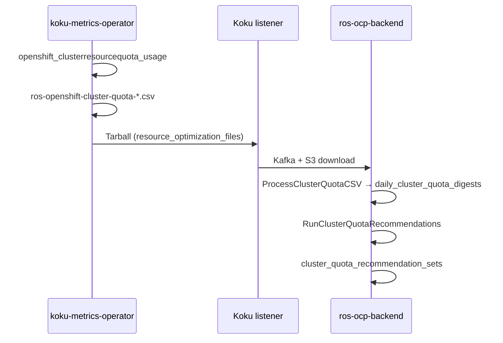

# ClusterResourceQuota Recommendations

**Status:** **IMPLEMENTED** (Phase 10)  
**Plugin:** `cluster-quota` (Phase 1, priority 36)  
**Depends on:** Namespace [ResourceQuota recommendations](quota-recommendations.md) (recommended for v1 recommended-hard sums)  
**OpenShift:** Required — `ClusterResourceQuota` is an OpenShift API extension (`quota.openshift.io/v1`), not upstream Kubernetes.

---

## What is ClusterResourceQuota?

`ClusterResourceQuota` enforces the same **hard / used** semantics as namespace `ResourceQuota`, but **aggregated across multiple namespaces** selected by a label or annotation selector on `Namespace` objects.

| Concept | Namespace `ResourceQuota` | `ClusterResourceQuota` |
|---------|---------------------------|-------------------------|
| API group | `v1` / `ResourceQuota` | `quota.openshift.io/v1` / `ClusterResourceQuota` |
| Scope | One namespace | Many namespaces (selector) |
| Metric source | `kube_resourcequota` | `openshift_clusterresourcequota_usage` |
| Operator CSV | `ros-openshift-namespace-*.csv` | `ros-openshift-cluster-quota-*.csv` |
| ROS plugin | `quota` (priority 35) | `cluster-quota` (priority 36) |

CRQ objects are **per cluster** — each recommendation row is `(org_id, cluster_uuid, cluster_quota_name)`.

---

## Implementation overview

| Layer | Component | Behavior |
|-------|-----------|----------|
| **Operator** | koku-metrics-operator | PromQL on `openshift_clusterresourcequota_usage` (`type=hard` / `used`) for CPU/memory request and limit resources; emits `ros-openshift-cluster-quota-YYYYMMDD-YYYYMMDD.csv` when series exist |
| **Listener** | Koku masu | No changes — `ros-openshift` files route to `resource_optimization_files` via existing packaging |
| **Ingest** | [`internal/ingestion/cluster_quota.go`](../../internal/ingestion/cluster_quota.go) | `PayloadTypeClusterQuota`; upserts `daily_cluster_quota_digests` |
| **Engine** | [`internal/engine/recommend_cluster_quota.go`](../../internal/engine/recommend_cluster_quota.go) | Classification reuse from namespace quota (`tighten` / `raise` / `optimal` / `none`) |
| **Persistence** | [`migrations/000087_cluster_quota_recommendations.up.sql`](../../migrations/000087_cluster_quota_recommendations.up.sql) | `cluster_quota_recommendation_sets` |
| **API** | [`internal/api/handlers_cluster_quota_recs.go`](../../internal/api/handlers_cluster_quota_recs.go) | `GET .../cluster-quota/` |
| **Settings** | [`internal/engine/cluster_quota_settings.go`](../../internal/engine/cluster_quota_settings.go) | `GET/PUT/DELETE .../settings/cluster-quota` |

**Plugin registration:** [`internal/plugins/cluster-quota/plugin.go`](../../internal/plugins/cluster-quota/plugin.go) — CSV ingest via `SupportedCSVTypes`, priority 36, retention on recommendation and digest tables.

**Enablement:** Include `cluster-quota` in `ROS_ENABLED_PLUGINS`. When disabled, list and settings routes return **404** (same as other plugins).

---

## Data flow



**Filename routing:** [`DetermineCSVType`](../../internal/utils/utils.go) matches ordered prefixes, including `ros-openshift-cluster-quota-` and nise compat `ocp_ros_cluster_quota`.

**Clusters without CRQs:** No metrics → no CSV → zero API rows (not an error). Plugin stays enabled.

---

## Recommendation algorithm (v1)

1. Load latest CRQ hard/used per `cluster_quota_name` from `daily_cluster_quota_digests`.
2. Load **cluster-wide** aggregate of namespace quota recommendations from `quota_recommendation_sets` (sum across all namespaces on the cluster).
3. Apply headroom and utilization thresholds from [Configuration](#configuration) (same semantics as namespace `quota`).
4. Classify `recommendation_type` and `risk_level`; on `tighten`, estimate monthly savings when `ROS_SAVINGS_ESTIMATES_ENABLED=true`.

**v1 limitation:** Without CRQ-to-namespace membership mapping, the same cluster-wide namespace-quota sum is applied to **each** CRQ row on the cluster. Per-CRQ recommended-hard sums using selector membership are a future enhancement.

**FinOps note:** Do not add namespace `quota` savings and CRQ `tighten` savings in one fleet total without deduplication — CRQ is a team-pool view; namespace quota is a project view.

---

## Timing and one-cycle lag

Same pattern as [namespace ResourceQuota](quota-recommendations.md#timing-and-one-cycle-lag):

1. **After container CSV:** `RunClusterQuotaRecommendations` runs immediately after `RunQuotaRecommendations` at the end of `processContainerCSVNative`, using digests and namespace quota rows already in PostgreSQL.
2. **After cluster-quota CSV:** Ingest updates `daily_cluster_quota_digests`, then `RunClusterQuotaRecommendations` runs in the same cycle.
3. **Stale namespace quota sums:** If namespace `quota` has not run yet in the current cycle (for example, only CRQ CSV in the payload), recommended-hard aggregates reflect the **previous** namespace quota run until container + namespace/quota processing completes.

On first deployment, expect **one report cycle** before tighten/raise signals fully align with fresh container and namespace quota data.

---

## Database schema

**Recommendations:** `cluster_quota_recommendation_sets` — unique `(org_id, cluster_uuid, cluster_quota_name)`.

**Digests:** `daily_cluster_quota_digests` — unique `(org_id, cluster_uuid, cluster_quota_name, report_date)`; GREATEST upsert on hard/used columns.

Thresholds are **not** stored per row; they resolve at runtime from settings (see below).

---

## API

```
GET /api/cost-management/v1/recommendations/openshift/cluster-quota/
```

| Query param | Maps to |
|-------------|---------|
| `filter[cluster]` | `cluster_uuid` |
| `filter[cluster_quota_name]`, `filter[cluster_resource_quota]`, or `filter[crq]` | `cluster_quota_name` |
| `filter[recommendation_type]` | `tighten` \| `raise` \| `optimal` \| `none` |
| `filter[risk_level]` | `high` \| `medium` \| `low` \| `none` |
| `limit`, `offset` | Pagination (default limit 20, max 100) |

**Settings:**

```
GET /api/cost-management/v1/recommendations/openshift/settings/cluster-quota
PUT /api/cost-management/v1/recommendations/openshift/settings/cluster-quota
DELETE /api/cost-management/v1/recommendations/openshift/settings/cluster-quota
```

OpenAPI: [`openapi.json`](../../openapi.json). Public docs: [docs-site feature page](../../docs-site/features/cluster-resource-quota.md).

---

## Configuration

Resolution order: **per-org Settings API** → **`ROS_CLUSTER_QUOTA_*` env vars** → **compiled defaults** (10 / 90 / 70).

| Variable | Default | Description |
|----------|---------|-------------|
| `ROS_CLUSTER_QUOTA_HEADROOM_PERCENT` | `10` | Margin on recommended CRQ hard values |
| `ROS_CLUSTER_QUOTA_HIGH_RISK_THRESHOLD_PERCENT` | `90` | `raise` + `high` risk when utilization ≥ threshold |
| `ROS_CLUSTER_QUOTA_MEDIUM_RISK_THRESHOLD_PERCENT` | `70` | `medium` risk band |

Distinct prefix from namespace `ROS_QUOTA_*`. PUT on env-locked fields returns **403**.

---

## Comparison with namespace quota

| Aspect | Namespace Quota | ClusterResourceQuota |
|--------|-----------------|----------------------|
| Scope | Single namespace | Multiple namespaces (selector) |
| Metric source | `kube_resourcequota` | `openshift_clusterresourcequota_usage` |
| Operator CSV | `ros-openshift-namespace-*.csv` | `ros-openshift-cluster-quota-*.csv` |
| DB table | `quota_recommendation_sets` | `cluster_quota_recommendation_sets` |
| Plugin | `quota` | `cluster-quota` |
| API | `GET .../quota/` | `GET .../cluster-quota/` |
| Settings | `.../settings/quota` | `.../settings/cluster-quota` |
| Status | **Implemented** | **Implemented** |

---

## Operator dependencies (v1 limitations)

| Gap | Why |
|-----|-----|
| **Per-CRQ namespace selector** | `ros-openshift-cluster-quota-*.csv` has no selector/namespace membership columns. The engine sums all namespace `quota_recommendation_sets` per cluster and applies that aggregate to **every** CRQ row until the operator exports selector labels (see comment in [`recommend_cluster_quota.go`](../../internal/engine/recommend_cluster_quota.go)). |
| **Storage / pods / object counts** | Same as namespace quota — operator PromQL only covers CPU/memory request/limit on `openshift_clusterresourcequota_usage`. |

---

## Related documentation

- [Namespace ResourceQuota recommendations](quota-recommendations.md)
- [REQ-8.4b](../architecture/requirements.md) — requirements traceability
- [Plugin phases](../architecture/plugin-phases.md) — `cluster-quota` priority 36
- [Known issues](../known-issues.md) — timing and remaining gaps
