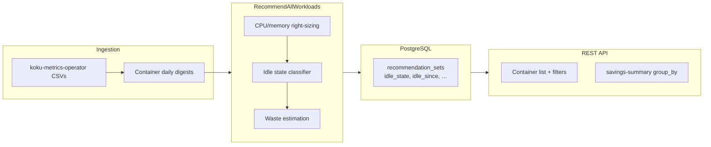

# Idle and Zombie Workload Detection

Implementation-ready design for classifying provisioned-but-unused OpenShift workloads,
estimating recoverable waste, and surfacing actionable termination guidance through
the ROS recommendations API.

---

## Overview / Motivation

Provisioned but unused resources represent **pure waste**: the customer pays 100% of
allocated cost while receiving zero productive value. This is fundamentally different
from [container right-sizing](../architecture/recommendation-engines.md):

| Concern | Rightsizing | Idle / zombie detection |
|---------|-------------|-------------------------|
| Problem | Over-provisioned relative to usage | Allocated with negligible or no usage |
| Savings model | Partial reduction (delta between request and recommendation) | **Full elimination** of resource cost |
| User action | Lower requests/limits | Terminate workload, delete PVC, drain node, etc. |

**Common scenarios:**

- Abandoned dev/test namespaces left running after a project ends
- Post-migration containers still requesting CPU/memory but serving no traffic
- Idle Jupyter or ML notebook pods holding GPU or large memory requests
- GPUs allocated via device plugin with `sm_active` / `dram_active` near zero for days
- Orphaned PVCs with capacity reserved but no mounting pod

ROS already performs **basic** idle detection during container recommendation:

- [`DetectIdle()`](../../internal/engine/detect_idle.go) — true when **every** digest day's
  max CPU and max memory are strictly below fixed millicore/KiB thresholds
- [`DetectAbandoned()`](../../internal/engine/detect_idle.go) — true when **all** days have
  exactly zero CPU and memory usage (maps to notification `NotifIdleWorkload` today)
- [`ApplySavingsEstimates()`](../../internal/engine/savings.go) — idle/abandoned workloads
  receive **100%** of current resource cost as recoverable savings

This design **extends** that foundation with a three-state classification (`zombie`,
`idle`, `active`), request-relative utilization, burst-workload guards, workload-level
grouping for sidecars, multi-resource coverage, persisted API fields, and fleet-level
waste metrics.

### Inline engine helper (Phase 1)

Per-container idle/zombie classification runs **inside** the container recommendation
path via [`ClassifyIdleState()`](../../internal/engine/idle_classification.go) in
[`RecommendWorkloadsStreaming()`](../../internal/engine/recommend_all.go), using digest
rows already in memory (no second DB pass).

- **Containers** — classified once per container when recommendations are produced;
  results persist on `recommendation_sets` (`idle_state`, `idle_since`,
  `estimated_waste_cents`, peaks, etc.).
- **Namespaces** — after the namespace plugin writes `namespace_recommendation_sets`,
  [`AggregateNamespaceIdleState()`](../../internal/engine/idle_classification.go) rolls up
  container and GPU `idle_state`: **zombie** when every workload in the namespace is
  zombie; **idle** when all are non-active but at least one is idle (a mix of idle and
  zombie counts as idle); otherwise **active**. Plugin **priority** guarantees
  `container` (10) and `gpu` (20) run before `namespace` (90).

Legacy [`DetectIdle()`](../../internal/engine/detect_idle.go) / [`DetectAbandoned()`](../../internal/engine/detect_idle.go)
remain for notification codes; `DetectAbandoned` is still invoked for
`NotifIdleWorkload` compatibility.

See [Plugin execution phases](../architecture/plugin-phases.md).



---

## Scope

| Resource | Primary signal | Phase |
|----------|----------------|-------|
| **Containers** | CPU/memory P95 vs request; peak vs P95 burst guard | 1–3 |
| **GPUs** | `sm_active` / `dram_active` basis points (P95) | 4 (implemented) |
| **PVCs** | No pod mount for > 7 days; orphaned PVC | 4 |
| **Nodes** | Node utilization P95 < 10%; drain candidate when pods reschedule | 4 |
| **Namespaces** | **All** containers in namespace classified idle or zombie | 1 (post-process) |

Out of scope for initial delivery:

- Automatic termination or scale-to-zero (recommendation only)
- Dependency / blast-radius graph before terminate (future extension)
- Cross-cluster idle correlation

---

## Classification Model

Three persisted states: `zombie`, `idle`, `active` (default).

Classification uses the **medium-term** digest window (7 days) unless configured otherwise.
Admin/tenant settings can raise `idle_minimum_observation_days` (default **14**) so
classification only runs after sufficient calendar coverage (two full weekends).

### Containers

| State | Condition | Minimum observation |
|-------|-----------|---------------------|
| **zombie** | P95(cpu) < 1 millicore **and** peak(cpu) < 10 millicores | 7 days (14 default gate) |
| **idle** | `cpu_utilization_p95` < 2% of **request** **and** `mem_utilization_p95` < 5% of **request** | 7 days (14 default gate) |
| **active** | Everything else | — |

**Definitions:**

- `cpu_utilization_p95` = P95 daily CPU usage (millicores) ÷ current CPU request (millicores)
- `mem_utilization_p95` = P95 daily memory usage (bytes) ÷ current memory request (bytes)
- P95 and peak are computed from digest rows in the observation window (same data as
  [`MultiWeightedPercentileWithExtras()`](../../internal/engine/decay.go); idle logic
  may use unweighted P95 for classification stability — implementer choice, document in code)

**Mapping from today:**

| Today | Proposed |
|-------|----------|
| `DetectAbandoned` (all zero) | **zombie** (stricter peak guard still applies) |
| `DetectIdle` (max below fixed MC/KiB) | Superseded by **idle** (request-relative) or **zombie** |
| Neither | **active** |

Zombie is a **subset** of historically "idle" workloads with near-dead CPU profile;
idle covers workloads with non-trivial requests but negligible utilization.

### GPUs

Uses existing GPU basis-point metrics from operator reports (see
[GPU classification](../architecture/gpu-classification.md)).

| State | Condition | Minimum observation |
|-------|-----------|---------------------|
| **zombie** | `sm_active_p95` < 100 bp (1%) **and** `dram_active_p95` < 100 bp | 7 days |
| **idle** | `sm_active_p95` < 500 bp (5%) **and** `dram_active_p95` < 500 bp | 7 days |
| **active** | Otherwise | — |

Savings for idle GPUs follow existing API pattern: full `gpu_cost_per_month` per
[Cost Integration — GPU savings](../architecture/cost-integration.md#gpu-savings).

**Implementation (Phase 4):** [`ClassifyGPUIdleFromDigests()`](../../internal/engine/gpu_idle_classification.go)
runs inside [`RecommendGPUWithSettings()`](../../internal/engine/gpu_recommender.go) when
GPU recommendations are computed from `gpu_container_digests`. Results persist on
`recommendation_sets` (`gpu_idle_state`, `gpu_idle_since`, `gpu_idle_duration_days`,
`gpu_estimated_waste_cents`) via [`StoreGPUClassifications()`](../../internal/engine/gpu_query.go)
after container recommendations are written (GPU plugin `HookAfterCSVTypes` + report processor).

### PVCs

| State | Condition | Notes |
|-------|-----------|-------|
| **idle** | Capacity allocated; no pod mounting PVC for > 7 days | Requires pod–PVC binding from snapshot inventory / metrics |
| **orphaned** | PVC exists with no pod reference in cluster inventory | Stronger signal; may map to `idle_state=idle` with `idle_recommendation.action=delete_pvc` |

PVC idle detection shares inventory signals with [PVC right-sizing](../../docs-site/features/pvc-rightsizing.md).

### Nodes

| State | Condition |
|-------|-----------|
| **under-utilized** | `node_utilization_p95` < 10% for > 7 days |
| **candidate for drain** | Under-utilized **and** simulation shows all pods schedulable elsewhere |

Node states align with [node consolidation](../../docs-site/features/node-recommendations.md)
but emphasize **idle waste** (full node monthly cost) vs rightsizing delta.

### Namespaces (aggregate)

| State | Condition |
|-------|-----------|
| **idle** | **Every** non-excluded container in the namespace is `idle` or `zombie` |
| **active** | At least one container is `active` |

Namespace aggregation runs after container classification (Phase 5). Namespace-level
notifications today explicitly exclude `NotifIdleWorkload` (container-only); namespace
idle may use a new code or fleet summary only.

---

## False Positive Prevention

### CronJobs and burst workloads

If `peak(cpu) > burst_ratio × P95(cpu)` (default `burst_ratio = 10`), classify as
**active** (bursty), not idle.

**Rationale:** A CronJob active ~5 minutes per day can show very low P95 while peak
spikes are meaningful — classic false positive for percentile-only rules.

### Sidecars and multi-container pods

Group containers by `(namespace, workload, workload_type)` — the same key used in
[`RecommendWorkloadsStreaming()`](../../internal/engine/recommend_all.go).

| Rule | Behavior |
|------|----------|
| Primary container active | Sidecar (envoy, istio-proxy, vault-agent) → **supporting**; do not surface as idle in UI primary row |
| All containers idle/zombie | Workload flagged; list API may show workload-level summary |

Only flag a workload when **all** user-facing containers in the group pass idle/zombie
checks (exclude init containers from the "all" predicate if they have zero requests).

### Recently deployed workloads

Skip classification when `observation_days < idle_minimum_observation_days` (configurable;
default **14**). Set `idle_state = active` and omit `idle_since`.

`first_seen` = earliest digest `bucket_date` for the container in the org/cluster.

### Seasonality

Default **14-day** minimum observation covers two full weekends and reduces false
positives from weekly batch jobs. Tenants may lower to 7 via Settings API where
workload churn is low (document risk in UI).

### Known exclusions

| Pattern | Handling |
|---------|----------|
| DaemonSets | Never classify (`workload_type` / owner kind check) |
| `kube-system`, `openshift-*` namespaces | Default exclude list; configurable |
| Opt-out annotation | `idle-detection/exclude: "true"` on Pod → **active** |
| Init containers | Excluded from "all containers idle" namespace rule |

---

## Savings Estimation

Idle waste is **full monthly cost** of the allocated resource — not a rightsizing delta.

### Containers

```
wasted_monthly_cost = (
    cpu_request_cores × cpu_rate_per_core_hour
  + memory_request_gib × mem_rate_per_gb_hour
) × 730 hours/month × replica_count
```

Plus infrastructure/distributed overhead using the same apportionment as
[`computeIdleSavings()`](../../internal/engine/savings.go) when `ROS_SAVINGS_ESTIMATES_ENABLED=true`.

Persist **`estimated_waste_cents`** on `recommendation_sets` (distinct from
`estimated_monthly_savings` on rightsizing rows — see API section). For idle/zombie
containers, rightsizing savings may be `$0` while waste field shows full elimination value.

### GPUs

```
wasted_monthly_cost = gpu_cost_per_month × idle_gpu_count
```

### PVCs / nodes

Use storage rate × allocated GiB (PVC) or `node_cost_per_month` (node) for full cost
when classified idle/orphaned/under-utilized.

---

## Data Model Changes

New columns on **`recommendation_sets`** (container plugin), one row per
`(org_id, cluster_uuid, namespace, workload, container_name, term, engine)` — store
idle fields on the **medium_term / cost** row or replicate on all rows (implementer:
prefer single canonical row per container key to avoid drift; API merges from medium/cost).

```sql
ALTER TABLE recommendation_sets
    ADD COLUMN IF NOT EXISTS idle_state TEXT NOT NULL DEFAULT 'active',
    ADD COLUMN IF NOT EXISTS idle_since TIMESTAMPTZ,
    ADD COLUMN IF NOT EXISTS idle_duration_days INTEGER,
    ADD COLUMN IF NOT EXISTS estimated_waste_cents BIGINT NOT NULL DEFAULT 0,
    ADD COLUMN IF NOT EXISTS peak_cpu_millicores INTEGER,
    ADD COLUMN IF NOT EXISTS peak_memory_bytes BIGINT;

CREATE INDEX IF NOT EXISTS idx_rs_idle_state
    ON recommendation_sets (org_id, idle_state)
    WHERE idle_state != 'active';
```

| Column | Type | Description |
|--------|------|-------------|
| `idle_state` | `TEXT` | `zombie`, `idle`, or `active` |
| `idle_since` | `TIMESTAMPTZ` | First day state became idle/zombie (UTC) |
| `idle_duration_days` | `INTEGER` | Days since `idle_since` at classification time (see note below) |

**Note:** `idle_duration_days` is computed at classification time (once per daily
recommendation run). It reflects days since `idle_since` as of the last engine execution,
not real-time. Consumers should treat it as "as of last recommendation run" — accurate ±1 day.
| `estimated_waste_cents` | `BIGINT` | Full monthly waste (integer cents) |
| `peak_cpu_millicores` | `INTEGER` | Max CPU in observation window |
| `peak_memory_bytes` | `BIGINT` | Max memory in observation window |

**Migration notes:**

- Follow existing migration numbering in `migrations/`
- Backfill: `idle_state = 'active'`, `estimated_waste_cents = 0`
- GPU idle columns on `recommendation_sets` (`gpu_idle_*`) — migration `000084` (Phase 4)
- PVC/node tables: parallel columns in a future phase

**State transitions:** On each `RecommendAllWorkloads` pass, recompute from digests;
update `idle_since` only when transitioning from `active` → `idle`/`zombie`, preserve
when staying in same non-active state, clear when returning to `active`.

### Savings vs Waste (Double-Counting Prevention)

| Field | Meaning | When to show |
|-------|---------|--------------|
| `estimated_monthly_savings` | Rightsizing delta — cost if you **resize** requests to the recommended values | `idle_state = active` only |
| `estimated_monthly_waste` | Full idle cost — cost if you **terminate** or remove the workload | `idle_state` ∈ {`idle`, `zombie`} |

When `idle_state != active`, the API **suppresses** `estimated_monthly_savings` because
rightsizing savings are misleading for workloads that should be removed. The UI must
present waste and savings as **separate categories** and never sum them.

`idle_recommendation.action = "terminate"` signals that `estimated_monthly_waste` is the
actionable dollar figure.

---

## API Changes

Base path: `/api/cost-management/v1/recommendations/openshift`

### Container list — filter

```
GET /api/cost-management/v1/recommendations/openshift
  ?filter[idle_state]=zombie,idle
```

Follows existing filter infrastructure in
[`internal/model`](../../internal/model) and
[API Query Parameters](../operations/api-query-parameters.md).
Multiple values = OR within the parameter.

### Container list — response fields

Added alongside existing recommendation payload (medium-term cost engine row):

```json
{
  "idle_state": "zombie",
  "idle_since": "2026-04-15",
  "idle_duration_days": 42,
  "peak_cpu_millicores": 2,
  "peak_memory_bytes": 52428800,
  "estimated_monthly_waste": {
    "value": "89.500000",
    "units": "USD"
  },
  "idle_recommendation": {
    "action": "terminate",
    "confidence": "high",
    "reason": "No meaningful CPU or memory activity for 42 days"
  }
}
```

| Field | Notes |
|-------|-------|
| `idle_state` | `zombie`, `idle`, `active` |
| `idle_since` | ISO date (`YYYY-MM-DD`) |
| `idle_duration_days` | Staleness: see Data Model note above |
| `estimated_monthly_waste` | Same shape as `estimated_monthly_savings` (6-decimal string + units) |
| `estimated_monthly_savings` | Omitted when `idle_state != active` (rightsizing delta not actionable) |
| `idle_recommendation.action` | `terminate` (zombie/idle container), `delete_pvc`, `drain_node` (other resources, later phases) |
| `idle_recommendation.confidence` | `high` if observation ≥ 14d and not bursty; `medium` if 7–13d |

Omit `idle_recommendation` when `idle_state=active`. Omit waste object when
`ROS_SAVINGS_ESTIMATES_ENABLED=false` or no cost data.

### Savings summary — grouping

```
GET /api/cost-management/v1/recommendations/openshift/savings-summary
  ?group_by[idle_state]=*
```

Response adds breakdown rows:

```json
{
  "meta": { "count": 3 },
  "data": [
    {
      "idle_state": "zombie",
      "estimated_monthly_waste": { "value": "4200.000000", "units": "USD" },
      "container_count": 12
    },
    {
      "idle_state": "idle",
      "estimated_monthly_waste": { "value": "8250.000000", "units": "USD" },
      "container_count": 35
    }
  ]
}
```

Fleet meta (existing savings-summary `meta` or `total` section):

```json
{
  "total_idle_waste": { "value": "12450.000000", "units": "USD" },
  "idle_container_count": 47,
  "zombie_container_count": 12
}
```

Rightsizing savings and idle waste should be **reported separately** so dashboards do
not double-count (idle = eliminate; rightsizing = reduce).

---

## Engine Implementation

### When

During [`RecommendAllWorkloads()`](../../internal/engine/recommend_all.go) /
[`RecommendWorkloadsStreaming()`](../../internal/engine/recommend_all.go), **after**
CPU/memory recommendation values are computed for each container key and **before**
[`WriteRecommendations()`](../../internal/engine/recommend_all.go).

Optionally extract `classifyIdleState(containerKey, digestRows, settings) IdleResult`
in new file `internal/engine/idle_detection.go`.

### Algorithm (pseudocode)

```
for each container with digest rows in window:
    if excluded(namespace, workload_type, annotations):
        idle_state = "active"
        continue

    if observation_days < settings.minimum_observation_days:
        idle_state = "active"  // insufficient data
        continue

    cpu_p95 = percentile95(digest.cpu_usage)
    mem_p95 = percentile95(digest.mem_usage)
    cpu_peak = max(digest.cpu_usage)
    mem_peak = max(digest.mem_usage)
    cpu_request = current_cpu_request_millicores
    mem_request = current_mem_request_bytes

    if cpu_peak > settings.burst_ratio * max(cpu_p95, 1):
        idle_state = "active"  // bursty workload
        continue

    if cpu_p95 < settings.zombie_cpu_p95_mc
       AND cpu_peak < settings.zombie_cpu_peak_mc:
        idle_state = "zombie"
        idle_since = first_day_where(predicate)

    else if cpu_request > 0 AND mem_request > 0
            AND (cpu_p95 / cpu_request) < settings.idle_cpu_util_pct
            AND (mem_p95 / mem_request) < settings.idle_mem_util_pct:
        idle_state = "idle"
        idle_since = first_day_where(utilization below thresholds)

    else:
        idle_state = "active"

    if idle_state != "active":
        estimated_waste_cents = compute_full_idle_cost(...)
        peak_cpu_millicores = cpu_peak
        peak_memory_bytes = mem_peak
        idle_duration_days = days_since(idle_since)

    // Workload-level pass: if any sibling container active, downgrade supporting sidecars

ApplySavingsEstimates() // extend: map zombie/idle to waste + keep NotifIdleWorkload
```

### Performance

**Negligible incremental cost** — digest rows are already loaded for percentile
computation. Classification is O(days per container) with simple comparisons.
No extra database round trips.

### Notifications

Container idle/abandoned codes **5** and **8** are documented in
[notification-codes.md](../architecture/notification-codes.md).

Extend [`EvaluateContainerNotifications()`](../../internal/engine/notifications.go):

| Code | When |
|------|------|
| `NotifIdleWorkload` (existing) | `idle_state` ∈ {`idle`, `zombie`} — emitted for backward compatibility |
| `IDLE_CONTAINERS_DETECTED` (fleet, **planned**) | Org-level notification on transition `active` → `idle`/`zombie` since last watermark |

`NotifIdleWorkload` is implemented in [`EvaluateNotifications()`](../../internal/engine/notifications.go).

**Planned (Phase 3):** `IDLE_CONTAINERS_DETECTED` — fleet-level digest when any container
in the org newly transitions to `idle` or `zombie` compared to the previous recommendation
watermark. Not implemented yet; per-container `NotifIdleWorkload` covers existing consumers.

---

## Configuration (3-Tier Model)

Follows the existing configurability pattern: admin env vars > tenant Settings API >
compiled defaults. Same precedence model as
[Configurable Thresholds](../../docs-site/features/configurable-thresholds.md).

When `ROS_IDLE_DETECTION_ENABLED=false`, omit new API fields; keep `idle_state='active'`
in DB.

### 9.1 Admin Environment Variables (Cluster-Wide)

| Env Var | Default | Type | Description |
|---------|---------|------|-------------|
| `ROS_IDLE_DETECTION_ENABLED` | `true` | bool | Feature gate |
| `ROS_IDLE_ZOMBIE_CPU_MILLICORES` | `1` | int | P95 CPU below this = zombie candidate |
| `ROS_IDLE_ZOMBIE_PEAK_MILLICORES` | `10` | int | Peak CPU below this confirms zombie |
| `ROS_IDLE_CPU_UTILIZATION_PCT` | `2` | int | P95/request % threshold for idle |
| `ROS_IDLE_MEMORY_UTILIZATION_PCT` | `5` | int | P95/request % threshold for idle |
| `ROS_IDLE_BURST_RATIO` | `10` | int | peak/P95 ratio that classifies workload as bursty (not idle) |
| `ROS_IDLE_MIN_OBSERVATION_DAYS` | `14` | int | Days of data required before classifying |
| `ROS_IDLE_GPU_SM_ACTIVE_BP` | `500` | int | GPU sm_active below this = idle (basis points, 500 = 5%) |
| `ROS_IDLE_GPU_DRAM_ACTIVE_BP` | `500` | int | GPU dram_active below this = idle |
| `ROS_IDLE_EXCLUDE_NAMESPACES` | `kube-system,openshift-*` | csv | Namespaces never flagged (glob patterns) |
| `ROS_IDLE_EXCLUDE_WORKLOAD_TYPES` | `DaemonSet` | csv | Workload types never flagged |
| `ROS_IDLE_NOTIFICATIONS_ENABLED` | `true` | bool | Send notifications on state transitions |

Admin-locked fields cannot be overridden by tenants (same pattern as existing threshold
settings).

### 9.2 Tenant Settings API

**Endpoint:** `GET/PUT /api/cost-management/v1/recommendations/openshift/settings/idle-detection`

**Request/Response shape:**

```json
{
  "idle_detection": {
    "enabled": true,
    "thresholds": {
      "cpu_utilization_percent": 2,
      "memory_utilization_percent": 5,
      "burst_ratio": 10,
      "minimum_observation_days": 14,
      "gpu_sm_active_basis_points": 500,
      "gpu_dram_active_basis_points": 500
    },
    "exclusions": {
      "namespaces": ["kube-system", "openshift-*", "monitoring"],
      "workload_types": ["DaemonSet"],
      "workload_names": ["istio-proxy-*", "envoy-*"],
      "annotations": ["idle-detection/exclude"]
    },
    "notifications": {
      "enabled": true,
      "notify_on_transition_to": ["zombie", "idle"],
      "cooldown_days": 7
    }
  },
  "locked_fields": ["cpu_utilization_percent"]
}
```

Integrate with [`SizingThresholdSettings`](../../internal/engine/threshold_settings.go)
or add `IdleDetectionSettings` resolved at classification time (alongside
[`ResolveSizingThresholds()`](../../internal/engine/threshold_settings.go)).

**Note:** Existing `idle_cpu_threshold_mc` / `idle_mem_threshold_kib` in sizing settings
power legacy `DetectIdle`; migration path:

1. Phase 1: new classifier coexists; legacy `IsIdle` derived from `idle_state != active`
2. Phase 2: deprecate absolute thresholds in docs; map defaults to zombie/idle rules

### 9.3 Tenant Permissions

| Parameter | Tenant-configurable? | Rationale |
|-----------|---------------------|-----------|
| `enabled` | Yes | Org may not want idle detection |
| `thresholds.cpu_utilization_percent` | Yes (unless locked) | Different orgs have different tolerance |
| `thresholds.memory_utilization_percent` | Yes (unless locked) | Same |
| `thresholds.burst_ratio` | Yes (unless locked) | ML orgs may want higher (20×) to avoid false positives |
| `thresholds.minimum_observation_days` | Yes (min 3, max 90) | Fast-moving teams want 7d, cautious want 30d |
| `thresholds.gpu_*` | Yes (unless locked) | GPU usage patterns vary by workload type |
| `exclusions.namespaces` | Yes (additive only) | Tenants add exclusions on top of admin's list |
| `exclusions.workload_types` | Yes (additive only) | Same |
| `exclusions.workload_names` | Yes | Tenant-specific workload patterns |
| `exclusions.annotations` | Yes | Custom opt-out annotations |
| `notifications.enabled` | Yes | Tenant can silence |
| `notifications.cooldown_days` | Yes (min 1, max 90) | How often to re-notify |
| Zombie thresholds (1m/10m CPU) | **No** — admin only | Defines "dead"; should not vary per tenant |
| Admin `exclude_namespaces` | **No** — admin only | Security/compliance: infra namespaces always excluded |

### 9.4 Validation Rules

```
cpu_utilization_percent:      1–50  (integer)
memory_utilization_percent:   1–50  (integer)
burst_ratio:                  2–100 (integer)
minimum_observation_days:     3–90  (integer)
gpu_sm_active_basis_points:   100–5000
gpu_dram_active_basis_points: 100–5000
cooldown_days:                1–90
exclusions.namespaces:        max 50 entries, validated pattern (alphanumeric, dash, dot, * glob)
exclusions.workload_types:    must be one of: Deployment, StatefulSet, DaemonSet, Job, CronJob, DeploymentConfig
exclusions.workload_names:    max 50 entries, glob patterns allowed
exclusions.annotations:       max 20 entries
```

Unknown fields in PUT request → 400 with descriptive error (same pattern as threshold
settings).

### 9.5 Precedence and Merge Logic

1. Start with compiled defaults
2. Overlay admin env vars (if set and non-zero)
3. Overlay tenant Settings API values (if set and not locked)
4. `exclusions` are **additive**: tenant exclusions are UNION'd with admin exclusions
   (tenant cannot remove admin exclusions)

### 9.6 Recalculation Trigger

When a tenant updates idle settings via PUT:

1. Validate input
2. Persist to `idle_detection_settings` (JSONB column or table)
3. Mark org as `reship_pending = true`
4. Background worker re-runs idle classification with new thresholds
5. API serves updated `idle_state` on next request

Same async recalculation pattern as existing threshold settings changes.

### 9.7 RBAC

- **Read** idle settings: `cost_management:*:read` (any authenticated user in the org)
- **Write** idle settings: `cost_management_settings:*:write` (same permission as threshold
  settings)

---

## Notifications (Phase 3)

| Property | Value |
|----------|-------|
| Code | `IDLE_CONTAINERS_DETECTED` |
| Trigger | Org-level: ≥1 container newly `active` → `idle` or `zombie` since last notification watermark |
| Payload | `idle_count`, `zombie_count`, `total_monthly_waste`, top 5 workloads by waste |
| Debounce | Per org, at most once per 24h unless waste increases > 20% |

Do not emit on steady-state rescans. Store last-notified snapshot in
`org_recommendation_metadata` or notification service state table.

---

## UI Considerations (future)

Not implemented in ros-ocp-backend; contract for koku-ui / HCCM:

| Element | Behavior |
|---------|----------|
| Optimizations table | "Idle" tab or `filter[idle_state]` chips |
| Dashboard card | Total idle waste + counts |
| Severity | Zombie = critical; idle = warning |
| Action | "View termination impact" → future dependency map |

See [UI Integration Guide](../../docs-site/ui-integration-guide.md).

---

## Rollout Strategy

| Phase | Deliverables | User-visible |
|-------|--------------|--------------|
| **1** | DB columns + engine classification + API `idle_state` fields | Filter/list only; no notifications |
| **2** | `estimated_waste_cents`, savings-summary `group_by[idle_state]`, fleet meta | Waste dollars on dashboard |
| **3** | Settings API thresholds + `IDLE_CONTAINERS_DETECTED` | Tunable + alerts |
| **4** | GPU, PVC, node idle rules | Multi-resource |
| **5** | Namespace aggregation | Namespace idle badge |

Enable in dev with `ROS_IDLE_DETECTION_ENABLED=true`; default **off** in production
until Phase 2 validation completes.

---

## Risks and Mitigations

| Risk | Mitigation |
|------|------------|
| False positive → user terminates needed workload | 14-day default observation; burst ratio; high confidence only for zombie |
| CronJobs flagged idle | `peak > 10 × P95` → active |
| Sidecars flagged | Workload-level grouping; supporting container suppression |
| Noisy notifications | Transition-only fleet notification; 24h debounce |
| Threshold varies by org | Settings API + admin env locks |
| Legacy `IsIdle` behavior change | Map `idle_state != active` to `IsIdle` for savings/notifications |
| Double-count savings | Separate `estimated_monthly_waste` from rightsizing `estimated_monthly_savings` |

---

## Implementation Effort

| Component | Effort | Dependencies |
|-----------|--------|--------------|
| Engine classification (`idle_detection.go`) | Small | Digest rows, existing keys |
| DB migration | Small | New columns + partial index |
| API filter + response | Small | Container list handler, money helpers |
| Waste calculation | Small | Extend `computeIdleSavings` / new waste field |
| Configuration | Small | Threshold settings pattern |
| GPU idle | Small | GPU basis points in digests |
| Node/namespace aggregation | Medium | Cross-container + scheduling sim |
| Notifications | Medium | Notification framework |
| IQE / E2E tests | Medium | Nise workloads with idle profiles |

**Estimate:** 2–3 engineering days for Phases 1–2; ~1 week for full Phases 1–5.

### Suggested implementation order

1. Migration + [`ClassifyIdleState()`](../../internal/engine/idle_classification.go) + unit tests
2. Wire into `RecommendWorkloadsStreaming` + namespace `AggregateNamespaceIdleState`
3. API enrichment + `filter[idle_state]`
4. Savings summary grouping + fleet meta
5. Settings API + notifications + extended resources

---

## Comparison with Competitors

| Tool | Idle detection | Notes |
|------|----------------|-------|
| Kubecost | Basic | Simple utilization threshold; limited burst handling |
| CAST AI | Yes | Rebalancing / eviction focus |
| Spot.io | Limited | Spot / interruption focus |
| **ROS (this)** | Advanced | Burst guard, workload grouping, multi-resource, configurable thresholds, separate waste metric |

---

## Future Extensions

| Extension | Description |
|-----------|-------------|
| **Scheduled idle** | Recurring idle (nights/weekends) → recommend KEDA/HPA schedules |
| **Dependency mapping** | Graph of Services/Ingresses before terminate |
| **Auto-hibernate** | Scale to zero integrations |
| **Cost attribution** | Idle waste by tag/team via [tag filtering](tag-filtering.md) |
| **VM idle** | Extend `NotifVMIdle` pattern to OpenShift Virtualization guests |

## Deferred / future work

- **Pod annotation opt-out** — Allow workload owners to annotate Pods with `ros.openshift.io/idle-detection-exclude: "true"` to prevent idle/zombie classification. Requires operator changes to export annotations in ROS CSV, plus ingestion and engine changes. Current workaround: use namespace globs or workload-type exclusions in the Settings API, which cover most cases (e.g., exclude CronJob, exclude kube-system).

- **Sidecar / workload grouping** — Currently each container is classified independently. In sidecar-heavy clusters (istio-proxy, fluentd, etc.), infrastructure sidecars may appear as zombie when their parent workload is active. A future post-classification pass would group containers by workload (Deployment/StatefulSet) and downgrade sidecars to `active` when any primary container in the same workload is active. Workaround: use namespace or workload-type exclusions in Settings API.

- **Org-level idle notification (item 15):** Fire org-level notification when idle container count exceeds configurable threshold. Deferred — requires notification delivery infrastructure (email/webhook) not yet built.

- **Operator network I/O for zombie refinement (item 16):** Adding container network RX/TX as a zombie guard signal (workload with CPU idle but receiving traffic should not be zombie). Operator already collects VM network metrics; extending to containers would improve zombie accuracy.

---

## Test and deployment coverage

| Layer | Location | What it verifies |
|-------|----------|------------------|
| Contract tests | [`internal/api/contract_test.go`](../../internal/api/contract_test.go) (`TestContractIdleDetection_*`) | JSON list filters, idle field presence/omission, savings `group_by[idle_state]`, CSV headers |
| IQE tests | `iqe-cost-management-plugin/iqe_cost_management/tests/rest_api/v1/test_ros_idle_detection.py` | Live API filters, settings GET/PUT validation, CSV export columns |
| Helm chart | `cost-onprem-chart` — `cost-onprem/values.yaml` (`ros.api.idleDetection`) and `cost-onprem/templates/ros/_feature-env.yaml` | Injects all `ROS_IDLE_*` environment variables into ros-api and ros-processor |
| OpenAPI | [`openapi.json`](../../openapi.json) (authoritative) and partial fragment [`docs/openapi/idle-detection.yaml`](../../docs/openapi/idle-detection.yaml) | `filter[idle_state]`, response fields, settings endpoints, grouped savings schema |

---

## Related Documentation

- [Savings estimations](../../docs-site/features/savings-estimations.md)
- [Configurable thresholds](../../docs-site/features/configurable-thresholds.md)
- [Cost integration](../architecture/cost-integration.md)
- [Container recommendations](../../docs-site/features/container-recommendations.md)
- [Public feature page](../../docs-site/features/idle-detection.md)
- Inline classifier: [`idle_classification.go`](../../internal/engine/idle_classification.go)
- Legacy notification helpers: [`detect_idle.go`](../../internal/engine/detect_idle.go),
  [`notifications.go`](../../internal/engine/notifications.go)
