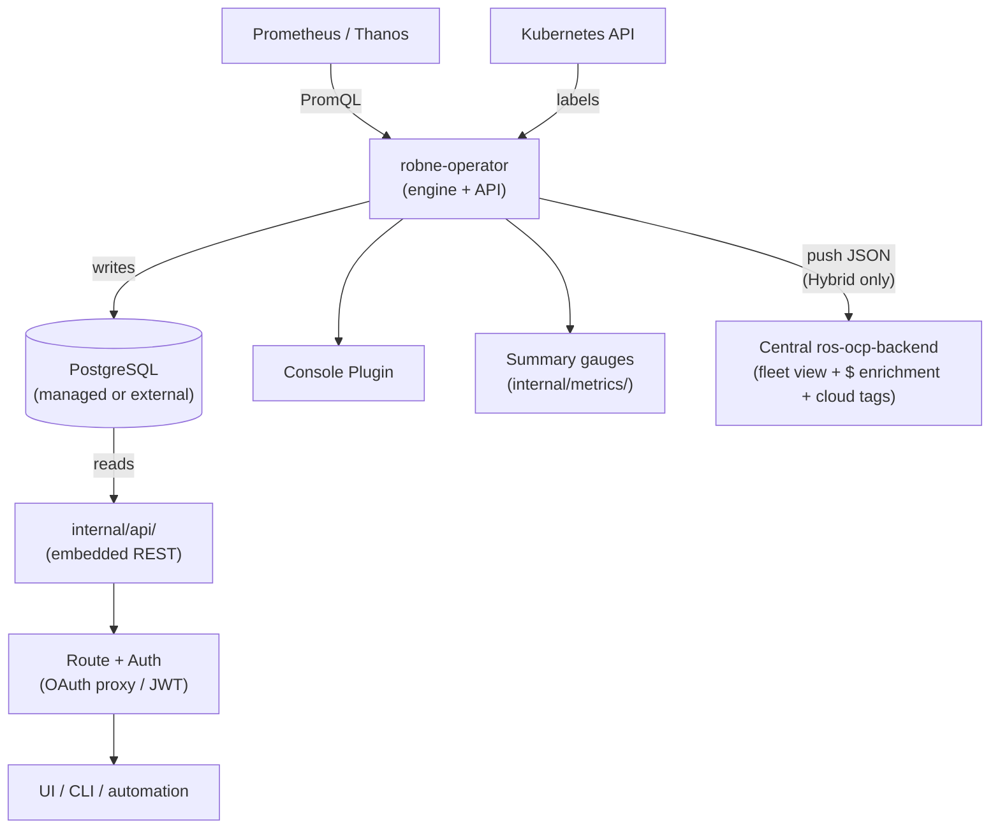
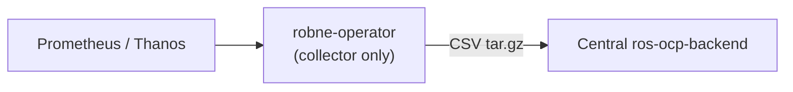
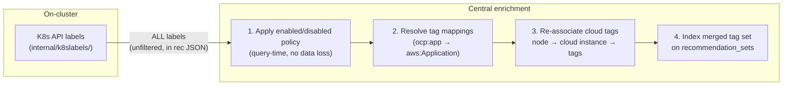

# Resource Optimization On-Cluster Modes (robne-operator)

Internal reference for the planned on-cluster recommendation computation delivered
by the **Red Hat Lightspeed Resource Optimization Operator** (`robne-operator`).

**Status:** Future work (not yet implemented).

**Repository:** Separate from koku-metrics-operator (modeled after it).

**CRD:** `ResourceOptimizationConfig` (`resource-optimization.openshift.io/v1beta1`)

## Overview

`robne-operator` is a standalone operator — not an extension of
koku-metrics-operator — that delivers Resource Optimization through three
operating modes:

| Mode | Engine | Local API | Push to Central | Use case |
|------|--------|-----------|-----------------|----------|
| **Local** | On-cluster | Yes | No | Disconnected, single-cluster, latency-sensitive |
| **Remote** | Central (ros-ocp-backend) | No | CSV metrics | Drop-in koku-metrics-operator ROS replacement |
| **Hybrid** | On-cluster | Yes | Recs + digests (JSON) | Fleet view + local freshness |

In Local and Hybrid modes, the operator queries Prometheus/Thanos directly via
PromQL, computes recommendations using the shared `ros-ocp-engine` Go module, and
writes results to PostgreSQL (managed or external). An embedded REST API and
OpenShift Console plugin serve recommendations locally. Hybrid mode additionally
pushes pre-computed recommendations and daily digests to central Cost Management.

In Remote mode, the operator is a lightweight collector/uploader only — no engine,
database, API, console plugin, or summary metrics.

Clusters needing both Cost Management and Resource Optimization install both
operators during the migration overlap period.

## Architecture

### Local / Hybrid



### Remote



## Mode-dependent component deployment

| Component | Local | Hybrid | Remote |
|-----------|-------|--------|--------|
| Prometheus collection | Active | Active | Active |
| Recommendation engine | Active | Active | Inactive |
| Managed PostgreSQL | Active | Active | Inactive |
| REST API pod | Configurable (default on) | Configurable (default on) | Unavailable (CRD validation rejects) |
| Console Plugin | Configurable (default on) | Configurable (default on) | Unavailable (CRD validation rejects) |
| Summary Prometheus metrics | Configurable (default on) | Configurable (default on) | Unavailable |
| CSV packaging + upload | Inactive | Active (JSON format) | Active (CSV format) |

CRD validation rejects `spec.api.enabled: true` and `spec.console_plugin.enabled: true`
when `spec.mode: remote`.

## Mode switching

| Transition | Behavior |
|------------|----------|
| Local → Hybrid | Engine continues; `internal/pushresults/` starts uploading |
| Hybrid → Local | Push stops; engine continues |
| Local/Hybrid → Remote | Engine stops; API/plugin reconcilers tear down deployments; PostgreSQL StatefulSet scaled to 0 (PVC retained by default) |
| Remote → Local/Hybrid | PostgreSQL provisioned or resumed; engine starts; first recommendations after one `recommendation_cycle` |

## Managed PostgreSQL lifecycle

| Event | Behavior |
|-------|----------|
| Default install | Operator deploys StatefulSet + PVC + Service (`database.type: managed`) |
| External DB | `database.type: external` + user-provided Secret |
| Mode → Remote | StatefulSet scaled to 0; PVC retained (`retain_data: true` default) |
| Explicit cleanup | `database.managed_config.retain_data: false` → delete StatefulSet + PVC |
| CR deletion | All managed resources GC'd via `ownerReference` |

## Engine code sharing

The recommendation engine is extracted into a shared Go module `ros-ocp-engine`
imported by:

- **robne-operator** — on-cluster computation (`internal/engine/` wraps the module)
- **ros-ocp-backend** — central computation (existing `internal/engine/` migrates to import)

Same algorithms, single source of truth. Remote-mode central processing continues
to use digest tables via `RemoteProvider`; Local/Hybrid uses `PrometheusProvider`.

## Key design decisions

| Decision | Rationale |
|----------|-----------|
| Separate operator (`robne-operator`) | Clean lifecycle; no mode conflicts with koku-metrics-operator cost collection |
| Three modes in one CRD | Single install path; customers migrate Remote → Hybrid → Local incrementally |
| Eliminate digest/sample tables (Local/Hybrid) | Prometheus IS the TSDB; no need to replicate metrics in PostgreSQL |
| PromQL aggregation server-side | `quantile_over_time()`, `avg_over_time()` computed by Prometheus; Go only does decay weighting |
| OCP labels from K8s API directly | Real-time labels, no Koku tag-sync delay; cloud tags re-associated at central |
| Managed PostgreSQL default | Recommendations-only schema (~70 MB / 1000 containers); external option for RDS/Azure DB |
| Embedded API (not separate ros-ocp-api pod) | Same binary serves REST + reconciliation; reduces deployment complexity |
| Push via existing tar.gz upload (Hybrid) | No new transport; JSON recommendations + digests as new file types |
| Remote mode = koku-metrics-operator parity | Drop-in replacement during migration; CSV format unchanged |
| Dollar savings optional on-cluster | Central enrichment after push; or `effective_rates` fetch via `spec.central.effective_rates` |
| Summary metrics only (not per-container) | Alerting gauges; per-container detail via REST API |

## Tag and label reconciliation

Tags/labels are a critical cross-cutting concern because the current system
unifies OCP labels, cloud tags, tag mappings, and enable/disable policies
into a single filterable namespace. Local/Hybrid modes preserve full tag
functionality.

### Data flow



### Design decisions

| Decision | Rationale |
|----------|-----------|
| Push ALL raw labels (not just enabled) | Central policy may change; avoids re-push |
| Apply enable/disable at query time | Same mechanism as today; no enrichment-time filtering |
| Cloud tag re-association during enrichment | Reuses existing OCP-on-cloud correlation tables |
| Cloud billing must be active for cloud tags | Already required for `effective_rates` / dollar savings |

### Edge cases

- **New node (< 24h)**: Cloud tag association may lag until next CUR/export arrives.
  Same behavior as current architecture.
- **Disconnected cluster (Local mode)**: No cloud tags (bare-metal). OCP labels fully functional.
- **Tag mapping changes**: Next enrichment cycle picks up new mappings. Previously
  indexed recommendations retain old mapping until re-enriched (acceptable staleness).

### Central-side implementation

The enrichment step (already needed for savings) extends to:

1. Read `pod_labels` from pushed recommendation JSON
2. Look up `reporting_ocp{aws,azure,gcp}_cost_line_item_project_daily_summary_p`
   for cluster + node → resource_id correlation
3. Fetch cloud tags from resource_id's line items
4. Merge OCP labels + cloud tags + resolved mappings → write to `recommendation_sets.tags`
5. Apply enabled-tag filter at API query time (existing `filter[tag:key]=value` logic)

## Business hours without reship

In the current Remote architecture, changing a BH schedule triggers a reship: masu
re-publishes historical CSVs from S3 → Kafka → ros-ocp-backend re-ingests with
new weighting. This works because raw CSVs persist in S3 for ~90 days.

Local/Hybrid modes eliminate the entire reship mechanism. The replacement depends on
the metrics backend:

### With Thanos (RHACM): immediate full re-computation

Thanos has unlimited retention. On BH change, the next recommendation cycle
re-queries the full window with BH-weighted PromQL. Strictly superior to reship
(faster, higher fidelity, no S3/Kafka/masu dependency).

### With Prometheus only: forward-only convergence

Prometheus typically retains ~15 days. On BH change:

- Days within retention: re-queried with new BH weighting immediately
- Days beyond retention: data is gone; old recommendations age out naturally

Convergence timeline:

- Day 0: long-term (15d) rec = 0 days new + 15 days old schedule
- Day 7: long-term rec = 7 days new + 8 days old
- Day 15: fully converged

This matches the existing `MarkReshipForwardOnly` fallback behavior (triggered
when reship retries are exhausted). In Local/Hybrid it becomes the default for
Prometheus-only deployments.

### Design decision

**Forward-only is acceptable** because:

1. BH schedules change very rarely (once per quarter assumption from design doc)
2. 15-day convergence is invisible to most users
3. Avoids reintroducing digest-style storage tables
4. Customers who need instant retroactive BH should use Thanos

### Future enhancement (if customer demand warrants)

A lightweight daily aggregate table could store hourly-bucketed percentiles
(p50, p95, p99, max per container per hour-of-day per day). On BH change,
re-weight these stored aggregates without raw Prometheus data. Estimated storage:
~5–10 MB per 1000 containers per 90-day window.

## What changes in the engine

### Shared module: `ros-ocp-engine`

Extracted from ros-ocp-backend `internal/engine/`:

- `recommend_cpu.go`, `recommend_memory.go`
- `decay.go` (input: daily values from Prometheus step query or digest tables)
- `idle.go`, `gpu_recommender.go`, `recommend_nodes.go`
- `quality.go`, `retention.go`, `savings.go`

Both robne-operator and ros-ocp-backend import this module.

### Eliminated in Local/Hybrid (not needed on-cluster)

- `internal/ingestion/` — CSV parsing, digest computation, pipeline, partition management
- `internal/services/report_processor.go` — Kafka consumer (central only)
- `internal/reship/` — S3 CSV re-fetch for business hours (replaced by direct Prometheus re-query)
- All `daily_*_digests` tables and migrations (central Remote path retains these)
- `container_usage_samples`, `namespace_usage_samples` tables

### Preserved

- `internal/api/` — serves from PostgreSQL (embedded in robne-operator; standalone in ros-ocp-backend)
- `internal/model/` — recommendation schema (shared)

### New components (robne-operator)

| Package | Purpose |
|---------|---------|
| `internal/promquery/` | PromQL client implementing `MetricsProvider` interface |
| `internal/k8slabels/` | Kubernetes label reader (replaces tag sync) |
| `internal/pushresults/` | JSON serialization + upload of recommendations and digests (Hybrid) |
| `internal/metrics/` | Summary Prometheus gauges (`robne_*` metrics) |
| `internal/database/` | Managed PostgreSQL reconciliation (StatefulSet, PVC, Service) |
| `internal/consoleplugin/` | OpenShift Console plugin deployment |
| `internal/collector/` | CSV collection for Remote mode (koku-metrics-operator parity) |

## MetricsProvider interface

```go
type MetricsProvider interface {
    DailyAggregates(ctx context.Context, namespace, workload, container string,
        metric Metric, window time.Duration) ([]DailyValue, error)

    Percentiles(ctx context.Context, namespace, workload, container string,
        metric Metric, window time.Duration, quantiles []float64) (map[float64]float64, error)

    Max(ctx context.Context, namespace, workload, container string,
        metric Metric, window time.Duration) (float64, error)
}
```

Two implementations:

- `RemoteProvider` — reads from `daily_container_digests` (central ros-ocp-backend, Remote mode)
- `PrometheusProvider` — queries Prometheus/Thanos directly (robne-operator Local/Hybrid)

## Prometheus query patterns

```promql
# Percentiles (vectorized — returns all containers at once)
quantile_over_time(0.95, rate(container_cpu_usage_seconds_total{...}[5m])[7d:15m])

# Daily aggregates for decay (one value per day, stepped)
avg_over_time(rate(container_cpu_usage_seconds_total{...}[5m])[1d])

# Max memory
max_over_time(container_memory_working_set_bytes{...}[7d])
```

~30-40 vectorized PromQL queries per recommendation cycle (each returns all matching
containers). At 15-minute cadence (default `recommendation_cycle: 900`): negligible
Prometheus load.

## Hybrid push payload

Hybrid mode pushes **both** pre-computed recommendations and raw daily digests
(compressed JSON tar.gz). This enables central to:

1. Store recommendations for fleet views
2. Re-compute with different parameters (fleet-wide BH, tag policies)
3. Enrich with dollar savings using cost model rates
4. Associate cloud tags via OCP-on-cloud correlation

### Recommendation file

File type: `ros-openshift-recommendations-YYYYMM.json`

```json
{
  "cluster_id": "...",
  "generated_at": "2026-06-03T14:00:00Z",
  "schema_version": "1.0",
  "recommendations": [
    {
      "namespace": "...",
      "workload": "...",
      "container": "...",
      "node": "worker-3",
      "labels": {"app": "frontend", "team": "platform", "version": "v2.1"},
      "terms": { "short_term": {...}, "medium_term": {...}, "long_term": {...} },
      "confidence": 0.85,
      "idle_state": "active",
      "notifications": [...],
      "current_cpu_request_mc": 1000,
      "current_memory_request_kib": 1048576
    }
  ]
}
```

### Digest file (Hybrid only)

File type: `ros-openshift-digests-YYYYMM.json` — daily percentile aggregates per
container, enabling central re-computation without raw Prometheus access.

Central handler: UPSERT into `recommendation_sets` + savings enrichment via cost
model lookup + tag reconciliation (cloud tags from OCP-on-cloud correlation using
`node` field, mapping resolution, enable/disable policy).

## Local API (embedded in robne-operator)

Recommendations are served locally via the REST API embedded in the operator binary
— same handlers as ros-ocp-backend (`internal/api/`), with ingestion code excluded.

### What it is

- Same Go module (`ros-ocp-engine` + `internal/api/`), same REST contract
- Same endpoints, pagination, `filter[tag:*]`, response shapes
- Read-only: no write paths, no ingestion, no Kafka dependency
- Deployed as part of the operator Deployment (not a separate ros-ocp-api pod)

### Authentication

| Mechanism | Use case | Implementation |
|-----------|----------|----------------|
| OpenShift OAuth proxy | Standalone operator (default) | Sidecar container; `oc login` credentials |
| Keycloak/RHBK JWT | cost-onprem / RHBK deployments | Same JWT validation as koku-server |

Configured via `spec.api.auth.type`: `"oauth-proxy"` or `"jwt"`.

The koku-ui-onprem frontend connects unchanged — it already sends JWT tokens
to the API via the same proxy configuration.

### Component ownership

| Component | robne-operator | ros-ocp-backend (central) |
|-----------|----------------|----------------------------|
| `internal/api/` | Yes (embedded, serves) | Yes (standalone ros-api pod) |
| `ros-ocp-engine` | Yes (computes) | Yes (computes from digests) |
| `internal/ingestion/` | No | Yes (Remote path only) |
| `internal/model/` | Yes (reads + writes) | Yes (reads + writes) |
| Database migrations | Yes (on startup) | Yes (on startup) |
| `internal/pushresults/` | Yes (Hybrid only) | No (receives via Koku listener) |
| `internal/collector/` | Yes (Remote mode CSV) | No |

## Summary Prometheus metrics

Exposed by `internal/metrics/` for alerting. Not per-container detail.

```
robne_idle_containers_total{cluster, namespace}
robne_oversized_containers_total{cluster, namespace}
robne_undersized_containers_total{cluster, namespace}
robne_optimal_containers_total{cluster, namespace}
robne_estimated_monthly_savings_usd{cluster}
robne_stale_recommendations_total{cluster}
robne_recommendation_freshness_seconds{cluster}
robne_idle_nodes_total{cluster}
robne_consolidation_candidates_total{cluster}
robne_recommendation_cycles_total{cluster}
robne_recommendation_errors_total{cluster, plugin}
```

## Plugins

All enabled by default via CRD `spec.engine.plugins.<name>.enabled`. Disable individually:

| Plugin | Package (ros-ocp-engine) |
|--------|--------------------------|
| `container` | `plugins/container/` |
| `namespace` | `plugins/namespace/` |
| `node` | `plugins/node/` |
| `vm` | `plugins/vm/` |
| `pvc` | `plugins/pvc/` |
| `quota` | `plugins/quota/` |
| `cluster_quota` | `plugins/cluster_quota/` |
| `gpu` | `plugins/gpu/` |
| `snapshot` | `plugins/snapshot/` |

Additional engine features: `idle_detection`, `business_hours`, `savings_estimation`.

## Dollar savings

Cost and performance engines differ only in thresholds. Without `effective_rates`,
dollar values are unavailable but all sizing recommendations still work.

Optional on-cluster fetch: `spec.central.effective_rates.enabled: true` — uses same
auth as central connection to pull rates from Cost Management `effective_rates` endpoint.

## Migration from koku-metrics-operator

| Phase | Change |
|-------|--------|
| Phase 1 | robne-operator ships alongside koku-metrics-operator (overlap) |
| Phase 2 | koku-metrics-operator removes ROS queries in future version |
| Phase 3 | koku-metrics-operator docs reference robne-operator for ROS |

OLM dependency is documented but not declared (avoids installation friction).

Remote mode (`spec.mode: remote`) provides koku-metrics-operator ROS parity for
incremental migration.

## Central-side changes required

1. New file-type handler in Koku listener for `ros-openshift-recommendations-*.json`
2. New file-type handler for `ros-openshift-digests-*.json` (Hybrid)
3. Savings enrichment pass (apply cost model rates to compute `estimated_monthly_savings`)
4. Tag reconciliation pass:
   - Store raw OCP labels from pushed JSON
   - Re-associate cloud tags via OCP-on-cloud correlation tables
   - Resolve tag mappings (aliases)
   - Apply enabled/disabled policy at API query time (existing mechanism)
5. `source` column on `recommendation_sets` (`'local'` vs `'central'`) for auditing
6. Optionally: promote `effective_rates` endpoint from masu-internal to public authenticated

## CRD reference

```yaml
apiVersion: resource-optimization.openshift.io/v1beta1
kind: ResourceOptimizationConfig
metadata:
  name: resourceoptimizationcfg
spec:
  mode: "hybrid"
  prometheus_config:
    service_address: "https://thanos-querier.openshift-monitoring.svc:9091"
    context_timeout: 120
    collect_previous_data: true
  engine:
    recommendation_cycle: 900
    plugins:
      container: {enabled: true}
      namespace: {enabled: true}
      node: {enabled: true}
      vm: {enabled: true}
      pvc: {enabled: true}
      quota: {enabled: true}
      cluster_quota: {enabled: true}
      gpu: {enabled: true}
      snapshot: {enabled: true}
    idle_detection: {enabled: true}
    business_hours: {enabled: true}
    savings_estimation: {enabled: true}
  database:
    type: "managed"
    managed_config:
      storage_size: "1Gi"
      retain_data: true
  api:
    enabled: true
    route: true
    auth:
      type: "oauth-proxy"
  console_plugin:
    enabled: true
  central:
    api_url: "https://console.redhat.com"
    authentication:
      type: "token"
    upload:
      upload_cycle: 360
      upload_toggle: true
    effective_rates:
      enabled: false
  source:
    name: ""
    create_source: false
  volume_claim_template:
    spec:
      accessModes: ["ReadWriteOnce"]
      resources:
        requests:
          storage: "10Gi"
```

## Effort estimate

~12-14 weeks (1 engineer). See the full feasibility analysis in the plan document.

## Public documentation

See [docs-site/planned-features/local-mode.md](../../docs-site/planned-features/local-mode.md) for the customer-facing feature page.
