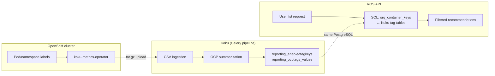
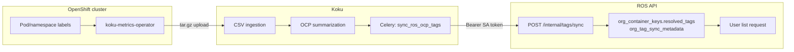

# Tag Filtering

Comprehensive reference for OpenShift tag synchronization, dual-path architecture,
and tag-based recommendation list filtering.

---

## Overview

**Tag filtering** lets operators narrow ROS recommendations by OpenShift labels (tags)
that Cost Management already tracks for billing. Tags originate on pods and namespaces
in the cluster, flow through the koku-metrics-operator into Koku summaries, and become
available to ROS list APIs via:

```
GET /api/cost-management/v1/recommendations/openshift?filter[tag:environment]=production
```

The feature is gated by `ROS_TAGS_ENABLED` on ROS. **How tags reach ROS list queries**
depends on deployment topology, controlled by `ROS_TAGS_SOURCE`:

| Mode | `ROS_TAGS_SOURCE` | Typical deployment |
|------|-------------------|--------------------|
| **On-prem (shared database)** | `db` (default) | cost-onprem Helm chart — Koku and ROS share one PostgreSQL |
| **SaaS (push API)** | `api` | console.redhat.com — separate Koku and ROS databases |

Both modes expose the **same public filter syntax** to clients. Only the internal
data path, configuration, freshness guarantees, and failure modes differ.

---

## Architecture

### On-Prem (Shared Database)

On-prem deployments run Koku and ros-ocp-backend against the **same PostgreSQL
instance**. ROS does not copy tag data into its own tables for filtering. Instead,
list queries **JOIN** ROS container rows to Koku tenant tag summary tables at query time.



**Request path:**

```
User Request
  → ROS API (identity/RBAC)
  → Parse filter[tag:key]=value
  → Step 1: resolve matching containers from org_container_keys
            WHERE EXISTS (
              SELECT 1 FROM org{org_id}.reporting_ocptags_values tv,
                   unnest(tv.cluster_ids, tv.namespaces) AS t(cluster_id, namespace)
              WHERE tv.key = :key AND tv.value IN (:values)
                AND t.cluster_id = ock.cluster_uuid::text
                AND t.namespace = ock.namespace
            )
  → Step 2: fetch recommendations for those container keys
  → Response
```

**Schema convention:** Koku tenant schemas are named `org{org_id}` where `org_id` is
the bare numeric ID from the identity header (e.g. `1234567` → schema `org1234567`).
ROS derives this with the same rule — never pass `org1234567` as the org_id in API
payloads or env vars.

**Tables queried (Koku tenant schema):**

| Table | Purpose |
|-------|---------|
| `reporting_enabledtagkeys` | Which OCP tag keys are enabled for filtering (`enabled=true`, `provider_type='OCP'`) |
| `reporting_ocptags_values` | Distinct `(key, value)` pairs with parallel `cluster_ids[]` and `namespaces[]` arrays linking tags to cluster/namespace scope |

**Implementation:** [`internal/tags/db_provider.go`](../../internal/tags/db_provider.go),
[`internal/model/tag_filters.go`](../../internal/model/tag_filters.go) (`applyDBTagFiltersToKeys`).

**Properties:**

- **Zero sync latency** — tags are as fresh as the last Koku summarization; no HTTP push step.
- **No inter-service auth** — ROS reads PostgreSQL directly; no ServiceAccount tokens or push endpoints.
- **No Koku-side tag sync config** — Koku Celery push tasks are no-ops when `ROS_TAGS_SOURCE=db`.
- **Single point of dependency** — ROS list latency includes JOIN cost against Koku tables (indexed; see query-performance doc).

---

### SaaS (Push API)

In SaaS, Koku and ROS use **separate databases**. ROS cannot SQL-join across services,
so Koku **pushes** resolved namespace tags into ROS after summarization and settings
changes. List filters read from `org_container_keys.resolved_tags` (JSONB).



**Push path:**

```
Koku summarization completes (or Settings API mutates enabled tags)
  → schedule_ros_tag_sync(schema) [api source only]
  → Celery task sync_ros_ocp_tags
  → build_namespace_tags_payload() from OCPUsageLineItemDailySummary.all_labels
  → POST /api/cost-management/v1/internal/tags/sync
       Authorization: Bearer <Kubernetes ServiceAccount token>
  → ROS: TokenReview validation → full-replace transaction
  → org_container_keys.resolved_tags updated per (cluster_uuid, namespace)
  → org_tag_sync_metadata.synced_at + tag_keys catalog updated
```

**Sync triggers (api source only):**

| # | Trigger | When | Scope |
|---|---------|------|-------|
| 1 | Tag settings API | Enable/disable key, mapping change | Single tenant |
| 2 | OCP summarization complete | After summary tables updated | Single tenant |
| 3 | Periodic safety-net | Celery beat every **6 hours** (`:15` past the hour) | All tenants |

The periodic task recovers from transient network failures or missed event hooks.
Worst-case staleness is therefore **up to ~6 hours** if both event-driven syncs fail.

**Implementation:**

| Component | Location |
|-----------|----------|
| Payload builder | [`koku/masu/processor/ros_tag_sync.py`](../../../koku/koku/masu/processor/ros_tag_sync.py) |
| Sync service | [`internal/tags/sync.go`](../../internal/tags/sync.go) |
| Auth | [`internal/tags/auth.go`](../../internal/tags/auth.go) |
| HTTP handlers | [`internal/api/handlers_tags_sync.go`](../../internal/api/handlers_tags_sync.go), [`handlers_tags_status.go`](../../internal/api/handlers_tags_status.go) |
| List filter (api path) | [`internal/model/tag_filters.go`](../../internal/model/tag_filters.go) (`applyAPITagFiltersToKeys`) |

**Freshness monitoring (api source):**

```
GET /api/cost-management/v1/internal/tags/status?org_id=1234567
Authorization: Bearer <token>
```

Response includes `synced_at` (ISO-8601 UTC) and the enabled-key catalog. Alert if
`synced_at` is older than ~7 hours when the 6-hour safety-net is configured.

With **db source**, the same endpoint reads live from Koku tables (no push metadata).

---

## SaaS Operations (`ROS_TAGS_SOURCE=api`)

Operational reference for console.redhat.com and other deployments where Koku and ROS
use separate databases. Tags flow **one way only**: Koku is the source of truth; ROS
never pushes tag data back to Koku.

### Who pushes to whom

| Role | Action |
|------|--------|
| **Koku** (cost management backend) | Builds and pushes tag payloads |
| **ROS** (resource optimization backend) | Receives and stores tags in `org_container_keys.resolved_tags` |

Direction is always **Koku → ROS**. Koku owns enabled tag keys (`reporting_enabledtagkeys`)
and observed namespace labels from OCP summarization (`OCPUsageLineItemDailySummary.all_labels`).

### Sync mechanism

| Component | Detail |
|-----------|--------|
| Celery task | `masu.processor.ros_tag_sync.sync_ros_ocp_tags` |
| Worker process | `koku-worker` (same Celery workers as data ingestion) |
| ROS endpoint | `POST /api/cost-management/v1/internal/tags/sync` |
| Scheduler | `schedule_ros_tag_sync(schema)` → `sync_ros_ocp_tags.delay(schema_name)` |

The task is a no-op when `ROS_TAGS_SOURCE=db` or `ROS_TAGS_ENABLED=false`.

### Triggers (when sync runs)

**Event-driven (seconds after the event):**

| # | Event | Hook location |
|---|-------|---------------|
| 1 | User enables/disables a tag key (Settings API) | `api/settings/tags/view.py` |
| 2 | User changes tag mappings (Settings API) | `api/settings/tags/mapping/view.py` |
| 3 | OCP summarization completes for a provider | `masu/processor/tasks.py` |

Each hook calls `schedule_ros_tag_sync(schema)`, which queues `sync_ros_ocp_tags.delay()`
asynchronously.

**Periodic safety-net (scheduled):**

| Component | Detail |
|-----------|--------|
| Beat task | `masu.processor.ros_tag_sync.sync_ros_ocp_tags_periodic` |
| Schedule | Every **6 hours** at `:15` past the hour (`crontab(minute="15", hour="*/6")`) |
| Scope | All tenant schemas (excludes `public`) |
| Purpose | Catch missed event-driven syncs (network blips, worker restarts, backlog) |

### Frequency and freshness

| Scenario | Expected latency |
|----------|------------------|
| Tag settings change | Seconds (event-driven Celery task) |
| New OCP data ingested | After summarization completes + push |
| All event triggers fail | Up to **~6 hours** (next periodic safety-net) |

Alert if `synced_at` from the status endpoint is **older than ~6 hours** during normal
operations.

### Manual trigger

**Masu API** (when exposed in your deployment):

```bash
curl -s "http://localhost:5042/api/cost-management/v1/sync_ros_tags/?schema=org1234567"
```

**Django shell** (Koku container):

```python
from masu.processor.ros_tag_sync import sync_ros_ocp_tags
sync_ros_ocp_tags.delay("org1234567")
```

**Celery CLI** (Koku worker container):

```bash
celery -A koku call masu.processor.ros_tag_sync.sync_ros_ocp_tags --args='["org1234567"]'
```

To sync **all tenants** immediately (same as the periodic safety-net fan-out):

```python
from masu.processor.ros_tag_sync import sync_ros_ocp_tags_periodic
sync_ros_ocp_tags_periodic.delay()
```

### Monitoring

**Koku worker logs** — successful sync:

```
ROS tag sync completed  schema=org1234567  namespace_count=…  updated=…
```

**Koku worker logs** — failure:

```
ROS tag sync failed  schema=org1234567  error=…
```

**ROS freshness endpoint:**

```bash
curl -s -H "Authorization: Bearer $TOKEN" \
  "$ROS_URL/api/cost-management/v1/internal/tags/status?org_id=1234567"
```

Compare `synced_at` (ISO-8601 UTC) to the last OCP manifest completion time. Values
**>6 hours old** indicate a stuck or failing sync pipeline.

### Failure handling

| Failure type | Behavior |
|--------------|----------|
| HTTP error / ROS unavailable | Task logs `ROS tag sync failed` and raises; Celery records the failure |
| Single org failure | Other orgs continue syncing; failed org retried on next event or 6h cycle |
| Auth failure (401/403) | ROS rejects before DB transaction — previous tags unchanged |
| Mid-sync crash | Full-replace transaction rolls back; last successful sync remains visible |

There is no inline automatic retry on `sync_ros_ocp_tags` itself — recovery depends on
the next event trigger or the 6-hour periodic safety-net.

### Required configuration

**Koku worker:**

```bash
ROS_TAGS_ENABLED=true
ROS_TAGS_SOURCE=api
ROS_OCP_BACKEND_URL=http://ros-ocp-backend:8000   # internal ROS API URL
ROS_TAGS_DEV_TOKEN=<token>                        # dev only; prod uses SA token
ROS_TAGS_SA_TOKEN_PATH=/var/run/secrets/kubernetes.io/serviceaccount/token
```

**ROS API:**

```bash
ROS_TAGS_ENABLED=true
ROS_TAGS_SOURCE=api
ROS_TAGS_ALLOWED_SERVICE_ACCOUNTS=system:serviceaccount:cost-onprem:koku-worker
ROS_TAGS_DEV_TOKEN=<same-token>                   # dev only
```

See [tag-sync-auth.md](../operations/tag-sync-auth.md) for TokenReview authentication details.

---

## On-Prem vs SaaS Comparison

| Dimension | On-Prem (`db`) | SaaS (`api`) |
|-----------|----------------|--------------|
| **Database topology** | Shared PostgreSQL | Separate Koku and ROS databases |
| **Tag data location** | Koku `reporting_ocptags_values` | ROS `org_container_keys.resolved_tags` |
| **Sync mechanism** | None (live SQL JOIN) | HTTP POST full-replace |
| **Latency to new tags** | After next Koku summarization | After summarization + successful push |
| **Worst-case staleness** | Summarization schedule only | Up to ~6h if pushes fail |
| **Inter-service auth** | Not required | Kubernetes ServiceAccount TokenReview |
| **Koku config required** | None for tag sync | `ROS_TAGS_ENABLED=true`, `ROS_TAGS_SOURCE=api`, `ROS_OCP_BACKEND_URL` |
| **ROS push endpoints** | Return 404 (disabled) | Active when `ROS_TAGS_ENABLED=true` |
| **Failure mode (Koku down)** | ROS cannot read fresh tags | Last successful sync retained |
| **Failure mode (network)** | N/A | Eventual consistency; periodic retry |
| **Operational complexity** | Lower (one DB) | Higher (auth, monitoring, Celery) |
| **Pod restart impact** | None (stateless reads) | None (tags in PostgreSQL) |

---

## Configuration

### ROS (ros-ocp-backend)

| Variable | Default | On-Prem | SaaS | Description |
|----------|---------|---------|------|-------------|
| `ROS_TAGS_ENABLED` | `false` | Required `true` | Required `true` | Master switch: list filters + push API (api only) |
| `ROS_TAGS_SOURCE` | `db` | `db` | `api` | `db` = Koku table JOIN; `api` = `resolved_tags` |
| `ROS_TAGS_ALLOWED_SERVICE_ACCOUNTS` | (empty) | N/A | Optional | Comma-separated SA names allowed to push; empty = any authenticated SA |
| `ROS_TAGS_DEV_TOKEN` | (empty) | N/A | Dev only | Static bearer when SA token unavailable (must match Koku) |

**On-prem example (cost-onprem chart):**

```yaml
env:
  ROS_TAGS_ENABLED: "true"
  ROS_TAGS_SOURCE: "db"
```

**SaaS example:**

```yaml
env:
  ROS_TAGS_ENABLED: "true"
  ROS_TAGS_SOURCE: "api"
  ROS_TAGS_ALLOWED_SERVICE_ACCOUNTS: "cost-management-koku-worker"
```

### Koku

| Variable | Default | On-Prem (`db`) | SaaS (`api`) | Description |
|----------|---------|----------------|--------------|-------------|
| `ROS_TAGS_ENABLED` | `false` | Ignored for push | `true` | Enables Celery push tasks |
| `ROS_TAGS_SOURCE` | `db` | `db` (default) | `api` | `db` = no push; `api` = HTTP sync |
| `ROS_OCP_BACKEND_URL` | `http://cost-onprem-ros-api:8000` | Unused | Required | ROS API base URL for push |
| `ROS_TAGS_DEV_TOKEN` | (empty) | Unused | Dev only | Bearer token when SA mount missing |
| `ROS_TAGS_SA_TOKEN_PATH` | `/var/run/secrets/kubernetes.io/serviceaccount/token` | Unused | Production | Projected SA token path on worker |

When `ROS_TAGS_SOURCE=db`, **no Koku-side tag sync configuration is required**. Settings
API hooks and post-summarization calls to `schedule_ros_tag_sync` are no-ops.

---

## Sync Payload Format (SaaS / api source only)

```json
{
  "org_id": "1234567",
  "synced_at": "2026-05-25T18:00:00Z",
  "tag_keys": [
    {"key": "environment", "values": ["production", "staging"]},
    {"key": "team", "values": []}
  ],
  "namespace_tags": [
    {
      "cluster_uuid": "550e8400-e29b-41d4-a716-446655440000",
      "namespace": "payments",
      "tags": {"environment": "production", "team": "platform"}
    }
  ]
}
```

| Field | Required | Description |
|-------|----------|-------------|
| `org_id` | yes | Bare org ID (not `org1234567`) |
| `synced_at` | yes | When Koku built the payload (UTC) |
| `tag_keys` | yes | All **enabled** OCP keys and observed values |
| `namespace_tags` | yes | Per `(cluster_uuid, namespace)` resolved tag map |

**Full-replace semantics:** Each sync runs in one transaction — reset all
`resolved_tags` for the org to `{}`, apply namespace maps, upsert metadata.
Namespaces not in the payload end up with empty tags.

---

## API Filtering Syntax

Both modes accept Koku bracket notation:

```
GET /api/cost-management/v1/recommendations/openshift
  ?filter[tag:environment]=production,staging
  &filter[tag:team]=platform
```

| Pattern | Semantics |
|---------|-----------|
| `filter[tag:key]=value` | Exact match |
| `filter[tag:key]=a,b` | OR within the same key |
| Multiple `filter[tag:*]` keys | AND across keys |
| `filter[tag:key]=*` | Key present (any value) |

Requires `ROS_TAGS_ENABLED=true`. With `api` source, at least one successful push
should have populated `resolved_tags` for the org.

Implementation uses a two-step list query: resolve matching containers first, then
fetch recommendations. See [query-performance](../operations/query-performance.md).

---

## Tag Lifecycle Scenarios

Behavior is **identical from the user's perspective** once data is visible to ROS.
Differences are *when* ROS sees changes and *what happens on failure*.

### New tag key enabled in Koku Settings

| Step | On-Prem (`db`) | SaaS (`api`) |
|------|----------------|--------------|
| 1 | Operator enables key via Settings API | Same |
| 2 | Key appears in `reporting_enabledtagkeys` immediately | Same + `schedule_ros_tag_sync` queued |
| 3 | Filters accept the key after values exist in `reporting_ocptags_values` | Push updates `tag_keys` catalog; filters use `resolved_tags` after sync |
| 4 | Values appear after next OCP summarization ingests labeled pods | Same + push after summarization |

### Tag key disabled in Koku Settings

| On-Prem | SaaS |
|---------|------|
| Key removed from enabled table; JOIN excludes it immediately on next query | Immediate push omits key; full-replace clears from all `resolved_tags` |

### Tag mapping changed

| On-Prem | SaaS |
|---------|------|
| Next summarization rebuilds `reporting_ocptags_values` with new resolution | Settings mutation triggers immediate push with new maps |

### Tag key disappears from cluster (still enabled in Settings)

| On-Prem | SaaS |
|---------|------|
| Next summarization updates tag value tables; fewer values in JOIN | Next summarization + push sends empty/fewer values; full-replace removes stale entries |

### New tag values appear

| On-Prem | SaaS |
|---------|------|
| Visible after next daily summarization | Visible after summarization + successful push |

### Tag values disappear (pods deleted or relabeled)

| On-Prem | SaaS |
|---------|------|
| Stale values drop from Koku tables on next summarization | Full-replace on next sync removes stale `resolved_tags` |

### Network / sync failure

| On-Prem | SaaS |
|---------|------|
| N/A — no HTTP sync | Koku logs `ROS tag sync failed`, Celery retries; previous tags retained; 6h safety-net |

### ROS pod restart

Both modes: **no state loss**. On-prem reads Koku tables; api mode persists tags in PostgreSQL.

---

## Authentication

### On-Prem (`db`): No authentication between services

ROS connects to PostgreSQL with its own credentials and reads Koku tenant schemas.
No ServiceAccount tokens, push endpoints, or mTLS are involved in tag filtering.

### SaaS (`api`): Kubernetes ServiceAccount TokenReview

See [tag-sync-auth.md](../operations/tag-sync-auth.md) for full auth documentation,
failure modes, and monitoring.

**Dev mode:** Set the same `ROS_TAGS_DEV_TOKEN` on Koku and ROS when projected SA
tokens are unavailable (local docker-compose).

### Future: mTLS (SaaS hardening)

Planned mutual TLS between Koku worker and ROS API (cert-manager or service mesh).
TokenReview will remain supported during migration behind a feature flag
(e.g. `ROS_TAGS_MTLS_ENABLED`).

---

## Scalability Considerations

| Dimension | On-Prem | SaaS |
|-----------|---------|------|
| Thousands of orgs | JOIN per request; Koku tables indexed | Periodic task fans out one Celery job per tenant |
| ~200 enabled tags | EXISTS subquery per filter key | JSONB `@>` / `->>` on `resolved_tags` |
| Large namespace counts | `reporting_ocptags_values` unnest join | Batch UPDATE by `(org_id, cluster_uuid, namespace)` in one transaction |

Monitor SaaS sync duration and Koku `ROS tag sync failed` logs. Alert on stale
`synced_at` beyond 7 hours.

---

## Future Enhancements

| Enhancement | Description |
|-------------|-------------|
| mTLS authentication | Transport-layer mutual auth for SaaS push; see [tag-sync-auth.md](../operations/tag-sync-auth.md) |
| `group_by[tag:key]=*` | Aggregate recommendations by tag dimension in API responses |
| Tag value autocomplete API | UI typeahead from tag catalog (db: live query; api: `org_tag_sync_metadata`) |
| Tag-based cost allocation | Correlate ROS savings with Koku tag breakdown reports |
| Webhook instant sync | Reduce reliance on 6-hour safety-net |
| Pod-level tag overrides | Support pod labels distinct from namespace defaults (v1 uses namespace-level only) |
| Cross-provider tag unification | Align AWS/Azure/GCP tag keys with OCP for hybrid dashboards |

---

## Related Documentation

- [Tag sync operations (api source)](../operations/tag-sync.md)
- [Tag sync authentication](../operations/tag-sync-auth.md)
- [Configuration](../operations/configuration.md)
- [Public docs: Tag Filtering](../../docs-site/features/tag-filtering.md)
- [Koku ROS integration](../../../koku/docs/architecture/ros-ocp-integration.md)
