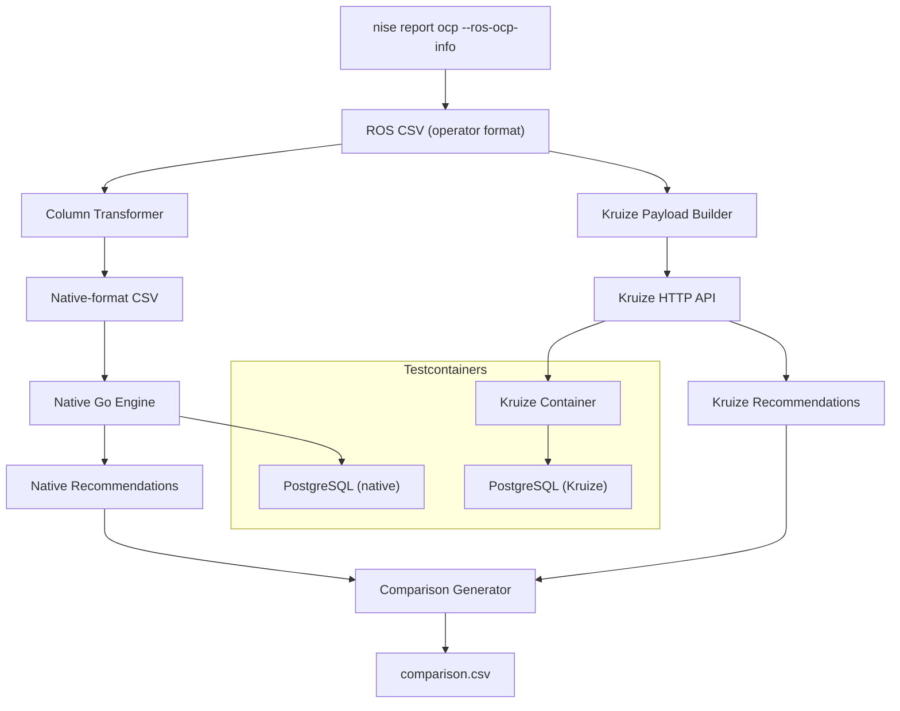

# Kruize vs Native Engine Comparison Tool

A self-contained CLI tool that runs the same nise-generated OpenShift utilization
data through both recommendation engines and produces a side-by-side CSV
spreadsheet showing how their recommendations differ.

## Architecture



Both engines receive the same input data but run in fully isolated containers.
The tool uses [testcontainers-go](https://golang.testcontainers.org/) to manage
all Docker infrastructure automatically — no manual setup beyond Docker itself.

## Prerequisites

### 1. Build the Kruize Docker image

```bash
cd ~/dev/koku/autotune
./build.sh -i kruize:local
```

This builds from `Dockerfile.autotune` (UBI + JDK + Maven). Takes ~5-10 minutes
on first run; subsequent builds use the Docker cache.

### 2. Generate test data with nise

Create a static data YAML (or use an existing example) and generate container-
level ROS data:

```bash
mkdir -p /tmp/nise-comparison/output

cd ~/dev/koku/nise
.venv/bin/nise report ocp \
  --static-report-file /tmp/nise-comparison/cluster1.yml \
  --ocp-cluster-id comparison-cluster-1 \
  --ros-ocp-info \
  --insights-upload /tmp/nise-comparison/output \
  --daily-reports
```

The tool needs the `*_openshift_report.6.csv` file (container-level metrics) from
the nise output.

**Key nise flags:**
- `--ros-ocp-info` — generates container-level data (not just pod-level)
- `--daily-reports` — one interval per 15-minute period
- `--insights-upload <dir>` — writes output to a directory structure

### 3. Docker daemon running

The tool spins up three containers via testcontainers-go:
- PostgreSQL 16 (native engine)
- PostgreSQL 16 (Kruize)
- kruize:local (Kruize Java service)

## Usage

```bash
cd ~/dev/koku/ros-ocp-backend

go run ./cmd/compare/ <nise-ros-csv-path> [cluster-id] [org-id] [cluster-uuid]
```

**Arguments:**

| Argument | Default | Description |
|---|---|---|
| `nise-ros-csv-path` | *(required)* | Path to the `*_openshift_report.6.csv` from nise |
| `cluster-id` | `comparison-cluster-1` | Human-readable cluster identifier |
| `org-id` | `org1234567` | Organization ID for tenant scoping |
| `cluster-uuid` | `a1b2c3d4-e5f6-...` | UUID used in the database |

**Example:**

```bash
go run ./cmd/compare/ \
  /tmp/nise-comparison/output/comparison-cluster-1/20260301-20260401/*_openshift_report.6.csv \
  comparison-cluster-1 \
  org1234567
```

**Output:** `comparison.csv` in the current directory.

## What the tool does (7 steps)

1. **Transform CSV** — Renames nise operator-format columns to native engine format
2. **Start native PostgreSQL** — Testcontainer with migrations and partition creation
3. **Run native engine** — `ProcessCSVToDigests` → `RecommendAllWorkloads`
4. **Start Kruize** — Dedicated PostgreSQL + Kruize container on a shared Docker network,
   configured via environment variables and a dynamically generated `cdappconfig.json`
5. **Run Kruize pipeline** — Create performance profile → create experiments →
   send metric intervals → fetch recommendations
6. **Generate comparison** — Join results by (namespace, workload, container, term, engine),
   normalize term names, compute percentage differences
7. **Print summary** — Console output with sample recommendations from each engine

Total runtime: ~2 minutes (dominated by Kruize's Java startup and the metric upload phase).

## Column Mapping (nise → native engine)

| Nise CSV Column | Native CSV Column | Notes |
|---|---|---|
| `interval_start` | `interval_start` | Same |
| `interval_end` | `interval_end` | Same |
| `namespace` | `namespace` | Same |
| `workload` | `workload_name` | **Renamed** |
| `workload_type` | `workload_type` | Same |
| `container_name` | `container_name` | Same |
| `cpu_request_container_avg` | `cpu_request` | Both in cores (float) |
| `cpu_limit_container_avg` | `cpu_limit` | Both in cores (float) |
| `cpu_usage_container_avg` | `cpu_usage` | Both in cores (float) |
| `cpu_throttle_container_avg` | `cpu_throttle` | Both in cores (float) |
| `memory_request_container_avg` | `mem_request` | Both in bytes (float) |
| `memory_limit_container_avg` | `mem_limit` | Both in bytes (float) |
| `memory_usage_container_avg` | `mem_usage` | Both in bytes (float) |
| `memory_rss_usage_container_avg` | `mem_rss` | Both in bytes (float) |

Units are compatible: CPU as fractional cores, memory as bytes. The native
engine's `CoreToMillicores` and `BytesToKiB` handle conversion internally.

## Kruize Pipeline Details

The tool drives Kruize through its full HTTP API lifecycle:

1. `POST /createPerformanceProfile` with [`resource_optimization_openshift.json`](../resource_optimization_openshift.json)
2. `POST /createExperiment` — one experiment per workload (namespace + workload name)
3. `POST /updateResults` — one request per 15-minute interval per workload, using
   Kruize's nested metric format (`cpuRequest`, `cpuUsage`, `memoryUsage`, etc.)
   with `aggregation_info` containing `sum`, `avg`, `min`, `max` values
4. `POST /updateRecommendations?experiment_name=...&interval_end_time=...` — triggers
   recommendation generation
5. Parse the response using `kruizePayload.ListRecommendations` to extract
   short/medium/long term cost/performance recommendations

### Kruize Container Configuration

The Kruize container is configured using environment variables (not config files
mounted to `/etc/config`, which is a common misconception). Key variables:

- `DB_CONFIG_FILE=/tmp/cdappconfig.json` — points to a mounted JSON file with
  database connection details (hostname uses the Docker network alias `kruize-db`)
- `dbdriver=jdbc:postgresql://`
- `savetodb=true`
- `clustertype=kubernetes`, `k8stype=minikube`
- Hibernate settings for PostgreSQL dialect

The `cdappconfig.json` is generated dynamically by the tool with the testcontainer's
network alias as the hostname.

## Output Format (comparison.csv)

One row per (container, term, engine) combination:

| Column | Description |
|---|---|
| `cluster_id` | Cluster identifier |
| `namespace`, `workload`, `container` | Workload identity |
| `term` | `short`, `medium`, or `long` |
| `engine` | `cost` or `performance` |
| `native_cpu_request_mc` | Native engine CPU request in millicores |
| `native_cpu_limit_mc` | Native engine CPU limit in millicores |
| `native_mem_request_kib` | Native engine memory request in KiB |
| `native_mem_limit_kib` | Native engine memory limit in KiB |
| `kruize_cpu_request_mc` | Kruize CPU request in millicores |
| `kruize_cpu_limit_mc` | Kruize CPU limit in millicores |
| `kruize_mem_request_kib` | Kruize memory request in KiB |
| `kruize_mem_limit_kib` | Kruize memory limit in KiB |
| `cpu_request_diff_pct` | `(native - kruize) / kruize * 100` |
| `mem_request_diff_pct` | `(native - kruize) / kruize * 100` |

Term normalization: the native engine uses `short`/`medium`/`long` while Kruize
uses `short_term`/`medium_term`/`long_term`. The tool normalizes these before
joining.

## Example Results

From a test run with 5 containers, 21 days of 15-minute data (10,080 rows):

| Container | CPU Request Diff | Memory Request Diff | Pattern |
|---|---|---|---|
| frontend-abc12 | +5.9% to +7.5% | -1.3% to +0.3% | Very close, native slightly higher CPU |
| backend-def34 | +5.1% to +5.4% | -4.3% to -3.0% | Native higher CPU, Kruize higher memory |
| postgres-ghi56 | -0.7% to -0.9% | -16.1% to -15.3% | CPU identical, Kruize ~16% more memory |
| prometheus-jkl78 | +1.9% to +2.2% | -15.8% to -16.8% | CPU close, Kruize ~16% more memory |
| grafana-mno90 | -2.4% to +4.8% | -10.8% to -11.7% | Mixed CPU, Kruize ~11% more memory |

**Takeaway:** CPU recommendations are generally within 0-7%. The significant
divergence is in memory, where Kruize consistently recommends 10-16% more,
particularly for memory-heavy workloads. This is likely due to different
percentile calculations or safety margins in the two algorithms.

## Key Files

| File | Purpose |
|---|---|
| [`cmd/compare/main.go`](../cmd/compare/main.go) | The comparison CLI tool (~1000 lines) |
| [`internal/ingestion/`](../internal/ingestion/) | CSV parsing, digest pipeline (native) |
| [`internal/engine/`](../internal/engine/) | Recommendation algorithms (native) |
| [`internal/types/kruizePayload/`](../internal/types/kruizePayload/) | Kruize API payload types |
| [`resource_optimization_openshift.json`](../resource_optimization_openshift.json) | Kruize performance profile |
| [`migrations/`](../migrations/) | Database schema (applied to native PostgreSQL) |

## Troubleshooting

| Symptom | Cause | Fix |
|---|---|---|
| `kruize:local` image not found | Image not built | Run `cd ~/dev/koku/autotune && ./build.sh -i kruize:local` |
| Kruize container exits with code 1 | Database connection failure | Check Docker network; ensure `kruize-compare-net` is created |
| `updateResults` returns 400 | Metric payload format wrong | Verify nise CSV has `_sum`, `_avg`, `_min`, `_max` columns |
| `no partition found` | Data dates outside partition range | Tool creates partitions for ±6/+3 months; check nise date range |
| Native engine produces 0 recs | Insufficient data (< 1 day) | Generate at least 2+ days of 15-minute interval data |
| Kruize produces 0 recs | Insufficient intervals | Kruize needs multiple days; generate 15+ days of data |
