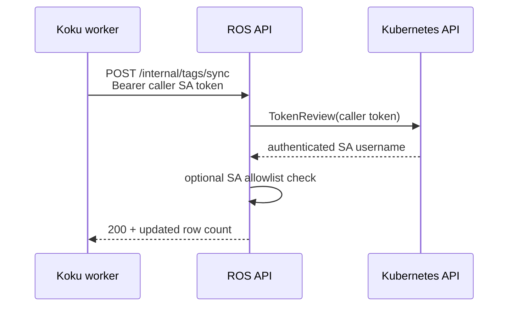

# Tag Sync Authentication

Authentication for tag data transfer depends on deployment mode (`ROS_TAGS_SOURCE`).

---

## On-Prem (`db` mode): No authentication needed

When ROS and Koku share a PostgreSQL instance (default for cost-onprem), ROS reads tag
data **directly from Koku tenant tables**:

- `org{org_id}.reporting_enabledtagkeys`
- `org{org_id}.reporting_ocptags_values`

There is **no HTTP push**, **no ServiceAccount token**, and **no mTLS** between services
for tag filtering. ROS uses its database credentials to query Koku schemas on the same
PostgreSQL server.

Internal push endpoints (`POST /internal/tags/sync`, `GET /internal/tags/status`) return
**404** when `ROS_TAGS_SOURCE=db` — they are not part of the on-prem data path.

**What you still configure:**

| Variable | Purpose |
|----------|---------|
| `ROS_TAGS_ENABLED=true` | Enables tag list filters |
| `ROS_TAGS_SOURCE=db` | Default; selects direct DB reads |

No Koku-side tag sync env vars are required.

---

## SaaS (`api` mode): ServiceAccount authentication

When Koku and ROS use separate databases, Koku pushes tags via HTTP. Internal endpoints
are **not** exposed through public ROS identity/RBAC middleware — access is restricted
to in-cluster callers with valid Kubernetes ServiceAccount identity.

| Method | Path |
|--------|------|
| `POST` | `/api/cost-management/v1/internal/tags/sync` |
| `GET` | `/api/cost-management/v1/internal/tags/status` |

---

### Current: Kubernetes ServiceAccount TokenReview

Koku pushes resolved tags from the worker/listener pod:

```
Authorization: Bearer <service-account-token>
```

On the ROS side, [`internal/tags/auth.go`](../../internal/tags/auth.go) validates via
the Kubernetes **TokenReview API**:



1. ROS reads its own pod ServiceAccount token (reviewer identity).
2. ROS POSTs `TokenReview` to `https://kubernetes.default.svc/apis/authentication.k8s.io/v1/tokenreviews`.
3. The API confirms the caller token is authenticated and returns the ServiceAccount
   username (`system:serviceaccount:<ns>:<name>`).
4. Optionally, `ROS_TAGS_ALLOWED_SERVICE_ACCOUNTS` restricts which SA names are accepted
   (empty = any authenticated SA).

**Why TokenReview:**

- Zero shared secrets to distribute inside the cluster.
- Native Kubernetes identity — caller must be a real pod ServiceAccount.
- Standard RBAC: grant the Koku worker SA permission to reach ROS internal routes.

**Dev fallback:** When `ROS_TAGS_DEV_TOKEN` is set, matching bearer tokens are accepted
with a warning log. Use only for local/docker-compose where TokenReview is unavailable.
Set the **same** token on Koku (`ROS_TAGS_DEV_TOKEN`) and ROS.

| Variable | Default | Purpose |
|----------|---------|---------|
| `ROS_TAGS_ENABLED` | `false` | Master switch for tag sync API and list filters |
| `ROS_TAGS_SOURCE` | `db` | Must be `api` for push endpoints to accept traffic |
| `ROS_TAGS_ALLOWED_SERVICE_ACCOUNTS` | (empty) | Comma-separated SA names; empty accepts any authenticated SA |
| `ROS_TAGS_DEV_TOKEN` | (empty) | Dev-only static bearer token |

Implementation: [`internal/tags/auth.go`](../../internal/tags/auth.go),
[`internal/api/handlers_tags_sync.go`](../../internal/api/handlers_tags_sync.go).

---

## Tag lifecycle and auth interaction (api mode)

Authentication gates **who** may push; lifecycle events determine **when** pushes occur.

| Scenario | Sync triggered? | Auth required? | ROS state if sync fails |
|----------|-----------------|----------------|-------------------------|
| Tag key enabled in Settings | Yes (immediate) | Bearer token | Previous tags retained |
| Tag key disabled | Yes (immediate) | Bearer token | Stale until success |
| OCP summarization complete | Yes (per tenant) | Bearer token | Stale until success |
| Periodic safety-net (6h) | Yes (all tenants) | Bearer token | Stale until success |
| Invalid/missing token | N/A | **401/403** | Unchanged |
| ROS pod restart | N/A | N/A | Tags persisted in DB |

Failed auth does **not** corrupt tag data — ROS rejects the request before the
full-replace transaction begins.

---

## Failure modes and recovery (api mode)

### TokenReview unavailable

**Symptoms:** ROS logs `service account reviewer token unavailable` or TokenReview HTTP errors.

**Causes:** ROS API pod not running with a mounted SA token; wrong `KUBERNETES_TOKEN_REVIEW_URL`;
API server unreachable.

**Recovery:**

1. Verify ROS deployment has `automountServiceAccountToken: true`.
2. Confirm in-cluster DNS to `kubernetes.default.svc`.
3. For local dev, set `ROS_TAGS_DEV_TOKEN` on both Koku and ROS.

### Caller token rejected

**Symptoms:** `token not authenticated` or `service account "…" is not allowed`.

**Causes:** Expired projected token; SA not in `ROS_TAGS_ALLOWED_SERVICE_ACCOUNTS`; non-SA user token.

**Recovery:**

1. Confirm Koku worker uses the expected ServiceAccount.
2. Add SA name to `ROS_TAGS_ALLOWED_SERVICE_ACCOUNTS` or leave empty for any SA.
3. Check projected token volume mount on Koku worker pod.

### Koku cannot read SA token

**Symptoms:** Koku log `service account token unavailable for ROS tag sync`.

**Recovery:** Set `ROS_TAGS_DEV_TOKEN` for dev, or fix SA token mount on Koku worker.

### Sync succeeds but filters stale

**Symptoms:** `GET /internal/tags/status` shows old `synced_at`.

**Causes:** Network partition after summarization; Celery task backlog; `ROS_TAGS_ENABLED=false`
on Koku; `ROS_TAGS_SOURCE` not set to `api`.

**Recovery:** Wait for 6-hour periodic sync or manually trigger summarization/tag settings change.
Monitor Koku `ROS tag sync failed` logs.

### Partial org corruption (theoretical)

Full-replace runs in a transaction — a mid-sync crash rolls back. Worst case: last **successful**
sync remains visible (eventual consistency, not data loss).

---

## Monitoring and alerting (api mode)

| Signal | Source | Suggested alert |
|--------|--------|-----------------|
| Sync failures | Koku log `ROS tag sync failed` | > N failures in 1h per org |
| Stale `synced_at` | `GET /internal/tags/status` | `synced_at` older than 7h |
| Auth failures | ROS API 401/403 on `/internal/tags/*` | Spike in unauthorized pushes |
| Zero `updated` rows | Sync response `updated: 0` with non-empty payload | Investigate missing `org_container_keys` rows |
| Removed keys | ROS log `tag sync: removed tag key` | Informational (expected on disable) |

**Health check workflow:**

```bash
# From a pod with the Koku worker SA token:
curl -s -H "Authorization: Bearer $TOKEN" \
  "$ROS_URL/api/cost-management/v1/internal/tags/status?org_id=1234567"
```

Compare `synced_at` to last successful OCP manifest completion time.

**On-prem (`db`):** Monitor Koku summarization completion instead — no `synced_at` push metadata.

---

## Future: mTLS (SaaS)

**Planned upgrade** for SaaS and high-security on-prem deployments: mutual TLS between
Koku worker and ros-ocp-backend pods.

### Motivation

ServiceAccount tokens work well in-cluster but have operational trade-offs:

- **Token rotation** — projected SA tokens expire; misconfiguration can cause sync failures.
- **Unidirectional trust** — TokenReview validates the caller, but Koku cannot
  cryptographically verify it is talking to the real ROS API beyond TLS server cert.
- **Off-cluster callers** — TokenReview requires in-cluster access to the Kubernetes API.

mTLS establishes **bidirectional authentication** at the transport layer.

### Intended design

```
┌─────────────┐   client cert (Koku SA)    ┌─────────────┐
│ Koku worker │ ─────────────────────────▶ │ ROS API     │
│             │ ◀───────────────────────── │             │
└─────────────┘   server cert (ROS API)    └─────────────┘
         both sides verify peer certificate
```

**Implementation options:**

1. **cert-manager** — per-service certificates from a cluster CA; mount cert/key into
   Koku and ROS; configure Go `http.Client` and Echo TLS for mutual verification.
2. **Service mesh sidecar** (Istio/Linkerd) — mTLS handled by sidecars; application
   continues HTTP but traffic is encrypted and authenticated between mesh members.

**Migration path:**

1. Ship mTLS alongside TokenReview (feature flag, e.g. `ROS_TAGS_MTLS_ENABLED`).
2. Helm chart mounts cert-manager `Certificate` resources for Koku worker and ROS API.
3. Configure Koku HTTP client with client cert; ROS with client cert verification.
4. Deprecate TokenReview for tag sync once mTLS is validated in CI.
5. Remove `ROS_TAGS_DEV_TOKEN` requirement for production paths.

**What mTLS does not replace:**

- Feature gating (`ROS_TAGS_ENABLED`) — still required.
- Payload validation and org scoping — ROS still validates `org_id` and full-replace semantics.
- Periodic safety-net — still recommended until webhook-based instant sync exists.

**On-prem note:** Shared-database deployments (`db` mode) do not need push auth today.
mTLS applies when operators choose `api` source or for other ROS↔Koku HTTP integrations.

---

## Related

- Feature overview: [`../features/tag-filtering.md`](../features/tag-filtering.md)
- Tag sync data flow (api): [`tag-sync.md`](tag-sync.md)
- Configuration: [`configuration.md`](configuration.md#tag-sync)
- Public docs: [`../../docs-site/features/tag-filtering.md`](../../docs-site/features/tag-filtering.md)
- Koku integration: [`koku/docs/architecture/ros-ocp-integration.md`](../../../../koku/docs/architecture/ros-ocp-integration.md)
