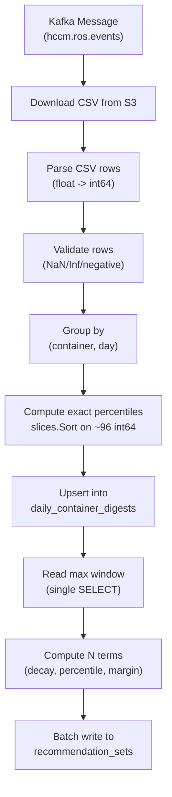

# Phase 1+2+3: Go Recommendation Engine + Metrics Pipeline + Decay/Custom Timeframes

## Scope

Implement REQ-1.1 through REQ-1.13, REQ-2.1 through REQ-2.7, and REQ-3.1 through REQ-3.5 in the existing `ros-ocp-backend` repo on the `pgarciaq-rosocp-superpowers-phase1` branch. All work follows strict TDD (Red-Green-Refactor). The test plan is in the companion document (test plan sections 5, 6, 7).

## Architecture

## Implementation Order

The work is structured into 8 milestones, each self-contained with tests. Dependencies flow downward: schema first, then pure Go functions, then integration wiring.

### Milestone 1: Database Schema (Migrations 000022-000027)

New `golang-migrate` migration files in `migrations/`:

- **000022**: Create `daily_container_digests` table (PARTITION BY RANGE on `bucket_date`) with all BIGINT metric columns per the spec in section 18. Create initial monthly partitions (current + next month).
- **000023**: Create `daily_namespace_digests` table (same pattern).
- **000024**: Create `org_recommendation_terms` table and `recommendation_profiles` table with seed data (cost: p60/p95, performance: p98/p100).
- **000025**: Create `notification_code_definitions` table with seed data (24 notification codes).
- **000026**: ALTER `recommendation_sets` -- add relational columns (`term`, `engine`, `rec_cpu_request_millicores`, `rec_cpu_limit_millicores`, `rec_memory_request_kib`, `rec_memory_limit_kib`, `current_*`, `variation_*_pct`, `notification_codes`, `confidence_level`, `estimated_monthly_savings_usd`, `recommendation_applied_at`, `stale`). Drop old unique constraint, add new PK on `(org_id, cluster_uuid, namespace, workload, container_name, term, engine)`.
- **000027**: Create `recommendation_quality` table (partitioned). Create `recommendation_history` table (partitioned, for REQ-1.12 shadow mode).

Key files:
- `migrations/000022_create_daily_container_digests.up.sql` (and `.down.sql`)
- Through `migrations/000027_*.up.sql`

### Milestone 2: Test Infrastructure (testcontainers-go + fixtures)

Add `testcontainers-go` as a dependency. Create shared test infrastructure:

- `internal/testutil/testdb.go` -- `SetupTestDB(t)` spins up PostgreSQL 16 via testcontainers, runs all golang-migrate migrations, returns `*pgxpool.Pool`. Uses `t.Cleanup()` for teardown.
- `internal/testutil/fixtures.go` -- Deterministic test data constants (`TestOrgID`, `TestClusterUUID`, `BaseDate`, etc.) and `SeedContainerDigest()` / `SeedDigestSeries()` helpers that insert rows into `daily_container_digests`.
- Add `pgx/v5` and `pgxpool` as direct dependencies (currently indirect via GORM).

Key files:
- `internal/testutil/testdb.go` (new)
- `internal/testutil/fixtures.go` (new)

### Milestone 3: CSV Parsing + Integer Conversion (REQ-2.3, REQ-2.1 validation)

New package `internal/ingestion/` with:

- `csvparser.go` -- `CoreToMillicores(s string) (int64, error)`, `BytesToKiB(s string) (int64, error)`, `ValidateMetricRow(row) error` (rejects NaN/Inf/negative), `ParseCSVRows(reader io.Reader) ([]MetricRow, error)`.
- `csvparser_test.go` -- Tests T-2.3a, T-2.3b, T-2.3c from the test plan. Table-driven tests for exact conversion, rounding, zero, large values, validation of NaN/Inf/negative/malformed.

Key files:
- `internal/ingestion/csvparser.go` (new)
- `internal/ingestion/csvparser_test.go` (new)

### Milestone 4: In-Memory Digest Computation (REQ-2.1 aggregation, REQ-3.1)

- `internal/ingestion/digest.go` -- `ComputeDigest(values []int64) Digest` struct (p50, p60, p95, p98, p99, max, mean, count). Uses `slices.Sort()` on `[]int64`. `GroupCSVRows(rows []MetricRow) map[DigestKey][]int64`. `DigestKey = {OrgID, ClusterUUID, Namespace, Workload, ContainerName, Date}`.
- `internal/ingestion/digest_test.go` -- Tests T-2.1a (percentile computation with exact values), T-2.1b (grouping), T-2.1c (upsert via integration test with testcontainers).

Key files:
- `internal/ingestion/digest.go` (new)
- `internal/ingestion/digest_test.go` (new)
- `internal/ingestion/models.go` (new -- structs: `MetricRow`, `DigestRow`, `DigestKey`, `Digest`)

### Milestone 5: Core Recommendation Engine (REQ-1.1 through REQ-1.8, REQ-3.2)

New package `internal/engine/`:

- `recommend_cpu.go` -- `RecommendCPU(rows []DigestRow, termDays int, decayHalfLife float64, costPct, perfPct, minMargin, maxMargin float64) CPURec`. Single-path percentile algorithm (no 1-core discontinuity), 25m floor, dual cost/perf output.
- `recommend_memory.go` -- `RecommendMemory(rows []DigestRow, ...) MemoryRec`. Uses max (not sort) for p100, adaptive tail-spread CV margin, separate request/limit.
- `detect_idle.go` -- `DetectIdle(rows []DigestRow) bool`. CPU < 10mc threshold.
- `term_config.go` -- `DefaultTerms` constant, `LoadTermConfig(ctx, pool, orgID) []TermConfig`, `TermConfig{WindowDays, MinDataDays, DecayHalfLifeHours}`.
- `margin.go` -- `ComputeAdaptiveMargin(p95, p50, mean, minMargin, maxMargin float64) float64`. Shared by CPU and memory.
- `trend.go` -- `ComputeLinearRegressionSlope(rows []DigestRow, cutoff time.Time, pctFunc func(DigestRow) int64) float64`.
- `percentile.go` -- `SelectPercentile(row DigestRow, pct float64) int64`. Maps pct to the correct pre-computed column (p50/p60/p95/p98/p99/max).
- `types.go` -- `CPURec`, `MemoryRec`, `ContainerRec`, `RecommendationResult` structs.
- `recommend_all.go` -- `RecommendAllWorkloads(ctx, pool, orgID, clusterUUID, start, end)` -- the "read once, compute N terms" orchestrator. Single SELECT, group by container, compute all terms, batch write.
- `recommend_namespace.go` -- `RecommendNamespace(rows []NamespaceDigestRow, ...)` -- same dual-model output pattern.

Test files (one per function, following test plan section 5):
- `recommend_cpu_test.go` -- T-1.1, T-1.2, T-1.3, T-1.3b (pure Go unit tests, no DB)
- `recommend_memory_test.go` -- T-1.5, T-1.6
- `detect_idle_test.go` -- T-6.1 (partial -- idle detection)
- `term_config_test.go` -- T-1.8 (12 tests for term windows, min data scaling, decay half-life)
- `margin_test.go` -- T-4.2 (adaptive margin tests)
- `trend_test.go` -- T-3.2b (trend slope)
- `recommend_all_test.go` -- T-1.11, T-1.10 (integration tests with testcontainers)

Key design decisions:
- All engine functions are **pure Go functions** taking `[]DigestRow` and config params, returning result structs. No DB dependency in unit tests.
- Decay weighting per REQ-3.2: `weight = exp(-age_hours / halflife_hours)`. For terms <= 1 day, no decay.
- Floor: CPU >= 25mc always.
- Limit = p99 * 1.05 (configurable).

### Milestone 6: Notification System (REQ-1.9)

- `internal/engine/notifications.go` -- Notification constants (matching `notification_code_definitions` table). `EvaluateNotifications(rec ContainerRec, dataHours float64, termMinHours float64) []int16`.
- `internal/engine/notifications_test.go` -- T-1.9 tests.

### Milestone 7: Ingestion Pipeline Wiring (REQ-2.1, REQ-2.4, REQ-3.1)

Modify existing code to wire the new pipeline:

- `internal/ingestion/pipeline.go` -- `ProcessCSVToDigests(ctx, pool, csvReader, orgID, clusterUUID)` -- full pipeline: parse -> validate -> group -> compute digests -> upsert. After upsert, calls `engine.RecommendAllWorkloads()`.
- Modify `internal/services/report_processor.go` -- Add a code path that uses the new `ingestion.ProcessCSVToDigests()` instead of (or alongside) the Kruize path. Gated by config flag `ROS_USE_NATIVE_ENGINE` (default: `true` on this branch).
- **Do NOT remove** the existing Kruize path yet (that's Phase 10). The new pipeline runs in parallel or replaces it based on config.
- Stop writing to `workload_metrics` table when native engine is active (REQ-2.4).

### Milestone 8: API Layer Updates (REQ-2.5, REQ-3.3, REQ-3.4)

- Update `internal/model/recommendation_set.go` -- New GORM struct fields for relational columns. Update `CreateRecommendationSet` to use new PK. Update `GetRecommendationSets` to read from relational columns instead of JSONB.
- Update `internal/api/handlers.go` -- Assemble nested JSON response from relational columns (3 terms x 2 engines -> nested `short_term/medium_term/long_term -> cost/performance -> cpu/memory`).
- Add `start_date`/`end_date` query parameters for on-demand custom timeframe computation (REQ-3.4). When present, call `engine.RecommendAllWorkloads()` at API time and return results directly.
- `internal/api/utils.go` -- New response assembly logic replacing `UpdateRecommendationJSON` for the relational-column path.

## New Dependencies

- `github.com/testcontainers/testcontainers-go` (test only)
- `github.com/jackc/pgx/v5` + `pgxpool` (promoted from indirect to direct, for batch operations and testcontainers integration)
- `github.com/jackc/pgx/v5/stdlib` (for golang-migrate compatibility)

## New Config Env Vars

- `ROS_USE_NATIVE_ENGINE` (bool, default `true`) -- use Go recommendation engine instead of Kruize
- `ROS_DIGEST_RETENTION_DAYS` (int, default `45`) -- digest table partition retention
- `ROS_ENABLE_REALTIME_RECS` (bool, default `false`) -- enable API-time computation (REQ-3.4)
- `ROS_ENABLE_SHADOW_MODE` (bool, default `false`) -- shadow mode (REQ-1.12)

## Files Touched (Existing)

- `go.mod` -- new dependencies
- `internal/config/config.go` -- new config fields
- `internal/services/report_processor.go` -- wire new pipeline
- `internal/model/recommendation_set.go` -- relational columns
- `internal/model/namespace_recommendation_set.go` -- relational columns
- `internal/model/common.go` -- updated query builders
- `internal/api/handlers.go` -- response assembly
- `internal/api/utils.go` -- new response format
- `internal/api/server.go` -- new query params
- `Makefile` -- new targets if needed

## New Packages/Files Created

- `internal/ingestion/` -- CSV parsing, digest computation, pipeline orchestration
- `internal/engine/` -- Recommendation engine (CPU, memory, idle, namespace, notifications, terms)
- `internal/testutil/testdb.go` -- testcontainers integration
- `internal/testutil/fixtures.go` -- deterministic test data
- `testdata/` -- golden files and test CSVs
- `migrations/000022-000027` -- new schema migrations

## TDD Execution Order

Each milestone follows RED-GREEN-REFACTOR. Within each milestone, implement one test at a time:

1. Write the failing test (RED)
2. Write minimum code to pass (GREEN)
3. Refactor while keeping tests green

The implementation order within each milestone follows the test plan section numbering (T-2.3a before T-2.3b, T-1.1 before T-1.2, etc.).

## What This Does NOT Include

- Phase 4 (OOM feedback) -- deferred
- Phase 5 (GPU) -- deferred
- Kruize removal (Phase 10) -- the Kruize path stays, gated by config
- API contract tests (section 17 of test plan) -- deferred to after core engine works
- Performance benchmarks (section 19) -- deferred
- Shadow mode implementation (section 16) -- schema created but reconciliation logic deferred
