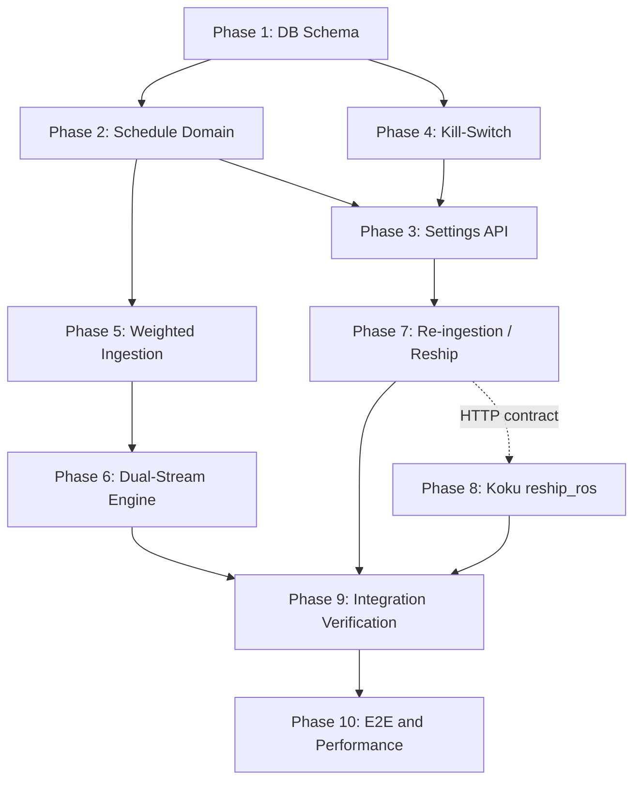

# Business Hours — TDD Implementation Plan

| Field | Value |
|-------|-------|
| **Status** | Accepted |
| **Design Doc** | [features-business-hours.md](./features-business-hours.md) |
| **Last Updated** | 2026-05-22 (design decisions 2026-05-22) |
| **Approach** | Red → Green → Refactor per phase |
| **Test case count** | **168** explicit IDs (165 from verification plan + 3 TDD scaffolding) + 23 edge-case traceability rows (BH-EDGE-001–023) |

---

## TDD Approach

Each phase is a **buildable, independently committable unit** (one PR or commit per phase). Work strictly in order within a phase:

1. **Red** — Write failing tests first. Tests must compile where possible; otherwise use `t.Skip("Phase N: not implemented")` only until the package exists, then remove skips and assert real failures.
2. **Green** — Minimal implementation to pass **only** that phase’s tests. No forward-looking abstractions.
3. **Refactor** — Clean up duplication, naming, and docs while keeping tests green.
4. **Checkpoint** — Run the phase verification command plus prior-phase regression (`go test ./... -short` for unit tiers).

**Conventions:** Table-driven subtests, `testify/require`, `t.Setenv` for config, `httptest.Server` for masu client mocks. Pattern references: [`handlers_terms_integration_test.go`](../internal/api/handlers_terms_integration_test.go), [`digest_test.go`](../internal/ingestion/digest_test.go), [`recommend_nodes_test.go`](../internal/engine/recommend_nodes_test.go), [`disabled_plugin_route_guards_test.go`](../internal/api/disabled_plugin_route_guards_test.go), [`migration_roundtrip_test.go`](../internal/engine/migration_roundtrip_test.go).

**Scope (v1):** Container and namespace plugins. Node/GPU/PVC business-hours streams are explicitly out of scope (negative tests BH-UNIT-109–111).

---

## Phase Dependency Graph



| Phase | Depends on | Can run in parallel with | Effort |
|-------|------------|--------------------------|--------|
| 1 | — | — | **M** |
| 2 | 1 | 4 (after 1) | **M** |
| 4 | 1 | 2 (after 1) | **S** |
| 3 | 2, 4 | — | **L** |
| 5 | 2 | — | **L** |
| 6 | 5 | — | **L** |
| 7 | 3 | 8 (contract stub) | **L** |
| 8 | 7 contract | 7 (different repo) | **M** |
| 9 | 5, 6, 7, 8 | — | **L** |
| 10 | 9 | — | **M** |

**Parallelization summary:** After Phase 1 lands, **Phase 2** and **Phase 4** can proceed in parallel. **Phase 8** (koku repo) can start once the `reship_ros` query contract is frozen in Phase 7 Red tests. Phases 3→5→6 and 7→9 are sequential chains.

---

## Phase 1: Database Schema & Migrations

**Effort:** M | **Parallel:** None (foundation) | **PR:** `[BH] Phase 1: schema and migrations`

### Goal

PostgreSQL can store business-hours schedules and digest rows discriminated by `schedule_type`, with extended primary keys, `reship_pending_since`, and indexes. Existing digest rows default to `all_hours` without backfill.

### Red (Write Failing Tests First)

| ID | File | Test signature | Asserts | Why it fails now |
|----|------|----------------|---------|------------------|
| BH-INT-001 | `internal/engine/migration_business_hours_test.go` | `TestMigration_BusinessHoursSchedulesTable` | Table exists; PK `(org_id, cluster_uuid, namespace)`; required columns | Table missing |
| BH-INT-002 | `internal/engine/migration_business_hours_test.go` | `TestMigration_DigestScheduleTypeEnum_Container` | Enum `digest_schedule_type`; column on `daily_container_digests`; PK includes `schedule_type` | Column/PK unchanged |
| BH-INT-003 | `internal/engine/migration_business_hours_test.go` | `TestMigration_DigestScheduleTypeEnum_Namespace` | Same on `daily_namespace_digests` | Same |
| BH-INT-004 | `internal/engine/migration_roundtrip_test.go` | `TestMigrationRoundtrip_BusinessHours` | Up→down→up without error; after 067 down, zero `schedule_type=business_hours` rows | New migrations break roundtrip |
| BH-INT-040 *(new)* | `internal/engine/migration_business_hours_test.go` | `TestMigration_067Down_DeletesBusinessHoursRowsBeforeDropColumn` | INSERT dual `schedule_type`; down 067; only `all_hours` remain; PK valid | Down migration missing DELETE |
| BH-INT-005 | `internal/engine/migration_business_hours_test.go` | `TestMigration_ExistingRowsDefaultAllHours` | Pre-seeded digest rows have `schedule_type=all_hours` | No column |
| BH-INT-015 | `internal/engine/migration_business_hours_test.go` | `TestMigration_BusinessHoursSchedulesIndexes` | Indexes on `(org_id)`, `(org_id, cluster_uuid)` | Indexes missing |
| BH-INT-016 | `internal/engine/migration_business_hours_test.go` | `TestMigration_BusinessHoursSchedulesDefaults` | INSERT minimal row → `off_hours_weight=0.0`, `enabled=true` | Defaults wrong |
| BH-INT-017 | `internal/engine/migration_business_hours_test.go` | `TestMigration_ReshipPendingSinceColumn` | `reship_pending_since TIMESTAMPTZ` nullable on schedules table | Column missing |
| BH-INT-033 | `internal/engine/migration_business_hours_test.go` | `TestMigration_InvalidScheduleTypeRejected` | INSERT `schedule_type='invalid'` → enum error | No enum |
| BH-INT-038 *(new)* | `internal/engine/migration_business_hours_test.go` | `TestMigration_FilesExistAndOrdered` | `000066_*` (or next) `business_hours` + `schedule_type` files exist; version > 000065 | Files not created |
| BH-UNIT-113 *(new)* | `internal/ingestion/schedule_type_test.go` | `TestScheduleTypeConstants_MatchEnum` | Go constants `ScheduleTypeAllHours` / `ScheduleTypeBusinessHours` match SQL enum labels | Package/constants missing |

**Infrastructure:** `[PG]` `[Docker]` — `testutil.SetupTestDB(t)`; skip with `-short`.

### Green (Minimal Implementation)

| Artifact | Action |
|----------|--------|
| `migrations/000066_create_business_hours_schedules.up.sql` | Create `business_hours_schedules` with sentinel PK values for hierarchy (not SQL NULL) |
| `migrations/000066_create_business_hours_schedules.down.sql` | Drop table |
| `migrations/000067_add_schedule_type_to_digests.up.sql` | `CREATE TYPE digest_schedule_type AS ENUM (...)`; ALTER `daily_container_digests`, `daily_namespace_digests`; extend PK; `DEFAULT 'all_hours'` |
| `migrations/000067_add_schedule_type_to_digests.down.sql` | Reverse PK + enum |
| `internal/ingestion/schedule_type.go` *(new)* | Typed constants for `all_hours` / `business_hours` |
| `internal/ingestion/pipeline.go` | Update `ON CONFLICT` target columns to include `schedule_type` (no-op behavior until Phase 5) |

**Minimal behavior:** Schema only — no application logic reads schedules yet.

### Refactor

- Align migration numbering with latest (`000065_*`); document in upgrade runbook.
- Share migration test helpers with [`migration_roundtrip_test.go`](../internal/engine/migration_roundtrip_test.go).
- Add SQL comments on enum and `reship_pending_since`.

### Checkpoint

```bash
cd /home/pgarciaq/dev/koku/ros-ocp-backend
go test ./internal/engine/... -run 'Migration|Roundtrip' -count=1
go test ./internal/ingestion/... -run ScheduleType -count=1
go test ./... -short -count=1   # no regressions
```

- All Phase 1 tests pass.
- Existing digest inserts still work with default `all_hours`.

---

## Phase 2: Schedule Domain Logic

**Effort:** M | **Parallel:** Phase 4 (after Phase 1) | **PR:** `[BH] Phase 2: schedule resolution and InBusinessHours`

### Goal

Pure functions resolve org → cluster → namespace schedules, evaluate `InBusinessHours(intervalStart, schedule)` with IANA timezones, and compute `W_schedule` for the combined weight formula. In-memory batch cache avoids per-row DB hits.

### Red (Write Failing Tests First)

| ID | File | Test signature | Asserts | Why it fails now |
|----|------|----------------|---------|------------------|
| BH-UNIT-021 | `internal/engine/business_hours_settings_test.go` | `TestResolveSchedule_OrgDefaultOnly` | `ResolveSchedule(ns)` returns org row | No `ResolveSchedule` |
| BH-UNIT-022 | `internal/engine/business_hours_settings_test.go` | `TestResolveSchedule_ClusterOverridesOrg` | Cluster row wins without NS override | No hierarchy |
| BH-UNIT-023 | `internal/engine/business_hours_settings_test.go` | `TestResolveSchedule_NamespaceOverridesCluster` | Namespace row wins | Same |
| BH-UNIT-024 | `internal/engine/business_hours_settings_test.go` | `TestResolveSchedule_NoRows_AllHoursOnly` | `Enabled=false` | Same |
| BH-UNIT-025 | `internal/engine/business_hours_settings_test.go` | `TestResolveSchedule_NamespaceDisabled` | NS `enabled:false` disables BH | Same |
| BH-UNIT-026 | `internal/engine/business_hours_settings_test.go` | `TestLoadSchedules_CacheSingleQuery` | One map; `Resolve` O(1) | No cache |
| BH-UNIT-027 | `internal/engine/business_hours_settings_test.go` | `TestResolveSchedule_OrgRowSentinelNulls` | Sentinel `cluster_uuid` + empty `namespace` | No store |
| BH-UNIT-030 | `internal/engine/business_hours_test.go` | `TestInBusinessHours_WeekdayInside` | Tue 10:00 America/New_York → true | Function missing |
| BH-UNIT-114 *(new)* | `internal/engine/business_hours_test.go` | `TestInBusinessHours_IntervalStartOnly_PartialOverlap` | BH 07:50–17:00, `IntervalStart=07:45` → false (v1 start-only rule) | Proportional overlap not implemented |
| BH-UNIT-031 | `internal/engine/business_hours_test.go` | `TestInBusinessHours_SaturdayOutside` | Sat 10:00 → false | Same |
| BH-UNIT-032 | `internal/engine/business_hours_test.go` | `TestInBusinessHours_StartInclusive` | 08:00 → true | Same |
| BH-UNIT-033 | `internal/engine/business_hours_test.go` | `TestInBusinessHours_EndExclusive` | 17:00 false; 16:59 true | Same |
| BH-UNIT-034 | `internal/engine/business_hours_test.go` | `TestInBusinessHours_AsiaKolkata` | UTC → +05:30 correct | Same |
| BH-UNIT-035 | `internal/engine/business_hours_test.go` | `TestInBusinessHours_PacificChatham` | +12:45 offset | Same |
| BH-UNIT-036 | `internal/ingestion/business_hours_test.go` | `TestScheduleWeight_OffHoursZero` | Outside window weight 0 | No `ScheduleWeight` |
| BH-UNIT-037 | `internal/ingestion/business_hours_test.go` | `TestScheduleWeight_OffHoursPartial` | weight 0.2 | Same |
| BH-UNIT-038 | `internal/ingestion/business_hours_test.go` | `TestScheduleWeight_AllHoursEquivalent` | weight 1.0 everywhere | Same |
| BH-UNIT-086 | `internal/engine/business_hours_test.go` | `TestCombinedWeight_DesignExamples` | `W_final = W_decay × W_schedule` numeric examples ±0.01 | No combined helper |
| BH-UNIT-087 | `internal/engine/business_hours_test.go` | `TestScheduleWeight_AllHoursStreamAlwaysOne` | all_hours path `W_schedule=1.0` | Same |
| BH-UNIT-092 | `internal/engine/business_hours_test.go` | `TestInBusinessHours_AllSevenDays` | All weekdays noon → true | Same |
| BH-UNIT-093 | `internal/engine/business_hours_test.go` | `TestInBusinessHours_SundayOnly` | Sat false, Sun true | Same |
| BH-INT-007 | `internal/engine/business_hours_settings_integration_test.go` | `TestScheduleCRUD_Inheritance` | SQL CRUD matches unit resolution | Store missing |
| BH-INT-019 | `internal/ingestion/pipeline_test.go` | `TestLoadSchedules_OneSelectPerBatch` | 500 rows / 10 NS → 1 schedule SELECT | Not instrumented |

**Edge traceability (implemented in this phase):** BH-EDGE-002, BH-EDGE-003, BH-EDGE-010, BH-EDGE-011, BH-EDGE-015, BH-EDGE-021, BH-EDGE-022 → covered by BH-UNIT-030–035, 033.

### Green (Minimal Implementation)

| File | Action |
|------|--------|
| `internal/engine/business_hours_settings.go` *(new)* | `BusinessHoursSchedule` struct; `LoadSchedules`, `Resolve`, CRUD helpers |
| `internal/engine/business_hours.go` *(new)* | `InBusinessHours`, `ScheduleWeight`, `CombinedWeight` |
| `internal/ingestion/business_hours.go` *(new)* | Thin wrappers calling engine package if needed for ingestion import cycle |

**Minimal behavior:** No HTTP, no Kafka, no digest writes — logic only.

### Refactor

- Extract shared `parseHHMM`, `validDays` set.
- Document half-open `[start, end)` and UTC parsing contract in package doc.
- Match naming to [`snapshot_settings.go`](../internal/engine/snapshot_settings.go).

### Checkpoint

```bash
go test ./internal/engine/... -run 'BusinessHours|ResolveSchedule|InBusinessHours|CombinedWeight' -count=1
go test ./internal/ingestion/... -run 'ScheduleWeight|LoadSchedules' -count=1
go test ./... -short -count=1
```

---

## Phase 3: Settings API (CRUD)

**Effort:** L | **Parallel:** None (needs Phase 2 + 4) | **PR:** `[BH] Phase 3: business-hours settings API`

### Goal

REST handlers for org/cluster/namespace business-hours settings with validation, inheritance on GET, `202 Accepted` on mutating writes, `204`/`404` on DELETE, and distinction between `enabled:false` and DELETE.

### Red (Write Failing Tests First)

| ID | File | Test signature | Asserts | Why it fails now |
|----|------|----------------|---------|------------------|
| BH-UNIT-001 | `internal/api/handlers_business_hours_settings_test.go` | `TestSettingsAPI_GET_OrgDefault_NoRow` | `200`, `enabled:false`, no schedule fields | Routes/handlers missing |
| BH-UNIT-002 | `internal/api/handlers_business_hours_settings_test.go` | `TestSettingsAPI_PUT_OrgDefault_ValidPayload` | `202`; mock reship called once (goroutine) | No handler |
| BH-UNIT-003 | `internal/api/handlers_business_hours_settings_test.go` | `TestSettingsAPI_PUT_InvalidTimezone` | `400` IANA | No validation |
| BH-UNIT-004 | `internal/api/handlers_business_hours_settings_test.go` | `TestSettingsAPI_PUT_EmptyDays` | `400` | Same |
| BH-UNIT-005 | `internal/api/handlers_business_hours_settings_test.go` | `TestSettingsAPI_PUT_InvalidDayName` | `400` | Same |
| BH-UNIT-006 | `internal/api/handlers_business_hours_settings_test.go` | `TestSettingsAPI_PUT_InvalidTimeFormat` | `400` | Same |
| BH-UNIT-007 | `internal/api/handlers_business_hours_settings_test.go` | `TestSettingsAPI_PUT_OvernightRejected` | `400` end ≤ start | Same |
| BH-UNIT-008 | `internal/api/handlers_business_hours_settings_test.go` | `TestSettingsAPI_PUT_OffHoursWeightOutOfRange` | `400` | Same |
| BH-UNIT-009 | `internal/api/handlers_business_hours_settings_test.go` | `TestSettingsAPI_PUT_OffHoursWeightDefault` | omitted → `0.0` | Same |
| BH-UNIT-010 | `internal/api/handlers_business_hours_settings_test.go` | `TestSettingsAPI_GET_Cluster_InheritsOrg` | effective merged view | Same |
| BH-UNIT-011 | `internal/api/handlers_business_hours_settings_test.go` | `TestSettingsAPI_PUT_ClusterOverride` | row with `cluster_uuid`, NULL `namespace` | Same |
| BH-UNIT-012 | `internal/api/handlers_business_hours_settings_test.go` | `TestSettingsAPI_GET_Namespace_InheritsChain` | cluster → org order | Same |
| BH-UNIT-013 | `internal/api/handlers_business_hours_settings_test.go` | `TestSettingsAPI_PUT_NamespaceEnabledFalse` | BH disabled regardless of parent | Same |
| BH-UNIT-014 | `internal/api/handlers_business_hours_settings_test.go` | `TestSettingsAPI_DELETE_OrgDefault_Exists` | `204`, reship triggered | Same |
| BH-UNIT-015 | `internal/api/handlers_business_hours_settings_test.go` | `TestSettingsAPI_DELETE_OrgDefault_NotFound` | `404` | Same |
| BH-UNIT-016 | `internal/api/handlers_business_hours_settings_test.go` | `TestSettingsAPI_DELETE_ClusterOverride` | `204`, inherit org | Same |
| BH-UNIT-017 | `internal/api/handlers_business_hours_settings_test.go` | `TestSettingsAPI_DELETE_NamespaceOverride` | `204`, inherit cluster | Same |
| BH-UNIT-018 | `internal/api/handlers_business_hours_settings_test.go` | `TestSettingsAPI_PUTEnabledFalse_Vs_DELETE` | row kept vs removed | Same |
| BH-UNIT-019 | `internal/api/handlers_business_hours_settings_test.go` | `TestSettingsAPI_MissingIdentity` | `401` | Middleware only |
| BH-UNIT-020 | `internal/api/handlers_business_hours_settings_test.go` | `TestSettingsAPI_InvalidClusterID` | bad UUID `400`; unknown `404` | Same |
| BH-UNIT-080 | `internal/api/handlers_business_hours_settings_test.go` | `TestSettingsAPI_DELETE_Cluster_InheritsOrg` | effective = org; reship | Same |
| BH-UNIT-081 | `internal/api/handlers_business_hours_settings_test.go` | `TestSettingsAPI_DELETE_Namespace_InheritsCluster` | reship NS scope | Same |
| BH-UNIT-082 | `internal/api/handlers_business_hours_settings_test.go` | `TestSettingsAPI_DELETE_OrgDefault_SystemAllHours` | BH digests cleared post-reship (mock) | Same |
| BH-UNIT-083 | `internal/api/handlers_business_hours_settings_test.go` | `TestSettingsAPI_DELETE_AsyncReshipLikePUT` | `204` before reship completes | Same |
| BH-UNIT-084 | `internal/api/handlers_business_hours_settings_test.go` | `TestSettingsAPI_GET_OrgDefault_RoundTrip` | all fields match INSERT | Same |
| BH-UNIT-085 | `internal/api/handlers_business_hours_settings_test.go` | `TestSettingsAPI_PUT_Returns202Not200` | status exactly `202` | Same |
| BH-UNIT-088 | `internal/api/handlers_business_hours_settings_test.go` | `TestSettingsAPI_PUT_TimezoneChange_TriggersReship` | mock reship once | Same |
| BH-UNIT-089 | `internal/api/handlers_business_hours_settings_test.go` | `TestSettingsAPI_PUT_EnabledFalse_StillReships` | `enabled=false` + reship | Same |
| BH-UNIT-090 | `internal/api/handlers_business_hours_settings_test.go` | `TestSettingsAPI_PUT_DayNameCaseSensitive` | `Monday` `400`; `monday` `202` | Same |
| BH-UNIT-091 | `internal/api/handlers_business_hours_settings_test.go` | `TestSettingsAPI_PUT_EqualStartEnd` | `08:00`/`08:00` → `400` | Same |
| BH-UNIT-094 | `internal/api/handlers_business_hours_settings_test.go` | `TestSettingsAPI_PUT_InvalidIANA` | `Not/A_Zone` → `400` | Same |
| BH-UNIT-106 | `internal/api/handlers_business_hours_settings_test.go` | `TestSettingsAPI_Reship_ScopedToClusterProvider` | URL has cluster UUID only | Same |
| BH-UNIT-107 | `internal/api/handlers_business_hours_settings_test.go` | `TestSettingsAPI_Reship_OrgLevel_AllClusters` | N provider UUIDs → N calls | Same |
| BH-UNIT-116 *(new)* | `internal/api/handlers_business_hours_settings_test.go` | `TestSettingsAPI_Reship_OrgFanOut_MaxTwoConcurrent` | 5 clusters; mock records ≤2 simultaneous in-flight | Unbounded fan-out |
| BH-UNIT-117 *(new)* | `internal/api/handlers_business_hours_settings_test.go` | `TestSettingsAPI_PUT_ResponseIncludesStorageWarning` | `warnings` contains digest ~2× message | No warning field |
| BH-INT-008 | `internal/api/handlers_business_hours_integration_test.go` | `TestSettingsAPI_PUT_RecordsMasuRequest` | POST query params schema/uuid/dates | No integration |
| BH-INT-012 | `internal/api/handlers_business_hours_integration_test.go` | `TestSettingsAPI_DELETE_Cluster_InheritedIngestion` | BH digests use org schedule | Pipeline stub |
| BH-INT-030 | `internal/api/handlers_business_hours_integration_test.go` | `TestSettingsAPI_TimezoneChange_AltersDigests` | p95/sample_count shift | No ingest link |
| BH-INT-037 | `internal/api/handlers_business_hours_integration_test.go` | `TestSettingsAPI_PUT_PostgresDown` | `5xx`; TX rollback | Failure injection |

**Edge traceability:** BH-EDGE-001 → BH-UNIT-007; BH-EDGE-006 → BH-UNIT-004; BH-EDGE-016 → BH-UNIT-004 + schema.

### Green (Minimal Implementation)

| File | Action |
|------|--------|
| `internal/api/handlers_business_hours_settings.go` *(new)* | GET/PUT/DELETE at 3 levels |
| `internal/api/server.go` | Register routes (gated by Phase 4 flag) |
| `internal/services/koku_reship.go` *(new)* | HTTP client stub — record calls, no-op `200` |
| `internal/config/config.go` | `KOKU_MASU_URL` |

**Minimal behavior:** Persist schedules; fire async reship stub; no real masu until Phase 7.

### Refactor

- Shared request validator with terms/snapshot handler patterns.
- Extract `effectiveScheduleResponse` DTO for GET inheritance.
- OpenAPI annotations `x-plugin-required: business-hours`.

### Checkpoint

```bash
go test ./internal/api/... -run 'BusinessHours|SettingsAPI' -count=1
go test ./internal/api/... -short -count=1
```

---

## Phase 4: Kill-Switch

**Effort:** S | **Parallel:** Phase 2 (after Phase 1) | **PR:** `[BH] Phase 4: ROS_BUSINESS_HOURS_ENABLED kill-switch`

### Goal

When `ROS_BUSINESS_HOURS_ENABLED=false`, business-hours routes, OpenAPI paths, and capabilities entry are hidden; ingestion and responses never emit BH data; schedules remain in DB.

### Red (Write Failing Tests First)

| ID | File | Test signature | Asserts | Why it fails now |
|----|------|----------------|---------|------------------|
| BH-UNIT-060 | `internal/api/disabled_plugin_route_guards_test.go` | `TestBusinessHoursDisabled_Routes404` | GET/PUT/DELETE BH paths → `404` | Routes always on |
| BH-UNIT-061 | `internal/api/openapi_handler_test.go` | `TestOpenAPI_BusinessHoursPathsFiltered` | `x-plugin-required: business-hours` stripped | Spec includes paths |
| BH-UNIT-062 | `internal/api/handlers_capabilities_test.go` | `TestCapabilities_BusinessHoursFalse` | `business_hours: false` | Field missing |
| BH-UNIT-063 | `internal/ingestion/pipeline_test.go` | `TestParseAndDigest_BusinessHoursDisabled_SkipsBH` | only `all_hours` upserts | BH path always on |
| BH-UNIT-064 | `internal/model/detail_response_test.go` | `TestBuildDetailResponse_KillSwitch_NoBHField` | no `business_hours` key | N/A until Phase 6 |
| BH-UNIT-065 | `internal/api/handlers_business_hours_settings_test.go` | `TestSettingsAPI_KillSwitch_NoReshipOnPUT` | zero HTTP calls | Reship always called |
| BH-UNIT-066 | `internal/api/handlers_business_hours_settings_test.go` | `TestSettingsAPI_KillSwitch_ReEnable` | routes restored; DB rows intact | Same |
| BH-UNIT-099 | `internal/config/config_test.go` | `TestConfig_BusinessHoursEnabled_DefaultTrue` | unset env → `true` | Config missing |
| BH-UNIT-108 | `internal/api/handlers_business_hours_settings_test.go` | `TestSettingsAPI_ReEnableAfterKillSwitch_PUTReships` | `PUT` triggers reship | Same |

### Green (Minimal Implementation)

| File | Action |
|------|--------|
| `internal/config/config.go` | Parse `ROS_BUSINESS_HOURS_ENABLED` (default `true`) |
| `internal/api/server.go` | Conditional route registration |
| `internal/api/openapi_handler.go` | Filter BH paths when disabled |
| Capabilities handler | Add `business_hours` bool |
| `internal/ingestion/pipeline.go` | Early return: skip BH grouping when disabled |

### Refactor

- Reuse [`registerDisabledPluginRouteGuards`](../internal/api/disabled_plugin_route_guards_test.go) pattern for BH plugin name.
- Single `BusinessHoursEnabled()` helper used by API + ingestion.

### Checkpoint

```bash
go test ./internal/api/... -run 'BusinessHours|OpenAPI|Capabilities|KillSwitch' -count=1
go test ./internal/config/... -count=1
go test ./... -short -count=1
```

---

## Phase 5: Weighted Ingestion

**Effort:** L | **Parallel:** None (needs Phase 2) | **PR:** `[BH] Phase 5: dual digest ingestion`

### Goal

`ParseAndDigestCSV` produces `all_hours` and optional `business_hours` digest groups; weighted percentiles; schedule resolution from cache; idempotent upserts for both `schedule_type` values.

### Red (Write Failing Tests First)

| ID | File | Test signature | Asserts | Why it fails now |
|----|------|----------------|---------|------------------|
| BH-UNIT-039 | `internal/ingestion/digest_test.go` | `TestComputeWeightedDigest_KnownFixture` | p95 within ±1 of spreadsheet; uses nearest-lower-rank (same as `percentileFromSorted`) | No weighted digest |
| BH-UNIT-115 *(new)* | `internal/ingestion/digest_test.go` | `TestComputeWeightedDigest_MatchesUnweightedWhenAllOnes` | all weights 1.0 ≡ `ComputeDigest` | Weighted path diverges |
| BH-UNIT-040 | `internal/ingestion/digest_test.go` | `TestGroupCSVRows_AllHours` | one group per container-day | `schedule_type` not in key |
| BH-UNIT-041 | `internal/ingestion/digest_test.go` | `TestGroupCSVRows_BusinessHours_ParallelGroups` | `DigestKey` includes `schedule_type` | Same |
| BH-UNIT-042 | `internal/ingestion/digest_test.go` | `TestGroupCSVRows_ScheduleDisabled_OnlyAllHours` | single stream | Same |
| BH-UNIT-043 | `internal/ingestion/digest_test.go` | `TestGroupCSVRows_EffectiveDisabled_NoBHGroups` | no BH groups | Same |
| BH-UNIT-095 | `internal/ingestion/digest_test.go` | `TestComputeWeightedDigest_BimodalOffHoursWeight` | BH p95 between pure BH and all-hours | Same |
| BH-UNIT-109 | `internal/plugins/node/plugin_test.go` | `TestNodePlugin_V1_NoBusinessHoursStream` | no `schedule_type=business_hours` query | Guard test |
| BH-UNIT-110 | `internal/plugins/gpu/plugin_test.go` | `TestGPUPlugin_V1_NoBusinessHoursStream` | GPU ignores BH digests | Guard test |
| BH-UNIT-111 | `internal/plugins/pvc/plugin_test.go` | `TestPVCPlugin_V1_NoScheduleType` | PVC upsert unchanged | Guard test |
| BH-INT-006 | `internal/ingestion/pipeline_test.go` | `TestUpsertDigest_OnConflictBothScheduleTypes` | two rows same day, different `schedule_type` | ON CONFLICT wrong |
| BH-INT-009 | `internal/ingestion/pipeline_test.go` | `TestProcessFixtureCSV_DualDigests` | sample_count 96 vs ~40; BH p95 < all_hours | No dual path |
| BH-INT-010 | `internal/ingestion/pipeline_test.go` | `TestProcessFixtureCSV_Idempotent` | reprocess unchanged | Same |
| BH-INT-014 | `internal/ingestion/pipeline_test.go` | `TestEnsureDigestPartitions_BothScheduleTypes` | INSERT both types in partition | Same |
| BH-INT-031 | `internal/ingestion/pipeline_test.go` | `TestNamespaceDigest_DualStream` | two NS digest rows | NS path missing |

**Fixtures (Red):** Add `internal/ingestion/testdata/bh_weekday_spike.csv`, `bh_flat.csv`, `bh_multi_ns.csv`, `bh_dst_spring.csv`, `bh_weighted.csv` per Section 9 of prior plan.

**Edge traceability:** BH-EDGE-004–005, BH-EDGE-007, BH-EDGE-009, BH-EDGE-013, BH-EDGE-020, BH-EDGE-023.

### Green (Minimal Implementation)

| File | Action |
|------|--------|
| `internal/ingestion/digest.go` | `GroupCSVRows(..., scheduleType, weightFn)`; `ComputeWeightedDigest` |
| `internal/ingestion/pipeline.go` | Dual `upsert` paths in `ParseAndDigestCSV` |
| `internal/ingestion/digest.go` | Extend `DigestKey` with `ScheduleType` |

**Minimal behavior:** No recommendation engine changes; no reship.

### Refactor

- Share percentile sort with existing `ComputeDigest`.
- Skip off-hours rows entirely when `off_hours_weight=0` (fast path).

### Checkpoint

```bash
go test ./internal/ingestion/... -count=1
go test ./internal/plugins/... -run 'V1_NoBusinessHours|NoScheduleType' -count=1
```

---

## Phase 6: Recommendation Engine (Dual-Stream)

**Effort:** L | **Parallel:** None (needs Phase 5) | **PR:** `[BH] Phase 6: dual-stream recommendations API`

### Goal

Engine loads digests by `schedule_type`, runs container and namespace plugins twice when BH enabled, and exposes optional `business_hours` nested config in Kruize-compatible JSON.

### Red (Write Failing Tests First)

| ID | File | Test signature | Asserts | Why it fails now |
|----|------|----------------|---------|------------------|
| BH-UNIT-050 | `internal/engine/recommend_all_test.go` | `TestDigestQuery_FilterAllHours` | SQL/filter `all_hours` | No filter param |
| BH-UNIT-051 | `internal/engine/recommend_all_test.go` | `TestDigestQuery_FilterBusinessHours` | separate row set | Same |
| BH-UNIT-052 | `internal/engine/recommend_all_test.go` | `TestRecommendDualStream_DifferentCPU` | BH amount < all_hours on fixture | Single stream |
| BH-UNIT-053 | `internal/engine/recommend_all_test.go` | `TestRecommend_NoSchedule_OmitsBH` | JSON has no `business_hours` | Field always present |
| BH-UNIT-054 | `internal/model/detail_response_test.go` | `TestBuildDetailResponse_BusinessHoursPresent` | nested path + amount/format | Builder missing |
| BH-UNIT-055 | `internal/model/detail_response_test.go` | `TestBuildDetailResponse_BusinessHoursAbsent` | zero `"business_hours"` keys | Same |
| BH-UNIT-056 | `internal/api/handlers_integration_test.go` | `TestListRecommendations_BusinessHoursParity` | list matches detail shape | Same |
| BH-UNIT-057 | `internal/engine/recommend_all_test.go` | `TestRecommend_InsufficientBHData_OmitsOrNotify` | no fake zero rec | Same |
| BH-UNIT-058 | `internal/engine/recommend_all_test.go` | `TestRecommend_DecayIndependentPerStream` | halflife change affects streams independently | Same |
| BH-UNIT-096 | `internal/model/detail_response_test.go` | `TestBusinessHours_KruizeAmountFormat` | CPU cores float; memory bytes int | Same |
| BH-UNIT-097 | `internal/model/detail_response_test.go` | `TestBusinessHours_LimitsObjectPresent` | `limits: {}` not omitted | Same |
| BH-UNIT-098 | `internal/model/detail_response_test.go` | `TestBusinessHours_ListDetailParity` | deep-equal subtree | Same |
| BH-UNIT-064 | `internal/model/detail_response_test.go` | `TestBuildDetailResponse_KillSwitch_NoBHField` | (from Phase 4) passes with engine | — |
| BH-INT-013 | `internal/engine/recommend_business_hours_integration_test.go` | `TestRecommendationJSON_DualStreamPersisted` | native JSON BH ≠ config | No persistence |
| BH-INT-032 | `internal/engine/recommend_business_hours_integration_test.go` | `TestInterDayDecay_IndependentPerStream` | change halflife → one stream shifts | Same |

**Edge traceability:** BH-EDGE-012, BH-EDGE-017, BH-EDGE-018.

### Green (Minimal Implementation)

| File | Action |
|------|--------|
| `internal/engine/recommend_all.go` | `schedule_type` on digest queries; dual run |
| `internal/engine/recommend_namespace.go` | Namespace dual stream |
| `internal/model/detail_response.go` | `BusinessHours *DetailResourceConfig` |
| List handlers | Merge BH into list payloads |

### Refactor

- Extract `runRecommendationStream(scheduleType)` to avoid duplication.
- Align with [`recommend_nodes_test.go`](../internal/engine/recommend_nodes_test.go) patterns.

### Checkpoint

```bash
go test ./internal/engine/... -run 'Recommend|DigestQuery' -count=1
go test ./internal/model/... -run 'BusinessHours|DetailResponse' -count=1
go test ./internal/api/... -short -count=1
```

---

## Phase 7: Re-ingestion / Reship (ros-ocp-backend)

**Effort:** L | **Parallel:** Phase 8 contract (different repo) | **PR:** `[BH] Phase 7: reship client, lock, poller, metrics`

### Goal

Settings mutations trigger async `reship_ros`; `reship_pending_since` + poller retries; single-flight lock with trailing reship; Prometheus metrics and structured progress logs.

### Red (Write Failing Tests First)

| ID | File | Test signature | Asserts | Why it fails now |
|----|------|----------------|---------|------------------|
| BH-UNIT-070 | `internal/reship/reship_test.go` | `TestReshipHTTP_Success_ClearsPending` | flag cleared | Client stub only |
| BH-UNIT-071 | `internal/reship/reship_test.go` | `TestReshipHTTP_NetworkError_SetsPending` | `reship_pending_since` set | No pending |
| BH-UNIT-072 | `internal/reship/reship_test.go` | `TestReshipHTTP_5xx_SetsPending` | same as 071 | Same |
| BH-UNIT-073 | `internal/reship/reship_test.go` | `TestReshipPoller_RetrySuccess` | cleared on Nth try | No poller |
| BH-UNIT-074 | `internal/reship/reship_test.go` | `TestReshipPoller_MaxRetries_IncrementsMetric` | `ros_reship_failures_total` | No metric |
| BH-UNIT-075 | `internal/reship/reship_test.go` | `TestReshipClient_DateRange_MaxWindowDays` | 90-day window | Wrong/missing range |
| BH-UNIT-076 | `internal/reship/reship_test.go` | `TestReshipLock_SingleFlight` | one in-flight **per cluster**; other cluster may run | No lock |
| BH-UNIT-077 | `internal/reship/reship_test.go` | `TestReshipLock_TrailingReshipOnRelease` | one trailing when `updated_at > started` | Same |
| BH-UNIT-078 | `internal/reship/reship_test.go` | `TestReshipLock_ThreePUTs_MaxTwoExecutions` | ≤2 reships | Same |
| BH-UNIT-079 | `internal/ingestion/pipeline_business_hours_test.go` | `TestProcessCSV_ReadsScheduleAtProcessTime` | schedule v2 after enqueue | Cached at enqueue |
| BH-UNIT-100 | `internal/reship/reship_test.go` | `TestReshipClient_EmptyMasuURL_NoPanic` | `202` on PUT; warn/skip | Panic/missing guard |
| BH-UNIT-101 | `internal/reship/reship_test.go` | `TestReshipLock_TTL_OneHour` | lock re-acquired after 61m | TTL not implemented |
| BH-UNIT-102 | `internal/reship/reship_test.go` | `TestReshipPoller_ConfigurableInterval` | 5s ticker | Fixed 60s |
| BH-UNIT-103 | `internal/reship/reship_test.go` | `TestReshipPoller_MaxRetriesDefault10` | 11th attempt no call | Unbounded |
| BH-UNIT-104 | `internal/reship/reship_test.go` | `TestReshipClient_400_SetsPending` | pending + capped retry | Same |
| BH-UNIT-105 | `internal/reship/reship_test.go` | `TestReshipClient_404_SetsPending` | same | Same |
| BH-UNIT-112 | `internal/reship/reship_test.go` | `TestReshipConsumerUnavailable_PendingUntilIngest` | pending until digest updated | Same |
| BH-INT-011 | `internal/reship/integration_test.go` | `TestReshipPending_PollerClears` | eventual clear with mock masu | No poller |
| BH-INT-018 | `internal/reship/integration_test.go` | `TestReshipLock_Storage` | unique `(org_id, cluster_uuid)` | Table missing |
| BH-INT-024 | `internal/reship/reship_test.go` | `TestReshipContract_NoReUpload` | document: ros side only POST | N/A ros |
| BH-INT-028 | `internal/services/report_processor_test.go` | `TestConsumer_PresignedDownload403` | digest not updated; error logged | Handler missing |
| BH-INT-029 | `internal/api/handlers_business_hours_integration_test.go` | `TestDELETE_OrgDefault_RemovesBHDigests` | no `business_hours` rows after reship | Same |

**Edge traceability:** BH-EDGE-008, BH-EDGE-014.

### Green (Minimal Implementation)

| File | Action |
|------|--------|
| `internal/reship/client.go` | Real HTTP POST to `{KOKU_MASU_URL}/reship_ros/` |
| `internal/reship/poller.go` | 60s default interval; max retries 10 |
| `internal/reship/lock.go` | In-memory per-cluster mutex + trailing reship |
| `internal/reship/metrics.go` | `ros_reship_in_progress`, `ros_reship_files_processed`, `ros_reship_duration_seconds`, `ros_reship_failures_total` |
| Handlers | Wire async goroutine + pending flag updates |

### Refactor

- Structured logs: `log_json` with `files_done`, `files_total`.
- Trailing reship in lock release callback.

### Checkpoint

```bash
go test ./internal/reship/... -run 'Reship|Poller|Lock' -count=1
go test ./internal/ingestion/... -run 'ProcessCSV_ReadsSchedule' -count=1
go test ./internal/services/... -run 'PresignedDownload403' -count=1
```

---

## Phase 8: Koku `reship_ros` Endpoint

**Effort:** M | **Repo:** `koku` (not ros-ocp-backend) | **Parallel:** Phase 7 | **PR:** `[COST-XXXX] Add masu reship_ros endpoint`

### Goal

Masu exposes `POST /api/cost-management/v1/reship_ros/` — list S3 ROS keys, presign (48h), publish Kafka — no re-upload.

### Red (Write Failing Tests First)

| ID | File | Test signature | Asserts | Why it fails now |
|----|------|----------------|---------|------------------|
| BH-INT-020 | `koku/masu/test/api/test_reship_ros.py` | `test_reship_ros_lists_s3_prefix` | keys under `{schema}/source={uuid}/date=` | Endpoint missing |
| BH-INT-021 | `koku/masu/test/api/test_reship_ros.py` | `test_reship_ros_kafka_message_shape` | matches kafka-schema.md | Same |
| BH-INT-022 | `koku/masu/test/api/test_reship_ros.py` | `test_reship_ros_presigned_ttl_48h` | `generate_s3_object_url` per key | Same |
| BH-INT-023 | `koku/masu/test/api/test_reship_ros.py` | `test_reship_ros_invalid_provider_uuid` | `400` | Same |
| BH-INT-025 | `koku/masu/test/api/test_reship_ros.py` | `test_reship_ros_empty_prefix` | `200`, `files_processed=0` | Same |
| BH-INT-026 | `koku/masu/test/api/test_reship_ros.py` | `test_reship_ros_kafka_failure_5xx` | producer error → 5xx | Same |
| BH-INT-027 | `koku/masu/test/api/test_reship_ros.py` | `test_reship_ros_s3_list_failure` | list error → 5xx | Same |
| BH-INT-034 | `koku/masu/test/api/test_reship_ros.py` | `test_reship_ros_missing_schema` | `400` | Same |
| BH-INT-035 | `koku/masu/test/api/test_reship_ros.py` | `test_reship_ros_invalid_date_range` | `400` | Same |
| BH-INT-036 | `koku/masu/test/api/test_reship_ros.py` | `test_reship_ros_missing_s3_credentials` | `503`/`500` clear error | Same |
| BH-INT-041 *(new)* | `koku/masu/test/api/test_reship_ros.py` | `test_reship_ros_lists_date_prefix_per_day` | mock S3 called with `{schema}/source={uuid}/date=` | Wrong prefix |

**Pattern:** [`koku/masu/test/api/test_ingest_ocp_payload.py`](../../koku/koku/masu/test/api/test_ingest_ocp_payload.py).

### Green (Minimal Implementation)

| File | Action |
|------|--------|
| `koku/masu/api/reship_ros.py` *(new)* | List, presign, `build_ros_msg`, `send_kafka_message` |
| `koku/masu/api/views.py`, `urls.py` | Register view |

### Refactor

- Reuse [`ros_report_shipper.py`](../../koku/koku/masu/external/ros_report_shipper.py) helpers only — no duplicate S3 client setup.

### Checkpoint

```bash
cd /home/pgarciaq/dev/koku/koku
pipenv run tox -e py311 -- masu.test.api.test_reship_ros
```

---

## Phase 9: Integration Verification

**Effort:** L | **Parallel:** None (needs Phases 5–8) | **PR:** `[BH] Phase 9: cross-component integration`

### Goal

End-to-end within test harness: Settings → reship (mock or real masu) → consumer → dual digests → dual recommendations; multi-cluster; tenant isolation; DELETE cleanup.

### Red (Write Failing Tests First)

| ID | File | Test signature | Asserts | Why it fails now |
|----|------|----------------|---------|------------------|
| BH-INT-008 | `internal/api/handlers_business_hours_integration_test.go` | *(full stack)* | Recorded masu POST | Partial from Phase 3 |
| BH-INT-012 | `internal/api/handlers_business_hours_integration_test.go` | *(full stack)* | inherited BH digests | Partial |
| BH-INT-030 | `internal/api/handlers_business_hours_integration_test.go` | *(full stack)* | timezone alters BH | Partial |
| BH-E2E-011 | `cost-onprem-chart/tests/suites/ros/test_business_hours.py` | `test_reingestion_sequence_diagram` | PUT → masu log → Kafka → consumer → dual digest/rec | New suite |
| BH-E2E-008 | `test_business_hours.py` | `test_namespace_mixed_schedules` | per-NS windows | New suite |
| BH-E2E-009 | `test_business_hours.py` | `test_namespace_enabled_false` | no BH in API | New suite |
| BH-E2E-010 | `test_business_hours.py` | `test_no_historical_data` | schedule stored; first ingest dual | New suite |
| BH-E2E-016 | `test_business_hours.py` | `test_put_enabled_false_vs_delete` | row vs inherit | New suite |
| BH-E2E-017 | `test_business_hours.py` | `test_cluster_only_override` | Sat–Sun cluster override | New suite |
| BH-E2E-018 | `test_business_hours.py` | `test_dst_spring_forward` | sample_count drop; no panic | New suite |
| BH-INT-039 *(new)* | `internal/engine/recommend_business_hours_integration_test.go` | `TestCrossTenant_ScheduleIsolation` | org A schedule invisible to org B | No test |

**Note:** Remaining E2E scenarios are Phase 10; Phase 9 focuses on **integration-tier** Go tests plus sequence-diagram E2E.

### Green (Minimal Implementation)

- Wire real masu URL in integration environment (optional).
- `test_business_hours.py` helpers: DB queries for `schedule_type`, `reship_pending_since`.

### Refactor

- Extract shared `put_business_hours_schedule()` pytest fixture.

### Checkpoint

```bash
go test ./... -count=1   # full integration, no -short
NAMESPACE=cost-onprem ./scripts/run-pytest.sh --ros -k "business_hours and not extended"
```

---

## Phase 10: E2E & Performance

**Effort:** M | **Parallel:** None (needs Phase 9) | **PR:** `[BH] Phase 10: E2E and performance gates`

### Goal

Full-stack validation on cost-onprem (or compose): happy path, failures, kill-switch, 90-day reship timing, and benchmark thresholds from design doc.

### Red (Write Failing Tests First)

#### E2E (`cost-onprem-chart/tests/suites/ros/test_business_hours.py`)

| ID | Test function | Asserts | Why it fails now |
|----|---------------|---------|------------------|
| BH-E2E-001 | `test_happy_path_dual_recommendations` | DB two `schedule_type`; API `business_hours` CPU differs | Feature not deployed |
| BH-E2E-002 | `test_schedule_change_trailing_reship` | digests `updated_at` newer; rec changes | Same |
| BH-E2E-003 | `test_delete_inheritance` | effective org schedule | Same |
| BH-E2E-004 | `test_masu_unavailable_retry` | `reship_pending` → NULL | Same |
| BH-E2E-005 | `test_kill_switch` | `404` settings; OpenAPI; capabilities | Same |
| BH-E2E-006 | `test_kill_switch_re_enable` | feature restored | Same |
| BH-E2E-007 | `test_first_time_90_day_reship` | wall clock < 30 min @ 10k containers | Same |
| BH-E2E-012 | `test_incremental_visibility_during_reship` | BH appears before counter complete | Same |
| BH-E2E-013 | `test_ros_reship_in_progress_gauge` | `0→1→0` | Same |
| BH-E2E-014 | `test_reship_progress_logs_and_counter` | JSON `files_done`/`files_total` | Same |
| BH-E2E-015 | `test_timezone_change_recommendations` | BH changes; all_hours stable ±5% | Same |
| BH-E2E-019 | `test_kafka_unavailable` | pending until restore | Same |
| BH-E2E-020 | `test_s3_ros_bucket_failure` | masu error; recovery | Same |

**Markers:** `@pytest.mark.ros`, `@pytest.mark.integration`; `@pytest.mark.extended` for BH-E2E-007.

#### Performance (`internal/ingestion/digest_bench_test.go`, `internal/engine/recommend_bench_test.go`)

| ID | Test signature | Threshold | Why it fails now |
|----|----------------|-----------|------------------|
| BH-PERF-001 | `BenchmarkComputeWeightedDigest_10kContainers` | < 10 ms total | No weighted path |
| BH-PERF-002 | `BenchmarkResolveScheduleCached_10k` | < 1 ms/lookup | No cache |
| BH-PERF-003 | `BenchmarkProcessCSV_DualVsSingle` | < 1.35× baseline | No dual |
| BH-PERF-004 | `BenchmarkRecommendDualStream` | < 200 ms/container | Single stream |
| BH-PERF-005 | *(timing via BH-E2E-007)* | < 30 min E2E | Not measured |
| BH-PERF-006 | `BenchmarkIngestBHWeightZero` | < 1.05× vs disabled | No fast path |
| BH-PERF-007 | `BenchmarkScheduleEvalPerRow_10k` | < 50 ms | No eval loop |
| BH-PERF-008 | `BenchmarkGETRecommendation_PrecomputedBH` | p99 < 100 ms | BH computed at query |

### Green (Minimal Implementation)

- NISE template: `tests/data/nise_templates/ocp_report_business_hours.yml`
- Optional fixture tarball: `tests/data/fixtures/bh_reship_90d/`
- Tune hot paths until benchmarks pass.

### Refactor

- Nightly CI job for `go test -bench` and extended pytest.

### Checkpoint

```bash
go test ./internal/ingestion/... -bench='BusinessHours|Weighted|ScheduleEval' -benchtime=3s
go test ./internal/engine/... -bench='DualStream|Recommend' -benchtime=3s
NAMESPACE=cost-onprem ./scripts/run-pytest.sh --extended -k business_hours
```

---

## Design Traceability

| Design doc section | Phase | Primary test IDs |
|--------------------|-------|------------------|
| Design Decisions Log (Q1–G3) | 1–8 | BH-INT-040, BH-UNIT-114–117, BH-INT-041 |
| Summary / dual aggregates | 5, 6 | BH-UNIT-040–041, BH-INT-006, BH-INT-009 |
| Settings API paths & body | 3 | BH-UNIT-001–020, BH-UNIT-084–094 |
| `off_hours_weight` / combined weight | 2, 5 | BH-UNIT-036–039, BH-UNIT-086–087 |
| Kill-switch | 4 | BH-UNIT-060–066, BH-UNIT-099, BH-E2E-005–006 |
| Database schema | 1 | BH-INT-001–005, BH-INT-015–017, BH-INT-033 |
| Ingestion pseudocode | 5 | BH-UNIT-040–043, BH-INT-009–010, BH-INT-019 |
| Two-stage weight pipeline | 2, 6 | BH-UNIT-086–087, BH-INT-032 |
| Recommendation response shape | 6 | BH-UNIT-054–058, BH-UNIT-096–098 |
| Re-ingestion sequence | 7, 8, 9, 10 | BH-UNIT-070–079, BH-INT-020–028, BH-E2E-011–014 |
| Concurrency / trailing reship | 7 | BH-UNIT-076–078, BH-E2E-002 |
| Koku `reship_ros` | 8 | BH-INT-020–027, BH-INT-034–036 |
| Performance table | 10 | BH-PERF-001–008, BH-E2E-007 |
| Edge cases table | 1–10 | BH-EDGE-001–023 (mapped in phases) |
| Future: node/GPU/PVC | 5 | BH-UNIT-109–111, BH-EDGE-017–018 |

---

## Acceptance Criteria

| # | Criterion | Phase | Test IDs |
|---|-----------|-------|----------|
| AC-1 | Settings API CRUD at org, cluster, namespace with inheritance | 3 | BH-UNIT-001–018, BH-INT-007 |
| AC-2 | Validation rejects invalid timezone, days, times, weights; v1 rejects overnight | 3 | BH-UNIT-003–009, BH-UNIT-007 |
| AC-3 | `DELETE` restores inheritance and triggers reship | 3, 7 | BH-UNIT-014–017, BH-UNIT-080–082, BH-E2E-003 |
| AC-4 | `PUT enabled:false` ≠ `DELETE` semantics | 3 | BH-UNIT-013, BH-UNIT-018, BH-E2E-016 |
| AC-5 | Dual digests written when BH enabled | 5 | BH-UNIT-040–041, BH-INT-006, BH-INT-009 |
| AC-6 | `off_hours_weight` affects percentiles as specified | 2, 5 | BH-UNIT-036–039, BH-EDGE-004–005 |
| AC-7 | Recommendations expose optional `business_hours` nested config | 6 | BH-UNIT-054–056, BH-E2E-001 |
| AC-8 | `ROS_BUSINESS_HOURS_ENABLED=false` hides API and skips BH ingest | 4 | BH-UNIT-060–066, BH-E2E-005 |
| AC-9 | `reship_ros` called on schedule change with correct date window | 3, 7, 8 | BH-UNIT-075, BH-INT-008, BH-INT-020 |
| AC-10 | Masu failure sets `reship_pending`; poller achieves consistency | 7 | BH-UNIT-071–074, BH-INT-011, BH-E2E-004 |
| AC-11 | Trailing reship: ≤2 reships per burst; latest schedule wins | 7 | BH-UNIT-076–079, BH-E2E-002 |
| AC-12 | Migrations apply cleanly; existing data defaults `all_hours` | 1 | BH-INT-001–005, BH-INT-038 |
| AC-13 | Weighted percentile < 10 ms for 10k containers | 10 | BH-PERF-001 |
| AC-14 | Schedule cache lookup < 1 ms after warmup | 10 | BH-PERF-002 |
| AC-15 | 90-day first reship < 30 min at 10k containers | 10 | BH-PERF-005, BH-E2E-007 |
| AC-16 | Backward compatible API when BH not configured | 6 | BH-UNIT-055, BH-E2E-010 |
| AC-17 | UTC `interval_start` + IANA timezone evaluation | 2 | BH-UNIT-034–035, BH-EDGE-015 |
| AC-18 | Idempotent digest upsert on re-ingestion | 5 | BH-INT-010, BH-E2E-002 |
| AC-19 | Capabilities and OpenAPI reflect feature state | 4 | BH-UNIT-061–062, BH-E2E-005 |
| AC-20 | Container + namespace plugins in v1 scope | 5, 6 | BH-INT-003, BH-INT-013, BH-INT-031 |
| AC-21 | Re-ingestion sequence end-to-end | 9, 10 | BH-E2E-011, BH-INT-024–028 |
| AC-22 | Combined weight formula and two-stage pipeline | 2, 6 | BH-UNIT-086–087, BH-INT-032 |
| AC-23 | Koku `reship_ros` no re-upload; S3 list + presign + Kafka only | 8 | BH-INT-024, BH-INT-020–022 |
| AC-24 | Dependency failure paths (masu, S3, Kafka, PG) | 7, 8, 10 | BH-UNIT-071–072, BH-INT-026–027, BH-INT-037, BH-E2E-019–020 |
| AC-25 | Phase 2 / future features absent in v1 | 5 | BH-UNIT-109–111, BH-EDGE-016–019 |
| AC-26 | SQL schema defaults, indexes, pending flag | 1 | BH-INT-015–017 |
| AC-27 | Config env defaults and poller/lock/retry knobs | 4, 7 | BH-UNIT-099–103, BH-UNIT-101 |
| AC-28 | Reship monitoring metrics and incremental API visibility | 7, 10 | BH-E2E-012–014, BH-PERF-008 |
| AC-29 | `PUT` returns `202`; `DELETE` returns `204`/`404` | 3 | BH-UNIT-085, BH-UNIT-014–015, BH-UNIT-083 |
| AC-30 | Kruize-compatible `amount`/`format` in `business_hours` | 6 | BH-UNIT-096–097, BH-E2E-001 |
| AC-31 | Migration down deletes `business_hours` digest rows before PK shrink | 1 | BH-INT-040, BH-INT-004 |
| AC-32 | v1 classifies BH by `IntervalStart` only (documented) | 2 | BH-UNIT-114 |
| AC-33 | Org reship fan-out capped at 2 concurrent clusters | 7 | BH-UNIT-116 |
| AC-34 | PUT returns storage-doubling warning | 3 | BH-UNIT-117 |

**Feature done when:** All AC rows green — unit+integration on every PR (`go test ./... -short`); full integration nightly; E2E on merge/nightly; perf on nightly.

---

## Parallelization & Multi-Repo Notes

| Workstream | Phases | Notes |
|------------|--------|-------|
| **ros-ocp-backend** | 1–7, 9–10 | Primary repo |
| **koku** | 8 | `reship_ros` only; can start when Phase 7 freezes HTTP contract |
| **cost-onprem-chart** | 9–10 | E2E pytest only |
| **koku-metrics-operator** | — | No changes (design) |

**Safe parallel pairs after Phase 1:**

- Engineer A: Phase 2 → 5 → 6
- Engineer B: Phase 4 → 3 (after 2+4)
- Engineer C: Phase 8 (koku) while Phase 7 proceeds

**Sequential gates:** Phase 1 before all others; Phase 5 before 6; Phase 7+8 before 9; Phase 9 before 10.

**Cross-repo CI (no full stack required on every PR):**

| Repo | PR gate | Full loop |
|------|---------|-----------|
| ros-ocp-backend | `go test ./... -short` + mock masu (`httptest`) | Phase 9 integration optional |
| koku | `tox -- masu.test.api.test_reship_ros` + mocked S3/Kafka | — |
| cost-onprem-chart | — | Phase 10 E2E (`test_business_hours.py`) |

---

## Appendix A: CI Commands

| Job | Command | Phases covered |
|-----|---------|----------------|
| ros-ocp-backend PR | `go test ./... -short` | 1–7 unit tiers |
| ros-ocp-backend nightly | `go test ./...` | 1–9 integration |
| ros-ocp-backend bench | `go test -bench='BusinessHours|Weighted|Dual|Schedule' -benchtime=3s ./internal/...` | 10 |
| cost-onprem-chart | `NAMESPACE=cost-onprem ./scripts/run-pytest.sh --ros -k business_hours` | 9–10 |
| cost-onprem extended | `./scripts/run-pytest.sh --extended -k business_hours` | BH-E2E-007, 012–020 |
| koku masu PR | `pipenv run tox -e py311 -- masu.test.api.test_reship_ros` | 8 |

## Appendix B: Test Data

| Asset | Phase | Path |
|-------|-------|------|
| `bh_weekday_spike.csv` | 5 | `internal/ingestion/testdata/` |
| `bh_flat.csv`, `bh_multi_ns.csv`, `bh_dst_spring.csv`, `bh_weighted.csv` | 5 | same |
| `bh_malformed_interval.csv` | 5 | same (BH-EDGE-023) |
| SQL seed schedules | 2, 3 | `internal/engine/testdata/business_hours_seed.sql` |
| NISE template | 10 | `cost-onprem-chart/tests/data/nise_templates/ocp_report_business_hours.yml` |
| 90d reship fixture (optional) | 10 | `cost-onprem-chart/tests/data/fixtures/bh_reship_90d/` |

**org_id convention:** bare `"1234567"` in JWT (schema `org1234567`).

## Appendix C: Implementation File Checklist

| Area | Production file | Test file(s) |
|------|-----------------|--------------|
| Migrations | `migrations/000066_*`, `000067_*`, `000068_*` | `migration_business_hours_test.go` |
| Schedule store | `internal/engine/business_hours_settings.go` | `business_hours_settings_test.go`, `*_integration_test.go` |
| Schedule eval | `internal/engine/business_hours.go` | `business_hours_test.go` |
| Settings API | `internal/api/handlers_business_hours_settings.go` | `handlers_business_hours_settings_test.go`, `handlers_business_hours_integration_test.go` |
| Ingestion | `internal/ingestion/digest.go`, `pipeline.go` | `digest_test.go`, `business_hours_test.go`, `pipeline_test.go`, `digest_bench_test.go` |
| Engine | `internal/engine/recommend_all.go` | `recommend_all_test.go`, `recommend_bench_test.go` |
| Response | `internal/model/detail_response.go` | `detail_response_test.go` |
| Reship | `internal/services/koku_reship.go`, `reship_poller.go` | `koku_reship_test.go`, `koku_reship_integration_test.go` |
| Koku masu | `koku/masu/api/reship_ros.py` | `test_reship_ros.py` |
| E2E | — | `cost-onprem-chart/tests/suites/ros/test_business_hours.py` |

## Appendix D: Edge-Case Index (BH-EDGE-001–023)

| ID | Phase | Primary test IDs |
|----|-------|------------------|
| BH-EDGE-001 | 3 | BH-UNIT-007 |
| BH-EDGE-002–003 | 2 | BH-UNIT-030, BH-INT-009, BH-E2E-018 |
| BH-EDGE-004–005 | 2, 5 | BH-UNIT-038, BH-UNIT-036, BH-E2E-001 |
| BH-EDGE-006–007 | 3, 5 | BH-UNIT-004, BH-UNIT-033, BH-INT-009 |
| BH-EDGE-008 | 7 | BH-UNIT-076–078, BH-E2E-002 |
| BH-EDGE-009 | 5, 6 | BH-UNIT-057, BH-INT-009 |
| BH-EDGE-010–011 | 2 | BH-UNIT-034–035 |
| BH-EDGE-012 | 6 | BH-UNIT-057 |
| BH-EDGE-013 | 5 | BH-INT-009, BH-E2E-008 |
| BH-EDGE-014 | 7 | BH-UNIT-079, BH-E2E-002 |
| BH-EDGE-015 | 2 | BH-UNIT-034, csv_contract |
| BH-EDGE-016 | 3 | BH-UNIT-004 |
| BH-EDGE-017–018 | 5 | BH-UNIT-109–110 |
| BH-EDGE-019 | — | Manual/nightly (documented debt) |
| BH-EDGE-020 | 1, 5 | BH-INT-005 |
| BH-EDGE-021–022 | 2 | BH-UNIT-030, BH-UNIT-033 |
| BH-EDGE-023 | 5, 7 | BH-INT-028, csv_contract |

---

---

## Phase 11: Documentation (Post-Implementation)

**Goal:** Update the developer website and operational docs to reflect the implemented feature.

**Prerequisite:** Phases 1–10 complete and merged.

### Red (Verify docs are stale)

| ID | Check | Expected failure |
|----|-------|-----------------|
| BH-DOC-001 | Developer website has no "Business Hours" page | Missing page |
| BH-DOC-002 | API reference doesn't show BH endpoints | Missing endpoints |
| BH-DOC-003 | Architecture diagrams don't show BH data flow | Stale diagram |
| BH-DOC-004 | Upgrade runbook has no BH section | Missing section |
| BH-DOC-005 | Configuration guide has no `ROS_BUSINESS_HOURS_ENABLED` | Missing knob |

### Green (Write the docs)

| Deliverable | Location | Content |
|-------------|----------|---------|
| Architecture page | `docs/architecture/business-hours.md` (mkdocs) | Data flow diagram, component interactions, dual-digest pipeline |
| API reference | Auto-generated from OpenAPI spec | BH endpoints, request/response examples |
| Configuration guide | `docs/configuration.md` or new `docs/admin/business-hours.md` | Kill-switch, schedule examples, storage impact warning |
| Upgrade runbook | `docs/upgrade-runbook.md` | Migration steps, reship after first configure, rollback procedure |
| Troubleshooting | `docs/troubleshooting.md` (append) | Common issues: reship stuck, missing BH recommendations, storage growth |

### Refactor

- Ensure all doc pages link back to source code (gomarkdoc references)
- Verify mkdocs nav includes new pages
- Check all internal links resolve

### Checkpoint

- `mkdocs build --strict` passes (no broken links)
- `mkdocs serve` — visual review of new pages
- All new pages appear in site navigation

**Effort:** S (1–2 days)

---

## Appendix E: Related Documentation

- [Business Hours Design](./features-business-hours.md)
- [Kafka message schema](architecture/kafka-schema.md)
- [Snapshot settings precedent](features-f-snapshot-staleness.md)
- [cost-onprem-chart E2E README](../../cost-onprem-chart/tests/README.md)
