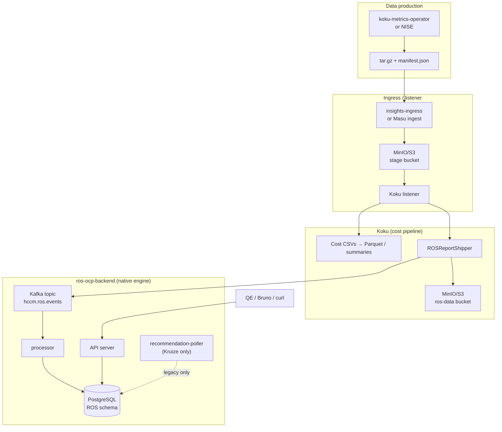

# Validating the Native Engine

This guide is for senior QE engineers (and developers) validating the **entire ROS-OCP native recommendation engine** (Go) on **x86-64** hardware. The native engine is a **complete rewrite** of recommendation logic previously handled by **Kruize** (Java / Autotune). Validation must cover **all plugins**, **cross-cutting platform features**, **Kruize-compatible API shapes** (so **koku-ui** needs no changes), **performance**, and **regression vs legacy**—not only OpenShift Virtualization (VM) recommendations.

**Document organization:** general platform and bread-and-butter features first (containers, API compat, cross-cutting), then specialized plugins (GPU, node, PVC, quota, snapshot), then VM scenarios and checklists at the end.

---

## Overview

**What changed:** `ros-ocp-backend` now computes OpenShift resource optimization recommendations in **Go** (the “native engine”), using plugins for containers, namespaces, nodes, GPU, PVC, quota, cluster-quota, snapshots, and VMs. The legacy **Kruize** path is optional and **mutually exclusive** with native plugins.

See also: [Native migration guide](../../docs/architecture/native-migration.md), [Features index](../features/index.md).

### Scope of validation (entire engine)

| Category | What to validate | Primary evidence |
|----------|------------------|------------------|
| **Plugins (recommendation types)** | All nine native plugins produce correct rows and API responses | DB tables, list/detail APIs, processor logs |
| **Cross-cutting** | Idle/zombie, business hours, fleet/savings summary, history/quality, terms, settings locks, dual engines | Filters, settings PUT, aggregate endpoints |
| **Kruize API compatibility** | Same paths and JSON nesting as Kruize for koku-ui | Detail `recommendation_terms`, `format` fields, box plots |
| **Data pipeline** | Kafka → S3 CSV download → digest → recommend | Listener + processor logs, `meta.count` |
| **Performance** | Latency, memory, DB query time under load | Prometheus, `hey`/`k6`, processor duration logs |
| **Regression** | Native vs Kruize where both can run (legacy env only) | Side-by-side comparison, known diffs doc |

#### Native plugins (all must be in scope)

| Plugin | Feature | ROS CSV / input | List API (representative) |
|--------|---------|-----------------|---------------------------|
| **container** | CPU/memory right-sizing (core; was Kruize) | `ocp_ros_usage.csv` | `GET .../recommendations/openshift` |
| **namespace** | Namespace quota targets | `ocp_ros_namespace_usage.csv` | `GET .../recommendations/openshift/namespace` |
| **gpu** | MIG bin-packing + time-slicing + classification | Same as container (+ GPU metrics) | `GET .../gpu`, `/gpu/mig`, `/gpu/timeslicing` |
| **node** | Underutilized / overcommitted nodes | Piggybacks on container CSV | `GET .../nodes`, `/nodes/utilization` |
| **pvc** | Oversized, near-full, growth projection | `ocp_storage_usage.csv` | `GET .../pvcs` |
| **quota** | ResourceQuota tighten/raise/optimal | Namespace digests + `ocp_ros_cluster_quota.csv` context | `GET .../quota/` |
| **cluster-quota** | ClusterResourceQuota vs namespace sums | `ocp_ros_cluster_quota.csv` | `GET .../cluster-quota/` |
| **snapshot** | Stale / orphaned / never-restored VolumeSnapshots | `ocp_snapshot_inventory.csv` | `GET .../snapshots` |
| **vm** | KubeVirt guest sizing (Preview/Beta) | `ocp_ros_vm_usage.csv` (+ optional GPU device CSV) | `GET .../vm`, `/vm/detail` |

**Not separate plugins but required:** idle/zombie detection (inside container/GPU produce paths), business hours (dual metric streams), savings via `KOKU_MASU_URL`.

#### Cross-cutting features

| Feature | Validate via |
|---------|----------------|
| Idle / zombie detection | `filter[idle_state]`, `idle_state`, `estimated_monthly_waste`, notification codes **5–7** |
| Business hours | `business_hours` block on detail engines; settings `.../settings/business-hours` |
| Fleet summary | `GET .../fleet-summary` |
| Savings summary | `GET .../savings-summary?engine=cost` |
| History & quality | `GET .../history`, `GET .../quality` |
| Configurable terms | `GET/PUT .../settings/terms?recommendation_type=<plugin>` |
| Per-plugin thresholds | `GET/PUT/DELETE .../settings/{container\|namespace\|node\|gpu\|pvc}` (deprecated alias: `.../settings/thresholds?recommendation_type=...`) |
| Global settings lock | `ROS_SETTINGS_LOCKED` → PUT/DELETE **403** |
| Dual engine (cost vs performance) | Nested `cost` / `performance` on containers; `filter[engine]` on VM/node |

### Validation priority (suggested order)

Use this order for a new native-engine QE cycle. **Containers and Kruize-compatible detail responses are highest priority** because production **koku-ui** Optimizations pages depend on them today.

| Priority | Area | Why first |
|----------|------|-----------|
| **P0** | Deployment + ingestion (Kafka, ROS CSVs, processor running) | Nothing else works without data |
| **P0** | Container list + detail + **Kruize JSON shape** | Primary UI surface; regression vs Kruize |
| **P0** | koku-ui-onprem smoke on `/optimizations` | End-user validation |
| **P1** | Settings API (thresholds, terms, locks) + dual engine | Tenant tuning and cost vs performance |
| **P1** | Idle/zombie + notifications + box plots | High-visibility UX |
| **P1** | Namespace recommendations | Quota guidance in UI |
| **P2** | GPU (MIG + time-slicing + summary) | Growing adoption |
| **P2** | Node, PVC, quota, cluster-quota, snapshot | On-prem feature completeness |
| **P2** | Fleet/savings summary, history, quality | FinOps dashboards |
| **P3** | VM plugin (Preview/Beta) | Newest; UI may be partial |
| **P3** | Performance / scalability / regression matrix | Release hardening |

**What you are validating (summary):**

- Data flows from operator-style payloads through Koku into ROS via **Kafka + S3/MinIO**
- The **processor** ingests ROS CSVs and runs native recommendation logic **inline** (no Kruize wait loop for the default deployment)
- The **API** exposes recommendations and settings under `/api/cost-management/v1/recommendations/openshift/...`
- **Every enabled plugin** returns sensible recommendations, notifications, and filters
- **koku-ui** renders list and breakdown without console errors when pointed at native engine data
- **VM recommendations** (when enabled) behave per design: idle/abandoned, guest-agent confidence, dual engines, history, settings

**What you do not need for native-engine validation:**

- Kruize / Autotune pods
- `recommendation-poller` process (only consumes `rosocp.kruize.recommendations` for legacy Kruize mode)
- A real OpenShift cluster (NISE replaces the koku-metrics-operator for local testing)

---

## Architecture

### High-level data flow



### How components connect

| Link | Mechanism | Notes |
|------|-----------|--------|
| Upload → Koku | Ingress or `ingest_ocp_payload` | Tarball lands in object storage; listener unpacks and processes |
| Koku → ROS | **`hccm.ros.events` Kafka topic** | Message contains **presigned S3 URLs** to ROS CSVs in `ros-data` (or configured `S3_ROS_BUCKET_NAME`) |
| ROS → CSV data | Processor **HTTP download** from URLs in Kafka message | Not a shared filesystem mount; URLs expire (48h default) |
| ROS → PostgreSQL | `pgx` pool (`DB_*` env vars) | On-prem chart often uses **same PostgreSQL** as Koku with a dedicated ROS DB user |
| Client → API | `http://<host>:8000/api/cost-management/v1/...` | **cost-onprem / SaaS:** Koku nginx **proxies** `/recommendations/` to `ros-api`. **Local ros-only:** hit ROS API directly on port 8000 |
| ROS → Koku (optional) | `KOKU_MASU_URL` | Dollar **savings** estimates; not required for core recommendation correctness |

### Native vs Kruize

| Mode | Env / config | Processes required |
|------|----------------|-------------------|
| **Native (default)** | `ROS_USE_NATIVE_ENGINE=true` (deprecated but default), native plugins enabled, **do not** set `ROS_ENABLED_PLUGINS=kruize` | `api` + `processor` |
| **Kruize legacy** | `ROS_ENABLED_PLUGINS=kruize` only | `api` + `processor` + `recommendation-poller` + Kruize service |

Native recommendations run in the **processor** after CSV ingestion (`process*CSVNative`, `RunVMRecommendations`, etc.). Expect log lines such as `native engine:` or `native VM engine:`.

---

## Prerequisites

### Hardware

| Resource | Recommendation |
|----------|----------------|
| **Architecture** | **x86-64** (amd64) — matches CI images and `podman build` defaults |
| **RAM** | **16 GB+** for full Koku + Kafka + MinIO + ROS locally; **8 GB** minimum for ROS-only quickstart |
| **CPU** | 4+ cores (parallel ingestion uses worker goroutines) |
| **Disk** | ~20 GB free for container images and NISE output |

### Software

| Tool | Version / notes |
|------|-----------------|
| **Git** | Clone sibling repos under one parent directory (e.g. `~/dev/koku/`) |
| **Docker or Podman** | Compose v2 for infrastructure |
| **Python** | **3.11+** for NISE (`pip install nise` or project venv) |
| **Go** | **1.25+** (see `ros-ocp-backend/go.mod`) if building/running from source |
| **curl**, **jq**, **psql** | API checks and DB verification |
| **Bruno** (optional) | Import API collection from `costmgmt-api-cheatsheet` |

### Repositories and branches

| Repository | Path | Branch / tag | Purpose |
|------------|------|--------------|---------|
| **ros-ocp-backend** | `~/dev/koku/ros-ocp-backend` | **`pgarciaq-rosocp-superpowers-phase11`** (native engine + VM work; may be named `phase11` on your fork) | Service under test |
| **koku** | `~/dev/koku/koku` | **`main`** unless your team pins an integration branch | Listener, ROS shipper, cost pipeline |
| **nise** | `~/dev/koku/nise` | **`main`** — VM generator and `examples/ocp_vm/vm_static_data.yml` are on main | Synthetic metrics CSVs |
| **costmgmt-api-cheatsheet** | `~/dev/koku/costmgmt-api-cheatsheet` | **`main`** | Bruno requests for ROS endpoints |
| **cost-onprem-chart** | `~/dev/koku/cost-onprem-chart` | **`main`** | Helm-based full stack on OpenShift (no docker-compose in chart) |
| **koku-metrics-operator** | `~/dev/koku/koku-metrics-operator` | Only for **real cluster** testing | Not required when using NISE |

```bash
# Example clone and checkout (adjust remotes to your forks)
cd ~/dev/koku
git -C ros-ocp-backend checkout pgarciaq-rosocp-superpowers-phase11
git -C koku checkout main
git -C nise checkout main
```

### Test identity (Koku dev customer)

Use a **bare numeric** `org_id` in JWT — Koku forms schema `org{org_id}` (e.g. `1234567` → `org1234567`). Do **not** put `org` in the claim.

```bash
export IDENTITY_JSON='{"identity":{"account_number":"10001","org_id":"1234567","type":"User","user":{"username":"user_dev","email":"user_dev@foo.com","is_org_admin":true,"access":{}}},"entitlements":{"cost_management":{"is_entitled":true}}}'
export IDENTITY=$(echo -n "$IDENTITY_JSON" | base64 -w0)
```

For **ingress system auth** (operator-style upload), the cluster UUID must appear in `identity.system.cn` — see [Generating test data](#generating-test-data).

### Exact `x-rh-identity` header (test customer)

Use this **verbatim** on every Koku/ROS API call and in Bruno as `xRhIdentity`:

```text
eyJpZGVudGl0eSI6eyJhY2NvdW50X251bWJlciI6IjEwMDAxIiwib3JnX2lkIjoiMTIzNDU2NyIsInR5cGUiOiJVc2VyIiwidXNlciI6eyJ1c2VybmFtZSI6InVzZXJfZGV2IiwiZW1haWwiOiJ1c2VyX2RldkBmb28uY29tIiwiaXNfb3JnX2FkbWluIjp0cnVlLCJhY2Nlc3MiOnt9fX0sImVudGl0bGVtZW50cyI6eyJjb3N0X21hbmFnZW1lbnQiOnsiaXNfZW50aXRsZWQiOnRydWV9fX0=
```

Decoded JSON (for reference only — send the base64 string, not this JSON):

```json
{"identity":{"account_number":"10001","org_id":"1234567","type":"User","user":{"username":"user_dev","email":"user_dev@foo.com","is_org_admin":true,"access":{}}},"entitlements":{"cost_management":{"is_entitled":true}}}
```

```bash
export IDENTITY='eyJpZGVudGl0eSI6eyJhY2NvdW50X251bWJlciI6IjEwMDAxIiwib3JnX2lkIjoiMTIzNDU2NyIsInR5cGUiOiJVc2VyIiwidXNlciI6eyJ1c2VybmFtZSI6InVzZXJfZGV2IiwiZW1haWwiOiJ1c2VyX2RldkBmb28uY29tIiwiaXNfb3JnX2FkbWluIjp0cnVlLCJhY2Nlc3MiOnt9fX0sImVudGl0bGVtZW50cyI6eyJjb3N0X21hbmFnZW1lbnQiOnsiaXNfZW50aXRsZWQiOnRydWV9fX0='
curl -s -H "x-rh-identity: $IDENTITY" 'http://localhost:8000/api/cost-management/v1/recommendations/openshift/vm?limit=1'
```

Tenant schema: `org1234567` (Koku prepends `org` to bare `org_id` **1234567**).

---

## Deployment order

Two supported layouts:

- **Path A — Integrated local stack:** Koku on-prem + MinIO + Kafka + listener + ROS (closest to cost-onprem)
- **Path B — ROS-focused quickstart:** ROS compose + optional ingress (fastest API/plugin iteration)

### Path A: Integrated Koku on-prem + native ROS

#### 1. Clone repos

See [Repositories and branches](#repositories-and-branches).

#### 2. Start Koku backend (on-prem)

```bash
cd ~/dev/koku/koku

# Required for compose file builds
grep -q USER_ID .env || echo "USER_ID=$(id -u)" >> .env
grep -q GROUP_ID .env || echo "GROUP_ID=$(id -g)" >> .env

export ONPREM=True
export USER_ID=$(id -u)
export GROUP_ID=$(id -g)

# Core API + workers
docker compose up -d db valkey unleash koku-server masu-server koku-worker koku-beat

# On-prem Kafka + listener (profiles in docker-compose.yml)
docker compose --profile onprem up -d kafka-zookeeper kafka init-kafka koku-listener
```

**Port 9000 conflict:** MinIO and the koku-ui dev server both use 9000. Stop the UI before starting MinIO.

#### 3. Start MinIO and ROS buckets

cost-onprem expects three bucket names; for local dev, align with listener/ingress conventions:

```bash
lsof -ti :9000 | xargs kill 2>/dev/null || true
docker compose up -d minio
sleep 3

docker run --rm --network koku_default --entrypoint sh minio/mc:latest -c "
  mc alias set local http://koku-minio:9000 kokuminioaccess kokuminiosecret &&
  mc mb --ignore-existing local/ocp-ingress &&
  mc mb --ignore-existing local/koku-bucket &&
  mc mb --ignore-existing local/ros-data &&
  mc mb --ignore-existing local/insights-upload-perma &&
  mc anonymous set public local/ocp-ingress
"
```

#### 4. Enable ROS shipping in Koku

Default Masu has `DISABLE_ROS_MSG=True`. For integrated testing, enable ROS Kafka messages and point at MinIO `ros-data`.

Add to `koku/.env` (or export on listener/masu/koku-worker):

```bash
DISABLE_ROS_MSG=False
S3_ROS_ACCESS_KEY=kokuminioaccess
S3_ROS_SECRET=kokuminiosecret
S3_ROS_ENDPOINT=http://koku-minio:9000
S3_ROS_BUCKET_NAME=ros-data
S3_ROS_REGION=us-east-1
```

Restart listener and masu after changing env:

```bash
docker compose restart koku-listener masu-server koku-worker
```

#### 5. Build and run ros-ocp-backend

**Option 5a — Run from source (recommended for QE on phase11 branch):**

```bash
cd ~/dev/koku/ros-ocp-backend
cp .env.example .env

# Use Koku's Postgres on host port 15432, OR ros compose db-ros (see Path B)
# For shared Koku DB, set DB_HOST=localhost DB_PORT=15432 and run ROS migrations against that DB.

# Kafka from Koku on-prem profile
export KAFKA_BOOTSTRAP_SERVERS=localhost:9092
export UPLOAD_TOPIC=hccm.ros.events
export RBAC_ENABLE=false
export ROS_DISABLED_PLUGINS=kruize
# Explicit native plugins (optional; default is all native except kruize):
# export ROS_ENABLED_PLUGINS=container,gpu,node,pvc,quota,cluster-quota,snapshot,vm,namespace

go run rosocp.go db migrate up

# Three terminals — native mode: API + processor only (no recommendation-poller)
make run-api-server          # :8000, PROMETHEUS_PORT=5007
make run-processor           # PROMETHEUS_PORT=5005
```

**Option 5b — Container image (x86-64):**

```bash
cd ~/dev/koku/ros-ocp-backend
podman build -t ros-ocp-backend:qe-native -f Dockerfile .
# Run api and processor containers with same env as above, network host or published ports
```

**Option 5c — OpenShift cost-onprem Helm chart:**

No docker-compose in `cost-onprem-chart`. Deploy on a cluster with `scripts/deploy-test-cost-onprem.sh` and rebuild/push images with a **new tag** before E2E (`imagePullPolicy: IfNotPresent`). See `cost-onprem-chart/CLAUDE.md` and chart `values.yaml` under `ros.image`.

#### 6. Key environment variables (native engine)

| Variable | Typical local value | Purpose |
|----------|---------------------|---------|
| `DB_HOST` / `DB_PORT` | `localhost` / `15432` | ROS PostgreSQL |
| `KAFKA_BOOTSTRAP_SERVERS` | `localhost:9092` or `localhost:29092` | Must match broker you started |
| `UPLOAD_TOPIC` | `hccm.ros.events` | Processor subscription |
| `RBAC_ENABLE` | `false` | Simplifies local API calls |
| `ROS_ENABLED_PLUGINS` | empty (all native) or explicit list | Allowlist plugins |
| `ROS_DISABLED_PLUGINS` | `kruize` (recommended) | Ensure Kruize is off |
| `ROS_ENABLE_VM_RECS` | `true` (default) | VM routes and plugin |
| `ROS_TAGS_ENABLED` | `true` | Tag filters (on-prem: `ROS_TAGS_SOURCE=db`) |
| `ROS_TAGS_SOURCE` | `db` when sharing Koku PostgreSQL | Read Koku tag tables |
| `KOKU_MASU_URL` | `http://localhost:5042` | Optional savings from masu |
| `ROS_SETTINGS_LOCKED` | `false` for settings tests | `true` → PUT/DELETE return 403 |
| `ROS_KAFKA_PARALLEL` | `true` | Parallel message processing |
| `ROS_KAFKA_WORKERS` | `3` | Worker goroutines |

Full reference: `docs-site/configuration.md`, `docs-site/architecture/configurability.md`.

#### 7. Verify services are healthy

```bash
# Koku API
curl -s http://localhost:8000/api/cost-management/v1/status/ | python3 -m json.tool

# Masu
curl -s http://localhost:5042/api/cost-management/v1/status/ | python3 -m json.tool

# ROS API (direct)
curl -s http://localhost:8000/status | python3 -m json.tool

# Kafka topic
docker exec koku-kafka kafka-topics --bootstrap-server localhost:9092 --list | grep hccm.ros.events

# Processor logs (after a test upload)
# Expect: "reports uploaded to S3 for ROS", "native engine", "native VM engine"
```

When using **Koku nginx proxy** (cost-onprem / clowder), the same recommendation URLs are served on **Koku port 8000**; nginx forwards `/api/cost-management/v1/recommendations/` to `ros-api:8000`.

---

### Path B: ROS quickstart (standalone compose)

From `docs-site/quickstart.md`:

```bash
cd ~/dev/koku/ros-ocp-backend
cp .env.example .env

docker compose -f scripts/docker-compose.yml up -d db-ros kafka zookeeper kafka-create-topics

go run rosocp.go db migrate up
make run-api-server
make run-processor
```

Optional ingress for upload testing:

```bash
# Set MINIO_ACCESS_KEY / MINIO_SECRET_KEY in scripts/.env for ingress service
docker compose -f scripts/docker-compose.yml up -d ingress minio
```

This path uses **separate** `db-ros` on port **15432** and Kafka on **29092** — wire Koku to the same brokers/buckets if you combine Path A + B.

---

## Generating test data

NISE mimics koku-metrics-operator CSV output. Use **`--write-monthly`** locally (not `--daily-reports`, which needs `INSIGHTS_ACCOUNT_ID` / `INSIGHTS_ORG_ID`). Use **`--ros-ocp-info`** for ROS files.

### Cluster UUID

Use the OCP provider UUID from Koku (must match source/cluster):

```bash
docker compose -f ~/dev/koku/koku/docker-compose.yml exec db psql -U postgres -d postgres -c "
  SELECT p.uuid::text, a.credentials
  FROM api_provider p
  LEFT JOIN api_providerauthentication a ON p.authentication_id = a.id
  WHERE p.type = 'OCP'
  ORDER BY p.name;"
```

Set:

```bash
export CLUSTER_UUID="<your-ocp-provider-uuid>"
```

### Container, namespace, node, GPU, PVC, quota, snapshot data

```bash
cd ~/dev/koku/nise
pip install -e .   # or use .venv

# Copy and edit dates in examples/ocp_on_aws/ocp_static_data.yml if needed
nise report ocp \
  --static-report-file examples/ocp_on_aws/ocp_static_data.yml \
  --ocp-cluster-id "$CLUSTER_UUID" \
  --ros-ocp-info \
  --write-monthly \
  -w /tmp/nise-ros-output
```

**ROS files produced (monthly naming):**  
`Month-Year-<uuid>-ocp_ros_usage.csv`, `ocp_ros_namespace_usage.csv`, `ocp_storage_usage.csv`, `ocp_snapshot_inventory.csv`, `ocp_ros_cluster_quota.csv`, etc.

See `docs-site/testing.md` for the full filename ↔ plugin matrix.

### VM recommendations data

```bash
nise report ocp \
  --static-report-file examples/ocp_vm/vm_static_data.yml \
  --ocp-cluster-id "$CLUSTER_UUID" \
  --ros-ocp-info \
  -s 2026-05-01 -e 2026-05-28 \
  -w /tmp/nise-vm-output
```

**Required for VM plugin:** `ocp_ros_vm_usage.csv` (and `ocp_ros_vm_gpu_device.csv` when GPU scenarios are enabled).

Template scenarios: idle, abandoned, guest agent on/off, Windows spike, crash loop, GPU classifications — see `nise/docs/ocp_vm_generator.md` and `nise/examples/ocp_vm/vm_static_data.yml`.

On-prem E2E template: `cost-onprem-chart/tests/data/nise_templates/ocp_report_vm.yml`.

#### NISE VM scenario map (`vm_static_data.yml`)

Source: `~/dev/koku/nise/examples/ocp_vm/vm_static_data.yml`. Extend `end_date` to **≥ 7 days** after `start_date` so `medium_term` VM recommendations appear (`min_data_days`).

| VM name | NISE flags | Expected notifications | Expected API signals |
|---------|------------|------------------------|----------------------|
| `web-server-linux-01` | guest agent, active | — (healthy baseline) | `confidence`: **high**; cost engine downsize possible |
| `idle-vm-linux-01` | `idle: true` | **18** (idle) | `filter[is_idle]=true`; not abandoned |
| `db-server-windows-01` | Windows, guest agent | — | Windows floors; may see **47** if spike enabled elsewhere |
| `legacy-app-01` | `guest_agent: false` | **38** (no guest agent) | `confidence`: **moderate** |
| `idle-windows-legacy-01` | idle, no agent | **18**, **38** | idle + moderate confidence |
| `late-agent-install-vm` | `agent_install_hour: 2` | **44** (agent interrupted) | mixed hypervisor/guest metrics early window |
| `agent-removed-vm` | `agent_remove_day: 5` | **44** | guest columns empty after day 5 |
| `crash-loop-vm-01` | `crash_loop: true` | **48** (frequent restarts) | elevated `restart_count` in digests |
| `abandoned-test-vm-01` | `abandoned: true` | **43** (abandoned) — **not 18** | `recommended` vCPU/memory **0**; `filter[is_abandoned]=true` |
| `windows-update-spike-vm` | `windows_update_spike: true` | **47** | performance engine P99 >> P95 |
| `downsize-unstable-vm` | `downsize_unstable: true` | **49** (performance downsize held) | compare `filter[engine]=performance` vs cost |
| `unknown-os-vm` | `guest_os: ""` | **46** | Linux defaults applied |
| `windows-high-usage-vm` / `linux-high-usage-vm` | `fixed_usage` 70/85% | — | kernel reserve comparison pair |
| `gpu-idle-vm` | GPU idle passthrough | **50** | `filter[has_gpu]=true`; `gpu_classification=idle` |
| `gpu-underutil-mig-vm` | MIG, low util | **51** | MIG profile in `gpu_devices` |
| `gpu-saturated-vm` | 2× GPU saturated | **52**, **53** | memory vs compute saturation codes |
| `gpu-healthy-vm` | medium util | — | balanced GPU; few notifications |
| `multi-gpu-mixed-vm` | mixed device util | **54** | detail shows 2 `gpu_devices` with different util |
| `variable-cpu-vm` | `cpu_pattern: variable` | — | adaptive CPU margin exercise |
| `u1-medium-vm` | small shape | — | `current_instance_type` populated |
| `instance-type-rec-01` | `oversized_for_instance_type` | **41** | `recommended.instance_type` set |
| `high-io-vm-01` | `high_io: true` | **39** | `io_profile.hint` in detail |
| `preference-server-vm` | fixed usage | — | preference fields when `cluster_instance_types.json` uploaded |

Full matrix with confidence and engine columns: [Expected behavior matrix](#expected-behavior-matrix-nise-vm-scenarios) below.

### Combined manifest (Koku + ROS)

Create `manifest.json` in the monthly output folder. **`start` and `end` are required** for Koku cost summaries.

```json
{
  "uuid": "02059694-68ab-4d58-8809-de1e91f1d0e5",
  "cluster_id": "CLUSTER_UUID_HERE",
  "date": "2026-05-28T00:00:00",
  "start": "2026-05-01T00:00:00",
  "end": "2026-05-28T00:00:00",
  "version": "1.0.0",
  "files": [
    "May-2026-CLUSTER_UUID-ocp_pod_usage.csv",
    "May-2026-CLUSTER_UUID-ocp_storage_usage.csv",
    "May-2026-CLUSTER_UUID-ocp_node_label.csv"
  ],
  "resource_optimization_files": [
    "May-2026-CLUSTER_UUID-ocp_ros_usage.csv",
    "May-2026-CLUSTER_UUID-ocp_ros_namespace_usage.csv",
    "May-2026-CLUSTER_UUID-ocp_ros_vm_usage.csv"
  ]
}
```

Replace filenames with actual NISE output names.

### Package tarball (strip `./` prefix)

```bash
cd /tmp/nise-ros-output/<cluster>/<month-folder>
tar czf /tmp/ros-upload.tar.gz --transform='s|^\./||' manifest.json *.csv
```

### Upload and trigger ingestion

**Via Masu (Koku local, matches listener flow):**

```bash
# Upload tarball to MinIO (key without .tar.gz suffix for ingest_ocp_payload pattern)
PAYLOAD=$(python3 -c "import uuid; print(uuid.uuid4().hex)")
docker run --rm --network koku_default \
  -v /tmp/ros-upload.tar.gz:/data/${PAYLOAD}.2026_05 \
  --entrypoint sh minio/mc:latest -c "
    mc alias set local http://koku-minio:9000 kokuminioaccess kokuminiosecret &&
    mc cp /data/${PAYLOAD}.2026_05 local/ocp-ingress/${PAYLOAD}.2026_05
  "

curl -s "http://localhost:5042/api/cost-management/v1/ingest_ocp_payload/?org_id=1234567&payload_name=${PAYLOAD}.2026_05"
```

**Via ingress (operator-style):**

```bash
# system identity: org_id + cluster cn
export INGRESS_IDENTITY=$(echo -n "{\"identity\":{\"org_id\":\"1234567\",\"type\":\"System\",\"auth_type\":\"cert-auth\",\"system\":{\"cn\":\"${CLUSTER_UUID}\",\"cert_type\":\"system\"},\"internal\":{\"org_id\":\"1234567\"}}}" | base64 -w0)

curl -X POST \
  -F "file=@/tmp/ros-upload.tar.gz;type=application/vnd.redhat.hccm.tar+tgz" \
  -H "x-rh-identity: $INGRESS_IDENTITY" \
  http://localhost:3000/api/ingress/v1/upload
```

**Do not use** combined `openshift_report.*.csv` from `--insights-upload` only — mixed columns break Koku report typing. Prefer typed monthly files.

### Watch processing

```bash
# Koku listener — ROS shipper
docker compose logs --since=5m koku-listener 2>&1 | grep -iE "ROS reports|hccm.ros.events|error"

# ROS processor
# Terminal running make run-processor — look for:
#   "native engine"
#   "native VM engine"
#   "recommendation" / "no recommendations"
```

---

## Verifying recommendations

### Timeline

| Stage | Typical duration | Signal |
|-------|------------------|--------|
| Listener unpack + Koku cost processing | 2–15 min | Worker logs `manifest marked complete` |
| ROS S3 upload + Kafka message | Seconds after listener handles ROS files | Listener: `reports uploaded to S3 for ROS, sending kafka message` |
| Processor download + ingest + **native recommend** | **1–5 min** per message (depends on CSV size) | Processor logs; no 24h Kruize poll |
| API visible | Immediately after DB write | `meta.count` > 0 |

**VM medium_term** needs **≥ 7 days** of data in the term window (`min_data_days`). Generate at least 7–15 days of daily digests in NISE date range.

**Settings cache:** Changes via PUT may take up to **60 seconds** to affect new recommendations unless cache was invalidated by the API.

### Log patterns (processor and engine)

Grep **ros-ocp-backend processor** logs (not Koku listener) after a Kafka message is consumed:

```bash
# Recent processor output (adjust container/pod name for your deployment)
kubectl logs -l app.kubernetes.io/component=ros-processor -n cost-onprem --tail=200 2>/dev/null \
  | grep -iE 'native engine|native VM|native namespace|native storage|native snapshot|node recs|vm recs|quota|cluster-quota|unable to fetch|wrote [0-9]+'
```

| Grep pattern | Meaning |
|--------------|---------|
| `native engine: wrote` | Container recommendations persisted (`wrote N recommendations`) |
| `native engine: no recommendations produced` | Container path ran; empty result (valid for sparse data) |
| `native engine: digest processing failed` | ROS usage CSV parse/upsert error |
| `native engine: unable to fetch CSV from URL` | Presigned URL expired or network/S3 misconfig |
| `native VM engine: cluster instance types ingested` | Optional `cluster_instance_types.json` loaded |
| `native VM engine: ingest failed` | `ocp_ros_vm_usage.csv` parse/upsert failed |
| `native VM engine: recommendations failed` | `RunVMRecommendations` error |
| `vm recs: upserted` | VM recommendations written (`upserted N recommendations`) |
| `vm recs: no VM digests` | No rows in `daily_vm_digests` for cluster/date range |
| `VM GPU device CSV: no digest for` | GPU device CSV arrived before VM usage digest for that day |
| `native namespace engine: wrote` | Namespace recommendations |
| `native storage engine: wrote` | PVC recommendations |
| `native snapshot engine: wrote` | Snapshot recommendations |
| `node recs: persist failed` | Node recommendation upsert error |
| `native engine: quota recommendations failed` | Quota plugin post-container hook (non-fatal) |

**Koku listener** (ROS shipper — message must exist before processor runs):

```bash
docker compose logs --since=5m koku-listener 2>&1 | grep -iE 'reports uploaded to S3 for ROS|hccm.ros.events|error'
```

**Failures outside ROS:**

```text
No ROS reports to handle in the current payload.    # manifest missing resource_optimization_files
ROS report handling disabled                       # DISABLE_ROS_MSG=True in Koku
```

### Database schema and verification queries

Connect to ROS PostgreSQL (same instance as Koku in integrated setup; ROS tables live in the **postgres** database, keyed by `org_id` string **1234567**):

```bash
PGPASSWORD=postgres psql -h localhost -p 15432 -U postgres -d postgres
```

| Table | Purpose |
|-------|---------|
| `recommendation_sets` | Container (and workload) recommendations — one row per container × term × engine |
| `daily_vm_digests` | VM daily aggregated metrics (15-min samples rolled up) |
| `vm_recommendations` | Current VM sizing recommendations (per VM × term × engine) |
| `vm_recommendation_history` | Historical VM recommendation snapshots |
| `vm_gpu_device_digests` | Per-GPU device metrics linked to `daily_vm_digests.id` |
| `node_recommendations` | Node consolidation recommendations |
| `pvc_recommendation_sets` | PVC right-sizing recommendations |
| `quota_recommendation_sets` | Namespace ResourceQuota recommendations |
| `cluster_quota_recommendation_sets` | ClusterResourceQuota recommendations |

```sql
-- Containers (native engine)
SELECT org_id, cluster_uuid, namespace, workload, container_name, term, engine,
       notification_codes, updated_at
FROM recommendation_sets
WHERE org_id = '1234567'
ORDER BY updated_at DESC NULLS LAST
LIMIT 10;

-- VM digests (ingestion succeeded?)
SELECT cluster_uuid, namespace, vm_name, usage_date, sample_count, agent_sample_count,
       guest_os, is_idle, is_abandoned
FROM daily_vm_digests
WHERE org_id = '1234567'
ORDER BY usage_date DESC
LIMIT 20;

-- VM recommendations (API source)
SELECT vm_name, namespace, term, engine, confidence, is_idle, is_abandoned,
       recommended_vcpu, recommended_memory_gib, notification_codes, last_recommended_at
FROM vm_recommendations
WHERE org_id = '1234567'
ORDER BY last_recommended_at DESC
LIMIT 20;

-- VM history
SELECT vm_name, namespace, term, engine, recommended_vcpu, recommended_memory_gib, recorded_at
FROM vm_recommendation_history
WHERE org_id = '1234567'
ORDER BY recorded_at DESC
LIMIT 10;

-- VM GPU devices (detail API `gpu_devices`)
SELECT d.vm_name, d.namespace, g.gpu_uuid, g.gpu_model, g.classification, g.utilization_pct
FROM vm_gpu_device_digests g
JOIN daily_vm_digests d ON d.id = g.vm_digest_id
WHERE d.org_id = '1234567'
LIMIT 20;

-- Nodes
SELECT node, term, engine, is_underutilized, notification_codes, updated_at
FROM node_recommendations
WHERE org_id = '1234567'
ORDER BY updated_at DESC
LIMIT 10;

-- PVCs
SELECT namespace, persistentvolumeclaim, recommendation_type, recommended_bytes,
       notification_codes, updated_at
FROM pvc_recommendation_sets
WHERE org_id = '1234567'
ORDER BY updated_at DESC
LIMIT 10;

-- ResourceQuota
SELECT namespace, quota_name, recommendation_type, risk_level, updated_at
FROM quota_recommendation_sets
WHERE org_id = '1234567'
ORDER BY updated_at DESC
LIMIT 10;

-- ClusterResourceQuota
SELECT namespace, crq_name, recommendation_type, risk_level, updated_at
FROM cluster_quota_recommendation_sets
WHERE org_id = '1234567'
ORDER BY updated_at DESC
LIMIT 10;

-- Container GPU classifications (not VM table)
SELECT namespace, workload, container_name, gpu_classification
FROM gpu_classifications
WHERE org_id = '1234567'
LIMIT 5;
```

Adjust `org_id` if your tenant differs.

### API smoke (after ingestion)

```bash
# Containers
curl -s -H "x-rh-identity: $IDENTITY" \
  'http://localhost:8000/api/cost-management/v1/recommendations/openshift?limit=5' \
  | python3 -m json.tool

# VMs
curl -s -H "x-rh-identity: $IDENTITY" \
  "http://localhost:8000/api/cost-management/v1/recommendations/openshift/vm?filter[cluster]=${CLUSTER_UUID}&limit=20" \
  | python3 -m json.tool
```

Expect `meta.count` ≥ 1 when data and plugins match. Empty `data` with `count: 0` — see [Troubleshooting](#troubleshooting).

---

## Kruize API compatibility validation

**koku-ui** (and Bruno collections in `costmgmt-api-cheatsheet`) call the **same URL paths** Kruize used. The native engine must return **compatible JSON** so the UI does not require changes. Implementation reference: `internal/model/detail_response.go` (`BuildDetailResponse`, `BuildNamespaceDetailResponse`), handlers in `internal/api/handlers.go`.

### Endpoints koku-ui uses (container-focused)

| UI flow | Method | Path | Notes |
|---------|--------|------|-------|
| Optimizations list | GET | `/recommendations/openshift` | Paginated; `meta.count`, `data[]` |
| Breakdown / detail | GET | `/recommendations/openshift/{recommendation-id}` | Kruize-nested detail shape |
| Namespace list | GET | `/recommendations/openshift/namespace` or `/namespaces` | Same term/engine nesting |
| Settings | GET/PUT | `/recommendations/openshift/settings/*` | Thresholds, terms, idle, business hours |
| GPU / nodes / PVC / VM | GET | Domain-specific paths under `/recommendations/openshift/...` | See [Key recommendation endpoints](#key-recommendation-endpoints) |

On **cost-onprem**, Koku nginx proxies `/api/cost-management/v1/recommendations/` to **ros-api**; local dev may hit ROS on port 8000 with the same path prefix.

### Detail response shape (must match Kruize)

The UI reads nested structures under `recommendations`, not flat millicore fields alone. Per term (`short_term`, `medium_term`, `long_term`):

| Path | Required content |
|------|------------------|
| `recommendations.monitoring_end_time` | RFC3339 UTC string (from digest window) |
| `recommendations.current` | `requests` / `limits` with `cpu` and `memory` objects |
| `recommendations.recommendation_terms.<term>.duration_in_hours` | `24` / `168` / `360` for short/medium/long |
| `recommendations.recommendation_terms.<term>.recommendation_engines.cost` | `config`, optional `variation`, `notifications`, optional `business_hours` |
| `recommendations.recommendation_terms.<term>.recommendation_engines.performance` | Same structure as cost |
| `recommendations.recommendation_terms.<term>.plots.plots_data` | Box plot quartiles for CPU and memory |
| `recommendations.recommendation_terms.<term>.notifications` | Map keyed by code string |

Each resource value in **config** / **current** / **business_hours** must use:

| Field | CPU | Memory |
|-------|-----|--------|
| `amount` | float (cores, e.g. `0.5` = 500m) | float (MiB) |
| `format` | **`"cores"`** | **`"MiB"`** |

**Invalid for UI:** `"millicores"`, `"bytes"`, or missing `format`. Native code converts internally via `mcToCores` / `kibToMiB` in `detail_response.go`.

Variation percentages use `format: "percent"` on `variation.requests.cpu` / `memory`.

### Compatibility verification checklist

| # | Check | Command / action |
|---|--------|------------------|
| 1 | Detail returns all three terms when data spans windows | `GET .../recommendations/openshift/{id}` → jq `.recommendations.recommendation_terms \| keys` |
| 2 | Both engines present per term | jq `.recommendations.recommendation_terms.medium_term.recommendation_engines \| keys` → `["cost","performance"]` |
| 3 | CPU format is `cores` | jq `...cost.config.requests.cpu.format` → `"cores"` |
| 4 | Memory format is `MiB` | jq `...cost.config.requests.memory.format` → `"MiB"` |
| 5 | Box plots non-empty for medium_term | jq `...medium_term.plots.plots_data` has CPU/memory series |
| 6 | Notifications map shape | Keys are strings; values have `type`, `message`, `code` |
| 7 | List view still works | `GET .../recommendations/openshift?limit=5` → `meta.count` > 0 |
| 8 | UI renders breakdown | Deploy koku-ui-onprem (see [End-to-end with koku-ui](#end-to-end-with-koku-ui)); open workload breakdown without JS errors |

```bash
REC_ID=$(curl -s -H "x-rh-identity: $IDENTITY" \
  'http://localhost:8000/api/cost-management/v1/recommendations/openshift?limit=1' \
  | jq -r '.data[0].id')

curl -s -H "x-rh-identity: $IDENTITY" \
  "http://localhost:8000/api/cost-management/v1/recommendations/openshift/${REC_ID}" \
  | jq '{
    terms: (.recommendations.recommendation_terms | keys),
    cpu_format: .recommendations.recommendation_terms.medium_term.recommendation_engines.cost.config.requests.cpu.format,
    mem_format: .recommendations.recommendation_terms.medium_term.recommendation_engines.cost.config.requests.memory.format,
    has_plots: (.recommendations.recommendation_terms.medium_term.plots.plots_data != null)
  }'
```

Further UI field documentation: [UI Integration Guide](../ui-integration-guide.md).

---

## Container recommendations validation

Container right-sizing is the **original core feature** (formerly 100% Kruize). Validate thoroughly before specialized plugins.

### Prerequisites

- `ocp_ros_usage.csv` in `resource_optimization_files`
- `container` plugin enabled (default)
- **≥ 1 day** of samples for `short_term`; **≥ 7 days** recommended for `medium_term` (match NISE date range)
- `ROS_DISABLED_PLUGINS` must **not** include `kruize`

### Checklist

| # | Check | How to verify | Expected |
|---|--------|---------------|----------|
| 1 | Recommendations persisted | `SELECT count(*) FROM recommendation_sets WHERE org_id='1234567'` | > 0 after ingest |
| 2 | All terms populated (when data allows) | Detail API `recommendation_terms` keys | `short_term`, `medium_term`, `long_term` |
| 3 | Cost vs performance differ on spiky workloads | Compare `config.requests.cpu.amount` for same term | Performance ≥ cost on CPU for spike patterns |
| 4 | Box plots populated | Detail `plots.plots_data` | Non-null CPU/memory quartiles |
| 5 | Idle detection | `filter[idle_state]=idle` or `zombie` | Matching workloads; codes **5–7** |
| 6 | Zombie waste field | List row with `idle_state=zombie` | `estimated_monthly_waste` present |
| 7 | OOM bump (if NISE/OOM events) | Notification code **4** or higher memory vs usage-only | See container feature doc |
| 8 | Tag filter | `filter[tag:app]=<value>` when tags enabled | Subset of workloads |
| 9 | Savings (optional) | `estimated_monthly_savings` on list | Non-zero when `KOKU_MASU_URL` + cost model; else code **25** |
| 10 | Processor log | Grep processor | `native engine: wrote N recommendations` |

### Workload pattern matrix (NISE / manual)

| Pattern | NISE / setup hint | What to assert |
|---------|-------------------|----------------|
| **Steady** | Default `ocp_static_data.yml` containers | Cost ≈ performance; small variation % |
| **Spiky** | Increase max vs avg CPU in static YAML | Performance engine CPU > cost; possible notification **2** |
| **Growing** | Ramp usage over date range | Medium/long term requests ≥ short_term |
| **Idle** | Near-zero usage, requests still high | `idle_state=idle`, downsize or waste |
| **Zombie** | Zero usage sustained | `idle_state=zombie`, waste estimate |

```bash
# List with idle filter
curl -s -H "x-rh-identity: $IDENTITY" \
  'http://localhost:8000/api/cost-management/v1/recommendations/openshift?filter[idle_state]=idle&limit=10' \
  | jq '.meta.count, .data[0].idle_state'
```

---

## Namespace recommendations validation

| # | Check | API / DB |
|---|--------|----------|
| 1 | Namespace rows after ingest | `GET .../recommendations/openshift/namespace` → `meta.count` > 0 |
| 2 | Detail Kruize shape | `GET .../namespace/{id}` → `recommendation_terms` + engines |
| 3 | Aggregates container guidance | DB: namespace recommendations align with sum of container recs in namespace |
| 4 | Memory trend notification | Code **3** when growth detected (see notification catalog) |

Data file: `ocp_ros_namespace_usage.csv`. Logs: `native namespace engine: wrote`.

---

## Node recommendations validation

Handlers: `internal/api/handlers_node_recs.go`. Feature doc: [Node recommendations](../features/node-recommendations.md).

| # | Check | How to verify | Expected |
|---|--------|---------------|----------|
| 1 | Node recs exist | `GET .../recommendations/openshift/nodes?filter[cluster]=${CLUSTER_UUID}` | `meta.count` > 0 |
| 2 | Engine filter | `?engine=cost` vs `?engine=performance` | Different target utilization / headroom |
| 3 | Underutilized flag | `filter[is_underutilized]=true` | Nodes below cost threshold (~80% util target) |
| 4 | Overcommitted nodes | High pod density scenarios in NISE | Notifications per node feature doc |
| 5 | Utilization endpoint | `GET .../nodes/utilization` | Per-node CPU/memory util for charts |
| 6 | DB consistency | `node_recommendations` table | Rows per node × term × engine |
| 7 | Node thresholds | `GET .../settings/node` | PUT changes reflected after recalc |

Logs: `node recs:` (success or `persist failed`).

---

## PVC recommendations validation

Data: `ocp_storage_usage.csv` in manifest `files` (cost pipeline) and storage metrics for PVC plugin.

| # | Check | API / signal |
|---|--------|--------------|
| 1 | List returns PVCs | `GET .../pvcs?filter[cluster]=...` |
| 2 | Oversized PVC | `recommendation_type` or classification = oversized; notification **11** region |
| 3 | Near-full PVC | Growth projection; codes **12–13** |
| 4 | Growth projection | `recommended_bytes` < current for oversized; growth rate fields populated |
| 5 | Savings on tighten | `estimated_monthly_savings` when Masu rates available |
| 6 | DB | `pvc_recommendation_sets` rows with `notification_codes` |

Logs: `native storage engine: wrote`.

---

## Quota and ClusterResourceQuota validation

| # | ResourceQuota (`quota` plugin) | ClusterResourceQuota (`cluster-quota`) |
|---|-------------------------------|----------------------------------------|
| 1 | `GET .../quota/?filter[namespace]=...` | `GET .../cluster-quota/` |
| 2 | Recommendation types: **tighten**, **raise**, **optimal** | Same classification model |
| 3 | `risk_level`: low / medium / high | Aligns with headroom % thresholds |
| 4 | Settings | `GET/PUT .../settings/quota` | `GET/PUT .../settings/cluster-quota` |
| 5 | DB tables | `quota_recommendation_sets` | `cluster_quota_recommendation_sets` |
| 6 | Notifications | Codes **14–17** (see [Notification codes](#notification-codes)) | CRQ-specific codes in catalog |

Cluster quota CSV: `ocp_ros_cluster_quota.csv`. Quota plugin also reads namespace digests after container processing.

---

## Snapshot recommendations validation

Data: `ocp_snapshot_inventory.csv`.

| # | Check | Expected |
|---|--------|----------|
| 1 | `GET .../snapshots` | Lists stale/orphaned/redundant snapshots |
| 2 | Classification | `stale`, `orphaned`, `never_restored`, etc. per feature doc |
| 3 | Cost estimate | Monthly savings when snapshot storage cost attributable |
| 4 | Settings | `GET/PUT .../settings/snapshot` |
| 5 | DB + logs | Snapshot recommendation table; `native snapshot engine: wrote` |

---

## Cross-cutting platform validation

| Feature | Validation steps |
|---------|------------------|
| **History** | After second ingest or threshold change: `GET .../history?limit=20` shows versioned entries |
| **Quality** | `GET .../quality` returns stability/adoption metrics for containers |
| **Fleet summary** | `GET .../fleet-summary` aggregates across clusters (multi-cluster NISE or multiple sources) |
| **Savings summary** | `GET .../savings-summary?engine=cost`; compare with sum of row-level savings |
| **Business hours** | Configure `PUT .../settings/business-hours`; verify `business_hours` on detail engines after reship |
| **Capabilities** | `GET .../settings/capabilities` lists enabled plugins and `locked_fields` |
| **CSV export** | List endpoints with `?format=csv` return headers including `currency` when savings enabled |

---

## Performance and scalability testing

Native engine runs **inline in the processor** after each Kafka message (no 24h Kruize poll). Validate scale before large customer rollouts.

### Scale targets (order-of-magnitude)

| Dimension | Dev expectation | Stress goal (QE) |
|-----------|-----------------|------------------|
| Containers per cluster | 100–500 (NISE static YAML) | 5,000+ (scaled YAML or duplicated rows) |
| VMs per cluster | 20–30 (`vm_static_data.yml`) | 500+ |
| Nodes | 4–20 | 100+ |
| Kafka messages / hour | 1–12 (hourly operator) | Parallel uploads |
| API concurrent readers | 10 | 50+ |

Exact SLOs are deployment-specific; record baseline on your hardware.

### Generating large-scale data

1. **NISE:** Copy `ocp_static_data.yml` and multiply namespaces, pods, or nodes; extend `start_date`/`end_date` for longer terms.
2. **Multiple clusters:** Register several OCP sources; run NISE per `CLUSTER_UUID`; verify fleet endpoints aggregate.
3. **Repeated ingest:** Re-upload monthly tarballs to measure incremental upsert time (should not full-table scan unbounded).

### Measuring recommendation generation time

```bash
# Processor: time from Kafka consume to log line
# Grep: "native engine: wrote" with timestamp delta from "processing message"

# Optional: Prometheus histograms on processor (PROMETHEUS_PORT=5005)
curl -s localhost:5005/metrics | grep -i ros
```

Record: CSV size (MB), wall-clock seconds, rows in `recommendation_sets`, RSS memory of processor process.

### Database performance

| Check | Action |
|-------|--------|
| List API latency | `GET .../recommendations/openshift?limit=100` with `time curl` |
| Explain plan | `EXPLAIN ANALYZE` on list query patterns (org_id + cluster + updated_at) |
| Indexes | Migrations should index `org_id`, `cluster_uuid`, `updated_at` on recommendation tables |
| Connection pool | Under load, no `ROS_DB_ACQUIRE_TIMEOUT` errors in API logs |

### API load testing

Use **hey** or **k6** against list + detail (with valid `x-rh-identity`):

```bash
# Example: 50 concurrent list requests for 30s (install hey first)
hey -n 500 -c 50 -H "x-rh-identity: $IDENTITY" \
  "http://localhost:8000/api/cost-management/v1/recommendations/openshift?limit=20"
```

Watch API pod/container CPU, `ROS_DB_MAX_CONNS`, and p95 latency. Flush Valkey if testing through Koku proxy with caching enabled.

### Memory under load

- Run processor with large CSV; monitor RSS (should stabilize after message completes)
- Go benchmarks in repo: `go test -bench=. -run='^$' ./internal/engine/`
- CI uses goleak for goroutine leaks (`make test`)

---

## Regression testing (native vs Kruize)

For environments still running Kruize, compare outputs before cutover. **Production validation should be native-only** (`ROS_DISABLED_PLUGINS=kruize`).

| Aspect | Kruize (legacy) | Native | QE action |
|--------|-----------------|--------|-----------|
| Wait time | Up to `KRUIZE_WAIT_TIME` (hours) | Seconds–minutes inline | Native must not require poller |
| Detail shape | Nested JSON in `recommendation_sets` | `DetailResponse` builder | Byte-compare key paths, not full blob |
| Box plots | Pre-computed | On-the-fly from samples | Visual compare in UI |
| GPU / node / PVC / quota / VM | Not available | Full plugins | New coverage only on native |
| Notification codes | Smaller set | 54 codes | Expect new codes; UI must tolerate unknown codes |
| Savings | Limited | Masu `effective_rates` | Enable `KOKU_MASU_URL` for parity tests |
| `monitoring_start_time` | In Kruize JSON | Derived from digests | May differ by hours; document delta |

### Side-by-side procedure (legacy lab only)

1. Ingest same tarball with `ROS_ENABLED_PLUGINS=kruize` (poller + Kruize pod running).
2. Record container detail JSON for sample workload ID.
3. Re-ingest with `ROS_DISABLED_PLUGINS=kruize` and native plugins.
4. Diff: `recommendation_terms.*.recommendation_engines.cost.config.requests` (allow ±10% sizing tolerance).
5. File known deltas in test report (percentile changes, OOM bump, idle detection).

### Migration path

Follow [Native migration guide](../../docs/architecture/native-migration.md): enable native plugins → verify P0/P1 checklist → disable Kruize → optional cleanup of `workload_metrics` via retention.

---

## End-to-end with koku-ui

Validate that the **Optimizations** experience works against native engine data, not only curl/Bruno.

### Start koku-ui-onprem

**Port note:** on-prem webpack dev server defaults to **9001** in `apps/koku-ui-onprem/webpack.config.ts` (MinIO uses 9000).

```bash
cd ~/dev/koku/koku-ui

# Identity for test customer (bare org_id 1234567)
export API_TOKEN=$(echo -n '{"identity":{"account_number":"10001","org_id":"1234567","type":"User","user":{"username":"user_dev","email":"user_dev@foo.com","is_org_admin":true,"access":{}}},"entitlements":{"cost_management":{"is_entitled":true}}}' | base64 -w0)

# Koku API (proxies /recommendations/ to ros-api on cost-onprem)
export API_PROXY_URL=http://localhost:8000

npm run start --workspace apps/koku-ui-onprem
```

Proxy rewrites `/api/cost-management/v1` → backend root; ROS routes must be reachable via Koku at `http://localhost:8000/api/cost-management/v1/recommendations/...`.

If using **Keycloak** on chart deployments, set `KEYCLOAK_*` vars per `apps/koku-ui-onprem/README.md` instead of `API_TOKEN`.

### UI validation checklist

| # | Page / flow | Pass criteria |
|---|-------------|---------------|
| 1 | `/optimizations` (or ROS module route) | Table loads; `meta.count` reflected in UI |
| 2 | Container breakdown | Term tabs: short / medium / long |
| 3 | Cost vs performance toggle | Different request/limit values |
| 4 | Box plot charts | CPU and memory charts render (not empty skeleton) |
| 5 | Notifications | Warning/info badges match API codes |
| 6 | Idle workloads | Filter or badge for idle/zombie if exposed |
| 7 | GPU optimizations | GPU list/MIG pages if enabled in UI build |
| 8 | Node optimizations | Node list loads |
| 9 | VM optimizations | VM table/detail (Preview; feature-flagged in UI) |
| 10 | Settings | Threshold changes persist (unless `ROS_SETTINGS_LOCKED`) |

**Browser devtools:** Network tab → detail request → verify `format: "cores"` and `"MiB"`. Console must have no unhandled JSON shape errors.

**Cache:** After backend changes, `docker exec koku_valkey redis-cli FLUSHALL` and hard-refresh (Ctrl+Shift+R).

---

## API validation

### Cheat sheet and Bruno

| Resource | Location |
|----------|----------|
| **Local Bruno collection** | `~/dev/koku/costmgmt-api-cheatsheet/bruno/Optimizations/` |
| **GitHub** | https://github.com/project-koku/costmgmt-api-cheatsheet |
| **Lightspeed auth / base URL** | https://developers.redhat.com/cheat-sheets/red-hat-lightspeed-api-cheat-sheet |

Import the repo into Bruno. Set collection variables:

- `baseURL` = `http://localhost:8000/api/cost-management/v1` (Koku proxy or direct ROS)
- `xRhIdentity` = your base64 identity (same as `$IDENTITY`)

Every request needs header **`x-rh-identity`** and cost-management entitlement.

### OpenAPI spec

Local: `~/dev/koku/ros-ocp-backend/openapi.json`  
Server prefix: `/api/cost-management/v1`

### Key recommendation endpoints

| Area | Method | Path |
|------|--------|------|
| Containers | GET | `/recommendations/openshift` |
| Container detail | GET | `/recommendations/openshift/{recommendation-id}` |
| Namespaces | GET | `/recommendations/openshift/namespace` or `/namespaces` |
| **VM list** | GET | `/recommendations/openshift/vm` |
| **VM detail** | GET | `/recommendations/openshift/vm/detail` |
| **VM history** | GET | `/recommendations/openshift/vms/{vm_name}/history` |
| Instance types | GET | `/recommendations/openshift/instance-types` |
| GPU | GET | `/recommendations/openshift/gpu` |
| GPU MIG | GET | `/recommendations/openshift/gpu/mig` |
| GPU time-slicing | GET | `/recommendations/openshift/gpu/timeslicing` |
| Nodes | GET | `/recommendations/openshift/nodes` |
| PVCs | GET | `/recommendations/openshift/pvcs` |
| ResourceQuota | GET | `/recommendations/openshift/quota/` |
| ClusterResourceQuota | GET | `/recommendations/openshift/cluster-quota/` |
| Snapshots | GET | `/recommendations/openshift/snapshots` |
| Fleet summary | GET | `/recommendations/openshift/fleet-summary` |
| Savings summary | GET | `/recommendations/openshift/savings-summary` |
| History | GET | `/recommendations/openshift/history` |
| Quality | GET | `/recommendations/openshift/quality` |

### Example VM API checks

```bash
BASE='http://localhost:8000/api/cost-management/v1'

# List — cost engine, high confidence
curl -s -H "x-rh-identity: $IDENTITY" \
  "${BASE}/recommendations/openshift/vm?filter[cluster]=${CLUSTER_UUID}&filter[engine]=cost&filter[confidence]=high&limit=20" \
  | jq '.meta.count, .data[0].vm_name, .data[0].notifications'

# Performance engine contrast
curl -s -H "x-rh-identity: $IDENTITY" \
  "${BASE}/recommendations/openshift/vm?filter[cluster]=${CLUSTER_UUID}&filter[engine]=performance&filter[vm_name]=web-server-linux-01" \
  | jq '.data[0].recommended'

# Detail + daily digests
curl -s -H "x-rh-identity: $IDENTITY" \
  "${BASE}/recommendations/openshift/vm/detail?cluster_uuid=${CLUSTER_UUID}&namespace=production&vm_name=web-server-linux-01&engine=cost" \
  | jq '.data[0].daily_digests | length'

# Idle / abandoned filters
curl -s -H "x-rh-identity: $IDENTITY" \
  "${BASE}/recommendations/openshift/vm?filter[is_idle]=true&filter[cluster]=${CLUSTER_UUID}" | jq '.meta.count'
curl -s -H "x-rh-identity: $IDENTITY" \
  "${BASE}/recommendations/openshift/vm?filter[is_abandoned]=true&filter[cluster]=${CLUSTER_UUID}" | jq '.meta.count'
```

Bruno equivalents: `VM recommendations list.bru`, `VM recommendations detail.bru`, `VM recommendations history.bru`, `All OpenShift optimizations.bru`.

### Response checks (containers)

List responses expose flat engine fields and/or nested terms depending on endpoint version; **detail** uses full Kruize nesting (see [Kruize API compatibility validation](#kruize-api-compatibility-validation)).

Abbreviated list shape:

```json
{
  "meta": { "count": 1, "limit": 5, "offset": 0 },
  "data": [{
    "id": "<uuid>",
    "cluster_uuid": "<uuid>",
    "project": "my-namespace",
    "container": "app",
    "workload": "api-deployment",
    "idle_state": "active",
    "recommendations": {
      "estimated_monthly_savings": { "value": "12.34", "units": "USD" },
      "short_term": { "cost": { }, "performance": { } },
      "medium_term": { "cost": { }, "performance": { } },
      "long_term": { "cost": { }, "performance": { } }
    }
  }]
}
```

For breakdown UI, always validate **`GET /{recommendation-id}`** detail shape, not list-only fields.

---

## Settings and configuration validation

Precedence: **admin env var (locks)** → **tenant Settings API (PostgreSQL)** → **compiled defaults**. See `docs-site/architecture/configurability.md`.

### Verify defaults (GET)

```bash
BASE='http://localhost:8000/api/cost-management/v1'

curl -s -H "x-rh-identity: $IDENTITY" \
  "${BASE}/recommendations/openshift/settings/container" | jq .

curl -s -H "x-rh-identity: $IDENTITY" \
  "${BASE}/recommendations/openshift/settings/vm" | jq .

curl -s -H "x-rh-identity: $IDENTITY" \
  "${BASE}/recommendations/openshift/settings/vm/terms" | jq .

curl -s -H "x-rh-identity: $IDENTITY" \
  "${BASE}/recommendations/openshift/settings/quota" | jq .

curl -s -H "x-rh-identity: $IDENTITY" \
  "${BASE}/recommendations/openshift/settings/cluster-quota" | jq .

curl -s -H "x-rh-identity: $IDENTITY" \
  "${BASE}/recommendations/openshift/settings/snapshot" | jq .

curl -s -H "x-rh-identity: $IDENTITY" \
  "${BASE}/recommendations/openshift/settings/idle-detection" | jq .

curl -s -H "x-rh-identity: $IDENTITY" \
  "${BASE}/recommendations/openshift/settings/capabilities" | jq .
```

Expect `locked_fields: []` and `settings_locked: false` when platform lock is off.

### Change settings (PUT)

```bash
# Example: VM idle CPU threshold (millicores)
curl -s -X PUT -H "x-rh-identity: $IDENTITY" -H "Content-Type: application/json" \
  "${BASE}/recommendations/openshift/settings/vm" \
  -d '{"thresholds":{"idle_cpu_mc":40}}' | jq .
```

Partial PUT is supported per settings type. After PUT, re-query recommendations or wait for threshold recalculation (if `ROS_THRESHOLD_RECALCULATION_ENABLED=true`).

### Env-var locking

1. Set e.g. `ROS_VM_IDLE_CPU_MC=50` on **API and processor**, restart both.
2. GET settings — expect `locked_fields` containing the mapped field name.
3. PUT the same field — expect **422** Unprocessable Entity.

Global freeze:

```bash
export ROS_SETTINGS_LOCKED=true
# PUT/DELETE any settings route → 403 with settings_locked
```

Per-feature opt-out when global lock is on: `ROS_SETTINGS_LOCKED_VM=false` (see `docs-site/configuration.md`).

### Reset to defaults (DELETE)

```bash
curl -s -X DELETE -H "x-rh-identity: $IDENTITY" \
  "${BASE}/recommendations/openshift/settings/vm" -w "\nHTTP %{http_code}\n"
# Expect 204 No Content when not locked
```

| DELETE path | Effect |
|-------------|--------|
| `/settings/vm` | Clear VM threshold overrides |
| `/settings/vm/terms` | Clear VM term windows |
| `/settings/container` | Clear container thresholds |
| `/settings/quota` | Clear quota settings |
| `/settings/cluster-quota` | Clear CRQ settings |
| `/settings/snapshot` | Clear snapshot settings |
| `/settings/idle-detection` | Clear idle detection overrides |
| `/settings/terms?recommendation_type=<plugin>` | Clear generic term overrides |

Bruno: `PUT Settings VM.bru`, `DELETE Settings VM.bru`, `GET Settings Thresholds - Container.bru`, etc.

### Settings endpoints summary

| Type | GET/PUT/DELETE path |
|------|---------------------|
| Container thresholds | `/settings/container` |
| Namespace thresholds | `/settings/namespace` |
| Node thresholds | `/settings/node` |
| GPU thresholds | `/settings/gpu` |
| PVC thresholds | `/settings/pvc` |
| VM thresholds | `/settings/vm` |
| VM terms | `/settings/vm/terms` |
| Quota | `/settings/quota` |
| Cluster quota | `/settings/cluster-quota` |
| Snapshot | `/settings/snapshot` |
| Idle detection | `/settings/idle-detection` |
| Generic terms | `/settings/terms?recommendation_type=<plugin>` |
| Business hours | `/settings/business-hours` (+ cluster/namespace subpaths) |

---

## Notification codes

ROS attaches integer **notification codes** to recommendations. There are **54 codes** across all plugins.

- **Full catalog (all codes, severity, UI hints):** [Notification Codes](../architecture/notification-codes.md) (`docs-site/architecture/notification-codes.md`)
- **Maintainer emitters:** `docs/architecture/notification-codes.md` in the repository

### VM notification quick reference (codes 18–19, 37–54)

| Code | Severity | Summary | Typical NISE VM (`vm_static_data.yml`) |
|------|----------|---------|----------------------------------------|
| 18 | WARNING | VM idle | `idle-vm-linux-01`, `idle-windows-legacy-01` |
| 19 | WARNING | VM oversized | large VM with sustained low usage |
| 37 | INFO | Disk growing (no guest capacity) | missing guest-agent disk metrics |
| 38 | INFO | No guest agent | `legacy-app-01`, VMs with `guest_agent: false` |
| 39 | WARNING | High disk I/O | `high-io-vm-01` |
| 40 | WARNING | Filesystem filling (&lt; 90 days) | growing filesystem metrics |
| 41 | INFO | Instance type recommended | `instance-type-rec-01` |
| 42 | CRITICAL | Filesystem &gt; 90% full | near-full guest filesystem |
| 43 | CRITICAL | VM abandoned | `abandoned-test-vm-01` (**not** code 18) |
| 44 | INFO | Guest agent interrupted | `late-agent-install-vm`, `agent-removed-vm` |
| 45 | INFO | Insufficient VM metrics | &lt; 1 full day of samples |
| 46 | INFO | Unknown guest OS | `unknown-os-vm` |
| 47 | INFO | Windows update spike | `windows-update-spike-vm` |
| 48 | WARNING | Frequent restarts | `crash-loop-vm-01` |
| 49 | INFO | Downsize held (performance engine) | `downsize-unstable-vm` with `filter[engine]=performance` |
| 50 | WARNING | VM GPU idle | `gpu-idle-vm` |
| 51 | WARNING | VM GPU underutilized | `gpu-underutil-mig-vm` |
| 52 | WARNING | VM GPU memory saturated | `gpu-saturated-vm` (memory-bound) |
| 53 | WARNING | VM GPU compute saturated | `gpu-saturated-vm` (compute-bound) |
| 54 | WARNING | Mixed idle/active GPUs | `multi-gpu-mixed-vm` |

API: VM list/detail return `notifications` as a JSON array (`type`: `info` | `warning` | `critical`). Containers use `notification_codes` + `notifications` map.

---

## Environment variables quick reference

Defaults are from `internal/config/config.go` (Viper). Set on **both API and processor** for recommendation behavior; settings-lock vars also affect the API.

### Plugins and engine mode

| Variable | Default | Purpose |
|----------|---------|---------|
| `ROS_USE_NATIVE_ENGINE` | `true` | Deprecated flag; native path is default |
| `ROS_ENABLED_PLUGINS` | *(empty = all native)* | Allowlist: `container,gpu,node,pvc,quota,cluster-quota,snapshot,vm,namespace` |
| `ROS_DISABLED_PLUGINS` | *(empty)* | Denylist; use `kruize` to disable legacy Java path |
| `ROS_ENABLE_VM_RECS` | `true` | VM API routes and `vm` plugin |
| `ROS_SETTINGS_LOCKED` | `false` | `true` → tenant PUT/DELETE settings return **403** |
| `ROS_SETTINGS_LOCKED_*` | `true` each | Per-feature opt-out when global lock is on (`_VM`, `_CONTAINER`, …) |

### Kafka and HTTP

| Variable | Default (local) | Purpose |
|----------|-----------------|---------|
| `KAFKA_BOOTSTRAP_SERVERS` | `localhost:29092` | Processor consumer |
| `KAFKA_CONSUMER_GROUP_ID` | `ros-ocp` | Consumer group |
| `KAFKA_AUTO_COMMIT` | `false` | Manual commit after processing |
| `UPLOAD_TOPIC` | `hccm.ros.events` | ROS ingest topic |
| `RECOMMENDATION_TOPIC` | `rosocp.kruize.recommendations` | Kruize poller only |
| `SOURCES_EVENT_TOPIC` | `platform.sources.event-stream` | Source events |
| `ROS_KAFKA_PARALLEL` | `true` | Parallel message workers |
| `ROS_KAFKA_WORKERS` | `3` | Worker pool size |
| `ROS_CSV_MAX_BODY_BYTES` | `524288000` | Max CSV download size |
| `ROS_CSV_DOWNLOAD_TIMEOUT_SECS` | `120` | CSV fetch timeout |
| `ROS_CSV_ALLOWED_HOSTS` | *(empty)* | Optional host allowlist for presigned URLs |
| `GLOBAL_HTTP_CLIENT_TIMEOUT_SECS` | `30` | Outbound HTTP (Masu, etc.) |

### Database (`DB_*` / pool tuning)

| Variable | Default (local) | Purpose |
|----------|-----------------|---------|
| `DB_HOST` | `localhost` | PostgreSQL host |
| `DB_PORT` | `15432` | PostgreSQL port |
| `DB_NAME` | `postgres` | Database name |
| `DB_USER` | `postgres` | User |
| `DB_PASSWORD` | `postgres` | Password |
| `DB_SSL` | `disable` | SSL mode |
| `DB_CA_CERT` | *(empty)* | CA for TLS |
| `ROS_DB_MAX_CONNS` | `10` | Pool max |
| `ROS_DB_MIN_CONNS` | `2` | Pool min |
| `ROS_DB_MAX_CONN_LIFETIME` | `30` | Minutes |
| `ROS_DB_MAX_CONN_IDLE_TIME` | `5` | Minutes |
| `ROS_DB_STATEMENT_CACHE_MODE` | `describe` | pgx cache mode |
| `ROS_DB_ACQUIRE_TIMEOUT_SECS` | `5` | Wait for connection |

### Koku / savings / RBAC

| Variable | Default | Purpose |
|----------|---------|---------|
| `KOKU_MASU_URL` | *(empty)* | Masu base URL for savings estimates |
| `ROS_SAVINGS_ESTIMATES_ENABLED` | `true` | Gate Masu rate fetches |
| `RBAC_ENABLE` | `false` (local) | RBAC on API |
| `ROS_RBAC_CACHE_TTL` | `60` | RBAC cache seconds |
| `SOURCES_API_BASE_URL` | `http://127.0.0.1:8002` | Sources API |
| `API_PORT` | `8000` | ROS API listen port |
| `PROMETHEUS_PORT` | `5005` / `5007` | Metrics (processor vs API) |

### VM thresholds (`ROS_VM_*`)

| Variable | Default | Maps to settings |
|----------|---------|------------------|
| `ROS_VM_CPU_PERCENTILE_COST` | `0.95` | Cost CPU percentile |
| `ROS_VM_CPU_PERCENTILE_PERF` | `0.99` | Performance CPU percentile |
| `ROS_VM_CPU_MARGIN_MIN` / `MAX` | `0.15` / `0.50` | CPU margin bounds |
| `ROS_VM_CPU_ADAPTIVE_MARGIN_ENABLED` | `true` | Variability-based margin |
| `ROS_VM_MEM_MARGIN_MIN` | `0.20` | Memory margin |
| `ROS_VM_DOWNSIZE_HYSTERESIS_RATIO` | `0.60` | Downsize gate |
| `ROS_VM_MIN_VCPU_CHANGE` | `2` | Min vCPU delta |
| `ROS_VM_MIN_GIB_CHANGE` | `2` | Min memory delta |
| `ROS_VM_IDLE_CPU_MC` | `50` | Linux idle CPU (mcores) |
| `ROS_VM_IDLE_MEMORY_MIB` | `512` | Linux idle memory |
| `ROS_VM_IDLE_CPU_MC_WINDOWS` | `200` | Windows idle CPU |
| `ROS_VM_IDLE_MEMORY_MIB_WINDOWS` | `3072` | Windows idle memory |
| `ROS_VM_LINUX_MEMORY_FLOOR_GIB` | `1` | Linux memory floor |
| `ROS_VM_WINDOWS_MEMORY_FLOOR_GIB` | `2` | Windows memory floor |
| `ROS_VM_ABANDONED_MIN_DAYS` | `3` | Abandoned detection |
| `ROS_VM_DISK_PROJECTION_DAYS` | `30` | Disk projection horizon |
| `ROS_VM_HIGH_IOPS_THRESHOLD` | `3000` | High I/O notification **39** |
| `ROS_VM_IO_SEQUENTIAL_THRESHOLD_BYTES` | `65536` | Sequential I/O pattern (**58**) |
| `ROS_VM_IO_RANDOM_THRESHOLD_BYTES` | `16384` | Random I/O pattern (**59**) |
| `ROS_VM_IO_MIN_IOPS_CLASSIFICATION` | `100` | Below this → `low-io` pattern |
| `ROS_VM_ENABLE_INSTANCE_TYPE_MATCHING` | `true` | Instance type CR matching |
| `ROS_VM_GPU_IDLE_THRESHOLD` | `0.05` | VM GPU idle (**50**) |
| `ROS_VM_GPU_UNDERUTIL_THRESHOLD` | `0.30` | VM GPU underutil (**51**) |
| `ROS_VM_GPU_COMPUTE_SATURATION_THRESHOLD` | `0.85` | VM GPU compute sat (**53**) |
| `ROS_VM_REC_HISTORY_RETENTION_DAYS` | `90` | History retention |

### Quota (`ROS_QUOTA_*` / `ROS_CLUSTER_QUOTA_*`)

| Variable | Default |
|----------|---------|
| `ROS_QUOTA_HEADROOM_PERCENT` | `10` |
| `ROS_QUOTA_HIGH_RISK_THRESHOLD_PERCENT` | `90` |
| `ROS_QUOTA_MEDIUM_RISK_THRESHOLD_PERCENT` | `70` |
| `ROS_CLUSTER_QUOTA_HEADROOM_PERCENT` | `10` |
| `ROS_CLUSTER_QUOTA_HIGH_RISK_THRESHOLD_PERCENT` | `90` |
| `ROS_CLUSTER_QUOTA_MEDIUM_RISK_THRESHOLD_PERCENT` | `70` |

### Container / GPU / node / PVC / snapshot (high-traffic)

See [Configuration](../configuration.md) and [Configurability](../architecture/configurability.md) for full `ROS_CONTAINER_*`, `ROS_GPU_*`, `ROS_NODE_*`, `ROS_PVC_*`, `ROS_SNAPSHOT_*`, `ROS_IDLE_*`, and dynamic `ROS_TERMS_<PLUGIN>_<TERM>_*` keys.

**Koku-side ROS shipping (not ros-ocp-backend):** `DISABLE_ROS_MSG`, `S3_ROS_ACCESS_KEY`, `S3_ROS_SECRET`, `S3_ROS_ENDPOINT`, `S3_ROS_BUCKET_NAME`, `S3_ROS_REGION`.

**Kruize legacy (only if `ROS_ENABLED_PLUGINS=kruize`):** `KRUIZE_URL`, `KRUIZE_WAIT_TIME`, `RECOMMENDATION_POLL_INTERVAL_HOURS`.

---

## Dual engine testing (cost vs performance)

Both engines are computed on every ingest and stored separately. See [Dual Engine (Cost vs Performance)](../features/dual-engine.md).

| Resource | API filter | What to compare |
|----------|------------|-----------------|
| **VM** | `filter[engine]=cost` or `filter[engine]=performance` | Cost uses CPU **P95**; performance **P99**. Performance may hold downsizes (**49**). |
| **Node** | `?engine=cost` or `?engine=performance` | Cost targets **80%** util; performance **55%** with 2× headroom. |
| **Container / namespace** | No list filter — both nested under `recommendation_terms.*.recommendation_engines` | Pick `cost` vs `performance` in JSON for same workload. |
| **Fleet savings** | `GET .../savings-summary?engine=cost` | Defaults to cost engine. |

```bash
BASE='http://localhost:8000/api/cost-management/v1'
VM='web-server-linux-01'
NS='production'

# Same VM — cost vs performance sizing
curl -s -H "x-rh-identity: $IDENTITY" \
  "${BASE}/recommendations/openshift/vm?filter[cluster]=${CLUSTER_UUID}&filter[vm_name]=${VM}&filter[engine]=cost" \
  | jq '.data[0].recommended'

curl -s -H "x-rh-identity: $IDENTITY" \
  "${BASE}/recommendations/openshift/vm?filter[cluster]=${CLUSTER_UUID}&filter[vm_name]=${VM}&filter[engine]=performance" \
  | jq '.data[0].recommended'
```

**Validation:** Performance engine requests should be **≥** cost engine for CPU/memory on spike-prone VMs (`downsize-unstable-vm` may show code **49** on performance only).

---

## GPU recommendations testing

GPU validation spans **container workloads** (MIG profiles, per-container classification) and **node-level time-slicing**, plus **VM guest GPU** (see [VM GPU](#vm-gpu-vm-usage--optional-gpu-device-csv) below). See [GPU MIG](../features/gpu-mig.md) and [GPU time-slicing](../features/gpu-time-slicing.md).

### Container GPU (ROS usage CSV + container plugin)

| Step | Action |
|------|--------|
| Data | NISE `ocp_static_data.yml` with GPU nodes, or operator GPU metrics |
| Files | `ocp_ros_usage.csv` in `resource_optimization_files` |
| API list | `GET .../recommendations/openshift?filter[has_gpu]=true` |
| API MIG | `GET .../recommendations/openshift/gpu/mig` — per-workload MIG profile recommendations |
| API summary | `GET .../recommendations/openshift/gpu` — fleet GPU summary |
| Filter | `gpu_classification=idle\|underutilized\|memory_bound\|compute_bound\|...` (see [GPU Classification](../architecture/gpu-classification.md)) |
| Detail | Container detail includes `gpu.<term>` with `recommended_gpu_profile`, savings |
| DB | `gpu_classifications` table |
| Notifications | **10**, **26**–**28**, **36** |
| Logs | `native engine: storing GPU classifications`, `marking GPU containers` |

```bash
curl -s -H "x-rh-identity: $IDENTITY" \
  "${BASE}/recommendations/openshift/gpu/mig?filter[cluster]=${CLUSTER_UUID}&limit=10" \
  | jq '.meta.count'

curl -s -H "x-rh-identity: $IDENTITY" \
  "${BASE}/recommendations/openshift?filter[has_gpu]=true&filter[gpu_classification]=underutilized&limit=5" \
  | jq '.data[0].gpu'
```

### Node-level GPU time-slicing

| Step | Action |
|------|--------|
| Data | Underutilized GPU nodes in ROS usage CSV (no MIG, shared GPU) |
| API | `GET .../recommendations/openshift/gpu/timeslicing` |
| Validate | `time_slicing_node`, `time_slicing_replicas` on container `gpu` object when recommended |
| Notifications | Time-slicing-specific codes in catalog |
| Savings | `estimated_monthly_timeslicing_savings` on `gpu.<term>` when rates available |

```bash
curl -s -H "x-rh-identity: $IDENTITY" \
  "${BASE}/recommendations/openshift/gpu/timeslicing?filter[cluster]=${CLUSTER_UUID}" \
  | jq '.meta.count, .data[0]'
```

### GPU idle detection

| Check | Expected |
|-------|----------|
| Classification `idle` | Very low SM/DRAM active averages |
| Notification **10** | GPU idle on container rec |
| Filter | `filter[gpu_classification]=idle` returns only idle GPU workloads |
| VM GPU idle | Separate codes **50**–**54** on VM plugin (not `gpu_classifications` table) |

### VM GPU (VM usage + optional GPU device CSV)

| Step | Action |
|------|--------|
| Data | `vm_static_data.yml` VMs with `gpu_count`, `gpu_utilization`, or `gpu_devices` |
| Files | `ocp_ros_vm_usage.csv`; optional `ocp_ros_vm_gpu_device.csv` for per-device rows |
| API list | `GET .../recommendations/openshift/vm?filter[has_gpu]=true` |
| API filter | `filter[gpu_classification]=idle` (and `underutilized`, `memory_saturated`, `compute_saturated`, `mixed`) |
| API detail | `GET .../recommendations/openshift/vm/detail?...` → verify `gpu_devices[]` (uuid, model, classification, utilization) |
| DB | `vm_gpu_device_digests` joined to `daily_vm_digests` |
| Notifications | **50**–**54** (see [VM notification quick reference](#vm-notification-quick-reference-codes-1819-3754)) |
| Logs | `VM GPU device CSV: no digest for` if device CSV precedes usage digest |

```bash
# VM GPU list
curl -s -H "x-rh-identity: $IDENTITY" \
  "${BASE}/recommendations/openshift/vm?filter[cluster]=${CLUSTER_UUID}&filter[has_gpu]=true&limit=20" \
  | jq '.data[] | {vm: .vm_name, class: .gpu_classification, codes: .notifications}'

# Detail — gpu_devices array
curl -s -H "x-rh-identity: $IDENTITY" \
  "${BASE}/recommendations/openshift/vm/detail?cluster_uuid=${CLUSTER_UUID}&namespace=ml-training&vm_name=multi-gpu-mixed-vm&engine=cost" \
  | jq '.data[0].gpu_devices'
```

---

## Expected behavior matrix (NISE VM scenarios)

Prerequisites: **≥ 7 days** of data in the active term window; `ROS_ENABLE_VM_RECS=true`; `vm` plugin enabled; cluster UUID matches NISE `--ocp-cluster-id`.

| VM name | Primary rec type | Notifications | Confidence (typical) | Cost vs performance note |
|---------|------------------|---------------|----------------------|----------------------------|
| `web-server-linux-01` | right-size (down) | — | high | performance ≥ cost requests |
| `idle-vm-linux-01` | idle / power-off | **18** | high | `is_idle=true`; small recommendations |
| `legacy-app-01` | right-size | **38** | moderate | hypervisor-only memory path |
| `abandoned-test-vm-01` | decommission | **43** | high | rec vCPU/mem **0**; not **18** |
| `crash-loop-vm-01` | investigate | **48** | high | restarts visible in digests |
| `downsize-unstable-vm` | hold downsize (perf) | **49** on performance | high | cost may downsize; performance holds |
| `instance-type-rec-01` | instance type | **41** | high | `recommended.instance_type` populated |
| `high-io-vm-01` | storage class | **39** | high | `io_profile` in detail |
| `gpu-idle-vm` | remove GPU | **50** | high | `gpu_classification=idle` |
| `gpu-underutil-mig-vm` | smaller MIG | **51** | high | MIG profile in detail |
| `gpu-saturated-vm` | larger GPU | **52**, **53** | high | saturation classification |
| `multi-gpu-mixed-vm` | reduce GPU count | **54** | high | 2 entries in `gpu_devices` |

---

## VM-specific validation checklist

Use `examples/ocp_vm/vm_static_data.yml` scenarios. Map VM names to expected behavior.

| # | Check | How to verify | Expected |
|---|--------|---------------|----------|
| 1 | VM recommendations appear after ingestion | `GET .../vm?filter[cluster]=...` | `meta.count` > 0 |
| 2 | Idle VMs detected | VM `idle-vm-linux-01`, `filter[is_idle]=true` | `metadata.is_idle=true`, notification **18** |
| 3 | Abandoned VMs detected | `abandoned-vm-linux-01`, `filter[is_abandoned]=true` | `recommended` vCPU/memory 0, notification **43** (not 18) |
| 4 | Guest agent affects confidence | `legacy-app-01` (no agent) vs `web-server-linux-01` (agent) | `moderate` + **38** vs `high` when enough samples |
| 5 | CPU/memory sizing sensible | Compare `current` vs `recommended` for oversized VM | Downsize only if hysteresis met; whole vCPU/GiB |
| 6 | Disk growth projection | VMs with filesystem or allocation growth | `disk_projection.days_until_full` or `growth_gib_per_day`; **40** / **37** |
| 7 | I/O profiling | `high_io` scenario VM | `io_profile.hint`, notification **39** |
| 7b | I/O pattern | `sequential_io` / `random_io` VMs | `io_profile.pattern` `sequential` or `random`; notifications **58** / **59** |
| 8 | Instance type matching | `oversized_for_instance_type` or large idle VM | `recommended.instance_type`, notification **41** |
| 9 | GPU VM recommendations | GPU scenarios in YAML | `gpu` object; filters `has_gpu`, `gpu_classification`; **50–53** |
| 10 | Notifications meaningful | List/detail `notifications[]` | Codes match `docs-site/features/virtual-machines.md` table |
| 11 | Dual engine differs | Same VM, `filter[engine]=cost` vs `performance` | Performance uses higher percentiles (P99 vs P95) |
| 12 | History endpoint | `GET .../vms/{vm_name}/history?cluster_uuid=...&namespace=...` | Entries after re-ingest or threshold change |
| 13 | Settings take effect | PUT `idle_cpu_mc`, re-run or wait for recalc | Idle classification changes for borderline VMs |
| 14 | Instance types API | `GET .../instance-types?filter[cluster]=...` | Cluster preferences / instancetypes discovered |

---

## Troubleshooting

| Symptom | Likely cause | Fix |
|---------|--------------|-----|
| No recommendations in API | ROS Kafka disabled, processor not running, or empty `resource_optimization_files` | `DISABLE_ROS_MSG=False`; run processor; fix manifest |
| Listener: `No ROS reports to handle` | ROS CSVs only under `files`, not `resource_optimization_files` | Move `ocp_ros_*.csv` to `resource_optimization_files` in manifest |
| Processor: `unable to fetch CSV` | Presigned URL expired or wrong bucket | Re-upload; check `S3_ROS_*` and clock skew |
| `meta.count: 0` for VMs only | `ROS_ENABLE_VM_RECS=false`, `vm` disabled, or no `ocp_ros_vm_usage.csv` | Enable VM plugin; include VM file in tarball |
| VM list **404** | VM plugin disabled | `ROS_ENABLE_VM_RECS=true`, not in `ROS_DISABLED_PLUGINS` |
| Koku costs all `$0` | Cost model empty | Update cost model via Koku API (separate from ROS) |
| Combined `openshift_report` CSV | `--insights-upload` mixed report | Use `--write-monthly` + typed files |
| Tarball `./` prefix | `tar czf .` without transform | `tar czf ... --transform='s|^\./||' .` |
| Settings PUT **403** | `ROS_SETTINGS_LOCKED=true` | Disable lock or use per-feature opt-out |
| Settings PUT **422** | Field locked by `ROS_*` env | Unset env on API + processor |
| `kruize` + native both enabled | Invalid config | Native only: `ROS_DISABLED_PLUGINS=kruize` |
| Wrong tenant / empty RBAC | Bad identity | Use `org_id: "1234567"`, admin user; or `RBAC_ENABLE=false` locally |
| Stale API responses | Koku/Valkey cache | `docker exec koku_valkey redis-cli FLUSHALL`; restart `koku-server` |
| orgorg schema bug | JWT `org_id: "org1234567"` | Use bare `"1234567"` |

### Disable Kruize explicitly

```bash
export ROS_ENABLED_PLUGINS=container,gpu,node,pvc,quota,cluster-quota,snapshot,vm,namespace
# OR
export ROS_DISABLED_PLUGINS=kruize
```

Do **not** run `make run-recommendation-poller` for native-only validation.

---

## Reference links

| Document | Path / URL |
|----------|------------|
| **This guide (MkDocs)** | `ros-ocp-backend/docs-site/testing/validating-native-engine.md` |
| **Repo copy** | `ros-ocp-backend/docs/testing/validating-native-engine.md` |
| **Native migration** | [docs/architecture/native-migration.md](../../docs/architecture/native-migration.md) |
| **Detail response (code)** | `internal/model/detail_response.go` |
| **Handlers (containers)** | `internal/api/handlers.go` |
| **Handlers (VM)** | `internal/api/handlers_vm_recs.go` |
| **Handlers (nodes)** | `internal/api/handlers_node_recs.go` |
| **Config (env vars)** | `internal/config/config.go` |
| **UI integration** | [ui-integration-guide.md](../ui-integration-guide.md) |
| **Notification codes (published)** | [architecture/notification-codes.md](../architecture/notification-codes.md) |
| Quickstart | `ros-ocp-backend/docs-site/quickstart.md` |
| Configuration | `ros-ocp-backend/docs-site/configuration.md` |
| Testing / NISE filenames | `ros-ocp-backend/docs-site/testing.md` |
| Features index | `ros-ocp-backend/docs-site/features/index.md` |
| VM feature (public) | `ros-ocp-backend/docs-site/features/virtual-machines.md` |
| VM design (internal) | `ros-ocp-backend/docs/design/vm-recommendations.md` |
| Configurability | `ros-ocp-backend/docs-site/architecture/configurability.md` |
| Public docs site | https://pgarciaq.github.io/ros-ocp-backend/ |
| OpenAPI | `ros-ocp-backend/openapi.json` |
| API cheat sheet (local) | `~/dev/koku/costmgmt-api-cheatsheet/` |
| API cheat sheet (GitHub) | https://github.com/project-koku/costmgmt-api-cheatsheet |
| Bruno Optimizations | `costmgmt-api-cheatsheet/bruno/Optimizations/` |
| NISE VM generator | `nise/docs/ocp_vm_generator.md` |
| NISE VM YAML | `~/dev/koku/nise/examples/ocp_vm/vm_static_data.yml` |
| Koku dev environment | `koku/AGENTS.md` (Full Development Environment) |
| cost-onprem chart | `cost-onprem-chart/CLAUDE.md` |
| ROS compose | `ros-ocp-backend/scripts/docker-compose.yml` |
| Koku compose | `koku/docker-compose.yml` |
| Makefile targets | `ros-ocp-backend/Makefile` (`run-api-server`, `run-processor`, `db-migrate`, `test`) |
| Container image build | `ros-ocp-backend/Dockerfile` |

---

## Quick command reference (copy-paste)

```bash
# Identity + cluster
export IDENTITY=$(echo -n '{"identity":{"account_number":"10001","org_id":"1234567","type":"User","user":{"username":"user_dev","email":"user_dev@foo.com","is_org_admin":true,"access":{}}},"entitlements":{"cost_management":{"is_entitled":true}}}' | base64 -w0)
export CLUSTER_UUID="<replace-with-ocp-provider-uuid>"

# ROS branch
cd ~/dev/koku/ros-ocp-backend && git checkout pgarciaq-rosocp-superpowers-phase11

# Native ROS processes
go run rosocp.go db migrate up
make run-api-server    # terminal 1
make run-processor     # terminal 2

# API smoke
curl -s -H "x-rh-identity: $IDENTITY" \
  "http://localhost:8000/api/cost-management/v1/recommendations/openshift/vm?limit=5" | python3 -m json.tool
```
